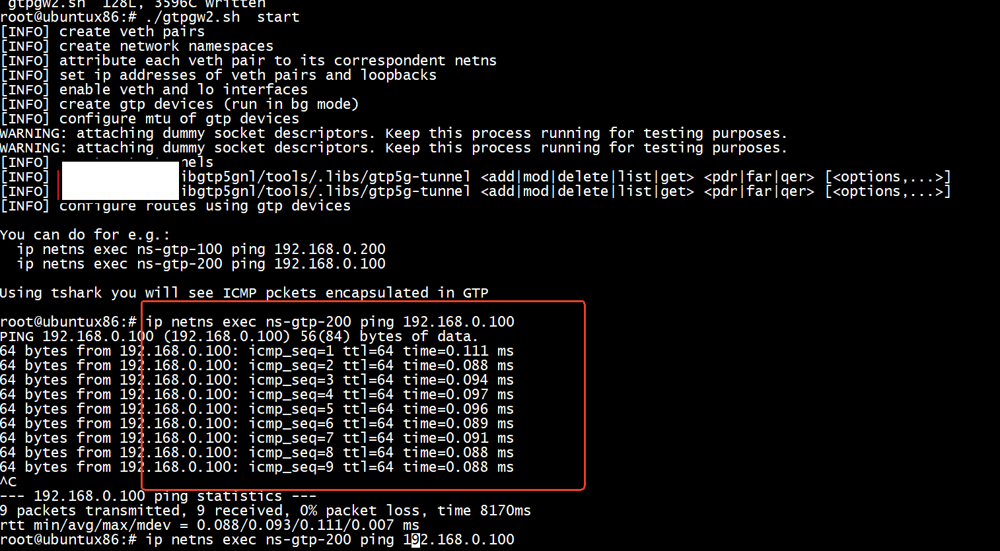

# gtp5g - 5G compatible GTP kernel module
gtp5g is a customized Linux kernel module gtp5g to handle packet by PFCP IEs such as PDR and FAR.
For detailed information, please reference to 3GPP specification TS 29.281 and TS 29.244.

## Notice
Due to the evolution of Linux kernel, this module would not work with every kernel version.
Please run this module with kernel version `5.0.0-23-generic`, upper than `5.4` (Ubuntu 20.04) or RHEL8.

## Usage
### Compile
```
git clone https://github.com/free5gc/gtp5g.git && cd gtp5g
make clean && make
```

## test1

```
root@ubuntux86:# modprobe udp_tunnel
root@ubuntux86:# insmod  gtp5g.ko 
root@ubuntux86:# 
```



```
GTP5G_SDF_FILTER_TOS_TRAFFIC_CLASS
tc-skbedit
if (get_qos_enable() && tp != NULL) {
        color = policePacket(tp, volume_mbqe);
    }
Color policePacket(TrafficPolicer* p, int pktLen) {
```
### Install kernel module
Install the module to the system and load automatically at boot
```
sudo make install
```

### Remove kernel module
Remove the kernel module from the system
```
sudo make uninstall
```
### Check Rules
Get PDR/FAR/QER information by "/proc"
```
# if UPF used legacy netlink struct without SEID, need use #SEID=0 to query related info as below:
echo #interfaceName #SEID #PDRID > /proc/gtp5g/pdr
echo #interfaceName #SEID #FARID > /proc/gtp5g/far
echo #interfaceName #SEID #QERID > /proc/gtp5g/qer
```
```
cat /proc/gtp5g/pdr
cat /proc/gtp5g/far
cat /proc/gtp5g/qer
```

### Enable/Disable QoS (Default is disabled)
Support Session AMBR and MFBR.

1) Check whether QoS is enabled or disabled. (1 means enabled, 0 means disabled)
    ```
    cat /proc/gtp5g/qos
    ```
2) Enable or disable QoS
   + enable
        ```
        echo 1 >  /proc/gtp5g/qos
        ```
   + disable
        ```
        echo 0 >  /proc/gtp5g/qos
        ```

### Enable/Disable GTP-U Sequence Number (Default is enabled)
Support GTP-U Sequence Number.

1) Check whether GTP-U Sequence Number is enabled or disabled. (1 means enabled, 0 means disabled)
    ```
    cat /proc/gtp5g/seq
    ```
2) Enable or disable GTP-U Sequence Number
   + enable
        ```
        echo 1 >  /proc/gtp5g/seq
        ```
   + disable
        ```
        echo 0 >  /proc/gtp5g/seq
        ```

### Log Related
1) check log
    ```
    dmesg
    ```
1) update log level
    ```
    # [number] is 0~4 
    # e.g. echo 4 > /proc/gtp5g/dbg
    echo [number] > /proc/gtp5g/dbg
    ```
### Tools
+ [go-gtp5gnl](https://github.com/free5gc/go-gtp5gnl)
