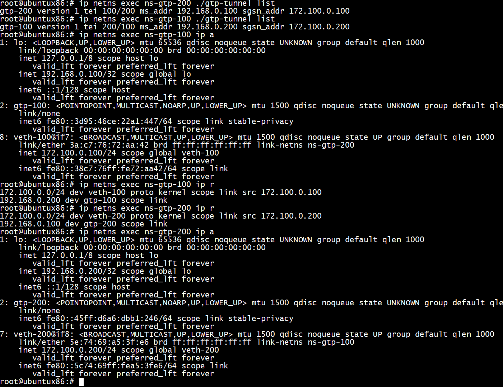
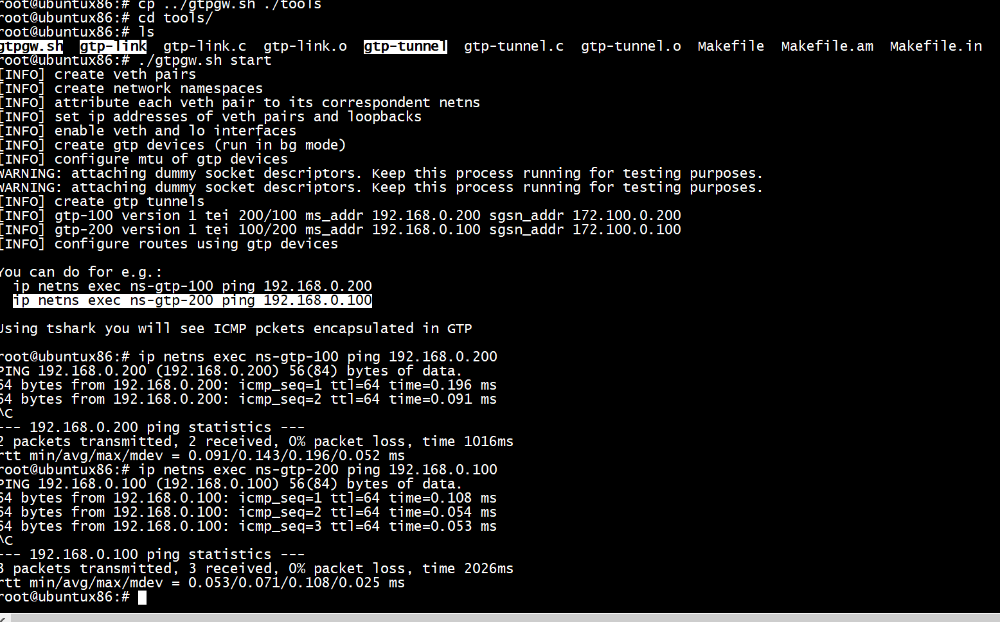
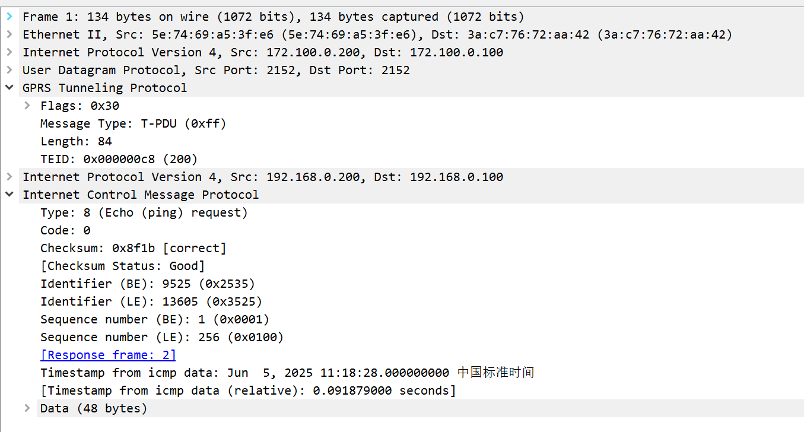

# Simple GTP Gateway example

This example make use of libgtpnl from osmocom to create a GTP tunnel
and send some traffic.

## kernel-gtp

```
root@ubuntux86:# lsmod | grep gtp
gtp                    28672  0
udp_tunnel             20480  1 gtp
root@ubuntux86:# 
```

## Install dependencies

```console
apt-get update && apt-get install -y autoconf libtool pkg-config
```

## Setup

First, get the example:

```console
git clone https://github.com/abousselmi/gtp-gw.git
cd gtp-gw
```

Second, you need to clone libgtpnl and compile it:

```console
https://github.com/osmocom/libgtpnl.git
cd libgtpnl
autoreconf -fi
./configure && make
sudo make install
sudo ldconfig
```

```
root@ubuntux86:# pwd
/work/gtp-gw/libgtpnl
root@ubuntux86:# ls tools/
gtp-link  gtp-link.c  gtp-link.o  gtp-tunnel  gtp-tunnel.c  gtp-tunnel.o  Makefile  Makefile.am  Makefile.in
root@ubuntux86:# 
```

Now we need to copy the example script where we have the gtp wrappers:

```console
cp ../gtpgw.sh ./tools
cd tools
```

Now you can run the example and enjoy:

```console
./gtpgw.sh start
```
  
   
   

```
root@ubuntux86:# ./gtp-tunnel list
root@ubuntux86:# ip netns exec ns-gtp-200 ./gtp-tunnel list
gtp-200 version 1 tei 100/200 ms_addr 192.168.0.100 sgsn_addr 172.100.0.100
root@ubuntux86:# ip netns exec ns-gtp-100 ./gtp-tunnel list
gtp-100 version 1 tei 200/100 ms_addr 192.168.0.200 sgsn_addr 172.100.0.200
root@ubuntux86:# 
```

To destroy everything, you can do:

```console
./gtpgw.sh stop
```

## Sample output

```console
./gtpgw.sh start
[INFO] create veth pairs
[INFO] create network namespaces
[INFO] attribute each veth pair to its correspondent netns
[INFO] set ip addresses of veth pairs and loopbacks
[INFO] enable veth and lo interfaces
[INFO] create gtp devices (run in bg mode)
[INFO] configure mtu of gtp devices
WARNING: attaching dummy socket descriptors. Keep this process running for testing purposes.
WARNING: attaching dummy socket descriptors. Keep this process running for testing purposes.
[INFO] create gtp tunnels
[INFO] version 1 tei 200/100 ms_addr 192.168.0.200 sgsn_addr 172.100.0.200
[INFO] version 1 tei 100/200 ms_addr 192.168.0.100 sgsn_addr 172.100.0.100
[INFO] configure routes using gtp devices

You can go for e.g.:
  ip netns exec ns-gtp-100 ping 192.168.0.200
  ip netns exec ns-gtp-200 ping 192.168.0.100

Using tshark you will see ICMP pckets encapsulated in GTP
```

## Credits

- [Kentaro Ebisawa libgtpnl (gtpc) tutorial](https://www.slideshare.net/kentaroebisawa/using-gtp-on-linux-with-libgtpnl)
- [osmocom gtpu](https://osmocom.org/projects/linux-kernel-gtp-u/wiki)
- [osmocom gtpc](https://osmocom.org/projects/linux-kernel-gtp-u/wiki/Libgtpnl)

