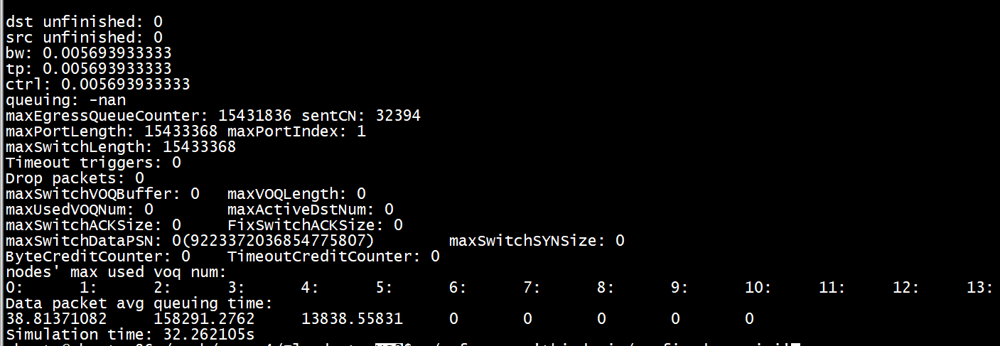
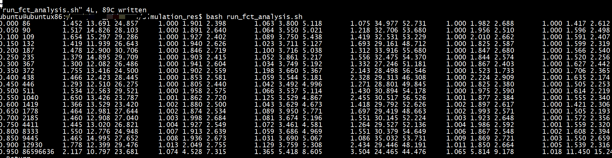

root@ubuntux86:# tar xf ns-allinone-3.40.tar.bz2
root@ubuntux86:# cd ns-allinone-3.40

切换到ubuntu    

```
 ./build.py --enable-examples --enable-tests
```
# NS-3 Simulator for SRNIC (NSDI'23)

[NS-3 Simulator for SRNIC (NSDI'23)](https://github.com/HKUST-SING/srnic-simulation-public)

# NS3-MP-RDMA simulation
[NS3-MP-RDMA simulation](https://github.com/Cherries-Man/NS3-MP-RDMA/tree/81a0e229f133c32590dcc6005b3d68f2ce628dca)   

#   Floodgate NS-3 simulator
 
```
gcc --version
gcc (Ubuntu 9.4.0-1ubuntu1~20.04.2) 9.4.0
Copyright (C) 2019 Free Software Foundation, Inc.
This is free software; see the source for copying conditions.  There is NO
warranty; not even for MERCHANTABILITY or FITNESS FOR A PARTICULAR PURPOSE.

```
 
```
g++ --version
g++ (Ubuntu 9.4.0-1ubuntu1~20.04.2) 9.4.0
Copyright (C) 2019 Free Software Foundation, Inc.
This is free software; see the source for copying conditions.  There is NO
warranty; not even for MERCHANTABILITY or FITNESS FOR A PARTICULAR PURPOSE.
```


```
./waf -d optimized configure

./waf build
```


```
./waf --run 'third mix/config-dcqcn.ini'
```


## NS-3 DCQCN

[NS-3 simulator for RDMA DCQCN-实验报告](https://github.com/shenliang07/DCQCN-)


```

```

# ns3-datacenter
[ns3-datacenter](https://github.com/inet-tub/ns3-datacenter)
This repository contains the source code used for the following papers:      
- [PowerTCP (NSDI 2022)](https://www.usenix.org/conference/nsdi22/presentation/addanki)
- [ABM (SIGCOMM 2022)](https://dl.acm.org/doi/10.1145/3544216.3544252)
- [Reverie (NSDI 2024)](https://www.usenix.org/conference/nsdi24)
- [Credence (NSDI 2024)](https://www.usenix.org/conference/nsdi24)
-  [ "Network Load Balancing with In-network Reordering Support for RDMA".](https://github.com/KaiLv16/llmsim-sim)   
-  [Homa DPDK and Aeolus (SIGCOMM'20).](https://github.com/gaoxiongzeng/dpdk-18.05)    

# alibaba-edu/High-Precision-Congestion-Control


+ 相关项目    

[new_ubuntu_cc High-Precision-Congestion-Control](https://github.com/zhaoqirun/new_ubuntu_cc/tree/86d2897d7f64f6985bba8c51981bf0fe274880b4/analysis)

[intcc/simulation/mix/](https://github.com/hrQAQ/intcc/tree/master/simulation/mix)        

[ns3-detnet-rdma](https://github.com/viscore-ai/ns3-detnet-rdma/tree/ea52f1d63844a9a27b1f80beb5d6a4277a27a0ff)    

[HPCC-PINT](https://github.com/ProbabilisticINT/HPCC-PINT/tree/6ce45efadaffd39bcd5594f60ceb7c2a8aa860f6) 
[ns3-ecn-sharp](https://github.com/snowzjx/ns3-ecn-sharp/tree/master)     


+ python 版本

```
python
Python 2.7.18 (default, Mar  8 2021, 13:02:45) 
[GCC 9.3.0] on linux2
Type "help", "copyright", "credits" or "license" for more information.
>>> 
KeyboardInterrupt
>>> 
python run.py --topo topology --trace flow --bw 100 --cc dcqcn --enable_tr 1
```

+ 安装 gcc-5、g++-5
```
 vim /etc/apt/sources.list
 deb http://dk.archive.ubuntu.com/ubuntu/ xenial main
deb http://dk.archive.ubuntu.com/ubuntu/ xenial universe
```

```
apt update
 apt install gcc-5 g++-5
```
+ build   
```
git clone  https://github.com/alibaba-edu/High-Precision-Congestion-Control.git
cd simulation/
CC='gcc-5' CXX='g++-5' ./waf configure  
./waf build
```

```
python run.py --cc dcqcn --trace flow --bw 100 --topo topology --hpai 50
Waf: Entering directory `/work//High-Precision-Congestion-Control/simulation/build'
Waf: Leaving directory `/work//High-Precision-Congestion-Control/simulation/build'
'build' finished successfully (0.291s)
ENABLE_QCN                      Yes
USE_DYNAMIC_PFC_THRESHOLD       Yes
PACKET_PAYLOAD_SIZE             1000
TOPOLOGY_FILE                   mix/topology.txt
FLOW_FILE                       mix/flow.txt
TRACE_FILE                      mix/trace.txt
TRACE_OUTPUT_FILE               mix/mix_topology_flow_dcqcn.tr
FCT_OUTPUT_FILE         mix/fct_topology_flow_dcqcn.txt
PFC_OUTPUT_FILE                         mix/pfc_topology_flow_dcqcn.txt
SIMULATOR_STOP_TIME             4
CC_MODE         1
ALPHA_RESUME_INTERVAL           1
RATE_DECREASE_INTERVAL          4
CLAMP_TARGET_RATE               No
RP_TIMER                        300
EWMA_GAIN                       0.00390625
FAST_RECOVERY_TIMES             1
RATE_AI                         20Mb/s
RATE_HAI                        200Mb/s
MIN_RATE                1000Mb/s
DCTCP_RATE_AI                           1000Mb/s
ERROR_RATE_PER_LINK             0
L2_CHUNK_SIZE                   4000
L2_ACK_INTERVAL                 1
L2_BACK_TO_ZERO                 No
HAS_WIN         0
GLOBAL_T                1
VAR_WIN         0
FAST_REACT              0
U_TARGET                0.95
MI_THRESH               0
INT_MULTI                               1
MULTI_RATE                              0
SAMPLE_FEEDBACK                         0
PINT_LOG_BASE                           1.01
PINT_PROB                               1
RATE_BOUND              1
ACK_HIGH_PRIO           1
LINK_DOWN                               0 0 0
ENABLE_TRACE                            0
KMAX_MAP                                 100000000000 1600 400000000000 6400
KMIN_MAP                                 100000000000 400 400000000000 1600
PMAX_MAP                                 100000000000 0.2 400000000000 0.2
BUFFER_SIZE                             32
QLEN_MON_FILE                           mix/qlen_topology_flow_dcqcn.txt
QLEN_MON_START                          2000000000
QLEN_MON_END                            3000000000
maxRtt=4160 maxBdp=52000
Running Simulation.
207.423
```

```
./trace_reader ../simulation/mix/mix_topology_flow_dcqcn.tr 
```

## analysis

```
python traffic_gen.py -c AliStorage2019.txt  -n 320 -l 0.3 -b 100G -t 0.1 
root@ubuntux86:# python traffic_gen.py -c WebSearch_distribution.txt -n 320 -l 0.3 -b 100G -t 0.1 
root@ubuntux86:# cat WebSearch_distribution.txt 
0 0
10000 15
20000 20
30000 30
50000 40
80000 53
200000 60
1000000 70
2000000 80
5000000 90
10000000 97
30000000 100
```

+ step1   

```
python run.py --topo topology --trace flow --bw 100 --cc dcqcn --enable_tr 1
```
把运行后的config_topology_flow_dcqcn.txt文件中的enable_trace = 0，改为enable_trace = 1，   
+ step2   
```
./trace_reader ../simulation/mix/mix_topology_flow_dcqcn.tr 

```

```
./trace_reader ../simulation/mix/mix_topology_flow_dcqcn.tr  'time>2000000000'
```

others

```
./trace_reader ../simulation/mix/mix.tr "sip=0x0b000401"| grep " n:0" | awk '{print $4}' > queue_
```


```
 python2 fct_analysis.py  -p  fct_topology_flow -s 100  -t 0 -T 2200000000 -b 100
../simulation/mix/fct_topology_flow_dcqcn.txt
0.000 200000000 6.175 6.355 6.355
```

## 测试topo and flow   


其中topology.txt的内容为：  
```
7 1 6
0
0 1 100Gbps 0.001ms 0
0 2 100Gbps 0.001ms 0
0 3 100Gbps 0.001ms 0
0 4 100Gbps 0.001ms 0
0 5 100Gbps 0.001ms 0
0 6 100Gbps 0.001ms 0
```
flow.txt的内容为：   
```
5
2 1 3 100 200000000 2
3 1 3 100 200000000 2
4 1 3 100 150000000 2
5 1 3 100 5000000 2
6 1 3 100 5000000 2
```

```
python2 fct_analysis.py  -p  fct_topology_flow -s 100
../simulation/mix/fct_topology_flow_dcqcn.txt
0.000 200000000 6.175 6.355 6.355

```

```
python3 total_fct_analysis.py 
平均FCT (ms):
```

## traffic_gen.py

```
python traffic_gen.py -c  GoogleRPC2008.txt  -n 320 -l 0.3 -b 100G -t 0.1 -o flow.txt
```
```
du -sh flow.txt
1.2G    flow.txt
```

# lomas

[Lomas](https://github.com/ZhiwenLiu99/Lomas/tree/master)    

python2     
```
cat run_fct_analysis.sh 
comm_arg='-p all2all -s 5 -t 0 -b 100'
exe='python2 fct_analysis.py'

${exe} ${comm_arg}
```
