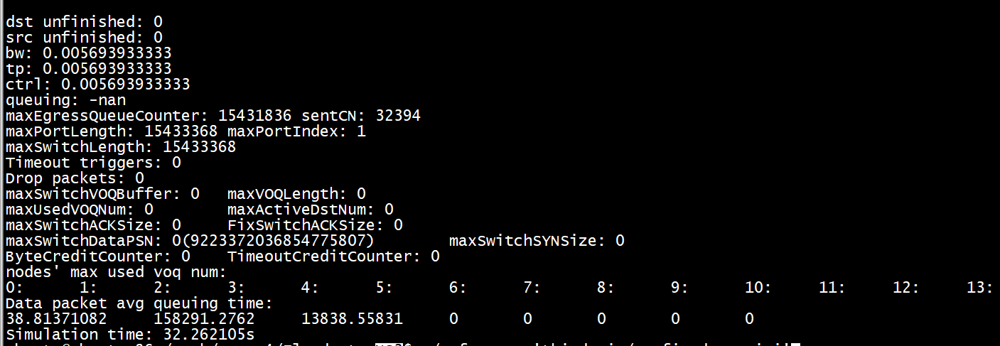

root@ubuntux86:# tar xf ns-allinone-3.40.tar.bz2
root@ubuntux86:# cd ns-allinone-3.40

切换到ubuntu    

```
 ./build.py --enable-examples --enable-tests
```

#   Floodgate NS-3 simulator
 
```
gcc --version
gcc (Ubuntu 9.4.0-1ubuntu1~20.04.2) 9.4.0
Copyright (C) 2019 Free Software Foundation, Inc.
This is free software; see the source for copying conditions.  There is NO
warranty; not even for MERCHANTABILITY or FITNESS FOR A PARTICULAR PURPOSE.

```
 
```
g++ --version
g++ (Ubuntu 9.4.0-1ubuntu1~20.04.2) 9.4.0
Copyright (C) 2019 Free Software Foundation, Inc.
This is free software; see the source for copying conditions.  There is NO
warranty; not even for MERCHANTABILITY or FITNESS FOR A PARTICULAR PURPOSE.
```


```
./waf -d optimized configure

./waf build
```


```
./waf --run 'third mix/config-dcqcn.ini'
```


## NS-3 DCQCN

[NS-3 simulator for RDMA DCQCN-](https://github.com/shenliang07/DCQCN-)


```

```

# High-Precision-Congestion-Control


+ 相关项目
[new_ubuntu_cc High-Precision-Congestion-Control ](https://github.com/zhaoqirun/new_ubuntu_cc/tree/86d2897d7f64f6985bba8c51981bf0fe274880b4/analysis)

+ 安装 gcc-5、g++-5
```
 vim /etc/apt/sources.list
 deb http://dk.archive.ubuntu.com/ubuntu/ xenial main
deb http://dk.archive.ubuntu.com/ubuntu/ xenial universe
```

```
apt update
 apt install gcc-5 g++-5
```
+ build   
```
git clone  https://github.com/alibaba-edu/High-Precision-Congestion-Control.git
cd simulation/
CC='gcc-5' CXX='g++-5' ./waf configure  
./waf build
```

```
python run.py --cc dcqcn --trace flow --bw 100 --topo topology --hpai 50
Waf: Entering directory `/work/ovs_p4/High-Precision-Congestion-Control/simulation/build'
Waf: Leaving directory `/work/ovs_p4/High-Precision-Congestion-Control/simulation/build'
'build' finished successfully (0.291s)
ENABLE_QCN                      Yes
USE_DYNAMIC_PFC_THRESHOLD       Yes
PACKET_PAYLOAD_SIZE             1000
TOPOLOGY_FILE                   mix/topology.txt
FLOW_FILE                       mix/flow.txt
TRACE_FILE                      mix/trace.txt
TRACE_OUTPUT_FILE               mix/mix_topology_flow_dcqcn.tr
FCT_OUTPUT_FILE         mix/fct_topology_flow_dcqcn.txt
PFC_OUTPUT_FILE                         mix/pfc_topology_flow_dcqcn.txt
SIMULATOR_STOP_TIME             4
CC_MODE         1
ALPHA_RESUME_INTERVAL           1
RATE_DECREASE_INTERVAL          4
CLAMP_TARGET_RATE               No
RP_TIMER                        300
EWMA_GAIN                       0.00390625
FAST_RECOVERY_TIMES             1
RATE_AI                         20Mb/s
RATE_HAI                        200Mb/s
MIN_RATE                1000Mb/s
DCTCP_RATE_AI                           1000Mb/s
ERROR_RATE_PER_LINK             0
L2_CHUNK_SIZE                   4000
L2_ACK_INTERVAL                 1
L2_BACK_TO_ZERO                 No
HAS_WIN         0
GLOBAL_T                1
VAR_WIN         0
FAST_REACT              0
U_TARGET                0.95
MI_THRESH               0
INT_MULTI                               1
MULTI_RATE                              0
SAMPLE_FEEDBACK                         0
PINT_LOG_BASE                           1.01
PINT_PROB                               1
RATE_BOUND              1
ACK_HIGH_PRIO           1
LINK_DOWN                               0 0 0
ENABLE_TRACE                            0
KMAX_MAP                                 100000000000 1600 400000000000 6400
KMIN_MAP                                 100000000000 400 400000000000 1600
PMAX_MAP                                 100000000000 0.2 400000000000 0.2
BUFFER_SIZE                             32
QLEN_MON_FILE                           mix/qlen_topology_flow_dcqcn.txt
QLEN_MON_START                          2000000000
QLEN_MON_END                            3000000000
maxRtt=4160 maxBdp=52000
Running Simulation.
207.423
```

```
./mix/mix_topology_flow_dcqcn.tr
```