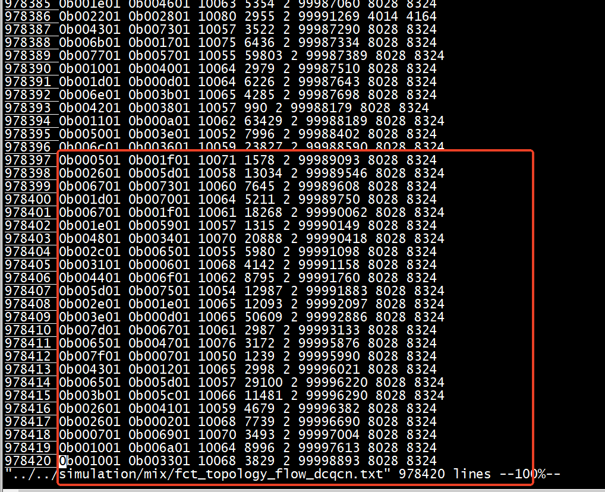

 

<center><h1>gen topo and flow </h1></center>

[conweave-ns3](https://github.com/conweave-project/conweave-ns3/tree/236a801a00e35de9078635e04acae2f701c21ded)

## gen topo and flow 

```
root@ubuntux86:# tree -L 2  
.
├── autorun.sh
├── config
│   ├── fat_k4_100G_OS2.txt
│   ├── fat_k8_100G_OS2.txt
│   ├── fat_topology_gen.py
│   └── leaf_spine_128_100G_OS2.txt
├── run.py
└── traffic_gen
    ├── AliStorage2019.txt
    ├── custom_rand.py
    ├── custom_rand.pyc
    ├── FbHdp2015.txt
    ├── flow_bins.py
    ├── GoogleRPC2008.txt
    ├── README.md
    ├── Solar2022.txt
    └── traffic_gen.py

2 directories, 15 files
```
执行./autorun.sh     
```
root@ubuntux86:# ./autorun.sh 
Running RDMA Network Load Balancing Simulations (leaf-spine topology) 

---------------------------------- 
TOPOLOGY: leaf_spine_128_100G_OS2 
NETWORK LOAD: 50 
TIME: 0.1 
----------------------------------
 
Run Lossless RDMA experiments... 
Run IRN RDMA experiments... 
Runing all in parallel. Check the processors running on background! 
```

```
root@ubuntux86:# tree -L 2  
.
├── autorun.sh
├── config
│   ├── fat_k4_100G_OS2.txt
│   ├── fat_k8_100G_OS2.txt
│   ├── fat_topology_gen.py
│   ├── L_25.00_CDF_AliStorage2019_N_128_T_100ms_B_100_flow.txt
│   └── leaf_spine_128_100G_OS2.txt
├── mix
│   └── output
├── run.py
└── traffic_gen
    ├── AliStorage2019.txt
    ├── custom_rand.py
    ├── custom_rand.pyc
    ├── FbHdp2015.txt
    ├── flow_bins.py
    ├── GoogleRPC2008.txt
    ├── README.md
    ├── Solar2022.txt
    └── traffic_gen.py

4 directories, 16 files
root@ubuntux86:# 
```

生成L_25.00_CDF_AliStorage2019_N_128_T_100ms_B_100_flow.txt   
生成mix    


## topology_file

默认的 `topology_file` 是 `leaf_spine_128_100G_OS2.txt`，存储在 `config` 文件夹下。

```cpp
// 由 topof 打开
// txt文件内容

// 第一行分别是 节点数node_num 交换机数switch_num 链路数link_num
144 16 192
     
// 第二行分别是 switch_num 个 交换机号
128 129 130 131 132 133 134 135 136 137 138 139 140 141 142 143

// 接下来的每一行（共计192行） 5个变量分别是
// 源src 目的dst 速率data_rate 链路延迟link_delay 错误速率error_rate
0 128 100Gbps 1000ns 0
1 128 100Gbps 1000ns 0
2 128 100Gbps 1000ns 0
......
```


## flow_file与从flow的执行流程

`flow_file` 存储在 `config` 文件夹下。

```cpp
// 第一行是流的数量
3
// 后续的每一行 5个变量分别是
// src dst pg maxPacketCount start_time
77 0 3 4287 2.000000003
102 42 3 5328 2.000000237
94 91 3 1956 2.000000438
```
```
python ./traffic_gen/traffic_gen.py -c /work/High-Precision-Congestion-Control/gen_topo_flow/../traffic_gen/AliStorage2019.txt -n 128 -l 0.25 -b 100G -t 0.1 -o /work//High-Precision-Congestion-Control/gen_topo_flow/config/L_25.00_CDF_AliStorage2019_N_128_T_100ms_B_100_flow.txt
```
简化 ：

```
 python traffic_gen.py -c  AliStorage2019.txt -n 128 -l 0.25 -b 100G -t 0.1 -o  flow.txt
```

## n_host

```
cat config/leaf_spine_128_100G_OS2.txt 
144 16 192
```

```
line[0]144 - line[1] 16, n_host 128
```

## test
```
mv L_25.00_CDF_AliStorage2019_N_128_T_100ms_B_100_flow.txt  flow.txt 
mv leaf_spine_128_100G_OS2.txt  topology.txt     
```
```
python run.py --trace flow  --topo topology  --cc dcqcn --enable_tr 1 --trace flow --bw 100
Waf: Entering directory `/work//High-Precision-Congestion-Control/simulation/build'
Waf: Leaving directory `/work//High-Precision-Congestion-Control/simulation/build'
'build' finished successfully (0.297s)
ENABLE_QCN                      Yes
USE_DYNAMIC_PFC_THRESHOLD       Yes
PACKET_PAYLOAD_SIZE             1000
TOPOLOGY_FILE                   mix/topology.txt
FLOW_FILE                       mix/flow.txt
TRACE_FILE                      mix/trace.txt
TRACE_OUTPUT_FILE               mix/mix_topology_flow_dcqcn.tr
FCT_OUTPUT_FILE         mix/fct_topology_flow_dcqcn.txt
PFC_OUTPUT_FILE                         mix/pfc_topology_flow_dcqcn.txt
SIMULATOR_STOP_TIME             4
CC_MODE         1
ALPHA_RESUME_INTERVAL           1
RATE_DECREASE_INTERVAL          4
CLAMP_TARGET_RATE               No
RP_TIMER                        300
EWMA_GAIN                       0.00390625
FAST_RECOVERY_TIMES             1
RATE_AI                         20Mb/s
RATE_HAI                        200Mb/s
MIN_RATE                1000Mb/s
DCTCP_RATE_AI                           1000Mb/s
ERROR_RATE_PER_LINK             0
L2_CHUNK_SIZE                   4000
L2_ACK_INTERVAL                 1
L2_BACK_TO_ZERO                 No
HAS_WIN         0
GLOBAL_T                1
VAR_WIN         0
FAST_REACT              0
U_TARGET                0.95
MI_THRESH               0
INT_MULTI                               1
MULTI_RATE                              0
SAMPLE_FEEDBACK                         0
PINT_LOG_BASE                           1.01
PINT_PROB                               1
RATE_BOUND              1
ACK_HIGH_PRIO           1
LINK_DOWN                               0 0 0
ENABLE_TRACE                            1
KMAX_MAP                                 100000000000 1600 400000000000 6400
KMIN_MAP                                 100000000000 400 400000000000 1600
PMAX_MAP                                 100000000000 0.2 400000000000 0.2
BUFFER_SIZE                             32
QLEN_MON_FILE                           mix/qlen_topology_flow_dcqcn.txt
QLEN_MON_START                          2000000000
QLEN_MON_END                            3000000000
maxRtt=8320 maxBdp=104000
Running Simulation.
953.256
```

```
python3 fctAnalysis.py -id 863619304 -dir /work//High-Precision-Congestion-Control/gen_topo_flow -bdp 104000 -sT 2005000000 -fT 2150000000 > /dev/null 2>&1
```

```
fctAnalysis.py  -bdp 104000 -sT 2005000000 -fT 2150000000
cat mix/fct_topology_flow_dcqcn.txt | awk '{if ($6>2005000000 && $6+$7<2150000000) {print $7/1000, $5} }' | sort -n -k 2
cat mix/fct_topology_flow_dcqcn.txt | awk '{if ($6>2005000000 && $6+$7<2150000000) {print $7/$8<1?1:$7/$8, $5} }' | sort -n -k 2
output_slowdown is emptry
```