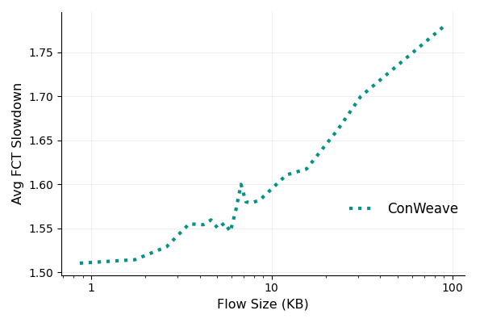

#  更改autorun.sh   只运行 conweave

```
# Lossless RDMA
cecho "GREEN" "Run Lossless RDMA experiments..."
#python3 run.py --lb fecmp --pfc 1 --irn 0 --simul_time ${RUNTIME} --netload ${NETLOAD} --topo ${TOPOLOGY} 2>&1 > /dev/null & 
#sleep 5
# conga only for non-bond topo;
#python3 run.py --lb conga --pfc 1 --irn 0 --simul_time ${RUNTIME} --netload ${NETLOAD} --topo ${TOPOLOGY} 2>&1 > /dev/null &
#sleep 5
# 
python3 run.py --lb conweave --pfc 1 --irn 0 --simul_time ${RUNTIME} --netload ${NETLOAD} --topo ${TOPOLOGY} 2>&1 > log.txt &
#python3 run.py --lb conweave --pfc 1 --irn 0 --simul_time ${RUNTIME} --netload ${NETLOAD} --topo ${TOPOLOGY} 2>&1 > /dev/null &
sleep 5
#python3 run.py --lb dv --pfc 1 --irn 0 --simul_time ${RUNTIME} --netload ${NETLOAD} --topo ${TOPOLOGY} 2>&1 > /dev/null &
#sleep 5
```
 
##  all-to-all_visual.py
设置conweave_id = 701211154    
```

#exchange this for the id of the simulation you want to plot
#fecmp_id = 497547479
conweave_id = 701211154
#CAVER_id = 545564951
```

```
root@ubuntux86:# pwd
/work/ns-allinone-3.19/ns-3.19/show
root@ubuntux86:# python3 all-to-all_visual.py 
root@ubuntux86:# 
```


## ./analysis/plot_*.py 
更改mix/.history  只保留运行conweave    
```
root@ubuntux86:# cat mix/.history 
date,id,ccmode,lbmode,cwh_tx_expiry_time,cwh_extra_reply_deadline,cwh_path_pause_time,cwh_extra_voq_flush_time,cwh_default_voq_waiting_time,pfc,irn,has_win,var_win,topo,bw,cdf,load,time
04/08/25,701211154,1,9,1000,4,16,64,600,1,0,0,0,fat_k4_100G_OS2,100,AliStorage2019,52,0.1
./waf --run 'scratch/network-load-balance /work/ns-allinone-3.19/ns-3.19/mix/output/701211154/config.txt' > /work/ns-allinone-3.19/ns-3.19/mix/output/701211154/config.log 2>&1
./waf --run 'scratch/network-load-balance' --command-template='gdb --args %s /work/ns-allinone-3.19/ns-3.19/mix/output/701211154/config.txt'

root@ubuntux86:# 
```

```
./analysis/plot_fct.py 
./analysis/plot_queue.py
./analysis/plot_uplink.py 
```
生成    
```
tree -D 1 analysis/figures/
1 [error opening dir]
analysis/figures/
├── [Apr  9 10:35]  AVG_TOPO_fat_k4_100G_OS2_LOAD_52_FC_Lossless.pdf
├── [Apr  9 10:32]  CDF_QUEUE_TOPO_fat_k4_100G_OS2_LOAD_52_FC_Lossless.pdf
├── [Apr  9 10:38]  CDF_UPLINK_TOPO_fat_k4_100G_OS2_LOAD_52_FC_Lossless.pdf
└── [Apr  9 10:35]  P99_TOPO_fat_k4_100G_OS2_LOAD_52_FC_Lossless.pdf

0 directories, 4 files
```