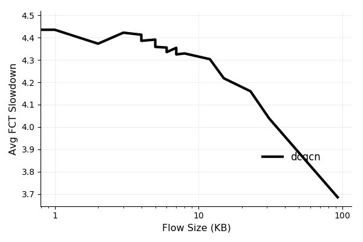
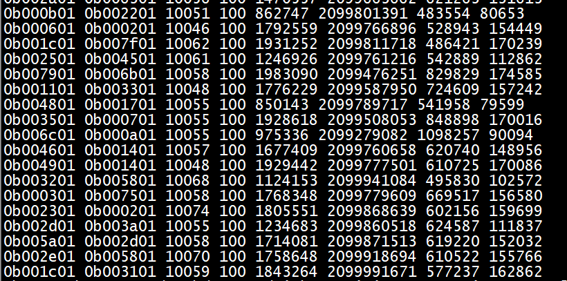

[results of CAVER](https://cloud.tsinghua.edu.cn/d/b55b00eb0ac240db983b/files/?p=%2F918924462%2F918924462_out_fct.txt)

[docker caver](https://github.com/denght23/CAVER/tree/107a853de02fcb9fc49307fbc2be8abec6d950ae)   

```
python2 fct_analysis.py  -p  fct_topology_flow   -t 0 -T 2200000000 -b 100
```



