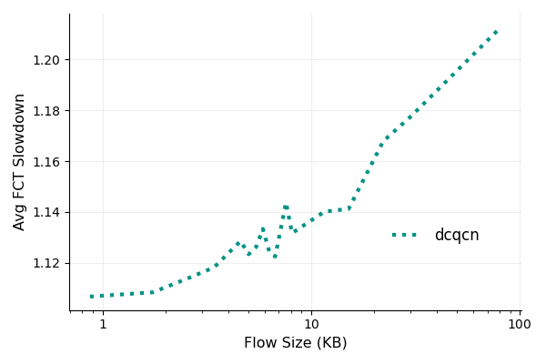

[results of CAVER](https://cloud.tsinghua.edu.cn/d/b55b00eb0ac240db983b/files/?p=%2F918924462%2F918924462_out_fct.txt)

[docker caver](https://github.com/denght23/CAVER/tree/107a853de02fcb9fc49307fbc2be8abec6d950ae)   

## error
```
python2 fct_analysis.py  -p  fct_topology_flow   -t 0 -T 2200000000 -b 100
```


## run
+ topo    
```
mv mix/fat.txt  mix/topology.txt     
```
+ flow    
```
python traffic_gen.py -c  AliStorage2019.txt -n 320 -l 0.25 -b 100G -t 0.1 -o  flow.txt
```
+ third.cc 

```
        maxRtt = maxBdp = 0;
        for (uint32_t i = 0; i < node_num; i++){
                if (n.Get(i)->GetNodeType() != 0)
                        continue;
                for (uint32_t j = 0; j < node_num; j++){
                        if (n.Get(j)->GetNodeType() != 0)
                                continue;
                        uint64_t delay = pairDelay[n.Get(i)][n.Get(j)];
                        uint64_t txDelay = pairTxDelay[n.Get(i)][n.Get(j)];
                        uint64_t rtt = delay * 2 + txDelay;
                        uint64_t bw = pairBw[i][j];
                        uint64_t bdp = rtt * bw / 1000000000/8;
                        pairBdp[n.Get(i)][n.Get(j)] = bdp;
                        pairBdp[n.Get(j)][n.Get(i)] = bdp;
                        pairRtt[i][j] = rtt;
                        pairRtt[j][i] = rtt;
                        if (bdp > maxBdp)
                                maxBdp = bdp;
                        if (rtt > maxRtt)
                                maxRtt = rtt;
                }
        }
```
+ run    
not --enable_tr 1     
```
python run.py --trace flow  --topo topology  --cc dcqcn --bw 100
```
+  python3 all-to-all_visual.py         

## source
%s/1000ns/0.001ms/g  

```
topof >> src >> dst >> data_rate >> link_delay >> error_rate;
```

```
void 
QbbHelper::SetChannelAttribute (std::string n1, const AttributeValue &v1)
{
  m_channelFactory.Set (n1, v1);
  m_remoteChannelFactory.Set (n1, v1);
}

```


```

//
// By default, you get a channel that 
// has an "infitely" fast transmission speed and zero delay.
PointToPointChannel::PointToPointChannel()
  :
    Channel (),
    m_delay (Seconds (0.)),
    m_nDevices (0)
{
  NS_LOG_FUNCTION_NOARGS ();
}
Time
PointToPointChannel::GetDelay (void) const
{
  return m_delay;
}
```
