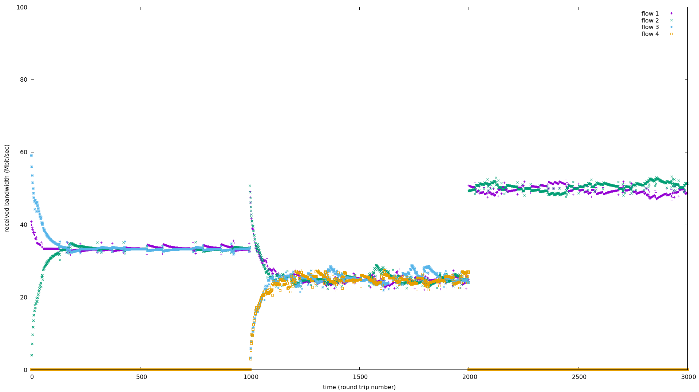
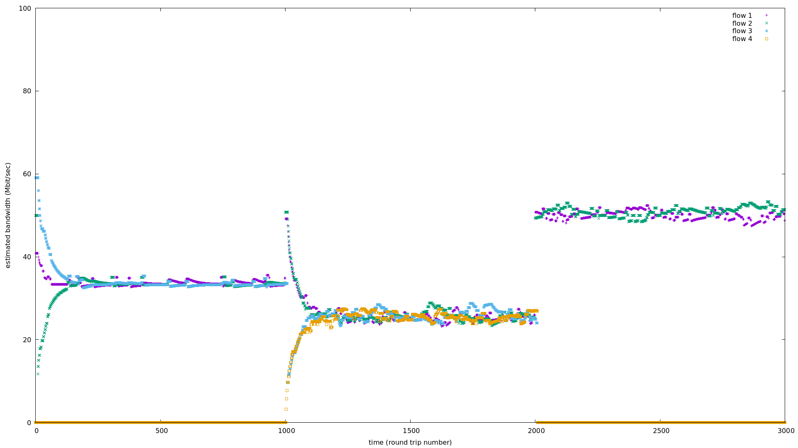
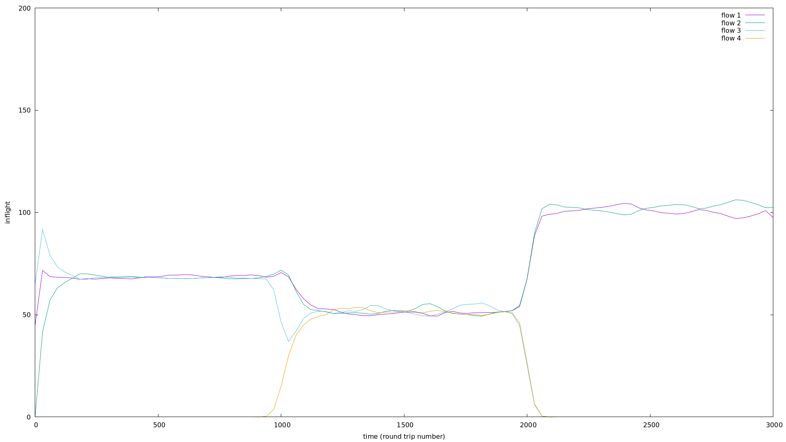
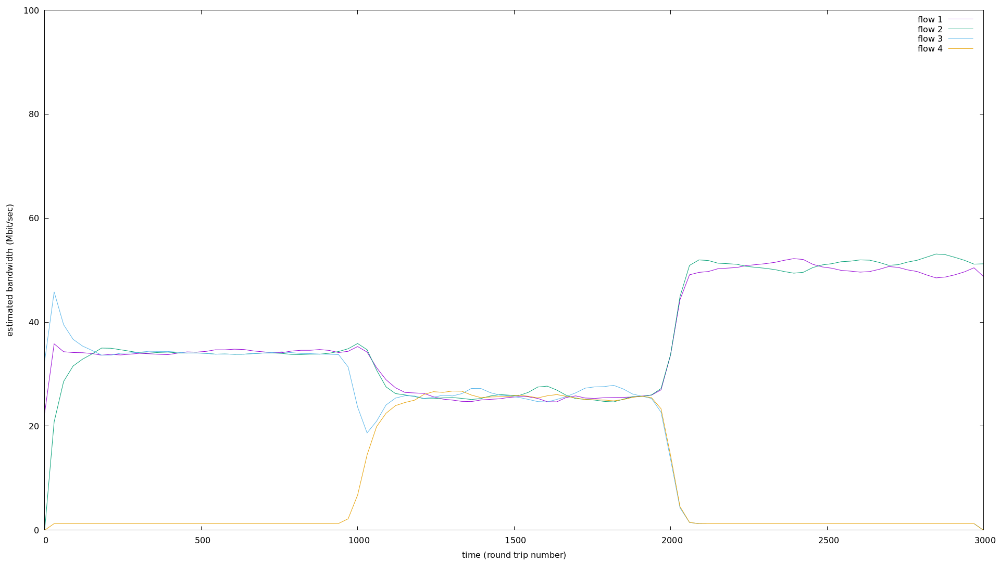
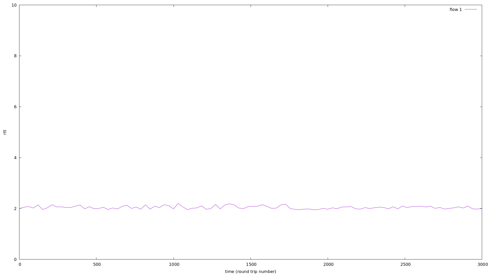

#  bbr 动力学模型
拥塞控制的核心目标是在保证公平的前提下保持 inflt 为 bdp(上下左右)，aimd 试图通过 capacity-seeking 达到此目标，然而它无法识别 bdp 与 buffer 的边界，现在我们知道，通过测量和利用 delivery rate 以及 rtprop 可以计算相对精确的 bdp，那么拥塞控制的所有要素就像烹饪食材调料一般，可任意发挥了。   

前面我已经柔和了 bbr，inflt 守恒，随机 cycle phase 等元素，但这些还是相对复杂，简单食材简单做，拿 aimd 和 bbr 结合最简单。   

AIMD：加法增加 cwnd，丢包了乘法减少 cwnd；   
AIMD-BBR：加法 probe，超过 bdp(或越过某个小量) 后乘法减少 cwnd。   
之所以想到这个新的做法，还是要解决 cycle phase 的同步问题，而同步 aimd 和异步 aimd 均可收敛到公平。   

```
#define I 2
#define M 0.5
void bbr_update_sending_bw(struct bbr_flow *f)
{
  if (f->status == PROBERTT) {
    f->saved_inflt = f->inflt;
    f->inflt = PROBERTT_INFLT;
    if (t - f->rstart >= PROBERTT_DELAY /*200 ms*/) {
      f->status = PROBEBW;
    }
  } else if (f->pacing_gain > 1) {
    f->inflt += I;
    f->pacing_gain = 0.5;
  } else if (f->pacing_gain < 1 && f->inflt <= f->receive_bw * f->min_rtt) {
    f->pacing_gain = 1.5;
  } else if (f->inflt > f->receive_bw * f->min_rtt){
    double d = f->inflt - f->receive_bw * f->min_rtt;
    f->inflt -= d; // 一次性 md 到位，drain to target
    //f->inflt -= M * f->inflt; // 一点点 md
  }

  if (f->status == PROBEBW) {
    if (t - f->pstart >= PROBERTT_WIN /*10 sec*/) {
      f->pstart = t;
      f->rstart = t;
      f->status = PROBERTT;
      f->inflt = f->saved_inflt;
    }
  }
  f->sending_bw = f->inflt / f->min_rtt;
  printf("flow %d p:%.3f max_bw: %.3f sending_bw: %.3f\n",
         f->index, f->pacing_gain, f->max_bw, f->sending_bw);
}

``` 

```
gcc -Wall -o bbr_additive bbr_additive.c
```
 
来做个模拟仿真，C = 100，RTPROP = 2，0～1000 时间单位 3条流，1000～2000 时间单位 4 条流，2000～3000 时间单位 2 条流，看下 inflt(采用 with lines smooth bezier 绘制，故显示不出 probertt 的毛刺) 和 rtt：
 
  


  


   


 fig/pacing.png    




还有外的改法，也可以解决 aimd 的 rtt 不公平性，将 minrtt 作为底座，aimd 加法增量设置为 α*minrtt，这意味着共享同一 minrtt 链路的流量保持相同的增量，minrtt 越大增量越大，以补偿长程感知不及时导致 inflt 填充速度慢。      

总之，怎么改都行，核心就两点：    

为保证公平性，除了不要同步 mimd，aimd 之外，怎么都行，异步 mimd 就是 bbr，异步 aimd 就是 inflt 守恒，都不伤大雅；    
为避免拥塞，避免 bufferbloat，***核心是识别 bdp，并将 inflt 保持在 bdp 附近***。   
理解并做到以上两点，拥塞控制算法或传输算法基本就这么回事了，其它的都是边角和调味料，用什么料做什么味道，但核心永远上面两条，万变不离其宗。   
任意组合 ai，mi，ad，md，同步，异步，随机，…已完成上面两个核心目标， 结果就是各种拥塞控制算法了。   
 

# references

[satellite-link-simulation bbr kernel module](https://github.com/ponedo/satellite-link-simulation/tree/master)   
[如何解决TCP BBR的RTT不公平性问题](https://blog.csdn.net/dog250/article/details/119652359)       
