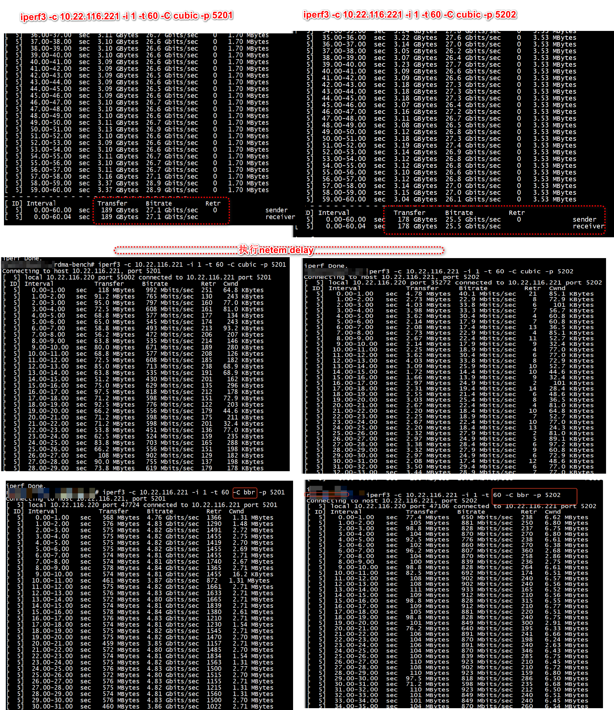
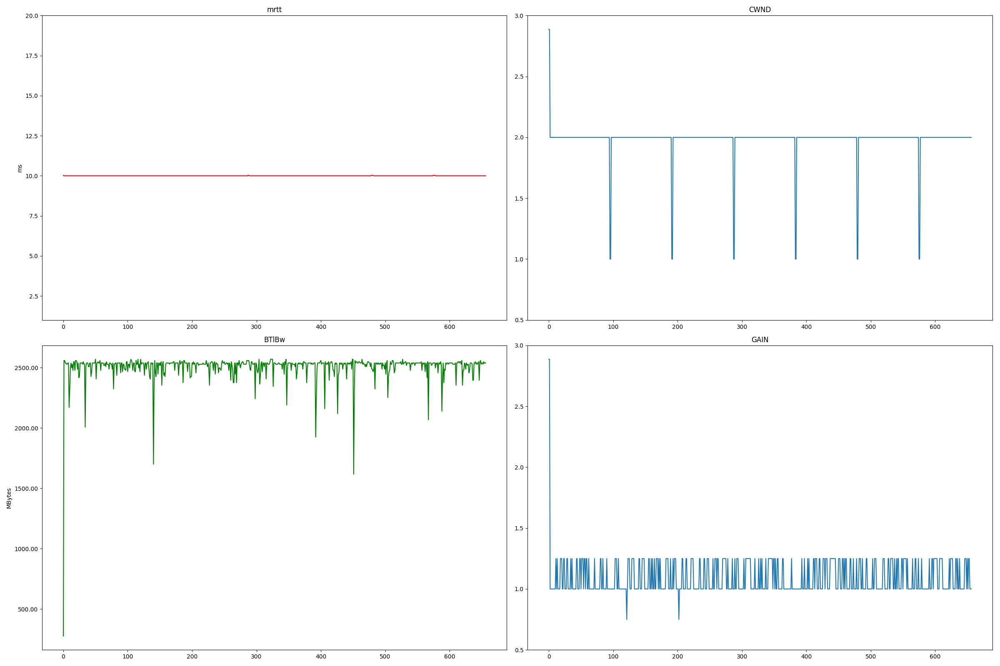
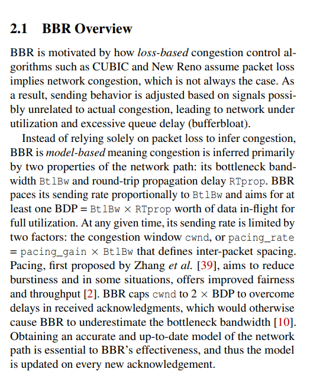

[如何解决TCP BBR的RTT不公平性问题](https://zhuanlan.zhihu.com/p/399639987)    
[BBR 和 CUBIC 对长肥管道的不同反应](https://zhuanlan.zhihu.com/p/31704683339)   
[长肥管道(LFT)中TCP的艰难处境与打法](https://blog.csdn.net/dog250/article/details/113020804)   


#  tc


```
sudo tc qdisc replace dev eth0 root netem latency 50ms   

（注：取消上述的设置可以使用这个命令 sudo tc qdisc del dev eth0 root ）  


```


    


## How can I visualize the behavior of Linux TCP BBR connections?

Check out [tcpdump](http://www.tcpdump.org/),
[tcptrace](http://www.tcptrace.org/), and
[xplot.org](http://www.xplot.org/). To install these tools on Ubuntu or Debian
you can use:

```
sudo apt-get install tcpdump tcptrace xplot-xplot.org
```

For an intro to this tool chain, see
[this slide deck](https://fasterdata.es.net/assets/Uploads/20131016-TCPDumpTracePlot.pdf).

An example session might look like:
```
# start capturing a trace:
tcpdump -w ./trace.pcap -s 120 -c 100000000 port $PORT &
# run test....
# turn trace into plot files:
tcptrace -S -zx -zy *pcap
# visualize each connection:
for f in `ls *xpl`; do echo $f ... ; xplot.org $f ; done
```


#  bw,mrtt ,pacing_gain ,cwnd_gain


bbr:(bw:2.5Gbps,mrtt:10,pacing_gain:1.25,cwnd_gain:2) send 5.4Gbps 


```
 while true; do     ss -tin | sed -n -e 's/.* cwnd:\([0-9]*\).* bbr:(\([^)]*\)).*/\1;;\2/p' -e 's/.* cwnd:\([0-9]*\).* ssthresh:\([0-9]*\).*/\1;\2;/p';     sleep 1; done | ts -s '%H:%M:%.S;'
00:00:00.000009; 308;;bw:49313512bps,mrtt:100.024,pacing_gain:1,cwnd_gain:2
00:00:00.989914; 308;;bw:49313512bps,mrtt:100.024,pacing_gain:1,cwnd_gain:2
00:00:01.993706; 308;;bw:49313512bps,mrtt:100.024,pacing_gain:1,cwnd_gain:2
```


```
while true;
do
    # ‘s/regexp/replacement/flags’
    # -E: use normal RegEx syntax 
    # -e#1: BBR v2 with pacing_gain and cwnd_gain being optional
    # -e#2: BBR v1
    # -e#3: Cubic
    # ts: add timestamp 
    ss -tin | sed -En \
        -e 's/.* cwnd:([0-9]*).* bbr:\((.*mrtt:[0-9.]*.*),(bw_hi:[^)]*).*/\1;;\2;\3;/p' \
        -e 's/.* cwnd:([0-9]*).* bbr:\(([^)]*)\).*/\1;;\2/p' \
        -e 's/.* cwnd:([0-9]*).* ssthresh:([0-9]*).*/\1;\2;/p' \
        | ts '%.s;'
    sleep 1; 
done  
```

```

ss --no-header -eipn dst 10.22.116.221:5202
while [[ $(date -u +%s) -le $endtime ]]; do ss --no-header -eipn dst 192.168.3.1 or dst 192.168.4.1 | ts '%.s' | tee -a $i-$j-$b-trial-ss.txt > /dev/null;sleep 0.1; done

 ss -iepn '( dport = :3443 )'
ss -tin sport = :22
ss -t -i -p
State                Recv-Q                 Send-Q                                  Local Address:Port                                  Peer Address:Port                 Process                
ESTAB                0                      52                                     172.22.116.220:ssh                                  172.22.117.78:54592                 users:(("sshd",pid=3886398,fd=4))
         dctcp-reno wscale:8,7 rto:236 rtt:33.178/17.845 ato:40 mss:1460 pmtu:1500 rcvmss:888 advmss:1460 cwnd:10 bytes_sent:149046 bytes_retrans:68 bytes_acked:148926 bytes_received:81634 segs_out:2499 segs_in:2786 data_segs_out:1266 data_segs_in:1888 dctcp:fallback_mode send 3.52Mbps lastsnd:12 lastrcv:12 lastack:12 pacing_rate 7.04Mbps delivery_rate 24.2Mbps delivered:1266 app_limited busy:46736ms unacked:1 retrans:0/1 dsack_dups:1 rcv_rtt:157872 rcv_space:64282 rcv_ssthresh:64076 minrtt:2.308
```

```
ss -tie | grep bbr
ss -iet dst  "10.22.116.221:5202"
State                    Recv-Q                    Send-Q                                        Local Address:Port                                         Peer Address:Port                    Process                                                                                                                                                                                          
ESTAB                    0                         3189620                                       10.22.116.220:53956                                       10.22.116.221:5202                     timer:(on,024ms,0) ino:65609310 sk:1001 cgroup:/user.slice/user-0.slice/session-3614.scope <->
         ts sack ecn bbr wscale:7,7 rto:212 rtt:10.06/0.002 mss:4148 pmtu:4200 rcvmss:536 advmss:4148 cwnd:1636 ssthresh:734 bytes_sent:3570314353 bytes_retrans:3056932 bytes_acked:3564134122 segs_out:860786 segs_in:56599 data_segs_out:860784 bbr:(bw:2.5Gbps,mrtt:10,pacing_gain:1.25,cwnd_gain:2) send 5.4Gbps lastrcv:13264 pacing_rate 3.1Gbps delivery_rate 2.48Gbps delivered:859295 app_limited busy:13228ms rwnd_limited:1324ms(10.0%) sndbuf_limited:892ms(6.7%) unacked:753 retrans:0/737 rcv_space:41480 rcv_ssthresh:61388 notsent:66320 minrtt:10
ESTAB                    0                         0                                             10.22.116.220:53946 
```


```
#tc qdisc del dev enp61s0f1np1 root
# 为打向 5201 端口的流打标签 10
iptables -A OUTPUT -t mangle -p tcp --dport 5201 -j MARK --set-mark 10
# 为打向 5202 端口的流打标签 20
iptables -A OUTPUT -t mangle -p tcp --dport 5202 -j MARK --set-mark 20

tc qdisc add dev enp61s0f1np1 root handle 1: htb
tc class add dev enp61s0f1np1 parent 1: classid 1:1 htb rate 10gbit
tc class add dev enp61s0f1np1 parent 1:1 classid 1:10 htb rate 5gbit
tc class add dev enp61s0f1np1 parent 1:1 classid 1:20 htb rate 5gbit

# filter 1 关联标签 10 
tc filter add dev enp61s0f1np1 protocol ip parent 1:0 prio 1 handle 10 fw flowid 1:10
# filter 2 关联标签 20
tc filter add dev enp61s0f1np1 protocol ip parent 1:0 prio 1 handle 20 fw flowid 1:20

# 标签 10 的 5201 流时延 2ms，丢包 1%
tc qdisc add dev enp61s0f1np1 parent 1:10 handle 10: netem delay 10ms loss 0.1%
# 标签 20 的 5202 流时延 20ms，丢包 1%
tc qdisc add dev enp61s0f1np1 parent 1:20 handle 20: netem delay 10ms loss 1%
```

```
iperf3 -c 10.22.116.221 -i 1 -t 60 -C cubic -p 5201
iperf3 -c 10.22.116.221 -i 1 -t 60 -C cubic -p 5202
```


```
mkdir out
python2 main-bbr.py  --dir  out
python2 plot-bbr.py  bbr.txt 
```



# test2

```
#tc qdisc del dev enp61s0f1np1 root
# 为打向 5201 端口的流打标签 10
iptables -A OUTPUT -t mangle -p tcp --dport 5201 -j MARK --set-mark 10
# 为打向 5202 端口的流打标签 20
iptables -A OUTPUT -t mangle -p tcp --dport 5202 -j MARK --set-mark 20

tc qdisc add dev enp61s0f1np1 root handle 1: htb
tc class add dev enp61s0f1np1 parent 1: classid 1:1 htb rate 10gbit
tc class add dev enp61s0f1np1 parent 1:1 classid 1:10 htb rate 5gbit
tc class add dev enp61s0f1np1 parent 1:1 classid 1:20 htb rate 5gbit

# filter 1 关联标签 10 
tc filter add dev enp61s0f1np1 protocol ip parent 1:0 prio 1 handle 10 fw flowid 1:10
# filter 2 关联标签 20
tc filter add dev enp61s0f1np1 protocol ip parent 1:0 prio 1 handle 20 fw flowid 1:20

# 标签 10 的 5201 流时延 2ms，丢包 1%
tc qdisc add dev enp61s0f1np1 parent 1:10 handle 10: netem delay 10ms loss 1
# 标签 20 的 5202 流时延 20ms，丢包 1%
tc qdisc add dev enp61s0f1np1 parent 1:20 handle 20: netem delay 10ms  15ms 50%  loss 3
```





```
cwnd = bw * min_rtt * gain = BDP * gain
```

```
mport re

text = "Price123 is the total cost."
match = re.match(r'\w+\d+', text)

if match:
    print(f"Matched: {match.group()}")
else:
    print("No match found")
```