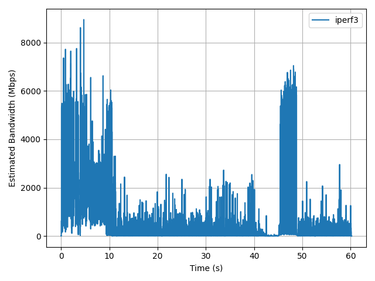
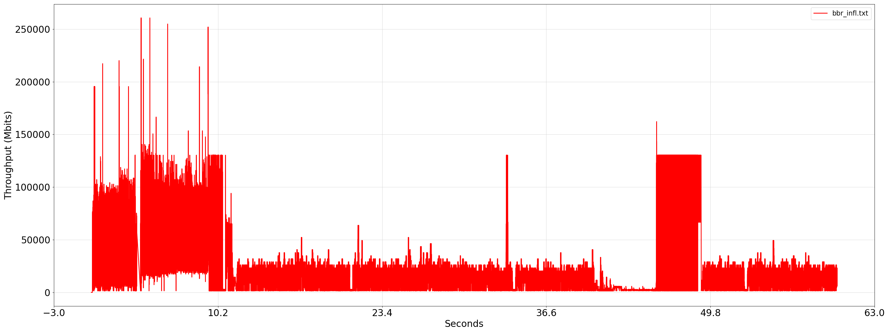
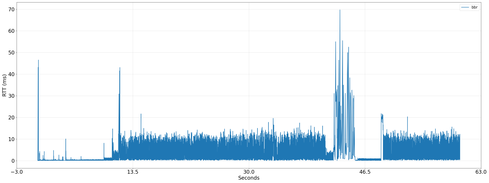
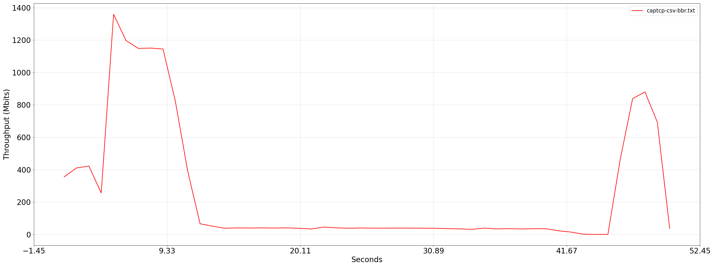
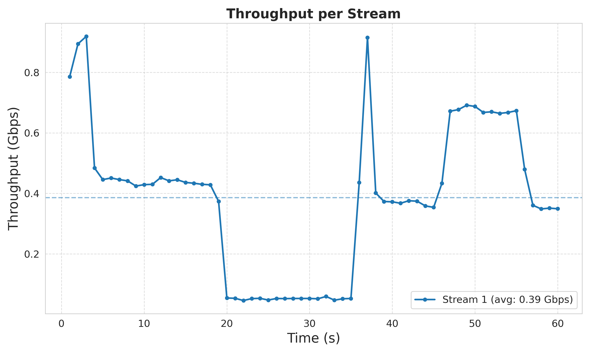

#  bdp use tcp.analysis.bytes_in_flight


```
 tshark -2 -r bbr2.pcap -R 'tcp.analysis.ack_rtt'  -e frame.time_relative -e frame.len -e frame.number -e frame.time_epoch -e ip.src  -e ip.dst -e tcp.window_size -e tcp.analysis.acks_frame -e tcp.analysis.ack_rtt   -e tcp.analysis.bytes_in_flight -Tfields -E separator=, > bbr.txt
```


查看tshark是否支持json

```
tshark -h | grep json
  -T pdml|ps|psml|json|jsonraw|ek|tabs|text|fields|?
  -j <protocolfilter>      protocols layers filter if -T ek|pdml|json selected
  -J <protocolfilter>      top level protocol filter if -T ek|pdml|json selected
  --no-duplicate-keys      If -T json is specified, merge duplicate keys in an object
                           into a single key with as value a json array containing all
```

```
tshark --version
TShark (Wireshark) 3.2.3 (Git v3.2.3 packaged as 3.2.3-1)
```

```
docker  run -it -d --net=host --cap-add=NET_ADMIN --privileged=true  -v /root/prog/modules/tcp-bbr:/tcp-bbr -v /root/prog:/root/prog  arm64v8/ubuntu:20.04

 apt-get update
  apt-get install python3
  apt-get -y install tshark
  apt-get install python3-pip
  pip3 install ijson
  pip3 install matplotlib
  apt-get -y install python2
  curl https://bootstrap.pypa.io/pip/2.7/get-pip.py -o get-pip.py
  python2 get-pip.py
  apt-get -y install pkg-config  
  python3 parse_bandwidth_pcap.py  -f bbr2.pcap  -s 10.10.103.251 -d 10.10.103.82
```

```
  python3 parse_bandwidth_pcap.py  -f bbr2.pcap  -s 10.10.103.251 -d 10.10.103.82
```




> ### inflight
采用plot_throughput.py脚本
```
root@centos7:/tcp-bbr/plot-rtt-tput# tshark -2 -r ../bbr.pcap  -R 'tcp.analysis.bytes_in_flight'  -e frame.time_relative -e tcp.analysis.bytes_in_flight -Tfields -E separator=, >  bbr_infl.txt
Running as user "root" and group "root". This could be dangerous.
root@centos7:/tcp-bbr/plot-rtt-tput# python3 plot_throughput.py --xlimit 60 -f bbr_infl.txt -o bbr-infl.png
saving to bbr-infl.png
root@centos7:/tcp-bbr/plot-rtt-tput# 
```


> ###  rtt
因为ipef测试了60s，所以--xlimit 60


```
root@centos7:/tcp-bbr/plot-rtt-tput# tshark -2 -r ../bbr.pcap  -R 'tcp.analysis.ack_rtt'  -e frame.time_relative -e tcp.analysis.ack_rtt -Tfields -E separator=, >  bbr_rtt.txt
Running as user "root" and group "root". This could be dangerous.
root@centos7:/tcp-bbr/plot-rtt-tput# 
```

```
root@centos7:/tcp-bbr/plot-rtt-tput# python3 plot_ping.py -f   bbr_rtt.txt   --xlimit 60 -o bbr_rtt.png
root@centos7:/tcp-bbr/plot-rtt-tput# 
```



> ###   captcp(依赖python2)分析throughout



```

git clone https://github.com/hgn/captcp.git
make
```
进入captcp 执行make安装


```
pip2 install dpkt

```


```
root@centos7:/tcp-bbr/plot-rtt-tput# pip2 install dpkt
DEPRECATION: Python 2.7 reached the end of its life on January 1st, 2020. Please upgrade your Python as Python 2.7 is no longer maintained. pip 21.0 will drop support for Python 2.7 in January 2021. More details about Python 2 support in pip can be found at https://pip.pypa.io/en/latest/development/release-process/#python-2-support pip 21.0 will remove support for this functionality.
Collecting dpkt
  Downloading dpkt-1.9.8.tar.gz (180 kB)
     |################################| 180 kB 155 kB/s 
Building wheels for collected packages: dpkt
  Building wheel for dpkt (setup.py) ... done
  Created wheel for dpkt: filename=dpkt-1.9.8-py2-none-any.whl size=194960 sha256=7f690d3f8e673aadf985e6523d9f958d8c51edef91e6375b12c47ed4a78e4f6a
  Stored in directory: /root/.cache/pip/wheels/d6/24/0b/45e5ef43a490316921d9962ab80a1e226894e72533ed524f1b
Successfully built dpkt
Installing collected packages: dpkt
Successfully installed dpkt-1.9.8
root@centos7:/tcp-bbr/plot-rtt-tput# captcp throughput -u Mbit --stdio ../bbr.pcap > captcp-bbr.txt
# captcp 2010-2013 Hagen Paul Pfeifer and others (c)
# http://research.protocollabs.com/captcp/
```


```
root@centos7:/tcp-bbr/plot-rtt-tput# awk "{print (\$1)(\",\")(\$2) }" < captcp-bbr.txt > captcp-csv-bbr.txt
root@centos7:/tcp-bbr/plot-rtt-tput# python3 plot_throughput.py --xlimit 50 -f captcp-csv-bbr.txt -o bbr-tput.png
saving to bbr-tput.png
```

+ 参考bonus.sh

```
#!/bin/bash

# Note: Mininet must be run as root.  So invoke this shell script
# using sudo.

oldpwd=$PWD
dir=${1:-bonus}
mkdir -p $dir
rm -rf $dir/*

#!/bin/bash

# This shell script must be run using sudo.

run () {
    type=$1
    dir=$2

    oldpwd=$PWD
    mkdir -p $dir
    rm -rf $dir/*

    if [ "$type" = "smallbuffer" ]
    then
	maxq=200
    elif [ "$type" = "largebuffer" ]
    then
	maxq=600
    else
	exit "Unknown experiment type $type"
    fi

    echo "running $type experiment..."

    python flows.py --fig-num 7 --cong bbr --time 100 --bw-net 10 --delay 10 --maxq $maxq --environment mininet --flow-type iperf --dir $dir

    cd $dir
    echo "processing flows..."
    for i in 0 1; do
	captcp throughput -u Mbit -f 2 --stdio flow$i.dmp > captcp$i.txt
	awk '{print $1","$2 }' < captcp$i.txt > captcp-csv$i.txt
    done
    cd $oldpwd
    python plot_throughput.py --xlimit 100 -f $dir/captcp-csv* -o $dir/bonus_$type.png -l cubic bbr
}

if [ "${1-all}" = "all" ]
then
    run "smallbuffer" bonus_smallbuffer
    run "largebuffer" bonus_largebuffer
else
    run $1 bonus_$1
fi
```

> ###  python map


‌Python 3
```
‌Python 3 返回值‌：map() 在 Python 3 中返回一个 map 对象，需用 list() 转换为列表。例如：
 
x = [1, 2, 3]  
y = list(map(float, x))  
输出 [1.0, 2.0, 3.0]。 ‌
```


Python 2 
```
‌兼容性处理‌：若需在 Python 2 中使用类似功能，可直接调用 map() 并传入函数和列表，例如：
python
Copy Code
deff(x): returnx*x  
print(map(f, [1, 2, 3])) 
```


# throughput

```
iperf3 -c 10.10.103.82 -i 1 -t 60 -C bbr -p 5202 -J > cli.json
```

```
python3 iperf_plotter.py  cli.json 
```



 
 # to do 
 
```
root@centos7:/tcp-bbr/iperf3-log# python3 iperf3_analyzer.py  -v  --plot  logs/cli.json
2025-10-16 00:40:01 | INFO     | parsed 0 interval rows
2025-10-16 00:40:01 | INFO     | wrote CSV → logs/cli.json.csv
2025-10-16 00:40:01 | ERROR    | iperf3_plotter not installed; skipping plot
2025-10-16 00:40:01 | INFO     | processed logs/cli.json in 0.534s
2025-10-16 00:40:01 | INFO     | finished 1 file(s) in 0.535s
```