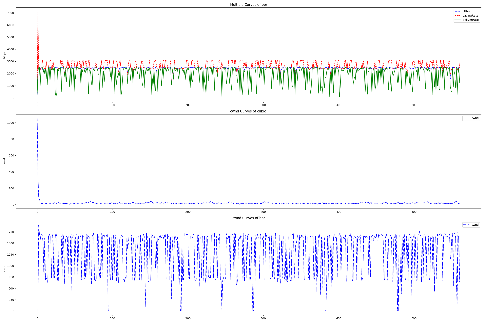
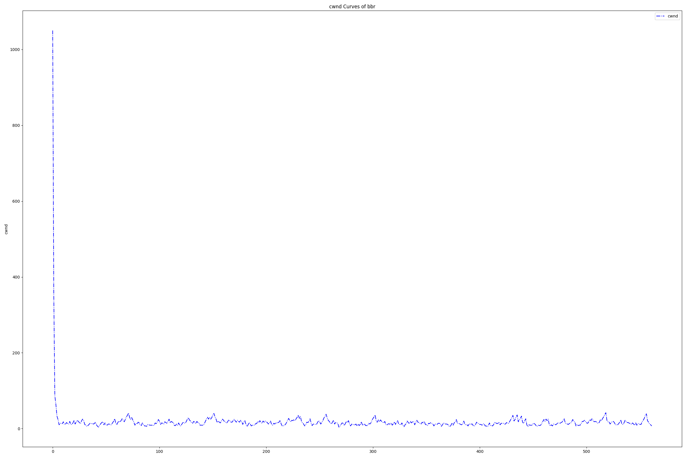
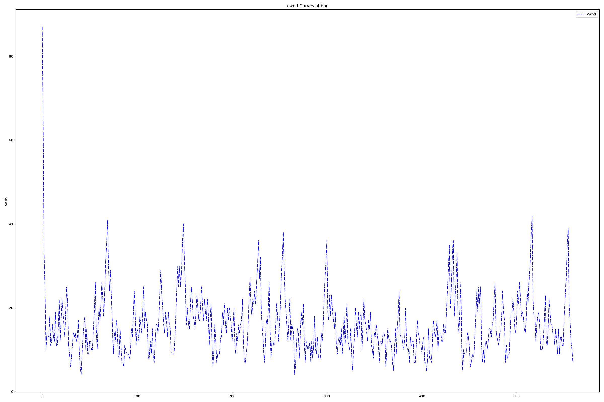
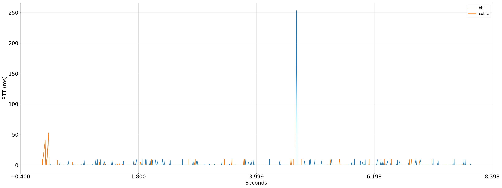
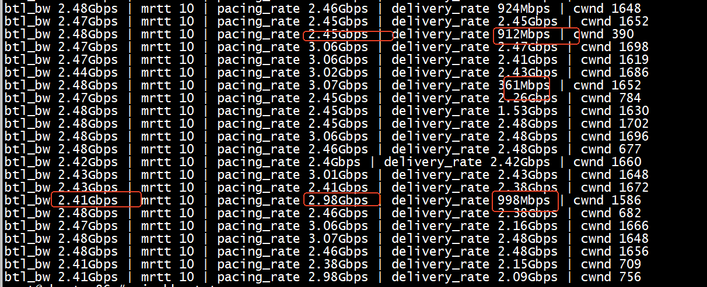
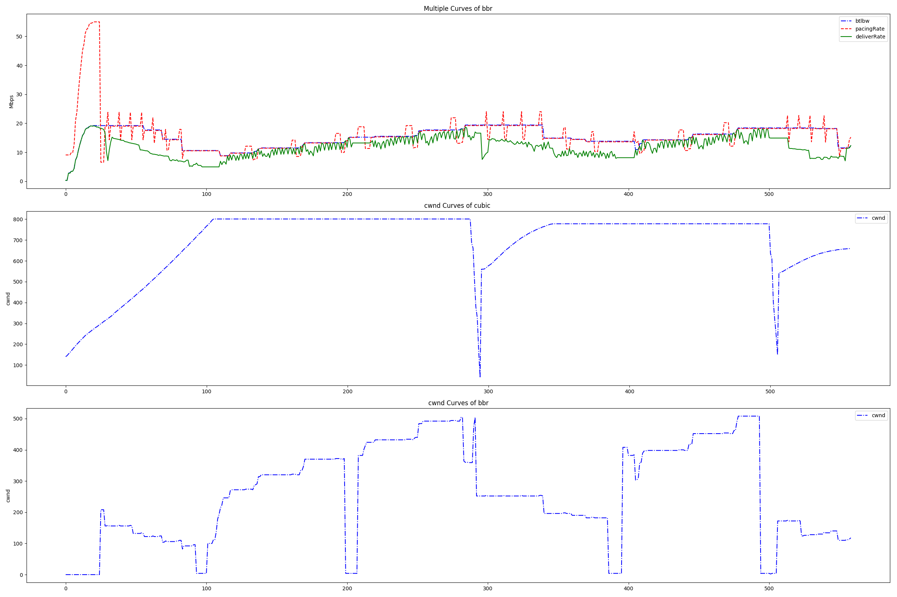
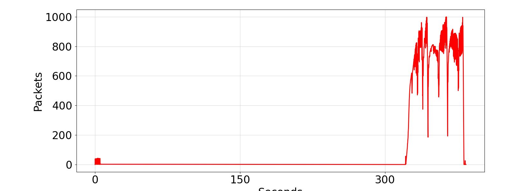
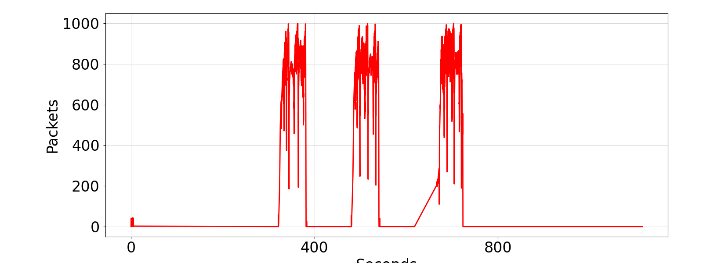

```
./parse_ss_out.py 5202 -i 1.0
 python2 main-bbr.py 
python3 plot_queue.py -f queue.txt -o qlen.png
```


# 测试


> ## 测试方法

+ netem设置   
```
cat bbr_cubic_rtt.sh 
tc qdisc del dev enp61s0f1np1 root
# 为打向 5201 端口的流打标签 10
iptables -A OUTPUT -t mangle -p tcp --dport 5201 -j MARK --set-mark 10
# 为打向 5202 端口的流打标签 20
iptables -A OUTPUT -t mangle -p tcp --dport 5202 -j MARK --set-mark 20

tc qdisc add dev enp61s0f1np1 root handle 1: htb
tc class add dev enp61s0f1np1 parent 1: classid 1:1 htb rate 10gbit
tc class add dev enp61s0f1np1 parent 1:1 classid 1:10 htb rate 5gbit
tc class add dev enp61s0f1np1 parent 1:1 classid 1:20 htb rate 5gbit

# filter 1 关联标签 10 
tc filter add dev enp61s0f1np1 protocol ip parent 1:0 prio 1 handle 10 fw flowid 1:10
# filter 2 关联标签 20
tc filter add dev enp61s0f1np1 protocol ip parent 1:0 prio 1 handle 20 fw flowid 1:20

# 标签 10 的 5201 流时延 2ms，丢包 1%
tc qdisc add dev enp61s0f1np1 parent 1:10 handle 10: netem delay 10ms loss 1
# 标签 20 的 5202 流时延 20ms，丢包 1%
tc qdisc add dev enp61s0f1np1 parent 1:20 handle 20: netem delay 10ms loss 1
#tc qdisc add dev enp61s0f1np1 parent 1:20 handle 20: netem delay 10ms  15ms 50%  loss 3
```
+ 同时开启iperf3 with bbr，iperf3 with cubic   


iperf3 with bbr 带宽在1.5G左右
```
iperf3 -c 10.22.116.221  -C bbr -p 5202  -t 60 -i 1
Connecting to host 10.22.116.221, port 5202
[  5] local 10.22.116.220 port 58206 connected to 10.22.116.221 port 5202
[ ID] Interval           Transfer     Bitrate         Retr  Cwnd
[  5]   0.00-1.00   sec   206 MBytes  1.73 Gbits/sec  346   6.51 MBytes       
[  5]   1.00-2.00   sec   205 MBytes  1.72 Gbits/sec  450   6.56 MBytes       
[  5]   2.00-3.00   sec   152 MBytes  1.28 Gbits/sec  330   5.93 MBytes       
[  5]   3.00-4.00   sec   196 MBytes  1.65 Gbits/sec  569   2.69 MBytes       
[  5]   4.00-5.00   sec   211 MBytes  1.77 Gbits/sec  415   6.41 MBytes       
[  5]   5.00-6.00   sec   211 MBytes  1.77 Gbits/sec  496   6.42 MBytes       
[  5]   6.00-7.00   sec   202 MBytes  1.70 Gbits/sec  515   6.66 MBytes       
[  5]   7.00-8.00   sec   202 MBytes  1.70 Gbits/sec  556   6.75 MBytes       
[  5]   8.00-9.00   sec   196 MBytes  1.65 Gbits/sec  578   6.72 MBytes       
[  5]   9.00-10.00  sec   199 MBytes  1.67 Gbits/sec  480   6.50 MBytes       
[  5]  10.00-11.00  sec   152 MBytes  1.28 Gbits/sec  348   6.45 MBytes       
[  5]  11.00-12.00  sec   198 MBytes  1.66 Gbits/sec  485   5.64 MBytes       
[  5]  12.00-13.00  sec   210 MBytes  1.76 Gbits/sec  458   6.69 MBytes       
[  5]  13.00-14.00  sec   200 MBytes  1.68 Gbits/sec  604   6.58 MBytes       
[  5]  14.00-15.00  sec   190 MBytes  1.59 Gbits/sec  601   2.65 MBytes       
[  5]  15.00-16.00  sec   208 MBytes  1.74 Gbits/sec  480   4.79 MBytes       
[  5]  16.00-17.00  sec   206 MBytes  1.73 Gbits/sec  553   6.50 MBytes       
[  5]  17.00-18.00  sec   142 MBytes  1.20 Gbits/sec  496   2.49 MBytes       
[  5]  18.00-19.00  sec   202 MBytes  1.70 Gbits/sec  450   6.52 MBytes       
[  5]  19.00-20.00  sec   199 MBytes  1.67 Gbits/sec  585   2.68 MBytes       
[  5]  20.00-21.00  sec   155 MBytes  1.30 Gbits/sec  402   2.78 MBytes       
[  5]  21.00-22.00  sec   199 MBytes  1.67 Gbits/sec  517   6.71 MBytes       
[  5]  22.00-23.00  sec   202 MBytes  1.70 Gbits/sec  490   6.27 MBytes       
[  5]  23.00-24.00  sec   198 MBytes  1.66 Gbits/sec  561   2.92 MBytes       
[  5]  24.00-25.00  sec   216 MBytes  1.81 Gbits/sec  420   2.62 MBytes       
[  5]  25.00-26.00  sec   199 MBytes  1.67 Gbits/sec  540   6.39 MBytes       
[  5]  26.00-27.00  sec   208 MBytes  1.74 Gbits/sec  415   6.62 MBytes       
[  5]  27.00-28.00  sec   156 MBytes  1.31 Gbits/sec  390   6.80 MBytes       
[  5]  28.00-29.00  sec   206 MBytes  1.73 Gbits/sec  435   6.72 MBytes       
[  5]  29.00-30.00  sec   192 MBytes  1.61 Gbits/sec  585   2.14 MBytes       
[  5]  30.00-31.00  sec   154 MBytes  1.29 Gbits/sec  420   2.60 MBytes       
[  5]  31.00-32.00  sec   218 MBytes  1.82 Gbits/sec  420   6.35 MBytes       
[  5]  32.00-33.00  sec   149 MBytes  1.25 Gbits/sec  435   2.02 MBytes       
[  5]  33.00-34.00  sec   198 MBytes  1.66 Gbits/sec  537   6.59 MBytes       
[  5]  34.00-35.00  sec   201 MBytes  1.69 Gbits/sec  524   6.55 MBytes       
[  5]  35.00-36.00  sec   206 MBytes  1.73 Gbits/sec  428   6.42 MBytes       
[  5]  36.00-37.00  sec   209 MBytes  1.75 Gbits/sec  467   6.67 MBytes       
[  5]  37.00-38.00  sec   205 MBytes  1.72 Gbits/sec  535   6.75 MBytes       
[  5]  38.00-39.00  sec   206 MBytes  1.73 Gbits/sec  420   2.63 MBytes       
[  5]  39.00-40.00  sec   186 MBytes  1.56 Gbits/sec  562   6.71 MBytes       
[  5]  40.00-41.00  sec   174 MBytes  1.46 Gbits/sec  450   16.2 KBytes       
[  5]  41.00-42.00  sec   179 MBytes  1.50 Gbits/sec  570   6.70 MBytes       
[  5]  42.00-43.00  sec   198 MBytes  1.66 Gbits/sec  570   6.54 MBytes       
[  5]  43.00-44.00  sec   186 MBytes  1.56 Gbits/sec  576   6.58 MBytes       
[  5]  44.00-45.00  sec   200 MBytes  1.68 Gbits/sec  580   6.73 MBytes       
[  5]  45.00-46.00  sec   191 MBytes  1.60 Gbits/sec  695   6.25 MBytes       
[  5]  46.00-47.00  sec   200 MBytes  1.68 Gbits/sec  479   6.63 MBytes       
[  5]  47.00-48.00  sec   205 MBytes  1.72 Gbits/sec  486   6.42 MBytes       
[  5]  48.00-49.00  sec   204 MBytes  1.71 Gbits/sec  540   6.72 MBytes       
[  5]  49.00-50.00  sec   205 MBytes  1.72 Gbits/sec  407   6.51 MBytes       
[  5]  50.00-51.00  sec   220 MBytes  1.85 Gbits/sec  376   6.51 MBytes       
[  5]  51.00-52.00  sec   155 MBytes  1.30 Gbits/sec  412   6.52 MBytes       
[  5]  52.00-53.00  sec   209 MBytes  1.75 Gbits/sec  495   6.56 MBytes       
[  5]  53.00-54.00  sec   209 MBytes  1.75 Gbits/sec  480   6.72 MBytes       
[  5]  54.00-55.00  sec   200 MBytes  1.68 Gbits/sec  611   6.62 MBytes       
[  5]  55.00-56.00  sec   195 MBytes  1.64 Gbits/sec  570   6.54 MBytes       
[  5]  56.00-57.00  sec   184 MBytes  1.54 Gbits/sec  644   2.69 MBytes       
[  5]  57.00-58.00  sec   206 MBytes  1.73 Gbits/sec  540   6.61 MBytes       
[  5]  58.00-59.00  sec   196 MBytes  1.65 Gbits/sec  593   6.45 MBytes       
[  5]  59.00-60.00  sec   148 MBytes  1.24 Gbits/sec  388   2.63 MBytes       
- - - - - - - - - - - - - - - - - - - - - - - - -
[ ID] Interval           Transfer     Bitrate         Retr
[  5]   0.00-60.00  sec  11.3 GBytes  1.62 Gbits/sec  29760             sender
[  5]   0.00-60.04  sec  11.3 GBytes  1.62 Gbits/sec                  receiver

```

```
iperf3 -c 10.22.116.221  -C cubic -p 5201  -t 60 -i 1
Connecting to host 10.22.116.221, port 5201
[  5] local 10.22.116.220 port 47792 connected to 10.22.116.221 port 5201
[ ID] Interval           Transfer     Bitrate         Retr  Cwnd
[  5]   0.00-1.00   sec  52.9 MBytes   443 Mbits/sec  142   60.8 KBytes       
[  5]   1.00-2.00   sec  5.00 MBytes  41.9 Mbits/sec   21   32.4 KBytes       
[  5]   2.00-3.00   sec  5.00 MBytes  41.9 Mbits/sec   11   81.0 KBytes       
[  5]   3.00-4.00   sec  6.25 MBytes  52.4 Mbits/sec   20   40.5 KBytes       
[  5]   4.00-5.00   sec  3.75 MBytes  31.5 Mbits/sec   15   68.9 KBytes       
[  5]   5.00-6.00   sec  5.00 MBytes  41.9 Mbits/sec   17   40.5 KBytes       
[  5]   6.00-7.00   sec  6.25 MBytes  52.4 Mbits/sec    9   97.2 KBytes       
[  5]   7.00-8.00   sec  11.2 MBytes  94.4 Mbits/sec   11    117 KBytes       
[  5]   8.00-9.00   sec  5.00 MBytes  41.9 Mbits/sec   19   36.5 KBytes       
[  5]   9.00-10.00  sec  3.75 MBytes  31.5 Mbits/sec   21   32.4 KBytes       
[  5]  10.00-11.00  sec  6.25 MBytes  52.4 Mbits/sec   15   60.8 KBytes       
[  5]  11.00-12.00  sec  6.25 MBytes  52.4 Mbits/sec   12   85.1 KBytes       
[  5]  12.00-13.00  sec  3.75 MBytes  31.5 Mbits/sec   25   40.5 KBytes       
[  5]  13.00-14.00  sec  7.50 MBytes  62.9 Mbits/sec   13   64.8 KBytes       
[  5]  14.00-15.00  sec  5.00 MBytes  41.9 Mbits/sec   14   28.4 KBytes       
[  5]  15.00-16.00  sec  7.50 MBytes  62.9 Mbits/sec    8    117 KBytes       
[  5]  16.00-17.00  sec  10.0 MBytes  83.9 Mbits/sec   14   81.0 KBytes       
[  5]  17.00-18.00  sec  7.50 MBytes  62.9 Mbits/sec   13   60.8 KBytes       
[  5]  18.00-19.00  sec  7.50 MBytes  62.9 Mbits/sec   10   77.0 KBytes       
[  5]  19.00-20.00  sec  5.00 MBytes  41.9 Mbits/sec   18   36.5 KBytes       
[  5]  20.00-21.00  sec  5.00 MBytes  41.9 Mbits/sec   14   52.7 KBytes       
[  5]  21.00-22.00  sec  6.25 MBytes  52.4 Mbits/sec   12   48.6 KBytes       
[  5]  22.00-23.00  sec  6.25 MBytes  52.4 Mbits/sec   17   36.5 KBytes       
[  5]  23.00-24.00  sec  5.00 MBytes  41.9 Mbits/sec   13   89.1 KBytes       
[  5]  24.00-25.00  sec  10.0 MBytes  83.9 Mbits/sec   13   77.0 KBytes       
[  5]  25.00-26.00  sec  6.25 MBytes  52.4 Mbits/sec   14   60.8 KBytes       
[  5]  26.00-27.00  sec  6.25 MBytes  52.4 Mbits/sec   12   68.9 KBytes       
[  5]  27.00-28.00  sec  8.75 MBytes  73.4 Mbits/sec   11   52.7 KBytes       
[  5]  28.00-29.00  sec  5.00 MBytes  41.9 Mbits/sec   18   60.8 KBytes       
[  5]  29.00-30.00  sec  5.00 MBytes  41.9 Mbits/sec   18   48.6 KBytes       
[  5]  30.00-31.00  sec  3.75 MBytes  31.5 Mbits/sec   19   40.5 KBytes       
[  5]  31.00-32.00  sec  5.00 MBytes  41.9 Mbits/sec   13   89.1 KBytes       
[  5]  32.00-33.00  sec  8.75 MBytes  73.4 Mbits/sec   11   77.0 KBytes       
[  5]  33.00-34.00  sec  5.00 MBytes  41.9 Mbits/sec   15   48.6 KBytes       
[  5]  34.00-35.00  sec  6.25 MBytes  52.4 Mbits/sec   14   60.8 KBytes       
[  5]  35.00-36.00  sec  5.00 MBytes  41.9 Mbits/sec   11   68.9 KBytes       
[  5]  36.00-37.00  sec  6.25 MBytes  52.4 Mbits/sec   14   68.9 KBytes       
[  5]  37.00-38.00  sec  5.00 MBytes  41.9 Mbits/sec   14   60.8 KBytes       
[  5]  38.00-39.00  sec  5.00 MBytes  41.9 Mbits/sec   18   32.4 KBytes       
[  5]  39.00-40.00  sec  3.75 MBytes  31.5 Mbits/sec   14   60.8 KBytes       
[  5]  40.00-41.00  sec  5.00 MBytes  41.9 Mbits/sec   15   44.6 KBytes       
[  5]  41.00-42.00  sec  3.75 MBytes  31.5 Mbits/sec   20   64.8 KBytes       
[  5]  42.00-43.00  sec  5.00 MBytes  41.9 Mbits/sec   17   36.5 KBytes       
[  5]  43.00-44.00  sec  2.50 MBytes  21.0 Mbits/sec   18   40.5 KBytes       
[  5]  44.00-45.00  sec  6.25 MBytes  52.4 Mbits/sec   14   52.7 KBytes       
[  5]  45.00-46.00  sec  5.00 MBytes  41.9 Mbits/sec   10    122 KBytes       
[  5]  46.00-47.00  sec  10.0 MBytes  83.9 Mbits/sec   22   64.8 KBytes       
[  5]  47.00-48.00  sec  5.00 MBytes  41.9 Mbits/sec   18   36.5 KBytes       
[  5]  48.00-49.00  sec  3.75 MBytes  31.5 Mbits/sec   16   60.8 KBytes       
[  5]  49.00-50.00  sec  7.50 MBytes  62.9 Mbits/sec   21   24.3 KBytes       
[  5]  50.00-51.00  sec  3.75 MBytes  31.5 Mbits/sec   11   68.9 KBytes       
[  5]  51.00-52.00  sec  6.25 MBytes  52.4 Mbits/sec   14   81.0 KBytes       
[  5]  52.00-53.00  sec  5.00 MBytes  41.9 Mbits/sec   13   77.0 KBytes       
[  5]  53.00-54.00  sec  7.50 MBytes  62.9 Mbits/sec   13    109 KBytes       
[  5]  54.00-55.00  sec  7.50 MBytes  62.9 Mbits/sec   11   97.2 KBytes       
[  5]  55.00-56.00  sec  10.0 MBytes  83.9 Mbits/sec   15   72.9 KBytes       
[  5]  56.00-57.00  sec  5.00 MBytes  41.9 Mbits/sec   18   52.7 KBytes       
[  5]  57.00-58.00  sec  6.25 MBytes  52.4 Mbits/sec   14   60.8 KBytes       
[  5]  58.00-59.00  sec  3.75 MBytes  31.5 Mbits/sec   13   72.9 KBytes       
[  5]  59.00-60.00  sec  7.50 MBytes  62.9 Mbits/sec   18   28.4 KBytes       
- - - - - - - - - - - - - - - - - - - - - - - - -
[ ID] Interval           Transfer     Bitrate         Retr
[  5]   0.00-60.00  sec   404 MBytes  56.5 Mbits/sec  1024             sender
```

> ## 测试结果   

```
 bash figure5.sh 
 python2 plot-bbr-cubic2.py  bbr.txt 
 python2 plot-cubic-cwnd.py
```

将cubic-cwnd单独plot和将最开始cwnd>100的过滤   

将最开始cwnd>100的过滤




> ##  bbr delivery_rate pacing_rate 


delivery_rate 陡降到Mbs,pacing_rate 却是GBs   


iperf3 with bbr 带宽在1.5G左右   
- delivery rate:

  1. inflight < BDP      
     inflight  増加  delivery rate  ．   

  2. inflight => BDP  
     delivery rate  最大 ,inflight - BDP = bottleneck queue ．     

  3. inflight > BDP + buffer size       
       CUBIC (loss-based)     

- RTT:

  1. inflight < BDP      
      RTT ~ RTprop  ．     

  2. inflight => BDP  
     bottleneck queue  ．     

  3. inflight > BDP + buffer size   

```
def send(packet):
    bdp = BtlBwFilter.currentMax * RTpropFilter.currentMin
    # 若在途的数据包超过了约束值，则暂缓发送数据
    if (inflight >= cwnd_gain * bdp):
        # wait for ack or timeout
        return
    # 若已经进入了下一个发送时间点，则获取数据包并且进行发送
    if (now >= nextSendTime):
        packet = nextPacketToSend()
        if (not packet):
            # 在应用层数据包不够时就更新app_limited状态
            app_limited_until = inflight
            return
         packet.app_limited = app_limited_until > 0
         packet.sendtime = now
         # 每个数据包都会携带有在发送时刻已经确认ACK的数据量
         # 从而在接收该包ACK时可以计算send-ack这段时间内的新抵达数据量
         # 用于计算发送速率
         packet.delivered = delivered
         packet.delivered_time = delivered_time
         ship(packet)
         # 协调下一次发送时间，确保不会超出瓶颈带宽太多
         nextSendTime = now + packet.size / (pacing_gain * BtlBwFilter.currentMax)
     timerCallbackAt(send, nextSendTime)
```


# test2 (bufferbloat or high bdp)


```
cat bdp.sh 

#!/usr/bin/env bash
# Helper: reset qdisc
IFACE="enp61s0f1np1"
reset_qdisc() {
   tc qdisc del dev "$IFACE" root 2>/dev/null || true
   tc qdisc del dev "$IFACE" ingress 2>/dev/null || true
}

# Apply scenario shaping on NS_B (server egress / client ingress)
# We shape B-side egress, which is A-side ingress for forward direction.
# High BDP (50Mbps, 100ms)
apply_high_bdp() {
  # 50Mbps, 100ms delay, reasonable queue
  reset_qdisc
  tc qdisc add dev "$IFACE" root handle 1: netem delay 100ms
  tc qdisc add dev "$IFACE" parent 1: handle 10: tbf rate 50mbit burst 64kbit latency 50ms
  tc qdisc add dev "$IFACE" parent 10: pfifo limit 1000
}

apply_bufferbloat() {
  # Big buffer (pfifo), same link
  reset_qdisc
  tc qdisc add dev "$IFACE" root handle 1: netem delay 50ms
  tc qdisc add dev "$IFACE" parent 1: handle 10: tbf rate 50mbit burst 256kbit latency 200ms
  tc qdisc add dev "$IFACE" parent 10: pfifo limit 20000
}
apply_high_bdp
#apply_bufferbloat
```
```
iperf3 -c 10.22.116.221  -C cubic -p 5201  -t 60 -i 1
Connecting to host 10.22.116.221, port 5201
[  5] local 10.22.116.220 port 42110 connected to 10.22.116.221 port 5201
[ ID] Interval           Transfer     Bitrate         Retr  Cwnd
[  5]   0.00-1.00   sec  4.07 MBytes  34.1 Mbits/sec    0    652 KBytes       
[  5]   1.00-2.00   sec  6.23 MBytes  52.3 Mbits/sec    0    936 KBytes       
[  5]   2.00-3.00   sec  5.00 MBytes  41.9 Mbits/sec    0   1.12 MBytes       
[  5]   3.00-4.00   sec  3.75 MBytes  31.5 Mbits/sec    0   1.30 MBytes       
[  5]   4.00-5.00   sec  3.75 MBytes  31.5 Mbits/sec    0   1.51 MBytes       
[  5]   5.00-6.00   sec  3.75 MBytes  31.5 Mbits/sec    0   1.72 MBytes       
[  5]   6.00-7.00   sec  5.00 MBytes  41.9 Mbits/sec    0   1.94 MBytes       
[  5]   7.00-8.00   sec  5.00 MBytes  41.9 Mbits/sec    0   2.18 MBytes       
[  5]   8.00-9.00   sec  3.75 MBytes  31.5 Mbits/sec    0   2.42 MBytes       
[  5]   9.00-10.00  sec  5.00 MBytes  41.9 Mbits/sec    0   2.67 MBytes       
[  5]  10.00-11.00  sec  5.00 MBytes  41.9 Mbits/sec    0   2.92 MBytes       
[  5]  11.00-12.00  sec  6.19 MBytes  51.9 Mbits/sec    0   3.17 MBytes       
[  5]  12.00-13.00  sec  4.95 MBytes  41.5 Mbits/sec    0   3.17 MBytes       
[  5]  13.00-14.00  sec  4.94 MBytes  41.5 Mbits/sec    0   3.17 MBytes       
[  5]  14.00-15.00  sec  4.94 MBytes  41.5 Mbits/sec    0   3.17 MBytes       
[  5]  15.00-16.00  sec  4.95 MBytes  41.5 Mbits/sec    0   3.17 MBytes       
[  5]  16.00-17.00  sec  4.94 MBytes  41.5 Mbits/sec    0   3.17 MBytes       
[  5]  17.00-18.00  sec  3.71 MBytes  31.1 Mbits/sec    0   3.17 MBytes       
[  5]  18.00-19.00  sec  4.94 MBytes  41.5 Mbits/sec    0   3.17 MBytes       
[  5]  19.00-20.00  sec  4.95 MBytes  41.5 Mbits/sec    0   3.17 MBytes       
[  5]  20.00-21.00  sec  3.71 MBytes  31.1 Mbits/sec    0   3.17 MBytes       
[  5]  21.00-22.00  sec  4.94 MBytes  41.5 Mbits/sec    0   3.17 MBytes       
[  5]  22.00-23.00  sec  3.71 MBytes  31.1 Mbits/sec    0   3.17 MBytes       
[  5]  23.00-24.00  sec  4.94 MBytes  41.5 Mbits/sec    0   3.17 MBytes       
[  5]  24.00-25.00  sec  4.95 MBytes  41.5 Mbits/sec    0   3.17 MBytes       
[  5]  25.00-26.00  sec  3.71 MBytes  31.1 Mbits/sec    0   3.17 MBytes       
[  5]  26.00-27.00  sec  4.94 MBytes  41.5 Mbits/sec    0   3.17 MBytes       
[  5]  27.00-28.00  sec  3.71 MBytes  31.1 Mbits/sec    0   3.17 MBytes       
[  5]  28.00-29.00  sec  3.71 MBytes  31.1 Mbits/sec    0   3.17 MBytes       
[  5]  29.00-30.00  sec  3.71 MBytes  31.1 Mbits/sec    0   3.17 MBytes       
[  5]  30.00-31.00  sec  3.71 MBytes  31.1 Mbits/sec    0   3.17 MBytes       
[  5]  31.00-32.00  sec  2.48 MBytes  20.8 Mbits/sec   18   1.33 MBytes       
[  5]  32.00-33.00  sec  4.89 MBytes  41.0 Mbits/sec    0   2.30 MBytes       
[  5]  33.00-34.00  sec  5.00 MBytes  42.0 Mbits/sec    0   2.53 MBytes       
[  5]  34.00-35.00  sec  3.75 MBytes  31.5 Mbits/sec    0   2.73 MBytes       
[  5]  35.00-36.00  sec  3.75 MBytes  31.5 Mbits/sec    0   2.90 MBytes       
[  5]  36.00-37.00  sec  4.99 MBytes  41.8 Mbits/sec    0   3.01 MBytes       
[  5]  37.00-38.00  sec  3.71 MBytes  31.1 Mbits/sec    0   3.08 MBytes       
[  5]  38.00-39.00  sec  4.95 MBytes  41.6 Mbits/sec    0   3.08 MBytes       
[  5]  39.00-40.00  sec  4.96 MBytes  41.6 Mbits/sec    0   3.08 MBytes       
[  5]  40.00-41.00  sec  4.96 MBytes  41.6 Mbits/sec    0   3.08 MBytes       
[  5]  41.00-42.00  sec  3.72 MBytes  31.2 Mbits/sec    0   3.08 MBytes       
[  5]  42.00-43.00  sec  4.95 MBytes  41.6 Mbits/sec    0   3.08 MBytes       
[  5]  43.00-44.00  sec  6.21 MBytes  52.1 Mbits/sec    0   3.08 MBytes       
[  5]  44.00-45.00  sec  3.72 MBytes  31.2 Mbits/sec    0   3.08 MBytes       
[  5]  45.00-46.00  sec  4.95 MBytes  41.6 Mbits/sec    0   3.08 MBytes       
[  5]  46.00-47.00  sec  3.72 MBytes  31.2 Mbits/sec    0   3.08 MBytes       
[  5]  47.00-48.00  sec  4.96 MBytes  41.6 Mbits/sec    0   3.08 MBytes       
[  5]  48.00-49.00  sec  3.72 MBytes  31.2 Mbits/sec    0   3.08 MBytes       
[  5]  49.00-50.00  sec  3.72 MBytes  31.2 Mbits/sec    0   3.08 MBytes       
[  5]  50.00-51.00  sec  4.96 MBytes  41.6 Mbits/sec    0   3.08 MBytes       
[  5]  51.00-52.00  sec  3.72 MBytes  31.2 Mbits/sec    0   3.08 MBytes       
[  5]  52.00-53.00  sec  3.72 MBytes  31.2 Mbits/sec    0   3.08 MBytes       
[  5]  53.00-54.00  sec  3.72 MBytes  31.2 Mbits/sec    0   3.08 MBytes       
[  5]  54.00-55.00  sec  2.48 MBytes  20.8 Mbits/sec    7    575 KBytes       
[  5]  55.00-56.00  sec  7.50 MBytes  62.9 Mbits/sec    5   2.27 MBytes       
[  5]  56.00-57.00  sec  3.75 MBytes  31.5 Mbits/sec    0   2.40 MBytes       
[  5]  57.00-58.00  sec  5.00 MBytes  41.9 Mbits/sec    0   2.50 MBytes       
[  5]  58.00-59.00  sec  5.00 MBytes  41.9 Mbits/sec    0   2.56 MBytes       
[  5]  59.00-60.00  sec  5.00 MBytes  41.9 Mbits/sec    0   2.60 MBytes       
- - - - - - - - - - - - - - - - - - - - - - - - -
[ ID] Interval           Transfer     Bitrate         Retr
[  5]   0.00-60.00  sec   269 MBytes  37.5 Mbits/sec   30             sender
[  5]   0.00-60.54  sec   268 MBytes  37.1 Mbits/sec                  receiver

iperf Done.
```

```
iperf3 -c 10.22.116.221  -C bbr -p 5202  -t 60 -i 1 
Connecting to host 10.22.116.221, port 5202
[  5] local 10.22.116.220 port 44952 connected to 10.22.116.221 port 5202
[ ID] Interval           Transfer     Bitrate         Retr  Cwnd
[  5]   0.00-1.00   sec  2.18 MBytes  18.3 Mbits/sec    0    356 KBytes       
[  5]   1.00-2.00   sec  3.21 MBytes  26.9 Mbits/sec    0    733 KBytes       
[  5]   2.00-3.00   sec  2.50 MBytes  21.0 Mbits/sec    0    843 KBytes       
[  5]   3.00-4.00   sec  1.25 MBytes  10.5 Mbits/sec    0    632 KBytes       
[  5]   4.00-5.00   sec  2.50 MBytes  21.0 Mbits/sec    0    640 KBytes       
[  5]   5.00-6.00   sec  1.25 MBytes  10.5 Mbits/sec    0    535 KBytes       
[  5]   6.00-7.00   sec  1.25 MBytes  10.5 Mbits/sec    0    494 KBytes       
[  5]   7.00-8.00   sec  0.00 Bytes  0.00 bits/sec    0    429 KBytes       
[  5]   8.00-9.00   sec  1.25 MBytes  10.5 Mbits/sec    0    332 KBytes       
[  5]   9.00-10.00  sec  1.25 MBytes  10.5 Mbits/sec    0    389 KBytes       
[  5]  10.00-11.00  sec  0.00 Bytes  0.00 bits/sec    0    405 KBytes       
[  5]  11.00-12.00  sec  0.00 Bytes  0.00 bits/sec    0    875 KBytes       
[  5]  12.00-13.00  sec  1.25 MBytes  10.5 Mbits/sec    0   1.08 MBytes       
[  5]  13.00-14.00  sec  1.25 MBytes  10.5 Mbits/sec    0   1.08 MBytes       
[  5]  14.00-15.00  sec  1.25 MBytes  10.5 Mbits/sec    0   1.27 MBytes       
[  5]  15.00-16.00  sec  1.25 MBytes  10.5 Mbits/sec    0   1.27 MBytes       
[  5]  16.00-17.00  sec  1.25 MBytes  10.5 Mbits/sec    0   1.27 MBytes       
[  5]  17.00-18.00  sec  1.25 MBytes  10.5 Mbits/sec    0   1.32 MBytes       
[  5]  18.00-19.00  sec  1.25 MBytes  10.5 Mbits/sec    0   1.46 MBytes       
[  5]  19.00-20.00  sec  2.50 MBytes  21.0 Mbits/sec    0   1.46 MBytes       
[  5]  20.00-21.00  sec  1.25 MBytes  10.5 Mbits/sec    0   1.47 MBytes       
[  5]  21.00-22.00  sec  1.25 MBytes  10.5 Mbits/sec    0   16.2 KBytes       
[  5]  22.00-23.00  sec  0.00 Bytes  0.00 bits/sec    0   1.68 MBytes       
[  5]  23.00-24.00  sec  2.50 MBytes  21.0 Mbits/sec    0   1.71 MBytes       
[  5]  24.00-25.00  sec  1.25 MBytes  10.5 Mbits/sec    0   1.71 MBytes       
[  5]  25.00-26.00  sec  1.25 MBytes  10.5 Mbits/sec    0   1.71 MBytes       
[  5]  26.00-27.00  sec  2.50 MBytes  21.0 Mbits/sec    0   1.79 MBytes       
[  5]  27.00-28.00  sec  2.50 MBytes  21.0 Mbits/sec    0   1.95 MBytes       
[  5]  28.00-29.00  sec  1.25 MBytes  10.5 Mbits/sec    0   1.95 MBytes       
[  5]  29.00-30.00  sec  2.50 MBytes  21.0 Mbits/sec    0   1.95 MBytes       
[  5]  30.00-31.00  sec  0.00 Bytes  0.00 bits/sec   15   1.42 MBytes       
[  5]  31.00-32.00  sec  3.75 MBytes  31.5 Mbits/sec    0   1021 KBytes       
[  5]  32.00-33.00  sec  1.25 MBytes  10.5 Mbits/sec    0   1021 KBytes       
[  5]  33.00-34.00  sec  2.50 MBytes  21.0 Mbits/sec    0   1021 KBytes       
[  5]  34.00-35.00  sec  1.25 MBytes  10.5 Mbits/sec    0   1021 KBytes       
[  5]  35.00-36.00  sec  1.25 MBytes  10.5 Mbits/sec    0   1021 KBytes       
[  5]  36.00-37.00  sec  2.50 MBytes  21.0 Mbits/sec    0    794 KBytes       
[  5]  37.00-38.00  sec  1.25 MBytes  10.5 Mbits/sec    0    794 KBytes       
[  5]  38.00-39.00  sec  1.25 MBytes  10.5 Mbits/sec    0    770 KBytes       
[  5]  39.00-40.00  sec  0.00 Bytes  0.00 bits/sec    0    737 KBytes       
[  5]  40.00-41.00  sec  1.25 MBytes  10.5 Mbits/sec    0    737 KBytes       
[  5]  41.00-42.00  sec  1.25 MBytes  10.5 Mbits/sec    0   16.2 KBytes       
[  5]  42.00-43.00  sec  1.25 MBytes  10.5 Mbits/sec    0   1.61 MBytes       
[  5]  43.00-44.00  sec  0.00 Bytes  0.00 bits/sec    0   1.42 MBytes       
[  5]  44.00-45.00  sec  2.50 MBytes  21.0 Mbits/sec    0   1.57 MBytes       
[  5]  45.00-46.00  sec  1.25 MBytes  10.5 Mbits/sec    0   1.57 MBytes       
[  5]  46.00-47.00  sec  1.25 MBytes  10.5 Mbits/sec    0   1.58 MBytes       
[  5]  47.00-48.00  sec  2.50 MBytes  21.0 Mbits/sec    0   1.79 MBytes       
[  5]  48.00-49.00  sec  1.25 MBytes  10.5 Mbits/sec    0   1.79 MBytes       
[  5]  49.00-50.00  sec  2.50 MBytes  21.0 Mbits/sec    0   1.79 MBytes       
[  5]  50.00-51.00  sec  1.25 MBytes  10.5 Mbits/sec    0   1.79 MBytes       
[  5]  51.00-52.00  sec  2.50 MBytes  21.0 Mbits/sec    0   2.01 MBytes       
[  5]  52.00-53.00  sec  1.25 MBytes  10.5 Mbits/sec    0   2.01 MBytes       
[  5]  53.00-54.00  sec  1.25 MBytes  10.5 Mbits/sec    7   16.2 KBytes       
[  5]  54.00-55.00  sec  1.25 MBytes  10.5 Mbits/sec    2    697 KBytes       
[  5]  55.00-56.00  sec  1.25 MBytes  10.5 Mbits/sec    0    705 KBytes       
[  5]  56.00-57.00  sec  1.25 MBytes  10.5 Mbits/sec    0    518 KBytes       
[  5]  57.00-58.00  sec  1.25 MBytes  10.5 Mbits/sec    0    551 KBytes       
[  5]  58.00-59.00  sec  1.25 MBytes  10.5 Mbits/sec    0    437 KBytes       
[  5]  59.00-60.00  sec  1.25 MBytes  10.5 Mbits/sec    0    462 KBytes       
- - - - - - - - - - - - - - - - - - - - - - - - -
[ ID] Interval           Transfer     Bitrate         Retr
[  5]   0.00-60.00  sec  87.9 MBytes  12.3 Mbits/sec   24             sender
[  5]   0.00-60.10  sec  84.8 MBytes  11.8 Mbits/sec                  receiver

iperf Done.
```
存在带宽=0.00 bits/sec


 qlen-hdp.png
 
 

# test3

删除所有tc qdisc del dev enp61s0f1np1 root    


 


```
iperf3 -c 10.22.116.221  -C cubic -p 5201  -t 60 -i 1
Connecting to host 10.22.116.221, port 5201
[  5] local 10.22.116.220 port 35936 connected to 10.22.116.221 port 5201
[ ID] Interval           Transfer     Bitrate         Retr  Cwnd
[  5]   0.00-1.00   sec  3.45 GBytes  29.6 Gbits/sec    0   2.54 MBytes       
[  5]   1.00-2.00   sec  3.36 GBytes  28.8 Gbits/sec    0   2.54 MBytes       
[  5]   2.00-3.00   sec  3.26 GBytes  28.0 Gbits/sec    0   2.54 MBytes       
[  5]   3.00-4.00   sec  3.15 GBytes  27.1 Gbits/sec    0   2.54 MBytes       
[  5]   4.00-5.00   sec  3.01 GBytes  25.9 Gbits/sec    0   2.54 MBytes       
[  5]   5.00-6.00   sec  3.00 GBytes  25.8 Gbits/sec    0   2.54 MBytes       
[  5]   6.00-7.00   sec  3.01 GBytes  25.8 Gbits/sec    0   2.54 MBytes       
[  5]   7.00-8.00   sec  3.00 GBytes  25.7 Gbits/sec    0   2.54 MBytes       
[  5]   8.00-9.00   sec  3.00 GBytes  25.8 Gbits/sec    0   2.54 MBytes       
[  5]   9.00-10.00  sec  3.00 GBytes  25.8 Gbits/sec    0   2.54 MBytes       
[  5]  10.00-11.00  sec  3.01 GBytes  25.8 Gbits/sec    0   2.54 MBytes       
[  5]  11.00-12.00  sec  3.03 GBytes  26.0 Gbits/sec    0   2.54 MBytes       
[  5]  12.00-13.00  sec  3.04 GBytes  26.1 Gbits/sec    0   2.54 MBytes       
[  5]  13.00-14.00  sec  3.02 GBytes  26.0 Gbits/sec    0   2.54 MBytes       
[  5]  14.00-15.00  sec  3.02 GBytes  25.9 Gbits/sec    0   2.54 MBytes       
[  5]  15.00-16.00  sec  3.03 GBytes  26.0 Gbits/sec    0   2.54 MBytes       
[  5]  16.00-17.00  sec  3.02 GBytes  25.9 Gbits/sec    0   2.54 MBytes       
[  5]  17.00-18.00  sec  3.05 GBytes  26.2 Gbits/sec    0   2.54 MBytes       
[  5]  18.00-19.00  sec  3.02 GBytes  25.9 Gbits/sec    0   2.54 MBytes       
[  5]  19.00-20.00  sec  3.02 GBytes  25.9 Gbits/sec    0   2.54 MBytes       
[  5]  20.00-21.00  sec  3.02 GBytes  25.9 Gbits/sec    0   2.54 MBytes       
[  5]  21.00-22.00  sec  3.02 GBytes  25.9 Gbits/sec    0   2.54 MBytes       
[  5]  22.00-23.00  sec  3.02 GBytes  25.9 Gbits/sec    0   2.54 MBytes       
[  5]  23.00-24.00  sec  3.01 GBytes  25.9 Gbits/sec    0   2.54 MBytes       
[  5]  24.00-25.00  sec  3.01 GBytes  25.9 Gbits/sec    0   2.54 MBytes       
[  5]  25.00-26.00  sec  3.03 GBytes  26.1 Gbits/sec    0   3.94 MBytes       
[  5]  26.00-27.00  sec  3.06 GBytes  26.3 Gbits/sec    0   3.94 MBytes       
[  5]  27.00-28.00  sec  3.07 GBytes  26.3 Gbits/sec    0   3.94 MBytes       
[  5]  28.00-29.00  sec  3.01 GBytes  25.8 Gbits/sec    0   3.94 MBytes       
[  5]  29.00-30.00  sec  3.00 GBytes  25.8 Gbits/sec    0   3.94 MBytes       
[  5]  30.00-31.00  sec  2.99 GBytes  25.7 Gbits/sec    0   3.94 MBytes       
[  5]  31.00-32.00  sec  2.99 GBytes  25.7 Gbits/sec    0   3.94 MBytes       
[  5]  32.00-33.00  sec  2.99 GBytes  25.6 Gbits/sec    0   3.94 MBytes       
[  5]  33.00-34.00  sec  2.99 GBytes  25.7 Gbits/sec    0   3.94 MBytes       
[  5]  34.00-35.00  sec  2.99 GBytes  25.7 Gbits/sec    0   3.94 MBytes       
[  5]  35.00-36.00  sec  3.00 GBytes  25.7 Gbits/sec    0   3.94 MBytes       
[  5]  36.00-37.00  sec  3.00 GBytes  25.8 Gbits/sec    0   3.94 MBytes       
[  5]  37.00-38.00  sec  3.11 GBytes  26.7 Gbits/sec    0   3.94 MBytes       
[  5]  38.00-39.00  sec  3.02 GBytes  26.0 Gbits/sec    0   3.94 MBytes       
[  5]  39.00-40.00  sec  3.00 GBytes  25.8 Gbits/sec    0   3.94 MBytes       
[  5]  40.00-41.00  sec  3.00 GBytes  25.8 Gbits/sec    0   3.94 MBytes       
[  5]  41.00-42.00  sec  2.99 GBytes  25.7 Gbits/sec    0   3.94 MBytes       
[  5]  42.00-43.00  sec  2.99 GBytes  25.7 Gbits/sec    0   3.94 MBytes       
[  5]  43.00-44.00  sec  2.98 GBytes  25.6 Gbits/sec    0   3.94 MBytes       
[  5]  44.00-45.00  sec  2.98 GBytes  25.6 Gbits/sec    0   3.94 MBytes       
[  5]  45.00-46.00  sec  2.98 GBytes  25.6 Gbits/sec    0   3.94 MBytes       
[  5]  46.00-47.00  sec  2.99 GBytes  25.7 Gbits/sec    0   3.94 MBytes       
[  5]  47.00-48.00  sec  3.10 GBytes  26.6 Gbits/sec    0   3.94 MBytes       
[  5]  48.00-49.00  sec  3.03 GBytes  26.1 Gbits/sec    0   3.94 MBytes       
[  5]  49.00-50.00  sec  3.01 GBytes  25.9 Gbits/sec    0   3.94 MBytes       
[  5]  50.00-51.00  sec  3.00 GBytes  25.8 Gbits/sec    0   3.94 MBytes       
[  5]  51.00-52.00  sec  2.99 GBytes  25.7 Gbits/sec    0   3.94 MBytes       
[  5]  52.00-53.00  sec  3.00 GBytes  25.7 Gbits/sec    0   3.94 MBytes       
[  5]  53.00-54.00  sec  3.00 GBytes  25.8 Gbits/sec    0   3.94 MBytes       
[  5]  54.00-55.00  sec  3.00 GBytes  25.7 Gbits/sec    0   3.94 MBytes       
[  5]  55.00-56.00  sec  3.00 GBytes  25.7 Gbits/sec    0   3.94 MBytes       
[  5]  56.00-57.00  sec  2.99 GBytes  25.7 Gbits/sec    0   3.94 MBytes       
[  5]  57.00-58.00  sec  3.00 GBytes  25.7 Gbits/sec    0   3.94 MBytes       
[  5]  58.00-59.00  sec  3.02 GBytes  26.0 Gbits/sec    0   3.94 MBytes       
[  5]  59.00-60.00  sec  2.99 GBytes  25.7 Gbits/sec    0   3.94 MBytes       
- - - - - - - - - - - - - - - - - - - - - - - - -
[ ID] Interval           Transfer     Bitrate         Retr
[  5]   0.00-60.00  sec   182 GBytes  26.0 Gbits/sec    0             sender
[  5]   0.00-60.05  sec   182 GBytes  26.0 Gbits/sec                  receiver

```

```
iperf3 -c 10.22.116.221  -C bbr -p 5202  -t 60 -i 1 
Connecting to host 10.22.116.221, port 5202
[  5] local 10.22.116.220 port 51844 connected to 10.22.116.221 port 5202
[ ID] Interval           Transfer     Bitrate         Retr  Cwnd
[  5]   0.00-1.00   sec  3.53 GBytes  30.3 Gbits/sec    0    794 KBytes       
[  5]   1.00-2.00   sec  3.09 GBytes  26.5 Gbits/sec    0    778 KBytes       
[  5]   2.00-3.00   sec  3.03 GBytes  26.0 Gbits/sec    0    745 KBytes       
[  5]   3.00-4.00   sec  3.08 GBytes  26.4 Gbits/sec    0    778 KBytes       
[  5]   4.00-5.00   sec  3.04 GBytes  26.1 Gbits/sec    0    753 KBytes       
[  5]   5.00-6.00   sec  3.02 GBytes  25.9 Gbits/sec    0    664 KBytes       
[  5]   6.00-7.00   sec  3.01 GBytes  25.9 Gbits/sec    0    729 KBytes       
[  5]   7.00-8.00   sec  3.02 GBytes  26.0 Gbits/sec    0    721 KBytes       
[  5]   8.00-9.00   sec  3.03 GBytes  26.0 Gbits/sec    0    770 KBytes       
[  5]   9.00-10.00  sec  3.03 GBytes  26.0 Gbits/sec    0    705 KBytes       
[  5]  10.00-11.00  sec  3.03 GBytes  26.0 Gbits/sec    0    753 KBytes       
[  5]  11.00-12.00  sec  3.03 GBytes  26.1 Gbits/sec    0    721 KBytes       
[  5]  12.00-13.00  sec  3.03 GBytes  26.1 Gbits/sec    0    721 KBytes       
[  5]  13.00-14.00  sec  3.03 GBytes  26.1 Gbits/sec    0    753 KBytes       
[  5]  14.00-15.00  sec  2.50 GBytes  21.5 Gbits/sec    0    689 KBytes       
[  5]  15.00-16.00  sec  3.03 GBytes  26.0 Gbits/sec    0    721 KBytes       
[  5]  16.00-17.00  sec  3.03 GBytes  26.0 Gbits/sec    0    802 KBytes       
[  5]  17.00-18.00  sec  3.03 GBytes  26.0 Gbits/sec    0    640 KBytes       
[  5]  18.00-19.00  sec  3.03 GBytes  26.0 Gbits/sec    0    713 KBytes       
[  5]  19.00-20.00  sec  3.02 GBytes  25.9 Gbits/sec    0    705 KBytes       
[  5]  20.00-21.00  sec  3.02 GBytes  26.0 Gbits/sec    0    681 KBytes       
[  5]  21.00-22.00  sec  3.02 GBytes  26.0 Gbits/sec    0    664 KBytes       
[  5]  22.00-23.00  sec  3.02 GBytes  26.0 Gbits/sec    0    721 KBytes       
[  5]  23.00-24.00  sec  3.02 GBytes  26.0 Gbits/sec    0    705 KBytes       
[  5]  24.00-25.00  sec  2.53 GBytes  21.7 Gbits/sec    0   16.2 KBytes       
[  5]  25.00-26.00  sec  2.97 GBytes  25.6 Gbits/sec    0    648 KBytes       
[  5]  26.00-27.00  sec  3.01 GBytes  25.9 Gbits/sec    0    689 KBytes       
[  5]  27.00-28.00  sec  3.01 GBytes  25.8 Gbits/sec    0    632 KBytes       
[  5]  28.00-29.00  sec  3.01 GBytes  25.8 Gbits/sec    0    664 KBytes       
[  5]  29.00-30.00  sec  3.00 GBytes  25.8 Gbits/sec    0    624 KBytes       
[  5]  30.00-31.00  sec  3.00 GBytes  25.8 Gbits/sec    0    640 KBytes       
[  5]  31.00-32.00  sec  3.01 GBytes  25.8 Gbits/sec    0    697 KBytes       
[  5]  32.00-33.00  sec  3.01 GBytes  25.8 Gbits/sec    0    664 KBytes       
[  5]  33.00-34.00  sec  3.01 GBytes  25.8 Gbits/sec    0    632 KBytes       
[  5]  34.00-35.00  sec  3.01 GBytes  25.9 Gbits/sec    0    616 KBytes       
[  5]  35.00-36.00  sec  2.54 GBytes  21.8 Gbits/sec    0    697 KBytes       
[  5]  36.00-37.00  sec  3.04 GBytes  26.1 Gbits/sec    0    729 KBytes       
[  5]  37.00-38.00  sec  3.01 GBytes  25.8 Gbits/sec    0    616 KBytes       
[  5]  38.00-39.00  sec  3.00 GBytes  25.8 Gbits/sec    0    713 KBytes       
[  5]  39.00-40.00  sec  3.04 GBytes  26.1 Gbits/sec    0    681 KBytes       
[  5]  40.00-41.00  sec  3.04 GBytes  26.1 Gbits/sec    0    664 KBytes       
[  5]  41.00-42.00  sec  3.00 GBytes  25.8 Gbits/sec    0    632 KBytes       
[  5]  42.00-43.00  sec  2.98 GBytes  25.6 Gbits/sec    0    672 KBytes       
[  5]  43.00-44.00  sec  2.99 GBytes  25.7 Gbits/sec    0    648 KBytes       
[  5]  44.00-45.00  sec  3.00 GBytes  25.7 Gbits/sec    0    656 KBytes       
[  5]  45.00-46.00  sec  2.47 GBytes  21.2 Gbits/sec    0    810 KBytes       
[  5]  46.00-47.00  sec  2.99 GBytes  25.7 Gbits/sec    0    737 KBytes       
[  5]  47.00-48.00  sec  2.99 GBytes  25.7 Gbits/sec    0    681 KBytes       
[  5]  48.00-49.00  sec  2.99 GBytes  25.7 Gbits/sec    0    762 KBytes       
[  5]  49.00-50.00  sec  2.99 GBytes  25.7 Gbits/sec    0    681 KBytes       
[  5]  50.00-51.00  sec  3.05 GBytes  26.2 Gbits/sec    0    632 KBytes       
[  5]  51.00-52.00  sec  3.06 GBytes  26.2 Gbits/sec    0    713 KBytes       
[  5]  52.00-53.00  sec  3.03 GBytes  26.0 Gbits/sec    0    705 KBytes       
[  5]  53.00-54.00  sec  3.01 GBytes  25.8 Gbits/sec    0    705 KBytes       
[  5]  54.00-55.00  sec  3.00 GBytes  25.8 Gbits/sec    0    713 KBytes       
[  5]  55.00-56.00  sec  2.51 GBytes  21.6 Gbits/sec    0    737 KBytes       
[  5]  56.00-57.00  sec  3.05 GBytes  26.2 Gbits/sec    0    713 KBytes       
[  5]  57.00-58.00  sec  3.16 GBytes  27.1 Gbits/sec    0    689 KBytes       
[  5]  58.00-59.00  sec  3.20 GBytes  27.5 Gbits/sec    0    697 KBytes       
[  5]  59.00-60.00  sec  3.23 GBytes  27.7 Gbits/sec    0    689 KBytes       
- - - - - - - - - - - - - - - - - - - - - - - - -
[ ID] Interval           Transfer     Bitrate         Retr
[  5]   0.00-60.00  sec   180 GBytes  25.7 Gbits/sec    0             sender
[  5]   0.00-60.04  sec   180 GBytes  25.7 Gbits/sec                  receiver

iperf Done.
```
