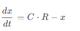

[bbr 的 c 实现和收敛行为仿真](https://blog.csdn.net/dog250/article/details/141364019)   
[bbr 多流共存的动态行为](https://blog.csdn.net/dog250/article/details/141387185)  
[Parking lot topology --google group](https://groups.google.com/g/bbr-dev/c/lHYHY_P9DsU/m/lHiuqkEDBQAJ)
[Anup Agarwal](https://github.com/108anup?page=3&tab=repositories)   
[Anup](https://www.cs.cmu.edu/~anupa/)  

简单来讲，一个方程即可描述 bbr，设 x 为 inflt，C，R 分别为瓶颈带宽和传播时延：
   

剩下的就是实现细节。把排队时延抽象到全局 inflt / C，而不是具象到 buffer，这样就不再需要将 rtt 分别排队时延和传播时延两部分，也不再需要分别处理。 