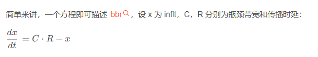

This open source distribution contains documentation, scripts, and
other materials related to the BBR congestion control algorithm.

Quick links:

- TCP BBRv3 Release:
  https://github.com/google/bbr/blob/v3/README.md
- BBR FAQ:
  https://github.com/google/bbr/blob/master/Documentation/bbr-faq.md
- TCP BBR Quick-Start: Building and Running TCP BBR on Google Compute Engine:
  https://github.com/google/bbr/blob/master/Documentation/bbr-quick-start.md
- Mailing list: Test results, performance evaluations, feedback, and
  BBR-related discussions are very welcome in the public e-mail list for BBR:
  https://groups.google.com/d/forum/bbr-dev

  Latest BBR code from our team
  ------------------------------

  - For Linux TCP BBR:
     https://github.com/google/bbr/blob/v3/net/ipv4/tcp_bbr.c

  - For QUIC BBR:
      https://github.com/google/quiche/blob/main/quiche/quic/core/congestion_control/bbr2_sender.cc
      https://github.com/google/quiche/blob/main/quiche/quic/core/congestion_control/bbr2_sender.h

  BBR v1 release
  ------------------------------

  - For Linux TCP BBR:
      https://git.kernel.org/pub/scm/linux/kernel/git/davem/net-next.git/tree/net/ipv4/tcp_bbr.c

  - For QUIC BBR:
      https://github.com/google/quiche/blob/main/quiche/quic/core/congestion_control/bbr_sender.cc
      https://github.com/google/quiche/blob/main/quiche/quic/core/congestion_control/bbr_sender.h

This is not an official Google product.

# bbr

 简单来讲，一个方程即可描述 bbr，设 x 为 inflt，C，R 分别为瓶颈带宽和传播时延：    
 
 
 
 剩下的就是实现细节。把排队时延抽象到全局 inflt / C，而不是具象到 buffer，这样就不再需要将 rtt 分别排队时延和传播时延两部分，也不再需要分别处理。
 
 
## bbr 多流场景    
若要更加全面展示多流共存场景的动态，需更新了一下仿真函数，模拟新流侵入和退出场景：
```
void simulate_one_phase(int i)
{
  double rtt;
  bbr_update_sending_bw(&f1);
  bbr_update_sending_bw(&f2);
  bbr_update_sending_bw(&f3);
  bbr_update_sending_bw(&f4);

  printf("t= %04d sending: f1: %.3f f2: %.3f f3: %.3f f4: %.3f\n",
         t, f1.sending_bw, f2.sending_bw, f3.sending_bw, f4.sending_bw);

  if (i < 1000) {
    rtt = (f1.inflt + f2.inflt + f3.inflt) / C;
    f1.receive_bw = C * f1.inflt / (f1.inflt + f2.inflt + f3.inflt);
    f2.receive_bw = C * f2.inflt / (f1.inflt + f2.inflt + f3.inflt);
    f3.receive_bw = C * f3.inflt / (f1.inflt + f2.inflt + f3.inflt);
    f4.receive_bw = 1;
    f4.max_bw = 1;
    f4.inflt = 1;
    if (i == 999) {
      f4.max_bw = 0.9 * C;
      f4.inflt = 0.9 * C * RTPROP;
    }
  } else if (i > 1000 && i < 2000) {
    rtt = (f1.inflt + f2.inflt + f3.inflt + f4.inflt) / C;
    f1.receive_bw = C * f1.inflt / (f1.inflt + f2.inflt + f3.inflt + f4.inflt);
    f2.receive_bw = C * f2.inflt / (f1.inflt + f2.inflt + f3.inflt + f4.inflt);
    f3.receive_bw = C * f3.inflt / (f1.inflt + f2.inflt + f3.inflt + f4.inflt);
    f4.receive_bw = C * f4.inflt / (f1.inflt + f2.inflt + f3.inflt + f4.inflt);
  } else {
    rtt = (f1.inflt + f2.inflt) / C;
    f1.receive_bw = C * f1.inflt / (f1.inflt + f2.inflt);
    f2.receive_bw = C * f2.inflt / (f1.inflt + f2.inflt);
    f3.receive_bw = 0;
    f4.receive_bw = 0;
    f3.max_bw = 0;
    f4.max_bw = 0;
    f3.inflt = 0;
    f4.inflt = 0;
  }

  printf("t= %04d receive: f1: %.3f f2: %.3f f3: %.3f f4: %.3f\n",
         t, f1.receive_bw, f2.receive_bw, f3.receive_bw, f4.receive_bw);

  bbr_update_maxbw_minrtt(&f1, rtt);
  bbr_update_maxbw_minrtt(&f2, rtt);
  bbr_update_maxbw_minrtt(&f3, rtt);
  bbr_update_maxbw_minrtt(&f4, rtt);

  printf("t= %04d  max_bw: f1: %.3f f2: %.3f f3: %.3f f4: %.3f\n",
         t, f1.max_bw, f2.max_bw, f3.max_bw, f4.max_bw);
  printf("t= %04d  inflt: f1: %.3f f2: %.3f f3: %.3f f4: %.3f\n",
         t, f1.inflt, f2.inflt, f3.inflt, f4.inflt);
  printf("t= %04d  min_rtt: f1: %.3f f2: %.3f f3: %.3f f4: %.3f\n",
         t, f1.min_rtt, f2.min_rtt, f3.min_rtt, f4.min_rtt);
  printf("t= %04d  pacing_gain: f1: %.3f f2: %.3f f3: %.3f f4: %.3f\n\n",
         t, f1.pacing_gain, f2.pacing_gain, f3.pacing_gain, f4.pacing_gain);

  t++;
  bw_filter_index = (bw_filter_index + 1) % BW_FILTER_LEN;
} 

```
它的意思是，在前 1/3 时间，3 流共存，此后侵入 1 条新流，维持 1/3 时间，最后 1/3 时间退出 2 条流，维持 2 条共存。