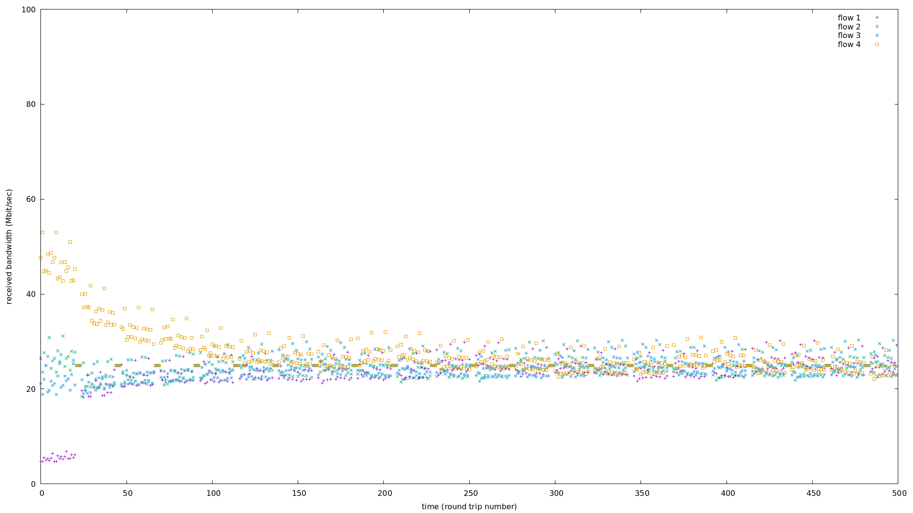
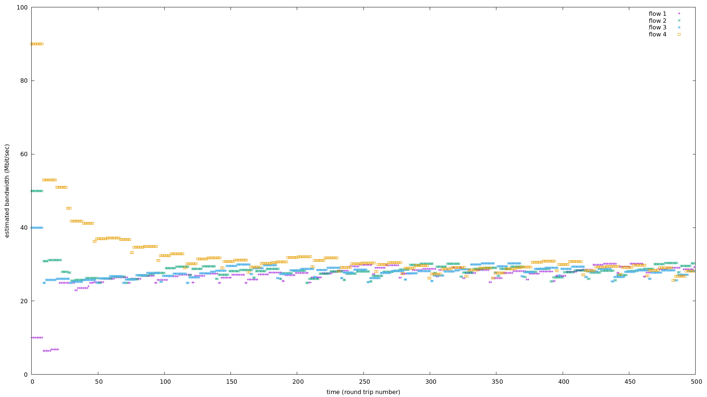
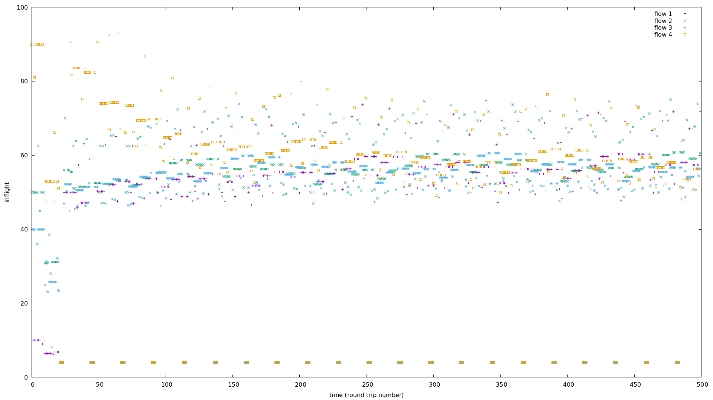

#  bbr 动力学模型
在 neal 的 parking-lot topology 代码基础上补充 bbr 实现，主要增加 probebw，probertt 的支持,本实现省略了 startup。   
来分别看一下 pacing_rate，delivery rate，inflight 的结论。    

C = 100Mbps，delivery rate 快速收敛到公平，4 条流 delivery rate 之和等于 C：   

pacing rate 基于 delivery rate，4 条流 pacing rate 之和等于 C + probe_quota：   

inflight 同样收敛到公平，4 条流 inflight 之和等于 C * R = 100 * 2：   

# references
[bbr 的 c 实现和收敛行为仿真](https://zhuanlan.zhihu.com/p/715565437)   

[satellite-link-simulation bbr kernel module](https://github.com/ponedo/satellite-link-simulation/tree/master)   