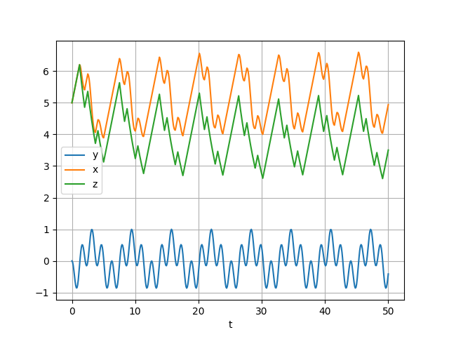

# dctcp
`dctcp aimd   sawtooth `    
`desmos在线函数编辑`   
[dctcp 比 reno，cubic 好在哪](https://zhuanlan.zhihu.com/p/712542141)      
[dctcp 可扩展、低时延图解](https://blog.csdn.net/dog250/article/details/135394122)
 [IDC网络Incast拥塞控制随想录](https://blog.csdn.net/dog250/article/details/121559293)       
```
python3 dctcp.py sin 0.3
```

