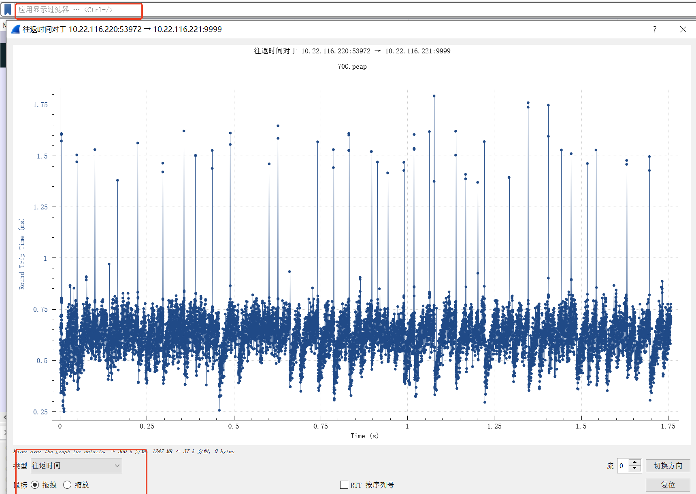

# rttcp

```
./rttcp.py analyze --type "flow" -i 100G.pcap -o trace.pcap.flow.txt
Traceback (most recent call last):
  File "./rttcp.py", line 129, in <module>
    main(sys.argv)
  File "./rttcp.py", line 115, in main
    packet_dumper.run()
  File "/root/rttcp/packet_dumper.py", line 106, in run
    proc = subprocess.Popen(command, stdout=subprocess.PIPE)
  File "/usr/lib/python2.7/subprocess.py", line 394, in __init__
    errread, errwrite)
  File "/usr/lib/python2.7/subprocess.py", line 1047, in _execute_child
    raise child_exception
OSError: [Errno 2] No such file or directory
```

```
apt-get install tshark
```
```
 python2 ./rttcp.py analyze --type "packet" -i    70G.pcap  -o trace.pcap.flow.txt
```

```
 tshark -i enp61s0f1np1 -f "tcp port 9999" -w test.pcap -P -a duration:10
```


+ 只对delta4, 进行分析抓包方法   
    
dst port 53972 是iperf client port   
```
tcpdump  -i enp61s0f1np1 dst port 53972  -eennvv -w 70G.pcap
```
然后执行./rttcp.py analyze --type "packet"    
```
 python2 ./rttcp.py analyze --type "packet" -i    70G.pcap  -o trace.pcap.flow.txt
```

## cpu freq

```
watch -n 0.5  "lscpu -e=CPU,MHZ"
CPU      MHZ
  0 2795.132
  1 2705.405
  2 2000.000
  3 2000.000
  4 2000.000
```
POPULAR_HZ_VALUES参数   
```
POPULAR_HZ_VALUES = [100., 200., 250., 1000.,2000.,2800.]

```

 


# tcpdump
默认情况不加参数tcpdump抓包的话只抓每个数据包的前68个字节，也就是通常情况下抓完整的tcp    

```
 tcpdump  -env  -r  70G.pcap   src host 10.22.116.221 
```
只抓tcp头部
```
tcpdump  -i enp61s0f1np1 port 53972  -s 68   -eennvv -w 90G.pcap
```
tcp头部最长60字节
```
tcpdump  -i enp61s0f1np1 port 53972  -s 88   -eennvv -w 90G.pcap
```

```
netstat -pan | grep 9999
tcp       28 3795420 10.22.116.220:54336     10.22.116.221:9999      ESTABLISHED 57808/iperf         
tcp       28 3459432 10.22.116.220:54380     10.22.116.221:9999      ESTABLISHED 57808/iperf         
tcp       28 3563132 10.22.116.220:54346     10.22.116.221:9999      ESTABLISHED 57808/iperf         
tcp       28 2866268 10.22.116.220:54328     10.22.116.221:9999      ESTABLISHED 57808/iperf         
tcp       28 3314252 10.22.116.220:54354     10.22.116.221:9999      ESTABLISHED 57808/iperf         
tcp       28 4135556 10.22.116.220:54368     10.22.116.221:9999      ESTABLISHED 57808/iperf         
tcp       28 3795420 10.22.116.220:54386     10.22.116.221:9999      ESTABLISHED 57808/iperf         
tcp       28 3854472 10.22.116.220:54402     10.22.116.221:9999      ESTABLISHED 57808/iperf 
```
对flow 10.22.116.220:54336进行tcpdump    

# tshark

for centos   
```
 yum install wireshark
```

# wireshark

```
tcp.analysis.ack_rtt
tcp.analysis.bytes_in_flight
tcp.window_size
```

## wireshark 分析
port 53972 是client的 port    
```
tcpdump  -i enp61s0f1np1 port 53972  -s 128  -eennvv -w 70G.pcap
```


#  ipsumdump (not succ)


```
$ curl -O http://www.read.seas.harvard.edu/~kohler/ipsumdump/ipsumdump-1.86.tar.gz
$ tar -xzf ipsumdump-1.86.tar.gz
$ cd ipsumdump-1.86
$ ./configure --prefix=/usr/
$ make
$ sudo make install
$ sudo make clean
```

# killed

```
dmesg -T| grep -E -i -B100 'killed process'
```