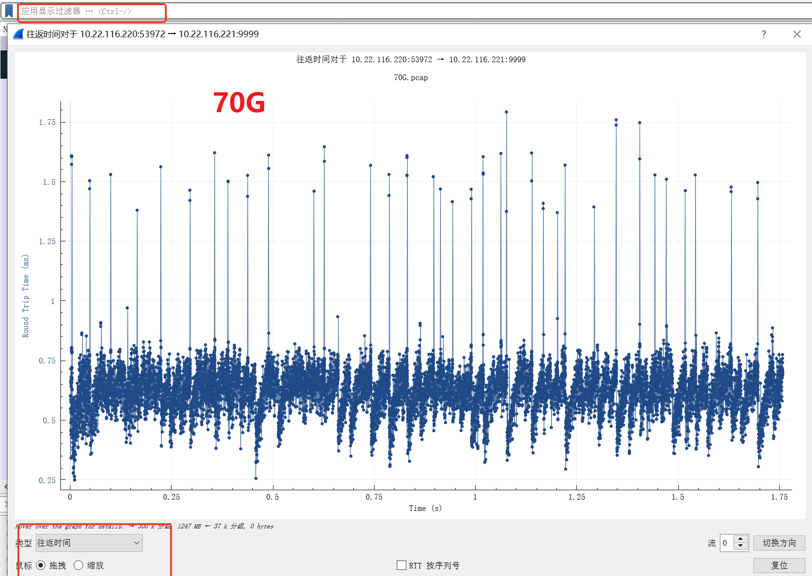

# rttcp

```
./rttcp.py analyze --type "flow" -i 100G.pcap -o trace.pcap.flow.txt
Traceback (most recent call last):
  File "./rttcp.py", line 129, in <module>
    main(sys.argv)
  File "./rttcp.py", line 115, in main
    packet_dumper.run()
  File "/root/rttcp/packet_dumper.py", line 106, in run
    proc = subprocess.Popen(command, stdout=subprocess.PIPE)
  File "/usr/lib/python2.7/subprocess.py", line 394, in __init__
    errread, errwrite)
  File "/usr/lib/python2.7/subprocess.py", line 1047, in _execute_child
    raise child_exception
OSError: [Errno 2] No such file or directory
```

```
apt-get install tshark
```
```
 python2 ./rttcp.py analyze --type "packet" -i    70G.pcap  -o trace.pcap.flow.txt
```

```
 tshark -i enp61s0f1np1 -f "tcp port 9999" -w test.pcap -P -a duration:10
```


+ 只对delta4, 进行分析抓包方法   
    
dst port 53972 是iperf client port   
```
tcpdump  -i enp61s0f1np1 dst port 53972  -eennvv -w 70G.pcap
```
然后执行./rttcp.py analyze --type "packet"    
```
 python2 ./rttcp.py analyze --type "packet" -i    70G.pcap  -o trace.pcap.flow.txt
```

## cpu freq

```
watch -n 0.5  "lscpu -e=CPU,MHZ"
CPU      MHZ
  0 2795.132
  1 2705.405
  2 2000.000
  3 2000.000
  4 2000.000
```
POPULAR_HZ_VALUES参数   
```
POPULAR_HZ_VALUES = [100., 200., 250., 1000.,2000.,2800.]

```

 


# tcpdump
默认情况不加参数tcpdump抓包的话只抓每个数据包的前68个字节，也就是通常情况下抓完整的tcp    

```
 tcpdump  -env  -r  70G.pcap   src host 10.22.116.221 
```
只抓tcp头部
```
tcpdump  -i enp61s0f1np1 port 53972  -s 68   -eennvv -w 90G.pcap
```
tcp头部最长60字节
```
tcpdump  -i enp61s0f1np1 port 53972  -s 88   -eennvv -w 90G.pcap
```

```
netstat -pan | grep 9999
tcp       28 3795420 10.22.116.220:54336     10.22.116.221:9999      ESTABLISHED 57808/iperf         
tcp       28 3459432 10.22.116.220:54380     10.22.116.221:9999      ESTABLISHED 57808/iperf         
tcp       28 3563132 10.22.116.220:54346     10.22.116.221:9999      ESTABLISHED 57808/iperf         
tcp       28 2866268 10.22.116.220:54328     10.22.116.221:9999      ESTABLISHED 57808/iperf         
tcp       28 3314252 10.22.116.220:54354     10.22.116.221:9999      ESTABLISHED 57808/iperf         
tcp       28 4135556 10.22.116.220:54368     10.22.116.221:9999      ESTABLISHED 57808/iperf         
tcp       28 3795420 10.22.116.220:54386     10.22.116.221:9999      ESTABLISHED 57808/iperf         
tcp       28 3854472 10.22.116.220:54402     10.22.116.221:9999      ESTABLISHED 57808/iperf 
```
对flow 10.22.116.220:54336进行tcpdump    

# tshark

for centos   
```
 yum install wireshark
```
Tshark 过滤PCAP的命令实例    
```

tshark -r 1.pcap -nn -Y rule -w 2.pcap
说明rule为过滤规则如’dns’为过滤dns数据，总体命令含义为读取1.pcap过滤出dns数据包，写入2.pcap.
```

# wireshark

```
tcp.analysis.ack_rtt
tcp.analysis.bytes_in_flight
tcp.window_size
tcp.analysis.retransmission
tcp.analysis.fast_retransmission
tcp.analysis.rto
```

+ retrans   
`tcp.analysis.retransmission || tcp.analysis.fast_retransmission`
[Wireshark抓包分析TCP重传](https://chegva.com/3572.html)   
   

 

tcp.analysis.retransmission是Wireshark的一个内置过滤表达式，它专门用于检测并显示所有标记为重传的数据包。
通过这个过滤条件，你可以轻松识别出网络中的TCP重传现象，并进一步分析其原因和影响。   

排除TCP重传数据包如果捕获的TCP包中有太多标识为[TCP Retransmission]的TCP重传包，而你又不希望看到TCP重传的数据包，可以使用逻辑“非”（NOT）操作符 ! 来排除这些重传包，过滤条件如下：    
```
!tcp.analysis.retransmission
```
这将会隐藏所有TCP重传的数据包，只显示正常的数据流量。
 
```
tshark -n -q -r 100-70G.pcap -z io,stat,0,tcp.analysis.retransmission,"tcp.analysis.retransmission"
Running as user "root" and group "root". This could be dangerous.

====================================================
| IO Statistics                                    |
|                                                  |
| Duration: 11.1 secs                              |
| Interval: 11.1 secs                              |
|                                                  |
| Col 1: tcp.analysis.retransmission               |
|     2: tcp.analysis.retransmission               |
|--------------------------------------------------|
|              |1                |2                |
| Interval     | Frames |  Bytes | Frames |  Bytes |
|--------------------------------------------------|
|  0.0 <> 11.1 |    116 | 486088 |    116 | 486088 |
====================================================
```

```
tshark -n -q -r 100-70G.pcap -z io,stat,0,tcp.analysis.retransmission,"tcp.analysis.retransmission and ip.src==10.22.116.220","tcp.analysis.retransmission and ip.src==10.22.116.221"
Running as user "root" and group "root". This could be dangerous.

=====================================================================
| IO Statistics                                                     |
|                                                                   |
| Duration: 11.1 secs                                               |
| Interval: 11.1 secs                                               |
|                                                                   |
| Col 1: tcp.analysis.retransmission                                |
|     2: tcp.analysis.retransmission and ip.src==10.22.116.220      |
|     3: tcp.analysis.retransmission and ip.src==10.22.116.221      |
|-------------------------------------------------------------------|
|              |1                |2                |3               |
| Interval     | Frames |  Bytes | Frames |  Bytes | Frames | Bytes |
|-------------------------------------------------------------------|
|  0.0 <> 11.1 |    116 | 486088 |    116 | 486088 |      0 |     0 |
=====================================================================
```

+ Rto (Retransmission TimeOut)

```
tshark -n -q -r 100-70G.pcap -z io,stat,0,tcp.analysis.rto,"tcp.analysis.rto and ip.src==10.22.116.220","tcp.analysis.rto and ip.src==10.22.116.221"
Running as user "root" and group "root". This could be dangerous.

===================================================================
| IO Statistics                                                   |
|                                                                 |
| Duration: 11.1 secs                                             |
| Interval: 11.1 secs                                             |
|                                                                 |
| Col 1: tcp.analysis.rto                                         |
|     2: tcp.analysis.rto and ip.src==10.22.116.220               |
|     3: tcp.analysis.rto and ip.src==10.22.116.221               |
|-----------------------------------------------------------------|
|              |1               |2               |3               |
| Interval     | Frames | Bytes | Frames | Bytes | Frames | Bytes |
|-----------------------------------------------------------------|
|  0.0 <> 11.1 |      6 | 22548 |      6 | 22548 |      0 |     0 |
===================================================================
```
 + [TCP Dup ACK]    
当乱序或者丢包发生时，接收方就会收到一些Seq号比期望值大的包，TCP协议每收到一个这种包就会ACK一次期望的Seq值，通过这个方式告知发送方，因此就产生了一些重复的Ack。Wireshark抓到这些重复的Ack就会提示[TCP Dup ACK].   
```
tshark -n -q -r 100-70G.pcap -z io,stat,0,tcp.analysis.rto,"tcp.analysis.duplicate_ack and ip.src==10.22.116.220","tcp.analysis.duplicate_ack and ip.src==10.22.116.221"
Running as user "root" and group "root". This could be dangerous.

===================================================================
| IO Statistics                                                   |
|                                                                 |
| Duration: 11.1 secs                                             |
| Interval: 11.1 secs                                             |
|                                                                 |
| Col 1: tcp.analysis.rto                                         |
|     2: tcp.analysis.duplicate_ack and ip.src==10.22.116.220     |
|     3: tcp.analysis.duplicate_ack and ip.src==10.22.116.221     |
|-----------------------------------------------------------------|
|              |1               |2               |3               |
| Interval     | Frames | Bytes | Frames | Bytes | Frames | Bytes |
|-----------------------------------------------------------------|
|  0.0 <> 11.1 |      6 | 22548 |      0 |     0 |   1092 | 92136 |
===================================================================
```

+ out_of_order   

```
tshark -n -q -r 100-70G.pcap -z io,stat,0,tcp.analysis.out_of_order,"tcp.analysis.out_of_order and ip.src==10.22.116.220","tcp.analysis.out_of_order and ip.src==10.22.116.221"
Running as user "root" and group "root". This could be dangerous.

=======================================================================
| IO Statistics                                                       |
|                                                                     |
| Duration: 11.1 secs                                                 |
| Interval: 11.1 secs                                                 |
|                                                                     |
| Col 1: tcp.analysis.out_of_order                                    |
|     2: tcp.analysis.out_of_order and ip.src==10.22.116.220          |
|     3: tcp.analysis.out_of_order and ip.src==10.22.116.221          |
|---------------------------------------------------------------------|
|              |1                 |2                 |3               |
| Interval     | Frames |  Bytes  | Frames |  Bytes  | Frames | Bytes |
|---------------------------------------------------------------------|
|  0.0 <> 11.1 |   1086 | 4576404 |   1086 | 4576404 |      0 |     0 |
=======================================================================
```
+ rtt    
```
tshark -n -q -r chegva.pcap -z io,stat,0,tcp.analysis.ack_rtt,"tcp.analysis.ack_rtt > 0.06 and tcp.analysis.ack_rtt < 0.12 and ip.src==100.70.11.11 and ip.dst==100.69.11.11","tcp.analysis.ack_rtt > 0.06 and tcp.analysis.ack_rtt < 0.12 and ip.src==100.69.11.11 and ip.dst==100.70.11.11"
```

+ Calculate Total Data Sent   
```
tshark -r h7_capture_cubic_150.pcap -Y "tcp && frame.time_relative <= 150" -T fields -e tcp.len | awk '{sum += $1} END {print sum}'
```
+ Calculate Total Data Retransmitted   
```
tshark -r h7_capture_cubic_150.pcap -Y "tcp.analysis.retransmission && frame.time_relative <= 150" -T fields -e tcp.len | awk '{sum += $1} END {print sum}'
```
+ Calculate Maximum Window Size   
```
tshark -r h7_capture_cubic_150.pcap -T fields -e tcp.window_size_value | sort -nr | head -1
```

+ Time-Sequence Graph
   
```
Time sequence stevens graph 
```
[Time-Sequence Graph (tcptrace).](https://packetbomb.com/understanding-the-tcptrace-time-sequence-graph-in-wireshark/)   


```
tshark -nr input.pcap -Y "display filter" -T fields -e frame.number -e tcp.seq -e tcp.options.timestamp.tsval
```

## wireshark 分析
port 53972 是client的 port,    
server  port 999      
抓包方法（包含client requeust and server response）      
```
tcpdump  -i enp61s0f1np1 port 53972  -s 128  -eennvv -w 70G.pcap
```



## tcptrace

```
apt-get -y install tcptrace
```

```
$tcpdump -w example.pcap -i eth0 -n
$tcptrace -R example.pcap
$xpl2gpl a2b_rtt.xpl
$gnuplot a2b_rtt.gpl
```

+ help

```
  -T      create throughput graph[s], (average over 10 segments, see -A)\n\
  -R      create rtt sample graph[s]\n\
  -S      create time sequence graph[s]\n\
  -N      create owin graph[s] (_o_utstanding data on _N_etwork)\n\
  -F      create segsize graph[s]\n\
  -L      create time line graph[s]\n\
  -G	  create ALL graphs\n\
```

###  tcptrace Rtt


[wirelshark tcptrace 识别](https://www.cnblogs.com/codestack/p/18023800)   


```
 tcpdump  -i enp61s0f1np1 port 46016  -s 128  -eennvv -w 100-70G.pcap
```


```
tcptrace -R 100-70G.pcap 
a2b_rtt.xpl
```

`bash xpl2gpl.txt a2b_rtt.xpl `产生如下文件     
```
a2b_rtt.datasets  a2b_rtt.gpl  a2b_rtt.labels
```
+ step3更改a2b_rtt.gpl后两行设置png输出      

```
set term png
set output "a2b_tsg.png"
```
+ step4    
```
gnuplot a2b_rtt.gpl
```


### tcptrace time sequence

+ step1   
```
tcptrace -S 100-70G.pcap
```
产生如下文件    

```
a2b_tsg.xpl  b2a_tsg.xpl
```
+ step2   
```
bash xpl2gpl.txt a2b_tsg.xpl 
```
+ step3更改a2b_tsg.gpl后两行设置png输出      

```
set term png
set output "a2b_tsg.png"
```
+ step4 
```
gnuplot a2b_tsg.gpl
```


+  gnuplot
1. Producing PDF (.pdf)   
````
gnuplot> set term pdf     (will produce PDF )
gnuplot> set output "printme.pdf" (any filename.pdf you want)
gnuplot> replot                   (recreates plot but you don't see it, goes to output file)
gnuplot> unset output  
gnuplot> unset term  
```
2. Producing png   (image file, similar to .jpg)   
```
gnuplot> set term png             (will produce .png output)
gnuplot> set output "printme.png" (output to any filename.png you want)
gnuplot> replot
gnuplot> unset term 
```
# ss查看tcp

```
 ss -eipnt  xxx
```

#  ipsumdump (not succ)


```
$ curl -O http://www.read.seas.harvard.edu/~kohler/ipsumdump/ipsumdump-1.86.tar.gz
$ tar -xzf ipsumdump-1.86.tar.gz
$ cd ipsumdump-1.86
$ ./configure --prefix=/usr/
$ make
$ sudo make install
$ sudo make clean
```

# killed

```
dmesg -T| grep -E -i -B100 'killed process'
```