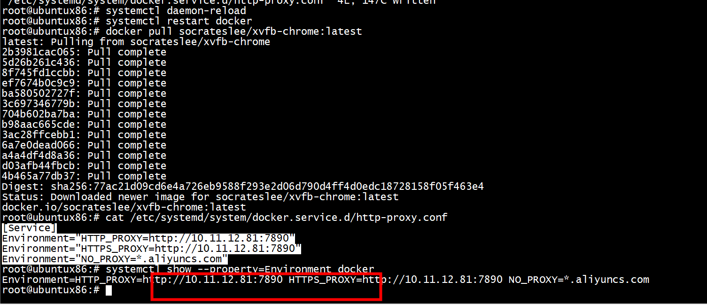
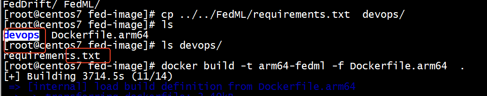

```
root@ubuntux86:# export HTTPS_PROXY=https://10.11.12.81:7890
root@ubuntux86:# python3 docker_pull.py  socrateslee/xvfb-chrome:latest
unset https_proxy
```
# proxy
```
mkdir -p /etc/systemd/system/docker.service.d
 vi /etc/systemd/system/docker.service.d/http-proxy.conf
```

```
root@ubuntux86:# cat /etc/systemd/system/docker.service.d/http-proxy.conf
[Service]
Environment="HTTP_PROXY=http://10.11.12.81:7890"
Environment="HTTPS_PROXY=http://10.11.12.81:7890"
Environment="NO_PROXY=*.aliyuncs.com,localhost,127.0.0.1,::1"
```
HTTPS_PROXY=http://10.11.12.81:7890,https也设置为http   
```
root@ubuntux86:# systemctl daemon-reload
root@ubuntux86:# systemctl restart docker
root@ubuntux86:# systemctl show --property=Environment docker
Environment=HTTP_PROXY=https://10.11.12.81:7890 HTTPS_PROXY=https://10.11.12.81:7890 NO_PROXY=localhost,127.0.0.1
root@ubuntux86:# 
```




# 鲲鹏

[镜像库](https://docker.aityp.com/)  

```
[root@centos7 docker-kunpen]# groupadd docker

[root@centos7 docker-kunpen]# usermod -a -G docker root
[root@centos7 docker-kunpen]#  systemctl daemon-reload && systemctl restart docker
[root@centos7 docker-kunpen]# 
``` 

```
docker pull swr.cn-north-4.myhuaweicloud.com/ddn-k8s/docker.io/arm64v8/ubuntu:18.04-linuxarm64
docker tag  swr.cn-north-4.myhuaweicloud.com/ddn-k8s/docker.io/arm64v8/ubuntu:18.04-linuxarm64  docker.io/arm64v8/ubuntu:18.04
``` 


```
docker build -t kunpeng-app -f armv8.ubuntu.Dockerfile  .
```

```
docker  run -it -d --net=host --cap-add=NET_ADMIN --privileged=true  -v /root/dpdk-stable-19.11.1:/root/dpdk-stable-19.11.1 -v /root/prog:/root/prog  kunpeng-app
docker exec -it 387318b58980  bash
docker  run -it   --net=host --cap-add=NET_ADMIN --privileged=true  -v /root/dpdk-stable-19.11.1:/root/dpdk-stable-19.11.1 -v /root/prog:/root/prog  kunpeng-app  bash
```


```
docker  run -it   --net=host --cap-add=NET_ADMIN --privileged=true  -v /root/dpdk-stable-19.11.1:/root/dpdk-stable-19.11.1 -v /root/prog:/root/prog -v /mnt/huge:/mnt/huge  e-rpc bash
```

```
docker import eRpc.tar  erpc:1.0

```

#  arm64v8/ubuntu:20.04

```
[root@centos7 ~]# docker  run -it -d --net=host --cap-add=NET_ADMIN --privileged=true  -v /root/prog/modules/tcp-bbr:/tcp-bbr -v /root/prog:/root/prog  arm64v8/ubuntu:20.04
Unable to find image 'arm64v8/ubuntu:20.04' locally
20.04: Pulling from arm64v8/ubuntu
20.04: Pulling from arm64v8/ubuntu
20.04: Pulling from arm64v8/ubuntu
```

# seccomp or mbind error    

```
docker  run -it  --rm  --name erpc  --net=host -u root  --security-opt seccomp=seccomp.json -v /root/dpdk-stable-19.11.1:/root/dpdk-stable-19.11.1 -v /root/prog:/root/prog -v /mnt/huge:/mnt/huge  erpc:2.0 /root/prog/eRPC-arm/hello_world/server
```

## gdb and trace

```
docker  run -it  --rm  --name erpc  --net=host -u root --cap-add=SYS_PTRACE   --security-opt seccomp=unconfined -v /root/dpdk-stable-19.11.1:/root/dpdk-stable-19.11.1 -v /root/prog:/root/prog -v /mnt/huge:/mnt/huge  erpc:2.0 gdb /root/prog/eRPC-arm/hello_world/server
```

# dockerfile基础镜像

```
[root@centos7 yacd]# docker pull swr.cn-north-4.myhuaweicloud.com/ddn-k8s/docker.io/node:alpine3.19-linuxarm64

[root@centos7 yacd]# docker tag  swr.cn-north-4.myhuaweicloud.com/ddn-k8s/docker.io/node:alpine3.19-linuxarm64  docker.io/node:alpine3.19
[root@centos7 yacd]# 
```
dockerfile基础镜像   
```
FROM docker.io/node:alpine3.19
WORKDIR /app
```

#  Dockerfile 中的 COPY 与 ADD 命令

[Dockerfile 中的 COPY 与 ADD 命令](https://cloud.tencent.com/developer/article/1332457)   


# docker rmi   

```
docker images --all
```

```
[root@centos7 test]# docker image inspect --format='{{.RepoTags}} {{.Id}} {{.Parent}}' $(docker image ls -q --filter since=020649b88b50)
[kunpeng-app:latest] sha256:cca321f3343bffa01906b827150f91ea0285d2d1f5ea37854498e31541a027f5 sha256:020649b88b50544caafbacbc49d424978bb8da43eafb2cc707efe3dcb7039e44

`cca32`

[root@centos7 test]# docker rmi cca32
Untagged: kunpeng-app:latest
Deleted: sha256:cca321f3343bffa01906b827150f91ea0285d2d1f5ea37854498e31541a027f5
Deleted: sha256:020649b88b50544caafbacbc49d424978bb8da43eafb2cc707efe3dcb7039e44
Deleted: sha256:a7f0d95646b8586bfe804a5b11cecf92726f8f6d8d6e3df4b50bdaf870a12c31
Deleted: sha256:140ba0fa50961941d6713dcceb7a12aca1f7cd31bc16d3daeff96517ea2c1852
Deleted: sha256:a9af70322edf97029d888f67f7f72d122cfe7225c4f76b69974bde3ffd3ffec3
Deleted: sha256:178d3781d1e3e063497ef6dcb3212e4a51ba79f690ecc16fe2dfd9ed80d4f292
Deleted: sha256:2bed27ed68e9bd27497578cf96bb54ce59ada63bb0f46ccb4ebf8e48c95e617c
Deleted: sha256:82198f72b0a0d72e824d41533463f790877d93c57dd42bbb4050e7df3c72911c
Deleted: sha256:91fe20fbe751b999d5702fa65f8a0bc7af98871210cebfed767beb90e2ca7a80
Deleted: sha256:b5d14e398a091b308a5d0ef26e78568d7ea23366324701d4ebe9cabf022fcd9a
Deleted: sha256:fb57abb7f5fbfabba21394f84b37d49d6ad816d2b14b8f67bd993f3a46497394
Deleted: sha256:ead01a019c6e1302b8a6ffe18c43d7a662b1fd21056acb9b09a8e87b7e852b6e
Deleted: sha256:10a212f196f3717e1f3f2bc503d5adda2586e8df53b6b0c69f58009922c79730
Deleted: sha256:cf7db5953ababfb93310eaa25143a8e4ff3f3dc16ec13f5d5aaf3f72d2d957e2
```
#  is not a valid repository/tag 
版本太低    

```
Sending build context to Docker daemon  13.3 MB
Step 1/17 : FROM docker.io/node:alpine3.19  AS builder
Error parsing reference: "docker.io/node:alpine3.19  AS builder" is not a valid repository/tag: invalid reference forma
```

```
1
 卸载旧版本‌：执行 yum remove docker* 命令移除旧版本。 ‌

2安装依赖‌：运行 yum install -y yum-utils 安装必需工具。 ‌

‌添加镜像源‌：使用 yum-config-manager --add-repo http://mirrors.aliyun.com/docker-ce/linux/centos/docker-ce.repo 配置阿里云镜像源。 ‌

3安装新版本‌：执行 yum install docker-ce docker-ce-cli containerd.io 完成安装。 ‌

```
docker system prune  

#  circular dependency detected on stage: build-env


```
docker build -t myimage -<<'EOF'
FROM busybox AS build-env
WORKDIR /app
RUN mkdir -p out && echo foo > out/CostsAnalyse.dll


WORKDIR /app
COPY --from=build-env /app/out/ .
EOF
```

```

[+] Building 0.3s (1/1) FINISHED                                                                                                                                                  docker:default
 => [internal] load build definition from Dockerfile                                                                                                                                        0.0s
 => => transferring dockerfile: 250B                                                                                                                                                        0.0s
Dockerfile:7
--------------------
   5 |     
   6 |     WORKDIR /app
   7 | >>> COPY --from=build-env /app/out/ .
   8 |     
--------------------
ERROR: failed to solve: circular dependency detected on stage: build-env
```

# COPY no such file or directory

```
Step 14/17 : RUN ls /app/public -al
 ---> Running in f3479e4d9aa5

total 112
drwxr-xr-x    3 root     root           224 Aug 12 03:11 .
drwxr-xr-x    1 root     root            20 Aug 12 03:11 ..
-rw-r--r--    1 root     root            16 Aug 12 03:11 CNAME
-rw-r--r--    1 root     root           340 Aug 12 03:11 _headers
-rw-r--r--    1 root     root          3766 Aug 12 03:11 apple-touch-icon-precomposed.png
drwxr-xr-x    2 root     root          4096 Aug 12 03:11 assets
-rw-r--r--    1 root     root          1247 Aug 12 03:11 index.html
-rw-r--r--    1 root     root           130 Aug 12 03:11 manifest.webmanifest
-rw-r--r--    1 root     root           136 Aug 12 03:11 registerSW.js
-rw-r--r--    1 root     root         62080 Aug 12 03:11 sw.js
-rw-r--r--    1 root     root          7703 Aug 12 03:11 yacd-128.png
-rw-r--r--    1 root     root          3433 Aug 12 03:11 yacd-64.png
-rw-r--r--    1 root     root          5430 Aug 12 03:11 yacd.ico
 ---> 4bc845c7e19b
Removing intermediate container f3479e4d9aa5
Step 15/17 : COPY /app/public /usr/share/nginx/html
lstat app/public: no such file or directory
```


# proxy

```
The Docker daemon uses the HTTP_PROXY, HTTPS_PROXY, and NO_PROXY environmental variables in its start-up environment to configure HTTP or HTTPS proxy behavior. You cannot configure these environment variables using the daemon.json file.

…

This example overrides the default docker.service file.

…

If you are behind an HTTP or HTTPS proxy server, for example in corporate settings, you need to add this configuration in the Docker systemd service file.
```

+ 1 创建 dockerd 相关的 systemd 目录，这个目录下的配置将覆盖 dockerd 的默认配置

```
$ sudo mkdir -p /etc/systemd/system/docker.service.d
````
+ 2 新建配置文件 /etc/systemd/system/docker.service.d/http-proxy.conf，这个文件中将包含环境变量

```
[Service]
Environment="HTTP_PROXY=http://proxy.example.com"
Environment="HTTPS_PROXY=http://proxy.example.com"
```
+3 如果你自己建了私有的镜像仓库，需要 dockerd 绕过代理服务器直连，那么配置 NO_PROXY 变量：
```
[Service]
Environment="HTTP_PROXY=http://proxy.example.com"
Environment="HTTPS_PROXY=http://proxy.example.com"
Environment="NO_PROXY=127.0.0.1,10.0.0.0/8,192.0.0.0/8,172.0.0.0/8,*.example.com,::1"
```
多个 NO_PROXY 变量的值用逗号分隔，而且可以使用通配符（*），极端情况下，如果 NO_PROXY=*，那么所有请求都将不通过代理服务器。

+4 重新加载配置文件，重启 dockerd
```
[root@centos7 docker]# systemctl daemon-reload
[root@centos7 docker]#  systemctl restart docker
```
+5 检查确认环境变量已经正确配置：

```
[root@centos7 docker]# systemctl show --property=Environment docker
Environment=GOTRACEBACK=crash DOCKER_HTTP_HOST_COMPAT=1 PATH=/usr/libexec/docker:/usr/bin:/usr/sbin HTTP_PROXY=http://127.0.0.1:1080 HTTPS_PROXY=http://127.0.0.1:1080
```
+ 6  从 docker info 的结果中查看配置项。 

```
docker info | grep -i proxy
  WARNING: You're not using the default seccomp profile
Http Proxy: http://127.0.0.1:1080
Https Proxy: http://127.0.0.1:1080
```

## Get https://registry-1.docker.io/v2/: proxyconnect tcp: EOF    
```
unset http_proxy
unset https_proxy
unset no_proxy
unset HTTP_PROXY
unset HTTPS_PROXY
unset NO_PROXY
```

```
docker pull busybox 
Using default tag: latest
Trying to pull repository docker.io/library/busybox ... 
Get https://registry-1.docker.io/v2/: unexpected EOF

[root@centos7 ~]# curl -I https://registry-1.docker.io/v2/
curl: (7) Failed to connect to 2a03:2880:f117:83:face:b00c:0:25de: Network is unreachable

[root@centos7 ~]# curl -x http://127.0.0.1:1080 https://registry-1.docker.io/v2/
curl: (56) Proxy CONNECT aborted
[root@centos7 ~]# curl -x https://127.0.0.1:1080 https://registry-1.docker.io/v2/
curl: (56) Proxy CONNECT aborted
[root@centos7 ~]# 
```

关闭/etc/systemd/system/docker.service.d/http-proxy.conf代理


# dpdk run in docker


```
docker  run -it  --rm  --name erpc  --net=host -u root --cap-add=SYS_PTRACE   --security-opt seccomp=unconfined -v /root/dpdk-stable-19.11.1:/root/dpdk-stable-19.11.1 -v /root/prog:/root/prog -v /mnt/huge:/mnt/huge -v /sys/bus/pci/drivers:/sys/bus/pci/drivers -v /sys/kernel/mm/hugepages:/sys/kernel/mm/hugepages -v /sys/devices/system/node:/sys/devices/system/node -v /dev:/dev  erpc:2.0 bash
root@centos7:/# cd ~/dpdk-stable-19.11.1/examples/helloworld2
root@centos7:~/dpdk-stable-19.11.1/examples/helloworld2# ./build/helloworld 
EAL: Detected 128 lcore(s)
EAL: Detected 4 NUMA nodes
EAL: Multi-process socket /var/run/dpdk/rte/mp_socket
EAL: Selected IOVA mode 'VA'
EAL: No available hugepages reported in hugepages-2048kB
EAL: Probing VFIO support...
EAL:   cannot open VFIO container, error 1 (Operation not permitted)
EAL: VFIO support could not be initialized
EAL: PCI device 0000:05:00.0 on NUMA socket 0
EAL:   probe driver: 19e5:200 net_hinic
EAL: PCI device 0000:06:00.0 on NUMA socket 0
EAL:   probe driver: 19e5:200 net_hinic
EAL: Requested device 0000:06:00.0 cannot be used
EAL: PCI device 0000:7d:00.0 on NUMA socket 0
EAL:   probe driver: 19e5:a222 net_hns3
EAL: PCI device 0000:7d:00.1 on NUMA socket 0
EAL:   probe driver: 19e5:a221 net_hns3
EAL: PCI device 0000:7d:00.2 on NUMA socket 0
EAL:   probe driver: 19e5:a222 net_hns3
EAL: PCI device 0000:7d:00.3 on NUMA socket 0
EAL:   probe driver: 19e5:a221 net_hns3
Number of Ports: 0
Invalid port_id=0
EAL: Error - exiting with code: 1
  Cause: Error during getting device (port 0) info: No such device
```

```
 cannot open VFIO container, error 1 (Operation not permitted)
```

解决方法    
```
Docker drops a number of privileges by default, including the ability to access most devices. You can explicitly grant access to a device using the --device flag, which would look something like:

docker run --device /dev/vfio/35 ...
Alternately, you can ask Docker not to drop any privileges:

docker run --privileged ...
You'll note that in both of the above examples it was not necessary to explicitly bind-mount /dev; in the first case, the device(s) you have exposed with --device will show up, and in the second case you see the host's /dev by default.
```


```
docker  run -it  --rm  --name erpc  --net=host -u root --cap-add=SYS_PTRACE   --security-opt seccomp=unconfined -v /root/dpdk-stable-19.11.1:/root/dpdk-stable-19.11.1 -v /root/prog:/root/prog -v /mnt/huge:/mnt/huge -v /sys/bus/pci/drivers:/sys/bus/pci/drivers -v /sys/kernel/mm/hugepages:/sys/kernel/mm/hugepages -v /sys/devices/system/node:/sys/devices/system/node -v /dev:/dev --privileged  erpc:2.0 bash
root@centos7:/#  cd ~/dpdk-stable-19.11.1/examples/helloworld2
root@centos7:~/dpdk-stable-19.11.1/examples/helloworld2# ./build/helloworld 
EAL: Detected 128 lcore(s)
EAL: Detected 4 NUMA nodes
EAL: Multi-process socket /var/run/dpdk/rte/mp_socket
EAL: Selected IOVA mode 'VA'
EAL: No available hugepages reported in hugepages-2048kB
EAL: Probing VFIO support...
EAL: VFIO support initialized
EAL: PCI device 0000:05:00.0 on NUMA socket 0
EAL:   probe driver: 19e5:200 net_hinic
EAL: PCI device 0000:06:00.0 on NUMA socket 0
EAL:   probe driver: 19e5:200 net_hinic
EAL:   using IOMMU type 1 (Type 1)
net_hinic: Initializing pf hinic-0000:06:00.0 in primary process
net_hinic: Device 0000:06:00.0 hwif attribute:
net_hinic: func_idx:1, p2p_idx:1, pciintf_idx:0, vf_in_pf:0, ppf_idx:0, global_vf_id:135, func_type:0
net_hinic: num_aeqs:4, num_ceqs:4, num_irqs:32, dma_attr:2
net_hinic: Get public resource capability:
net_hinic: host_id: 0x0, ep_id: 0x1, intr_type: 0x0, max_cos_id: 0x7, er_id: 0x1, port_id: 0x1
net_hinic: host_total_function: 0xf2, host_oq_id_mask_val: 0x8, max_vf: 0x78
net_hinic: pf_num: 0x2, pf_id_start: 0x0, vf_num: 0xf0, vf_id_start: 0x10
net_hinic: Get l2nic resource capability:
net_hinic: max_sqs: 0x10, max_rqs: 0x10, vf_max_sqs: 0x4, vf_max_rqs: 0x4
net_hinic: Initialize 0000:06:00.0 in primary successfully
EAL: PCI device 0000:7d:00.0 on NUMA socket 0
EAL:   probe driver: 19e5:a222 net_hns3
EAL: PCI device 0000:7d:00.1 on NUMA socket 0
EAL:   probe driver: 19e5:a221 net_hns3
EAL: PCI device 0000:7d:00.2 on NUMA socket 0
EAL:   probe driver: 19e5:a222 net_hns3
EAL: PCI device 0000:7d:00.3 on NUMA socket 0
EAL:   probe driver: 19e5:a221 net_hns3
Number of Ports: 1
hello from core 1
hello from core 2
hello from core 3
hello from core 4
hello from core 5
```

# add 指令




```
ADD ./devops/requirements.txt ./fedml/requirements.txt
RUN pip3 install -r ./fedml/requirements.txt
```

#  镜像代理


[镜像代理](https://taimatsu.xlog.app/china-mirror-proxy)   


nvcr.io     
```
将 nvcr.io 替换为 ngc.nju.edu.cn 即可。

docker pull nvcr.io/nvidia/pytorch:21.12-py3
=>
docker pull ngc.nju.edu.cn/nvidia/pytorch:21.12-py3
```

```
 docker pull nvcr.io/nvidia/pytorch:24.07-py3
 docker pull ngc.nju.edu.cn/nvidia/pytorch:24.07-py3
```
 
```
docker pull swr.cn-north-4.myhuaweicloud.com/ddn-k8s/docker.io/nvcr.io/nvidia/pytorch:24.07-py3
docker tag  swr.cn-north-4.myhuaweicloud.com/ddn-k8s/docker.io/nvcr.io/nvidia/pytorch:24.07-py3  docker.io/nvcr.io/nvidia/pytorch:24.07-py3
```

+ Google Container Registry 
```

gcr.io#
将 gcr.io 替换为 gcr.dockerproxy.com 即可。

docker pull gcr.io/username/image:tag
=>
docker pull gcr.dockerproxy.com/username/image:tag
```

+ k8s.gcr.io#

```
将 k8s.gcr.io 替换为 k8s.dockerproxy.com 即可。

docker pull k8s.gcr.io/username/image:tag
=>
docker pull k8s.dockerproxy.com/username/image:tag
GitHub Container Registry#
```

+ ghcr.io     
```
将 ghcr.io 替换为 ghcr.dockerproxy.com 即可。

docker pull ghcr.io/github/super-linter:latest
=>
docker pull ghcr.dockerproxy.com/github/super-linter:latest
```

+  Microsoft Artifact Registry    
```
mcr.microsoft.com#

将 mcr.microsoft.com 替换为 mcr.dockerproxy.com 即可。

docker pull mcr.microsoft.com/azure-cognitive-services/diagnostic:latest
=>
docker pull mcr.dockerproxy.com/azure-cognitive-services/diagnostic:latest
```
+ Quay Container Registry     

```
quay.io#
将 quay.io 替换为 quay.dockerproxy.com 即可。

docker pull quay.io/prometheus/prometheus:latest
=>
docker pull quay.dockerproxy.com/prometheus/prometheus:latest
```
