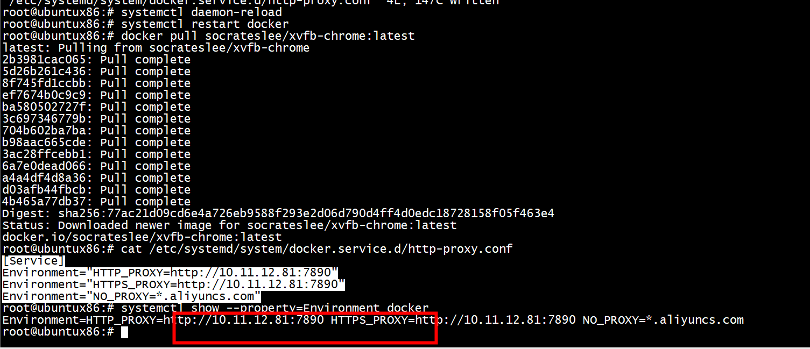

```
root@ubuntux86:# export HTTPS_PROXY=https://10.11.12.81:7890
root@ubuntux86:# python3 docker_pull.py  socrateslee/xvfb-chrome:latest
unset https_proxy
```
# proxy
```
mkdir -p /etc/systemd/system/docker.service.d
 vi /etc/systemd/system/docker.service.d/http-proxy.conf
```

```
root@ubuntux86:# cat /etc/systemd/system/docker.service.d/http-proxy.conf
[Service]
Environment="HTTP_PROXY=http://10.11.12.81:7890"
Environment="HTTPS_PROXY=http://10.11.12.81:7890"
Environment="NO_PROXY=*.aliyuncs.com"
```
HTTPS_PROXY=http://10.11.12.81:7890,https也设置为http   
```
root@ubuntux86:# systemctl daemon-reload
root@ubuntux86:# systemctl restart docker
root@ubuntux86:# systemctl show --property=Environment docker
Environment=HTTP_PROXY=https://10.11.12.81:7890 HTTPS_PROXY=https://10.11.12.81:7890 NO_PROXY=localhost,127.0.0.1
root@ubuntux86:# 
```




# 鲲鹏

[镜像库](https://docker.aityp.com/)  

```
[root@centos7 docker-kunpen]# groupadd docker

[root@centos7 docker-kunpen]# usermod -a -G docker root
[root@centos7 docker-kunpen]#  systemctl daemon-reload && systemctl restart docker
[root@centos7 docker-kunpen]# 
``` 

```
docker pull swr.cn-north-4.myhuaweicloud.com/ddn-k8s/docker.io/arm64v8/ubuntu:18.04-linuxarm64
docker tag  swr.cn-north-4.myhuaweicloud.com/ddn-k8s/docker.io/arm64v8/ubuntu:18.04-linuxarm64  docker.io/arm64v8/ubuntu:18.04
``` 


```
docker build -t kunpeng-app -f armv8.ubuntu.Dockerfile  .
```

```
docker  run -it -d --net=host --cap-add=NET_ADMIN --privileged=true  -v /root/dpdk-stable-19.11.1:/root/dpdk-stable-19.11.1 -v /root/prog:/root/prog  kunpeng-app
docker exec -it 387318b58980  bash
docker  run -it   --net=host --cap-add=NET_ADMIN --privileged=true  -v /root/dpdk-stable-19.11.1:/root/dpdk-stable-19.11.1 -v /root/prog:/root/prog  kunpeng-app  bash
```


```
docker  run -it   --net=host --cap-add=NET_ADMIN --privileged=true  -v /root/dpdk-stable-19.11.1:/root/dpdk-stable-19.11.1 -v /root/prog:/root/prog -v /mnt/huge:/mnt/huge  e-rpc bash
```