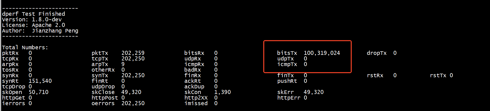

# pcie带宽   

```
lspci -n -s  0000:3b:00.0 -vvv | grep --color -i width
                LnkCap: Port #0, Speed 5GT/s, Width x8, ASPM L0s, Exit Latency L0s unlimited
                LnkSta: Speed 5GT/s (ok), Width x8 (ok)
```

## pcie 3.0

PCIE3.0，按照PCIE3.0的标准8Gb/s ，编码原则128/130b，100G网卡用16条lane（X16），所以理论总带宽=16*8Gb/s*128/130=126Gb/s ，所以也就是说PCIE总线理论上也只能到126G的总带宽，加上各种损耗，实际也就到100G左右，PCIE链路有限制，并且此款卡也只支持100G。所以无法达到200G的速率。    

## pcie 4.0

```
lspci -n -d 8086:1592 -vvv | grep --color -i width
                LnkCap: Port #0, Speed 16GT/s, Width x16, ASPM not supported
                LnkSta: Speed 16GT/s (ok), Width x16 (ok)
                LnkCap: Port #0, Speed 16GT/s, Width x16, ASPM not supported
                LnkSta: Speed 16GT/s (ok), Width x16 (ok)
```


# dperf



重要调优参数：

```
jumbo                       9000
payload_size                8192
cc                          3200
```


```
cat client-tps-port1-1.conf 
mode                        client
tx_burst                    128
launch_num                  10
cpu                         0 2 4 6 8 10 12 14

jumbo                       9000
payload_size                8192
#packet_size                 1000
duration                    2m
cps                         400
cc                          3200
keepalive                   1ms

#port                       pci             addr         gateway    [mac]
port                        0000:17:00.0   6.6.245.3   6.6.245.1     6c:fe:54:3d:8a:38 

#                           addr_start      num
client                      6.6.245.3       8

#                           addr_start      num
server                      6.6.247.3       8
#                           port_start      num
listen                      80              8
```