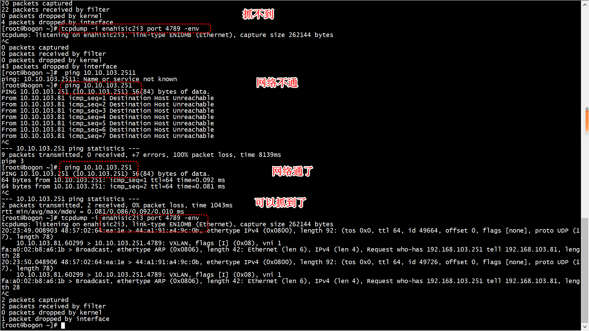

# client 节点配置

```
ip link add vxlan1 type vxlan id 1 remote 10.10.103.251 dstport 4789 dev enahisic2i3
ip a add  192.168.103.81/24 dev vxlan1
ip l set vxlan1 up
```
+ 10.10.103.251是外层ip(dpdk server)    
+ enahisic2i3的ip是10.10.103.81  
```
46: vxlan1: <BROADCAST,MULTICAST,UP,LOWER_UP> mtu 1450 qdisc noqueue state UNKNOWN group default qlen 1000
    link/ether fa:a0:02:b8:a6:1b brd ff:ff:ff:ff:ff:ff
    inet 192.168.103.81/24 scope global vxlan1
       valid_lft forever preferred_lft forever
    inet6 fe80::f8a0:2ff:feb8:a61b/64 scope link 
       valid_lft forever preferred_lft forever
```

>  ##   配置neigh

```
ip  n  add 192.168.103.251 dev vxlan1 lladdr  bc:97:e1:b6:e8:12
```
+ 192.168.103.251 vxlan内层ip(dpdk server)    
+ bc:97:e1:b6:e8:12  vxlan内层mac (dpdk server)   
[root@bogon dperf]# 
# make
```
make  RTE_TARGET=arm64-armv8a-linuxapp-gcc  RTE_SDK=/root/dpdk-19.11/ -j 64
  CC src/socket.o
```

# test

```
[root@bogon dperf]# curl http://192.168.103.251/ 
hello dperf!
[root@bogon dperf]# 
```


# test2

> ## ns1

```
ip netns add ns1
ip link add tap0 type veth peer name tap0_br
ip link set tap0 netns ns1
ip netns exec ns1 ip link set tap0 up
ip netns exec ns1 ip link set lo up
ip link set tap0_br up
# ip netns exec ns1 ifconfig tap0 hw ether fa:a0:02:b8:a6:1b
#brctl addbr  br0
#brctl addif  br0 enahisic2i3
ip netns exec ns1 ip addr add 192.168.103.81/24 dev tap0
ip netns exec ns1 route add -net 192.168.1.0 netmask 255.255.255.0 dev tap0
ip link add vxlan1 type vxlan id 1 remote 10.10.103.251 dstport 4789 dev enahisic2i3
brctl addif  br0 vxlan1
```

> ## 配置mac
+ tap0
```
ip netns exec ns1 ifconfig tap0 hw ether fa:a0:02:b8:a6:1b
```
+ vxlan1

```
[root@bogon ~]# ifconfig vxlan1 hw ether fa:a0:02:b8:a6:1a
```

> ## 配置neigh

```
ip netns exec ns1 ip  n  add 192.168.103.251 dev tap0 lladdr  bc:97:e1:b6:e8:12 
```

或者vxlan1 进行 arp proxy


```
[root@bogon ~]# bridge fdb | grep 'fa:a0:02:b8:a6:1b'
[root@bogon ~]# bridge fdb | grep vxlan1
fa:a0:02:b8:a6:1a dev vxlan1 master br0 permanent
fa:a0:02:b8:a6:1a dev vxlan1 vlan 1 master br0 permanent
00:00:00:00:00:00 dev vxlan1 dst 10.10.103.251 via enahisic2i3 self permanent
[root@bogon ~]# 
```

> ## curl

```
[root@bogon ~]# ip netns exec ns1 curl http://192.168.103.251/
hello dperf!
[root@bogon ~]# 
```
curl成功后的vxlan   
```
[root@bogon ~]# bridge fdb | grep vxlan1
fa:a0:02:b8:a6:1a dev vxlan1 master br0 permanent
bc:97:e1:b6:e8:12 dev vxlan1 master br0 
fa:a0:02:b8:a6:1a dev vxlan1 vlan 1 master br0 permanent
00:00:00:00:00:00 dev vxlan1 dst 10.10.103.251 via enahisic2i3 self permanent
bc:97:e1:b6:e8:12 dev vxlan1 dst 10.10.103.251 self 
[root@bogon ~]# 
```

> ## bug

```
ip link add vxlan1 type vxlan id 1 remote 10.10.103.251 dstport 4789 dev enahisic2i3
```


 tcpdump -i enahisic2i3 port 4789 -env抓不到vxlan报文，这是因为10.10.103.251无法访问通，




# vxlan arp proxy

```
[root@bogon ~]# brctl delif br0  vxlan1
[root@bogon ~]# ip l del vxlan1
[root@bogon ~]# ip link add vxlan1 type vxlan id 1 remote 10.10.103.251 dstport 4789 dev enahisic2i3 proxy
[root@bogon ~]# brctl addif br0  vxlan1
[root@bogon ~]# ip  n  add  192.168.103.251 dev vxlan1 lladdr  bc:97:e1:b6:e8:12
[root@bogon ~]# 
```

> ## test
```
[root@bogon ~]# ip netns exec ns1 curl http://192.168.103.251/
hello dperf!
[root@bogon ~]# ip netns exec ns1 ip n
192.168.103.251 dev tap0 lladdr bc:97:e1:b6:e8:12 REACHABLE
```