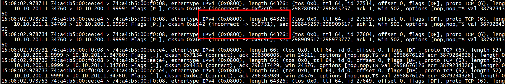
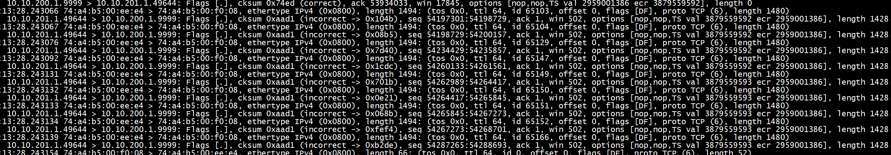
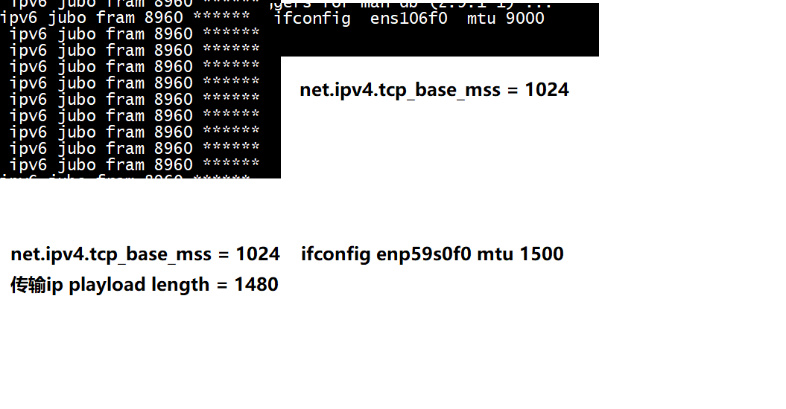
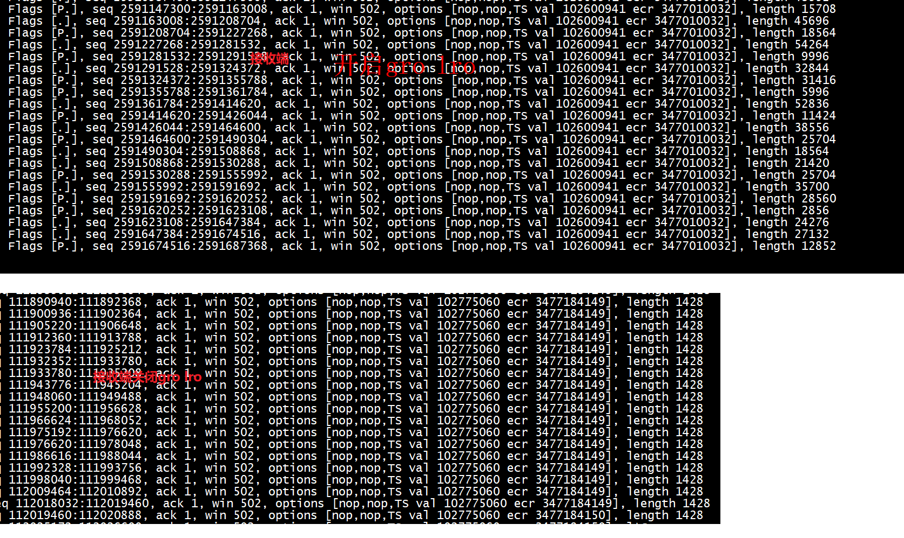

```Text
MTU
MTU 指的是 IP报文的大小, 一般MTU为1500

TCP模式下:
1500(MTU) = 1460(tcp payload) + 20(tcp head) + 20(ip head)

如果这个报文在MAC网卡上传输,还需打上 MAC头
1514 = 6(dst mac) + 6(src mac) +2(type) + MTU

```

现象描述
工作中需要将抓下来的报文回放测试,   
但是回放软件不支持 巨帧类型报文, 提示: 报文数据太长.  
以下是网卡抓包时, 确实可以看到存在IP报文 远大于常规MTU 1500   

使用 tcpdump 显示 超过 1500 的报文   
```
tcpdump -i br0  greater 1500  -tnn
```





```
root@p4gen:~# ethtool -k enp59s0f0  
Features for enp59s0f0:
rx-checksumming: on
tx-checksumming: on
        tx-checksum-ipv4: off [fixed]
        tx-checksum-ip-generic: on
        tx-checksum-ipv6: off [fixed]
        tx-checksum-fcoe-crc: on [fixed]
        tx-checksum-sctp: on
scatter-gather: on
        tx-scatter-gather: on
        tx-scatter-gather-fraglist: off [fixed]
tcp-segmentation-offload: on
        tx-tcp-segmentation: on
        tx-tcp-ecn-segmentation: off [fixed]
        tx-tcp-mangleid-segmentation: off
        tx-tcp6-segmentation: on
generic-segmentation-offload: on
generic-receive-offload: on
large-receive-offload: off
rx-vlan-offload: on
tx-vlan-offload: on
ntuple-filters: off
receive-hashing: on
highdma: on [fixed]
rx-vlan-filter: on
vlan-challenged: off [fixed]
tx-lockless: off [fixed]
netns-local: off [fixed]
tx-gso-robust: off [fixed]
tx-fcoe-segmentation: on [fixed]
tx-gre-segmentation: on
tx-gre-csum-segmentation: on
tx-ipxip4-segmentation: on
tx-ipxip6-segmentation: on
tx-udp_tnl-segmentation: on
tx-udp_tnl-csum-segmentation: on
tx-gso-partial: on
tx-tunnel-remcsum-segmentation: off [fixed]
tx-sctp-segmentation: off [fixed]
tx-esp-segmentation: on
tx-udp-segmentation: on
tx-gso-list: off [fixed]
fcoe-mtu: off [fixed]
tx-nocache-copy: off
loopback: off [fixed]
rx-fcs: off [fixed]
rx-all: off
tx-vlan-stag-hw-insert: off [fixed]
rx-vlan-stag-hw-parse: off [fixed]
rx-vlan-stag-filter: off [fixed]
l2-fwd-offload: off
hw-tc-offload: off
esp-hw-offload: on
esp-tx-csum-hw-offload: on
rx-udp_tunnel-port-offload: off [fixed]
tls-hw-tx-offload: off [fixed]
tls-hw-rx-offload: off [fixed]
rx-gro-hw: off [fixed]
tls-hw-record: off [fixed]
rx-gro-list: off
macsec-hw-offload: off [fixed]
rx-udp-gro-forwarding: off
hsr-tag-ins-offload: off [fixed]
hsr-tag-rm-offload: off [fixed]
hsr-fwd-offload: off [fixed]
hsr-dup-offload: off [fixed]
```

# tcp mss

```
root@p4gen:~# sysctl -a | grep 'net.ipv4.tcp_base_mss'
net.ipv4.tcp_base_mss = 1024
root@p4gen:~# 
```
即使net.ipv4.tcp_base_mss = 1024也会***传输ip playload length = 1480的tcp***报文    


# 巨帧特性
 Jumbo frame 一般指的是二层封装三层IP报文的值大于9000bytes的报文    
```
ifconfig enp59s0f0 mtu 10220
SIOCSIFMTU: Invalid argument
```

配置成9000 ok    
```
ifconfig enp59s0f0 mtu 9000
```


# 关闭 发送/接收 巨帧特性
 
```
[root@localhost ~]# ethtool -K  enp1s0f1 gro off
[root@localhost ~]# ethtool -K  enp1s0f1 gso off


[root@localhost ~]# ethtool -K  enp1s0f1 tso off
[root@localhost ~]# ethtool -K  enp1s0f1 lro off
```

