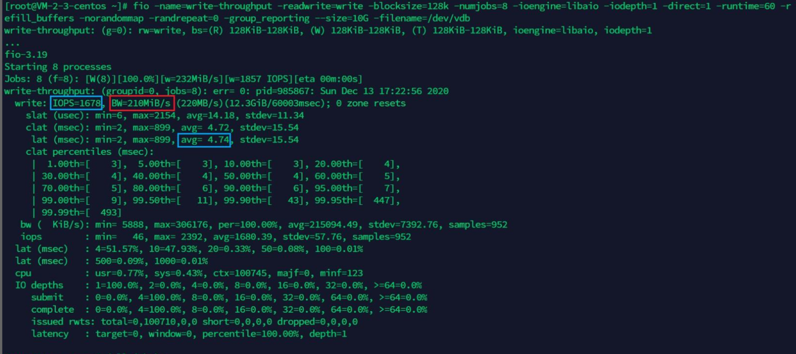
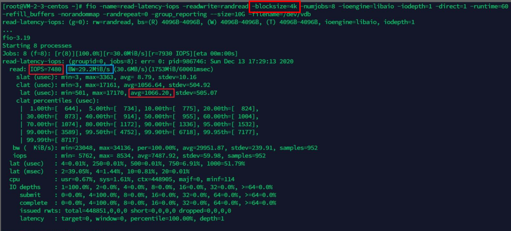
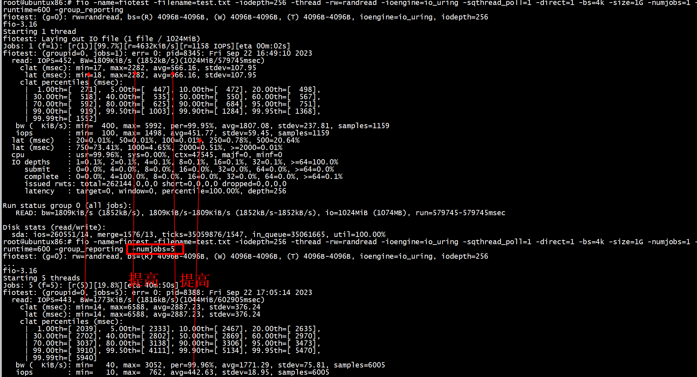

#  Direct-io
Direct-io的目的在于绕过fs的cache，直接对block设备上的文件进行读写，其目的在于提高读写性能（以读为例，毕竟少了一次从fs cache到用户态buffer的拷贝过程），这在文件仅读/写一次的情况下应该是比较比默认的读/写方式效率高（理论上）。
使用directI/O有一个很大的限制：buffer的内存地址、每次读写数据的大小、文件的offset三者都要与底层设备的逻辑块大小对齐（一般是 512 字节）。

```
root@ubuntux86:# blockdev --getss /dev/sda
512
root@ubuntux86:# 
```
如果不满足对齐要求，系统会报 EINVAL（Invalid argument。） 错误：    

##  Direct I/O 与数据持久化
使用bufferedI/O写入数据，write返回之后，数据实际上只到达pagecache——还在内存中，需要等内核线程周期性将脏页刷新到持久化存储上，或应用程序调用 fsync 主动将数据刷新脏页。   
理论上，使用directI/O不会经过page cache，当write返回之后，数据应该达到持久化存储。但是，除了文件数据本身，文件的一些重要的元数据，比如文件的大小，也会影响数据的完整性。而 direct I/O 只是对文件数据本身有效，文件的元数据读写还是会经过内核缓存 —— 使用 direct I/O 读写文件，依然需要使用 fsync 来刷新文件的元数据。   
 但是，并不是所有文件元数据都会影响到数据的完整性，比如文件的修改时间。为此，MySQL 提供了一个新的刷盘参数：O_DIRECT_NO_FSYNC —— 使用 O_DIRECT 读写数据，只有在必要的使用进行 fsync。  
 
# fio
+ 1 iops： 可以采取增加线程数（多核下更推荐，对时延影响相对小）以及增加队列深度（即iodepth参数，核数少时的办法）   
iodepth: I/O异步请求队列深度，默认为1，提升此值需要结合libaio和direct
+ 2带宽： block size
+ 3时延:   lat是总延迟，slat是提交io到内核的延迟，clat是内核到磁盘完成之间的延迟，因此lat=slat+clat。slat通常是比较稳定的值，所以这里通过观察clat来判断IO延迟情况。

+ 4 bs = 4k iodepth = 1：随机读/写测试，能反映硬盘的时延性能
+ 5 bs = 128k iodepth = 32：顺序读/写测试，能反映硬盘的吞吐性能
+ 6 bs = 4k iodepth = 32：随机读/写测试，能反映硬盘的 IOPS 性能

## iodepth
 
iodepth是队列深度，简单理解就是一批提交给系统的IO个数，由于同步的IO是堵塞的，IO操作会依次执行，iodepth一定小于1，因此该参数只有使用libaio/uring时才有意义。因为异步的时候，系统能够在读写结果返回之前就吸纳后续的IO请求，所以loop里边可能在跑多个IO操作，然后等待结果异步返回。    
  libaio引擎会用这个iodepth值来调用io_setup准备个可以一次提交iodepth个IO的上下文，同时申请个io请求队列用于保持IO。   在压测进行的时候，系统会生成特定的IO请求，往io请求队列里面扔，当队列里面的IO个数达到iodepth_batch值的时候，就调用io_submit批次提交请求，然后开始调用io_getevents开始收割已经完成的IO。    每次收割多少呢？由于收割的时候，超时时间设置为0，所以有多少已完成就算多少，最多可以收割iodepth_batch_complete值个。随着收割，IO队列里面的IO数就少了，那么需要补充新的IO。   什么时候补充呢？当IO数目降到iodepth_low值的时候，就重新填充，保证OS可以看到至少iodepth_low数目的io在电梯口排队着
 

##  顺序写：评测云盘最大吞吐量
```
fio -name=write-throughput -readwrite=write -blocksize=128k -numjobs=8 -ioengine=libaio -iodepth=1 -direct=1 -runtime=60 -refill_buffers -norandommap -randrepeat=0 -group_reporting --size=10G -filename=/dev/vdb
```
测试吞吐量一般需要用大一些的blocksize，选择128K比较合适。如需要进一步同时提升IOPS，可以采取增加线程数（多核下更推荐，对时延影响相对小）以及增加队列深度（即iodepth参数，核数少时的办法）。

测试结果类似如下：    

可以看到虽然吞吐量上去了，达到210MiB/s，但是并非没有有代价，时延达到了4ms左右，而IOPS不到2K    
##  随机读：评测云盘的时延和IOPS
降低-blocksize   
```
fio -name=read-latency-iops -readwrite=randread -blocksize=4k -numjobs=8 -ioengine=libaio -iodepth=1 -direct=1 -runtime=60 -refill_buffers -norandommap -randrepeat=0 -group_reporting --size=10G -filename=/dev/vdb
```
评测时延和IOPS，一般用4K的随机读写的负载。因为4K往往是最小的读写寻址单元，比如对于SSD硬盘。同样类似的，提升IOPS可以通过增加线程数来完成。    
测试结果类似如下：

可以看到，此时IOPS达到7K+，而平均请求时延也控制在了1ms，甚至大多数情况下更低，是比较理想的随机读写负载。当然，代价就是带宽吞吐量降到了30MiB/s左右。这里有个常见的权衡点：提升IOPS不能以牺牲太多时延为代价。因为时延是一种服务质量的体现，在CPU资源一定时，IOPS和时延是一定程度上负相关的，但如果能通过多线程/队列（引入CPU外援）等方法，可以在增加一些可忍的时延（如10%以内）但同时提升数倍的IOPS并发量，那么通常是值得的，也是常见的系统优化tradeoff。
#  io_uring
```
#针对io_uring的fixedufs特性
fio -threads=8 -size=10G -name=test -group_reporting -filename=./io.tmp -runtime=60 --ioengine=io_uring --iodepth=512 --fixedbufs 

#针对io_uring的sqthread_poll特性
fio -threads=8 -size=10G -name=test -group_reporting -filename=./io.tmp -runtime=60 --ioengine=io_uring --iodepth=512 --sqthread_poll 1
```
```
fio -name=fiotest -filename=test.txt -iodepth=128 -thread -rw=randread -ioengine=io_uring -sqthread_poll=1 -direct=1 -bs=4k -size=1G -numjobs=1 -runtime=600 -group_reporting
```

# libaio
```
fio -ioengine=libaio -bs=4k -direct=1 -thread -rw=read -filename=./io.tmp -name="BS 4KB read test" -iodepth=16 -runtime=60
```

# 磁盘

```Text
【1】随机读测试
fio -name=randread -direct=1 -iodepth=64 -rw=randread -ioengine=libaio -bs=4k -size=1G -numjobs=1-runtime=1000 -group_reporting -filename=/dev/sda2
【2】随机写测试
对于磁盘分区需要先umount
fio -name=randwrite -direct=1 -iodepth=64 -rw=randwrite -ioengine=libaio -bs=4k -size=1G -numjobs1 -runtime=1000 -group_reporting -filename=/dev/sda2
【3】 顺序读测试
fio -name=read -direct=1 -iodepth=64 -rw=read -ioengine=libaio -bs=4k -size=1G -numjobs=1 -runtim=1000 -group_reporting -filename=/dev/sda2
【4】 顺序写测试
fio -name=write -direct=1 -iodepth=64 -rw=write -ioengine=libaio -bs=4k -size=1G -numjobs=1 -runtme=1000 -group_reporting -filename=/dev/sda2
```
numjobs=5 测试  
```
【1】随机读测试
fio -name=randread -direct=1 -iodepth=64 -rw=randread -ioengine=libaio -bs=4k -size=1G -numjobs=5 -runtime=1000 -group_reporting -filename=/dev/sda2
【2】随机写测试
fio -name=randwrite -direct=1 -iodepth=64 -rw=randwrite -ioengine=libaio -bs=4k -size=1G -numjobs=5 -runtime=1000 -group_reporting -filename=/dev/sda2
【3】 顺序读测试
fio -name=read -direct=1 -iodepth=64 -rw=read -ioengine=libaio -bs=4k -size=1G -numjobs=5 -runtime=1000 -group_reporting -filename=/dev/sda2
```

#  blktrace+fio 模拟真实IO场景
```
# 随机读
fio -name=randread -direct=1 -iodepth=64 -rw=randread -ioengine=libaio -bs=4k -size=1G -numjobs=5 -runtime=1000 -group_reporting -filename=/dev/sda2
 
# 随机写
fio -name=randwrite -direct=1 -iodepth=64 -rw=randwrite -ioengine=libaio -bs=4k -size=1G -numjobs=5 -runtime=1000 -group_reporting -filename=/dev/sda2
 
# 顺序读
fio -name=read -direct=1 -iodepth=64 -rw=read -ioengine=libaio -bs=4k -size=1G -numjobs=5 -runtime=1000 -group_reporting -filename=/dev/sda2
 
# 顺序写
fio -name=write -direct=1 -iodepth=64 -rw=write -ioengine=libaio -bs=4k -size=1G -numjobs=5 -runtime=1000 -group_reporting -filename=/dev/sda2 


 使用 blktrace 跟踪磁盘上述压测的I/O
$ blktrace /dev/sda2
 
# 查看 blktrace 记录的结果
```
#   iodepth

```
root@ubuntux86:# fio -name=fiotest -filename=test.txt -iodepth=128 -thread -rw=randread -ioengine=io_uring -sqthread_poll=1 -direct=1 -bs=4k -size=1G -numjobs=1 -runtime=600 -group_reporting
fiotest: (g=0): rw=randread, bs=(R) 4096B-4096B, (W) 4096B-4096B, (T) 4096B-4096B, ioengine=io_uring, iodepth=128
fio-3.16
Starting 1 thread
fiotest: Laying out IO file (1 file / 1024MiB)
Jobs: 1 (f=1): [r(1)][100.0%][r=5360KiB/s][r=1340 IOPS][eta 00m:00s]
fiotest: (groupid=0, jobs=1): err= 0: pid=8282: Fri Sep 22 16:34:30 2023
  read: IOPS=459, BW=1840KiB/s (1884kB/s)(1024MiB/570014msec)
    clat (msec): min=12, max=1668, avg=278.30, stdev=94.80
     lat (msec): min=12, max=1668, avg=278.30, stdev=94.80
    clat percentiles (msec):
     |  1.00th=[  116],  5.00th=[  174], 10.00th=[  188], 20.00th=[  211],
     | 30.00th=[  228], 40.00th=[  245], 50.00th=[  259], 60.00th=[  279],
     | 70.00th=[  300], 80.00th=[  330], 90.00th=[  393], 95.00th=[  456],
     | 99.00th=[  617], 99.50th=[  693], 99.90th=[  894], 99.95th=[  978],
     | 99.99th=[ 1217]
   bw (  KiB/s): min= 1516, max= 5528, per=99.97%, avg=1838.43, stdev=236.60, samples=1140
   iops        : min=  379, max= 1382, avg=459.61, stdev=59.15, samples=1140
  lat (msec)   : 20=0.01%, 50=0.05%, 100=0.61%, 250=43.16%, 500=53.07%
  lat (msec)   : 750=2.79%, 1000=0.28%, 2000=0.04%
  cpu          : usr=99.95%, sys=0.01%, ctx=48049, majf=0, minf=0
  IO depths    : 1=0.1%, 2=0.1%, 4=0.1%, 8=0.1%, 16=0.1%, 32=0.1%, >=64=100.0%
     submit    : 0=0.0%, 4=0.0%, 8=0.0%, 16=0.0%, 32=0.0%, 64=0.0%, >=64=0.0%
     complete  : 0=0.0%, 4=100.0%, 8=0.0%, 16=0.0%, 32=0.0%, 64=0.0%, >=64=0.1%
     issued rwts: total=262144,0,0,0 short=0,0,0,0 dropped=0,0,0,0
     latency   : target=0, window=0, percentile=100.00%, depth=128

Run status group 0 (all jobs):
   READ: bw=1840KiB/s (1884kB/s), 1840KiB/s-1840KiB/s (1884kB/s-1884kB/s), io=1024MiB (1074MB), run=570014-570014msec

Disk stats (read/write):
  sda: ios=260469/15, merge=1512/13, ticks=34465186/1087, in_queue=34466490, util=100.00%
root@ubuntux86:# ls
io_uring-cp.c  io_uring-test.c  Makefile  sq_poll.c  test.txt
root@ubuntux86:# du -sh test.txt 
1.1G    test.txt
```
提高-iodepth=256   
```
root@ubuntux86:# rm test.txt 
root@ubuntux86:# touch test.txt
root@ubuntux86:# fio -name=fiotest -filename=test.txt -iodepth=256 -thread -rw=randread -ioengine=io_uring -sqthread_poll=1 -direct=1 -bs=4k -size=1G -numjobs=1 -runtime=600 -group_reporting
fiotest: (g=0): rw=randread, bs=(R) 4096B-4096B, (W) 4096B-4096B, (T) 4096B-4096B, ioengine=io_uring, iodepth=256
fio-3.16
Starting 1 thread
fiotest: Laying out IO file (1 file / 1024MiB)
Jobs: 1 (f=1): [r(1)][99.7%][r=4632KiB/s][r=1158 IOPS][eta 00m:02s]
fiotest: (groupid=0, jobs=1): err= 0: pid=8345: Fri Sep 22 16:49:10 2023
  read: IOPS=452, BW=1809KiB/s (1852kB/s)(1024MiB/579745msec)
    clat (msec): min=17, max=2282, avg=566.16, stdev=107.95
     lat (msec): min=18, max=2282, avg=566.16, stdev=107.95
    clat percentiles (msec):
     |  1.00th=[  271],  5.00th=[  447], 10.00th=[  472], 20.00th=[  498],
     | 30.00th=[  518], 40.00th=[  535], 50.00th=[  550], 60.00th=[  567],
     | 70.00th=[  592], 80.00th=[  625], 90.00th=[  684], 95.00th=[  751],
     | 99.00th=[  919], 99.50th=[ 1003], 99.90th=[ 1284], 99.95th=[ 1368],
     | 99.99th=[ 1552]
   bw (  KiB/s): min=  400, max= 5992, per=99.95%, avg=1807.08, stdev=237.81, samples=1159
   iops        : min=  100, max= 1498, avg=451.77, stdev=59.45, samples=1159
  lat (msec)   : 20=0.01%, 50=0.01%, 100=0.01%, 250=0.78%, 500=20.64%
  lat (msec)   : 750=73.41%, 1000=4.65%, 2000=0.51%, >=2000=0.01%
  cpu          : usr=99.96%, sys=0.00%, ctx=47545, majf=0, minf=0
  IO depths    : 1=0.1%, 2=0.1%, 4=0.1%, 8=0.1%, 16=0.1%, 32=0.1%, >=64=100.0%
     submit    : 0=0.0%, 4=0.0%, 8=0.0%, 16=0.0%, 32=0.0%, 64=0.0%, >=64=0.0%
     complete  : 0=0.0%, 4=100.0%, 8=0.0%, 16=0.0%, 32=0.0%, 64=0.0%, >=64=0.1%
     issued rwts: total=262144,0,0,0 short=0,0,0,0 dropped=0,0,0,0
     latency   : target=0, window=0, percentile=100.00%, depth=256

Run status group 0 (all jobs):
   READ: bw=1809KiB/s (1852kB/s), 1809KiB/s-1809KiB/s (1852kB/s-1852kB/s), io=1024MiB (1074MB), run=579745-579745msec

Disk stats (read/write):
  sda: ios=260551/14, merge=1576/13, ticks=35059876/1547, in_queue=35061665, util=100.00%
root@ubuntux86:# 
```
#  numjobs
提高 -numjobs=5
```
root@ubuntux86:# fio -name=fiotest -filename=test.txt -iodepth=256 -thread -rw=randread -ioengine=io_uring -sqthread_poll=1 -direct=1 -bs=4k -size=1G -numjobs=1 -runtime=600 -group_reporting  -numjobs=5
fiotest: (g=0): rw=randread, bs=(R) 4096B-4096B, (W) 4096B-4096B, (T) 4096B-4096B, ioengine=io_uring, iodepth=256
...
fio-3.16
Starting 5 threads
Jobs: 5 (f=5): [r(5)][19.8%][eta 40m:50s]                          
fiotest: (groupid=0, jobs=5): err= 0: pid=8388: Fri Sep 22 17:05:14 2023
  read: IOPS=443, BW=1773KiB/s (1816kB/s)(1044MiB/602905msec)
    clat (msec): min=14, max=6588, avg=2887.23, stdev=376.24
     lat (msec): min=14, max=6588, avg=2887.23, stdev=376.24
    clat percentiles (msec):
     |  1.00th=[ 2039],  5.00th=[ 2333], 10.00th=[ 2467], 20.00th=[ 2635],
     | 30.00th=[ 2702], 40.00th=[ 2802], 50.00th=[ 2869], 60.00th=[ 2970],
     | 70.00th=[ 3037], 80.00th=[ 3138], 90.00th=[ 3306], 95.00th=[ 3473],
     | 99.00th=[ 3910], 99.50th=[ 4111], 99.90th=[ 5134], 99.95th=[ 5470],
     | 99.99th=[ 5940]
   bw (  KiB/s): min=   40, max= 3052, per=99.96%, avg=1771.29, stdev=75.81, samples=6005
   iops        : min=   10, max=  762, avg=442.63, stdev=18.95, samples=6005
  lat (msec)   : 20=0.01%, 50=0.01%, 100=0.01%, 250=0.03%, 500=0.04%
  lat (msec)   : 750=0.04%, 1000=0.04%, 2000=0.59%, >=2000=99.24%
  cpu          : usr=99.95%, sys=0.04%, ctx=187385, majf=0, minf=0
  IO depths    : 1=0.1%, 2=0.1%, 4=0.1%, 8=0.1%, 16=0.1%, 32=0.1%, >=64=99.9%
     submit    : 0=0.0%, 4=0.0%, 8=0.0%, 16=0.0%, 32=0.0%, 64=0.0%, >=64=0.0%
     complete  : 0=0.0%, 4=100.0%, 8=0.0%, 16=0.0%, 32=0.0%, 64=0.0%, >=64=0.1%
     issued rwts: total=267233,0,0,0 short=0,0,0,0 dropped=0,0,0,0
     latency   : target=0, window=0, percentile=100.00%, depth=256

Run status group 0 (all jobs):
   READ: bw=1773KiB/s (1816kB/s), 1773KiB/s-1773KiB/s (1816kB/s-1816kB/s), io=1044MiB (1095MB), run=602905-602905msec

Disk stats (read/write):
  sda: ios=267071/0, merge=72/0, ticks=36443610/0, in_queue=36443609, util=100.00%
```

# references
[Linux 文件 I/O 进化史（三）：Direct I/O 和 Linux AIO](https://zhuanlan.zhihu.com/p/374627314)  
[探索fio参数如何选择以及全方位对比HDD和SSD性能](https://blog.csdn.net/get_set/article/details/108001674)  