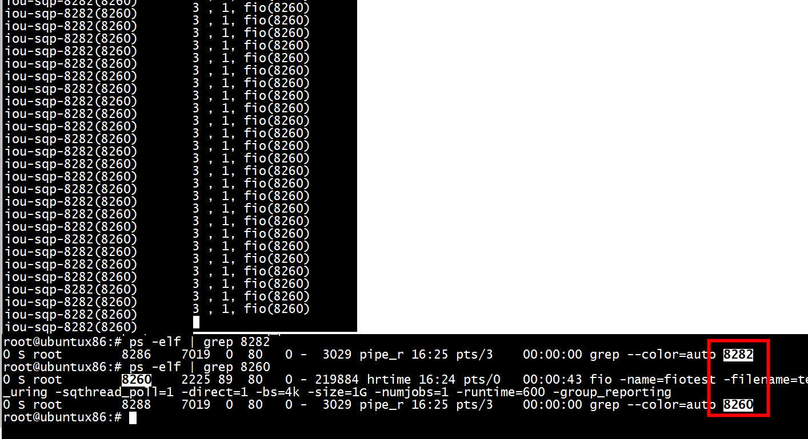

# ./io_uring-test  test.txt
sys_enter_io_uring_enter   
```
root@ubuntux86:# bpftrace -e 'tracepoint:syscalls:sys_enter_io_uring_enter { printf ("%u , %u, %s(%d)\n",args->fd,args->to_submit,comm, pid); }'
Attaching 1 probe...
3 , 4, io_uring-test(6954)
3 , 0, io_uring-test(6954)
```
io_uring_submit_sqe   
```
root@ubuntux86:#  bpftrace -e 'tracepoint:io_uring:io_uring_submit_sqe {printf("%s(%d)\n", comm, pid);}'
Attaching 1 probe...
io_uring-test(6954)
io_uring-test(6954)
io_uring-test(6954)
io_uring-test(6954)
```

# ./sq_poll

```
root@ubuntux86:# ps -L --pid  7000
    PID     LWP TTY          TIME CMD
   7000    7000 pts/0    00:00:00 sq_poll
root@ubuntux86:# 
```

sys_enter_io_uring_enter   
```
root@ubuntux86:# bpftrace -e 'tracepoint:syscalls:sys_enter_io_uring_enter { printf ("%u , %u, %s(%d)\n",args->fd,args->to_submit,comm, pid); }'
Attaching 1 probe...
3 , 2, sq_poll(7000)
3 , 0, sq_poll(7000)
3 , 0, sq_poll(7000)

```
io_uring_submit_sqe   

```

Error attaching probe: tracepoint:io_uring:io_uring_enter
root@ubuntux86:#  bpftrace -e 'tracepoint:io_uring:io_uring_submit_sqe {printf("%s(%d)\n", comm, pid);}'
Attaching 1 probe...
iou-sqp-7000(7000)
iou-sqp-7000(7000)
iou-sqp-7000(7000)
iou-sqp-7000(7000)

```
comm是iou-sqp-7000不是sq_poll(7000)    


# 运行fio

```
fio -name=fiotest -filename=test.txt -iodepth=128 -thread -rw=randread -ioengine=io_uring -sqthread_poll=1 -direct=1 -bs=4k -size=1G -numjobs=1 -runtime=600 -group_reporting
```


# references
[Submission Queue Polling](https://unixism.net/loti/tutorial/sq_poll.html)   