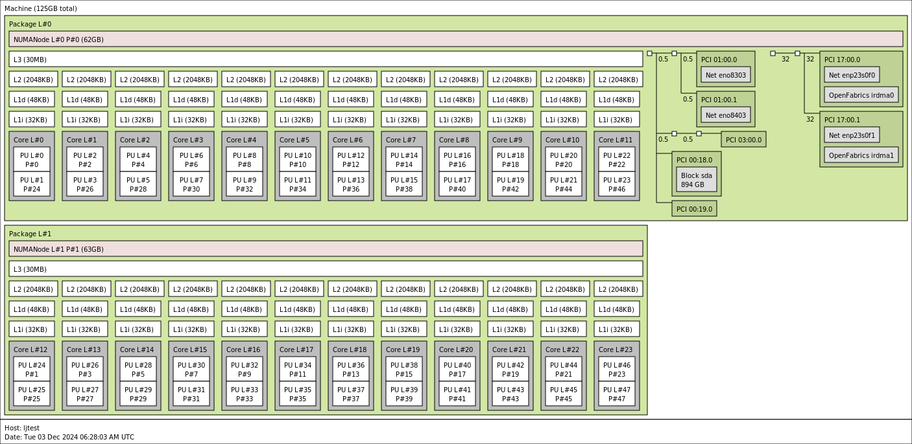
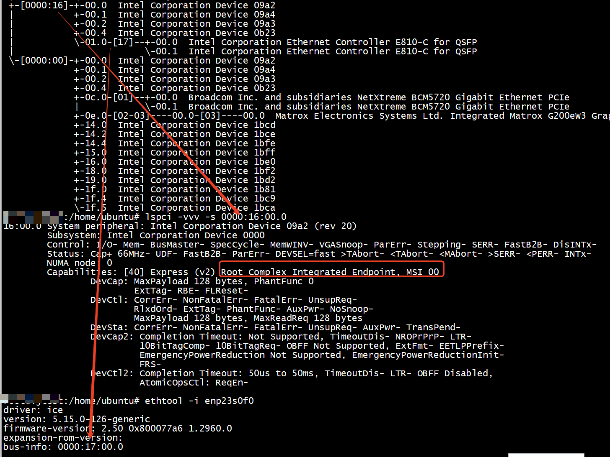

```
root@134node:~# lshw -class network -businfo
Bus info          Device      Class          Description
========================================================
pci@0000:3b:00.0  enp59s0     network        Ethernet Controller XL710 for 40GbE QSFP+
pci@0000:3f:00.0              network        Ethernet Connection X722
pci@0000:3f:00.2  enp63s0f2   network        Ethernet Connection X722 for 1GbE
pci@0000:3f:00.3  enp63s0f3   network        Ethernet Connection X722 for 1GbE
pci@0000:af:00.0  enp175s0f0  network        82599ES 10-Gigabit SFI/SFP+ Network Connection
pci@0000:af:00.1  enp175s0f1  network        82599ES 10-Gigabit SFI/SFP+ Network Connection
root@134node:~# 
```


```
 lspci -vvv -s af:00.0 
af:00.0 Ethernet controller: Intel Corporation Ethernet Controller XL710 for 40GbE QSFP+ (rev 02)
        Subsystem: Intel Corporation Ethernet Converged Network Adapter XL710-Q1
        Physical Slot: 106-1
        Control: I/O- Mem+ BusMaster+ SpecCycle- MemWINV- VGASnoop- ParErr+ Stepping- SERR+ FastB2B- DisINTx+
        Status: Cap+ 66MHz- UDF- FastB2B- ParErr- DEVSEL=fast >TAbort- <TAbort- <MAbort- >SERR- <PERR- INTx-
        Latency: 0, Cache Line Size: 32 bytes
        Interrupt: pin A routed to IRQ 314
        NUMA node: 1
        Region 0: Memory at ed000000 (64-bit, prefetchable) [size=8M]
        Region 3: Memory at ee000000 (64-bit, prefetchable) [size=32K]
        Expansion ROM at ee600000 [disabled] [size=512K]
        Capabilities: [40] Power Management version 3
                Flags: PMEClk- DSI+ D1- D2- AuxCurrent=0mA PME(D0+,D1-,D2-,D3hot+,D3cold+)
                Status: D0 NoSoftRst+ PME-Enable- DSel=0 DScale=1 PME-
        Capabilities: [50] MSI: Enable- Count=1/1 Maskable+ 64bit+
                Address: 0000000000000000  Data: 0000
                Masking: 00000000  Pending: 00000000
        Capabilities: [70] MSI-X: Enable+ Count=129 Masked-
                Vector table: BAR=3 offset=00000000
                PBA: BAR=3 offset=00001000
        Capabilities: [a0] Express (v2) Endpoint, MSI 00
                DevCap: MaxPayload 2048 bytes, PhantFunc 0, Latency L0s <512ns, L1 <64us
                        ExtTag+ AttnBtn- AttnInd- PwrInd- RBE+ FLReset+ SlotPowerLimit 0.000W
                DevCtl: CorrErr+ NonFatalErr+ FatalErr+ UnsupReq-
                        RlxdOrd+ ExtTag+ PhantFunc- AuxPwr- NoSnoop- FLReset-
                        MaxPayload 256 bytes, MaxReadReq 512 bytes
                DevSta: CorrErr+ NonFatalErr- FatalErr- UnsupReq+ AuxPwr- TransPend-
                LnkCap: Port #0, Speed 8GT/s, Width x8, ASPM L1, Exit Latency L1 <16us
                        ClockPM- Surprise- LLActRep- BwNot- ASPMOptComp+
                LnkCtl: ASPM L1 Enabled; RCB 64 bytes, Disabled- CommClk+
                        ExtSynch- ClockPM- AutWidDis- BWInt- AutBWInt-
                LnkSta: Speed 8GT/s (ok), Width x8 (ok)
                        TrErr- Train- SlotClk+ DLActive- BWMgmt- ABWMgmt-
                DevCap2: Completion Timeout: Range ABCD, TimeoutDis+ NROPrPrP- LTR-
                         10BitTagComp- 10BitTagReq- OBFF Not Supported, ExtFmt- EETLPPrefix-
                         EmergencyPowerReduction Not Supported, EmergencyPowerReductionInit-
                         FRS- TPHComp- ExtTPHComp-
                         AtomicOpsCap: 32bit- 64bit- 128bitCAS-
                DevCtl2: Completion Timeout: 50us to 50ms, TimeoutDis- LTR- OBFF Disabled,
                         AtomicOpsCtl: ReqEn-
                LnkCap2: Supported Link Speeds: 2.5-8GT/s, Crosslink- Retimer- 2Retimers- DRS-
                LnkCtl2: Target Link Speed: 2.5GT/s, EnterCompliance- SpeedDis-
                         Transmit Margin: Normal Operating Range, EnterModifiedCompliance- ComplianceSOS-
                         Compliance De-emphasis: -6dB
                LnkSta2: Current De-emphasis Level: -3.5dB, EqualizationComplete+ EqualizationPhase1+
                         EqualizationPhase2+ EqualizationPhase3+ LinkEqualizationRequest-
                         Retimer- 2Retimers- CrosslinkRes: unsupported
        Capabilities: [e0] Vital Product Data
                Product Name: XL710 40GbE Controller
                Read-only fields:
                        [PN] Part number: 
                        [EC] Engineering changes: 
                        [FG] Unknown: 
                        [LC] Unknown: 
                        [MN] Manufacture ID: 
                        [PG] Unknown: 
                        [SN] Serial number: 
                        [V0] Vendor specific: 
                        [RV] Reserved: checksum good, 0 byte(s) reserved
                Read/write fields:
                        [V1] Vendor specific: 
                End
        Capabilities: [100 v2] Advanced Error Reporting
                UESta:  DLP- SDES- TLP- FCP- CmpltTO- CmpltAbrt- UnxCmplt- RxOF- MalfTLP- ECRC- UnsupReq- ACSViol-
                UEMsk:  DLP- SDES- TLP- FCP- CmpltTO- CmpltAbrt- UnxCmplt- RxOF- MalfTLP- ECRC- UnsupReq+ ACSViol-
                UESvrt: DLP+ SDES+ TLP- FCP+ CmpltTO- CmpltAbrt- UnxCmplt- RxOF+ MalfTLP+ ECRC- UnsupReq- ACSViol-
                CESta:  RxErr- BadTLP- BadDLLP- Rollover- Timeout- AdvNonFatalErr+
                CEMsk:  RxErr- BadTLP- BadDLLP- Rollover- Timeout- AdvNonFatalErr+
                AERCap: First Error Pointer: 00, ECRCGenCap+ ECRCGenEn- ECRCChkCap+ ECRCChkEn-
                        MultHdrRecCap- MultHdrRecEn- TLPPfxPres- HdrLogCap-
                HeaderLog: 00000000 00000000 00000000 00000000
        Capabilities: [140 v1] Device Serial Number a8-6b-af-ff-ff-fe-fd-3c
        Capabilities: [150 v1] Alternative Routing-ID Interpretation (ARI)
                ARICap: MFVC- ACS-, Next Function: 0
                ARICtl: MFVC- ACS-, Function Group: 0
        Capabilities: [160 v1] Single Root I/O Virtualization (SR-IOV)
                IOVCap: Migration-, Interrupt Message Number: 000
                IOVCtl: Enable- Migration- Interrupt- MSE- ARIHierarchy+
                IOVSta: Migration-
                Initial VFs: 128, Total VFs: 128, Number of VFs: 0, Function Dependency Link: 00
                VF offset: 16, stride: 1, Device ID: 154c
                Supported Page Size: 00000553, System Page Size: 00000001
                Region 0: Memory at 00000000ed800000 (64-bit, prefetchable)
                Region 3: Memory at 00000000ee008000 (64-bit, prefetchable)
                VF Migration: offset: 00000000, BIR: 0
        Capabilities: [1a0 v1] Transaction Processing Hints
                Device specific mode supported
                No steering table available
        Capabilities: [1b0 v1] Access Control Services
                ACSCap: SrcValid- TransBlk- ReqRedir- CmpltRedir- UpstreamFwd- EgressCtrl- DirectTrans-
                ACSCtl: SrcValid- TransBlk- ReqRedir- CmpltRedir- UpstreamFwd- EgressCtrl- DirectTrans-
        Capabilities: [1d0 v1] Secondary PCI Express
                LnkCtl3: LnkEquIntrruptEn- PerformEqu-
                LaneErrStat: 0
        Kernel driver in use: i40e
        Kernel modules: i40e
```

# 安装 lstopo 命令

+ ubuntu   
```
sudo apt install hwloc
```
+ centos    
```
sudo yum install hwloc-gui
```

Show the summarized system topology in a graphical window (or print to console if no graphical display is available):   
lstopo    
Show the full system topology without summarizations:   
lstopo --no-factorize   
Show the summarized system topology with only [p]hysical indices (i.e. as seen by the OS):   
lstopo --physical   
Write the full system topology to a file in the specified format:    
lstopo --no-factorize --output-format console|ascii|tex|fig|svg|pdf|ps|png|xml path/to/file   
Other formats that can be used include svg and pdf:      

$ lstopo --of svg > out.svg    

$ lstopo --of pdf > out.pdf   

```
lstopo --logical  --output-format png 220.png
``` 

推荐  lstopo --no-factorize --output-format png 220.png     
```
 lstopo --no-factorize --output-format png 220.png
```




```
lscpu
Architecture:             x86_64
  CPU op-mode(s):         32-bit, 64-bit
  Address sizes:          46 bits physical, 57 bits virtual
  Byte Order:             Little Endian
CPU(s):                   48
  On-line CPU(s) list:    0-47
Vendor ID:                GenuineIntel
  Model name:             Intel(R) Xeon(R) Silver 4410Y
    CPU family:           6
    Model:                143
    Thread(s) per core:   2
    Core(s) per socket:   12
    Socket(s):            2
    Stepping:             8
    BogoMIPS:             4000.00
    Flags:                fpu vme de pse tsc msr pae mce cx8 apic sep mtrr pge mca cmov pat pse36 clflush dts acpi mmx fxsr sse sse2 ss ht tm pbe syscall nx pdpe1gb rdtscp lm constant_tsc art a
                          rch_perfmon pebs bts rep_good nopl xtopology nonstop_tsc cpuid aperfmperf tsc_known_freq pni pclmulqdq dtes64 monitor ds_cpl vmx smx est tm2 ssse3 sdbg fma cx16 xtpr p
                          dcm pcid dca sse4_1 sse4_2 x2apic movbe popcnt tsc_deadline_timer aes xsave avx f16c rdrand lahf_lm abm 3dnowprefetch cpuid_fault epb cat_l3 cat_l2 cdp_l3 invpcid_sing
                          le cdp_l2 ssbd mba ibrs ibpb stibp ibrs_enhanced tpr_shadow vnmi flexpriority ept vpid ept_ad fsgsbase tsc_adjust bmi1 avx2 smep bmi2 erms invpcid cqm rdt_a avx512f av
                          x512dq rdseed adx smap avx512ifma clflushopt clwb intel_pt avx512cd sha_ni avx512bw avx512vl xsaveopt xsavec xgetbv1 xsaves cqm_llc cqm_occup_llc cqm_mbm_total cqm_mbm
                          _local split_lock_detect avx_vnni avx512_bf16 wbnoinvd dtherm ida arat pln pts avx512vbmi umip pku ospke waitpkg avx512_vbmi2 gfni vaes vpclmulqdq avx512_vnni avx512_b
                          italg tme avx512_vpopcntdq la57 rdpid bus_lock_detect cldemote movdiri movdir64b enqcmd fsrm md_clear serialize tsxldtrk pconfig arch_lbr amx_bf16 avx512_fp16 amx_tile
                           amx_int8 flush_l1d arch_capabilities
Virtualization features:  
  Virtualization:         VT-x
Caches (sum of all):      
  L1d:                    1.1 MiB (24 instances)
  L1i:                    768 KiB (24 instances)
  L2:                     48 MiB (24 instances)
  L3:                     60 MiB (2 instances)
NUMA:                     
  NUMA node(s):           2
  NUMA node0 CPU(s):      0,2,4,6,8,10,12,14,16,18,20,22,24,26,28,30,32,34,36,38,40,42,44,46
  NUMA node1 CPU(s):      1,3,5,7,9,11,13,15,17,19,21,23,25,27,29,31,33,35,37,39,41,43,45,47
Vulnerabilities:          
  Gather data sampling:   Not affected
  Itlb multihit:          Not affected
  L1tf:                   Not affected
  Mds:                    Not affected
  Meltdown:               Not affected
  Mmio stale data:        Not affected
  Reg file data sampling: Not affected
  Retbleed:               Not affected
  Spec rstack overflow:   Not affected
  Spec store bypass:      Mitigation; Speculative Store Bypass disabled via prctl and seccomp
  Spectre v1:             Mitigation; usercopy/swapgs barriers and __user pointer sanitization
  Spectre v2:             Mitigation; Enhanced / Automatic IBRS; IBPB conditional; RSB filling; PBRSB-eIBRS SW sequence; BHI BHI_DIS_S
  Srbds:                  Not affected
  Tsx async abort:        Not affected
```

##   CPU 与内存吞吐量测试(pcm)  


[NUMA 与 PCIE](https://winddoing.github.io/post/13d4e2a6.html)    
[Intel 处理器测试工具:Processor Counter Monitor](https://github.com/intel/pcm)
+ 内存的读写速度   
+ 多物理 CPU 之间的 QPI 速度    


# lspci -tvv    and  lspci -PP -s



```
lspci -s  0000:16:01.0
16:01.0 PCI bridge: Intel Corporation Device 352a (rev 04)
```

```
lspci -PP -s  0000:17:00.0
16:01.0/17:00.0 Ethernet controller: Intel Corporation Ethernet Controller E810-C for QSFP (rev 02)
```
```
lspci -P  -s  0000:17:00.0
16:01.0/00.0 Ethernet controller: Intel Corporation Ethernet Controller E810-C for QSFP (rev 02)
```