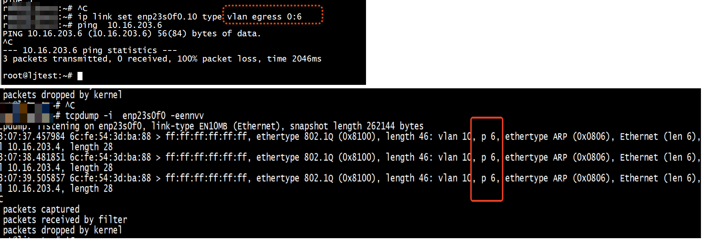

# test

```
ip link add link enp23s0f0  name enp23s0f0.10 type vlan id 10  egress-qos-map 0:3 1:0 2:0 3:0 4:0 5:0 6:0 7:0
ip link set enp23s0f0.10 type vlan egress 0:6
```




不需要 iptables   
```
 iptables -t mangle -A POSTROUTING -d  10.16.203.3 -j CLASSIFY --set-class 0:3
iptables --flush -t mangle 
```

```
for i in {0..7}; do ip link set dev eth1.100 type vlan egress-qos-map $i:3
```


```
#####INGRESS_PRIORITY####
Set that the voip VLAN (0.25) ingress priority is 0, the syntax will be:
ip link set eth0.25 type vlan ingress 0:0

Set that the servers VLAN (0.30) ingress priority is 2, then the syntax is:
ip link set eth0.30 type vlan ingress 0:2

#####EGRESS_PRIORITY####
Set that the voip VLAN (0.25) egress priority is 0, the syntax will be:
ip link set eth0.25 type vlan egress 0:0

Set that the servers VLAN (0.30) egress priority is 1, then the syntax is:
ip link set eth0.30 type vlan egress 2:1
```


```
# 举例：
iptables -t mangle -A OUTPUT -d 192.168.1.2 -j CLASSIFY --set-class 1:20
# -t mangle 指定 table 为 mangle
# -A 动作添加
# OUTPUT 指定 chain 为 OUTPUT
# -d 192.168.1.2 匹配包特征为目的为 192.168.1.2 
# -j CLASSIFY 指定 action 为 CLASSIFY
# --set-class 1:20 指定 CLASSIFY action 的额外参数 class=1:20
```