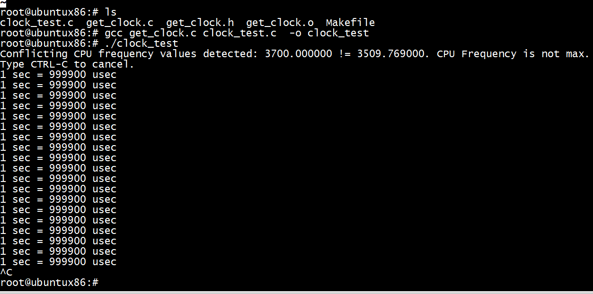

# x86
```
内核中的 rep_nop() 函数对 rep;nop 指令进行了包装：   
 
 static inline void rep_nop(void)   
 {   
 __asm__ __volatile__("rep;nop": : :"memory");   
 }   
 
 
 使用 rep_nop() 函数在内核中亦有样例：   
 static void delay_tsc(unsigned long loops)   
 {   
 unsigned long bclock, now;   
 
 preempt_disable();   
 rdtscl(bclock);   
 do {   
 rep_nop();   
 rdtscl(now);   
 } while ((now-bclock) < loops);   
 preempt_enable();   
 } 
```

# riscv

```
/* SPDX-License-Identifier: GPL-2.0-only */
#ifndef __ASM_VDSO_PROCESSOR_H
#define __ASM_VDSO_PROCESSOR_H

#ifndef __ASSEMBLY__

#include <asm/barrier.h>

static inline void cpu_relax(void)
{
#ifdef __riscv_muldiv
        int dummy;
        /* In lieu of a halt instruction, induce a long-latency stall. */
        __asm__ __volatile__ ("div %0, %0, zero" : "=r" (dummy));
#endif

#ifdef __riscv_zihintpause
        /*
         * Reduce instruction retirement.
         * This assumes the PC changes.
         */
        __asm__ __volatile__ ("pause");
#else
        /* Encoding of the pause instruction */
        __asm__ __volatile__ (".4byte 0x100000F");
#endif
        barrier();
}

#endif /* __ASSEMBLY__ */

#endif /* __ASM_VDSO_PROCESSOR_H */
```

# clock_test

```
root@ubuntux86:# gcc get_clock.c clock_test.c  -o clock_test
root@ubuntux86:# 
```
