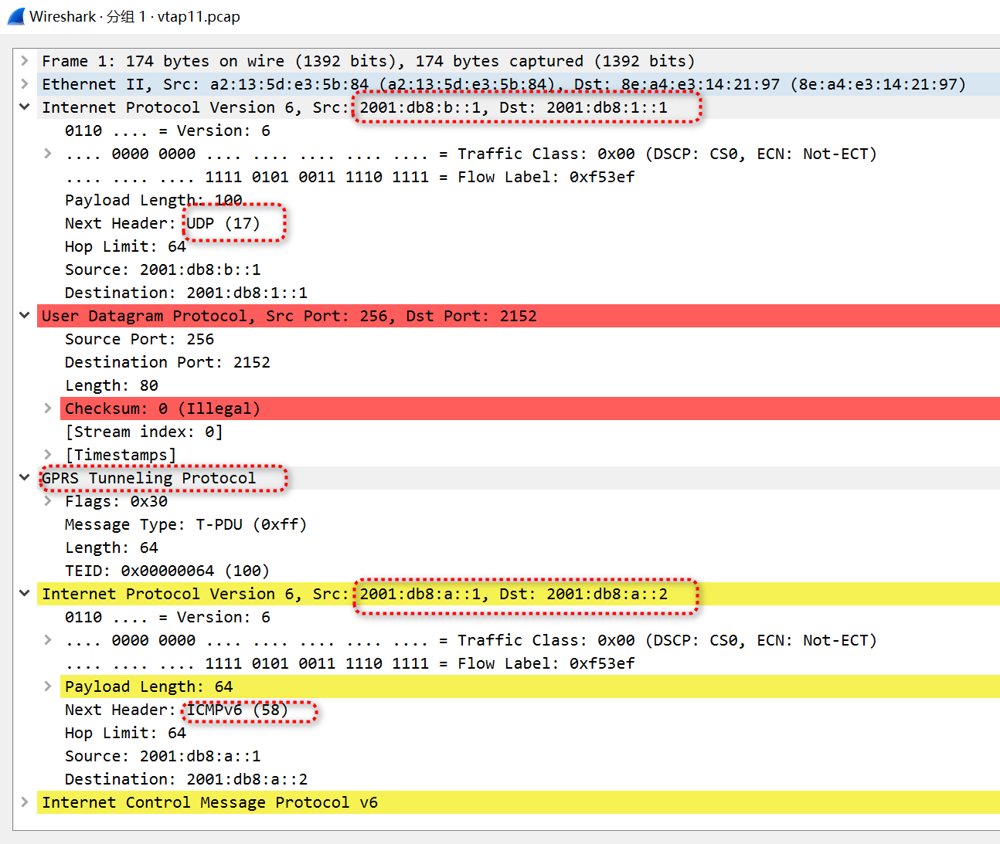
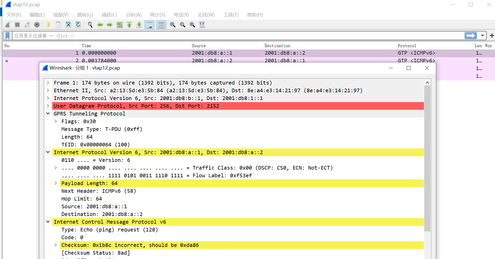
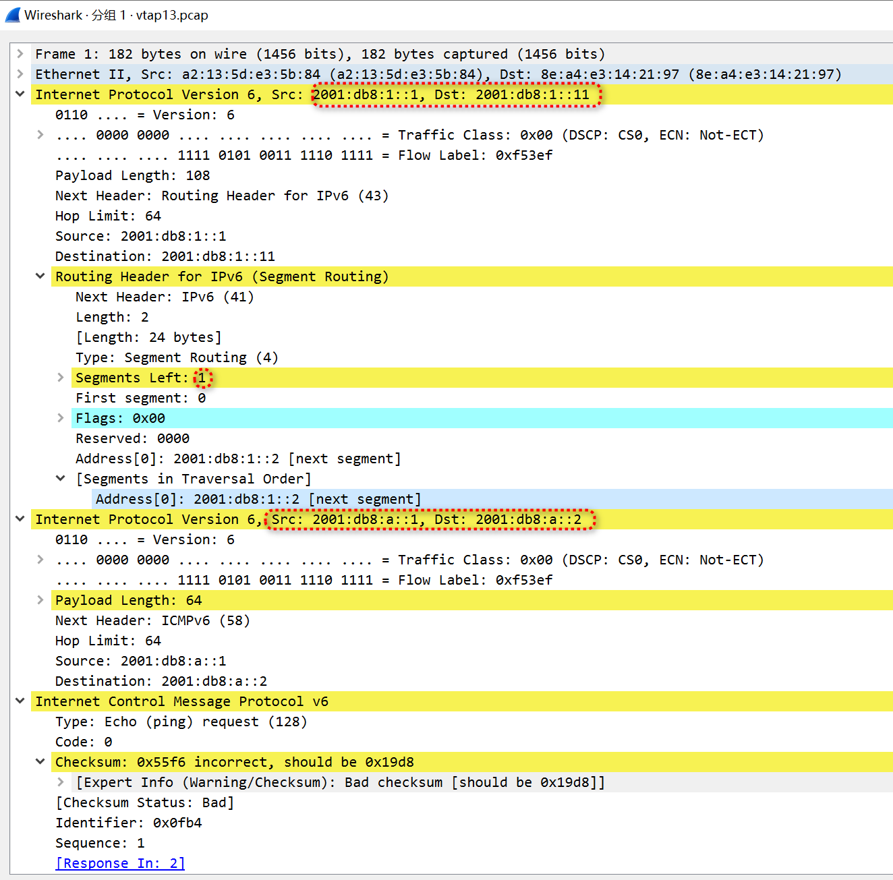
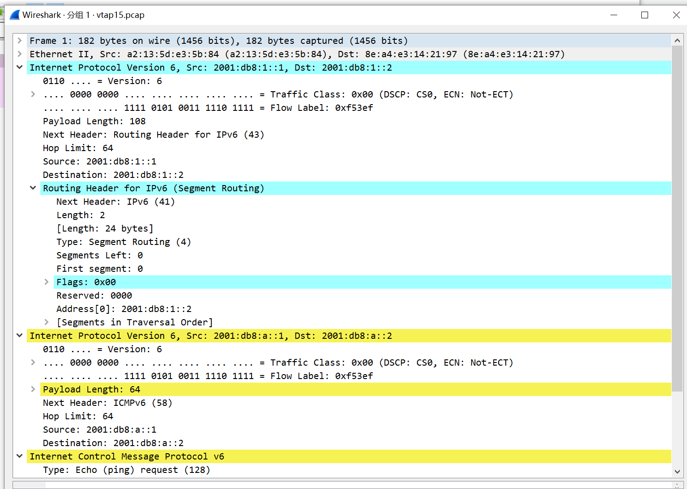
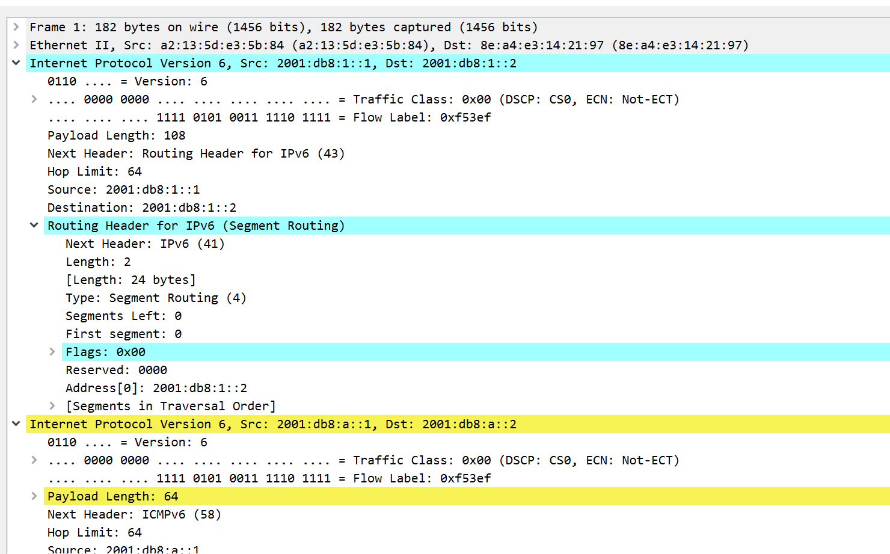
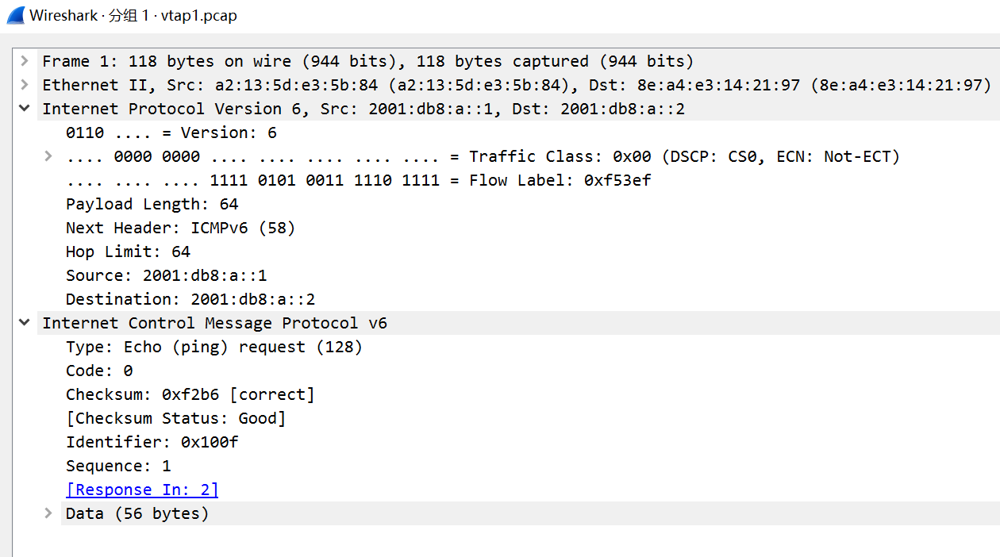

[dairui777/p4srv6](https://github.com/dairui777/p4srv6/tree/c5049a80ba366f0cacf20b8bfb88b21540150383)   


# 创建拓扑   
Run script ./tools/IPv6-GTP-Interworking.sh -c
       
Create 2 name spaces, host0 and host1.    
Create veth/vtap and vtap pairs: veth0/vtap0, veth1/vtap1, vtap(11/12,13/14,15/16)    
Assign veth0/1 to host0/1.    
```
./tools/IPv6-GTP-Interworking.sh -c
create_network
ip netns add host0
ip netns add host1
ip link add veth0 type veth peer name vtap0
ip link add veth1 type veth peer name vtap1
ip link add vtap11 type veth peer name vtap12
ip link set dev vtap11 up
ip link set dev vtap12 up
ip link add vtap13 type veth peer name vtap14
ip link set dev vtap13 up
ip link set dev vtap14 up
ip link add vtap15 type veth peer name vtap16
ip link set dev vtap15 up
ip link set dev vtap16 up
ip link set veth0 netns host0
ip link set veth1 netns host1
ip link set dev vtap0 up
ip link set dev vtap1 up
ip netns exec host0 ip link set veth0 up
ip netns exec host0 ifconfig lo up
ip netns exec host1 ip link set veth1 up
ip netns exec host1 ifconfig lo up
ip netns exec host0 ip addr add 172.20.0.1/24 dev veth0
ip netns exec host1 ip addr add 172.20.0.2/24 dev veth1
ip netns exec host0 ip -6 addr add 2001:db8:a::1/64 dev veth0
ip netns exec host1 ip -6 addr add 2001:db8:a::2/64 dev veth1
ip link set dev vtap0 up
ip link set dev vtap1 up
```

# 编译p4

```
p4c -x p4-14  p4-14/p4src/p4srv6.p4
p4-14/p4src/include/srv6.p4(381): [--Wwarn=invalid_header] warning: accessing a field of an invalid header hdr.ipv6_srh_segment_list[0]
 modify_field(ipv6.dstAddr, ipv6_srh_segment_list[0].sid);
                            ^^^^^^^^^^^^^^^^^^^^^^^^
```

# 运行交换机   


>> for gNB(GTP gateway)     
```
sudo simple_switch p4srv6.json -i 0@vtap0 -i 11@vtap11 \
--notifications-addr ipc:///tmp/bmv2-1-notifications.ipc \
--thrift-port 9091 \
--log-console -L debug -- nanolog ipc:///tmp/bm-1-log.ipc &
```
>> for SRv6    
```
sudo simple_switch p4srv6.json -i 1@vtap1 -i 12@vtap12 -i 13@vtap13 -i 14@vtap14 -i 15@vtap15 -i 16@vtap16 \
--notifications-addr ipc:///tmp/bmv2-0-notifications.ipc \
--thrift-port 9090 \
--log-console -L debug -- nanolog ipc:///tmp/bm-0-log.ipc &
```

# 下发流表

```
simple_switch_CLI  --thrift-port 9090 <  srv6.txt 
simple_switch_CLI  --thrift-port 9091 <  gnb.txt 
```

## srv6     

```
>> Upstream
table_add srv6_localsid srv6_End_M_GTP6_D2 2001:db8:1::1 => 2001:db8:1::1 2001:db8:1::11 2001:db8:1::2
table_add srv6_localsid srv6_End0 2001:db8:1::11 =>
table_add srv6_localsid srv6_End_DT6 2001:db8:1::2 =>
>> Downstream
// NG: table_add srv6_localsid srv6_T_Encaps_Red2 2001:db8:a::1 => 2001:db8:1::12 2001:db8:ff::64 2001:db8:b::1
table_add srv6_localsid srv6_T_Encaps_Red3 2001:db8:a::1 => 2001:db8:1::2 2001:db8:1::12 2001:db8:ff::64 2001:db8:b::1
// FIXME: This should be the same "srv6_End" as upstream.
table_add srv6_localsid srv6_End1 2001:db8:1::12 =>
table_add srv6_localsid srv6_End_M_GTP6_E 2001:db8:ff::64 => 2001:db8:ff::64
```


```
cat srv6.txt 
table_add fwd forward 12 => 13
table_add fwd forward 13 => 12
table_add fwd forward 14 => 15
table_add fwd forward 15 => 14
table_add fwd forward 16 =>  1
table_add fwd forward  1 => 16
table_add srv6_localsid srv6_End_M_GTP6_D2 2001:db8:1::1 => 2001:db8:1::1 2001:db8:1::11 2001:db8:1::2
table_add srv6_localsid srv6_End0 2001:db8:1::11 =>
table_add srv6_localsid srv6_End_DT6 2001:db8:1::2 =>
table_add srv6_localsid srv6_T_Encaps_Red3 2001:db8:a::1 => 2001:db8:1::2 2001:db8:1::12 2001:db8:ff::64 2001:db8:b::1
table_add srv6_localsid srv6_End1 2001:db8:1::12 =>
table_add srv6_localsid srv6_End_M_GTP6_E 2001:db8:ff::64 => 2001:db8:ff::64
```

## gNB

```
>> srcAddr, dstAddr, srcPort(0xaa), dstPort(2152:GTP-U), type(255:G-PDU), teid(100)
table_add gtpu_v6 gtpu_encap_v6 2001:db8:a::2 => 2001:db8:b::1 2001:db8:1::1 0x100 2152 255 100
table_add gtpu_v6 gtpu_decap_v6 2001:db8:b::1 =>
```


```
cat gnb.txt 
table_add fwd forward 0 => 11
table_add fwd forward 11 => 0
table_add gtpu_v6 gtpu_encap_v6 2001:db8:a::2 => 2001:db8:b::1 2001:db8:1::1 0x100 2152 255 100
table_add gtpu_v6 gtpu_decap_v6 2001:db8:b::1 =>
```


# 配置邻居表


```
root@ubuntux86:# ip netns exec host0 ip a
1: lo: <LOOPBACK,UP,LOWER_UP> mtu 65536 qdisc noqueue state UNKNOWN group default qlen 1000
    link/loopback 00:00:00:00:00:00 brd 00:00:00:00:00:00
    inet 127.0.0.1/8 scope host lo
       valid_lft forever preferred_lft forever
    inet6 ::1/128 scope host 
       valid_lft forever preferred_lft forever
6: veth0@if5: <BROADCAST,MULTICAST,UP,LOWER_UP> mtu 1500 qdisc noqueue state UP group default qlen 1000
    link/ether a2:13:5d:e3:5b:84 brd ff:ff:ff:ff:ff:ff link-netnsid 0
    inet 172.20.0.1/24 scope global veth0
       valid_lft forever preferred_lft forever
    inet6 2001:db8:a::1/64 scope global 
       valid_lft forever preferred_lft forever
    inet6 fe80::a013:5dff:fee3:5b84/64 scope link 
       valid_lft forever preferred_lft forever
root@ubuntux86:# ip netns exec host1 ip a
1: lo: <LOOPBACK,UP,LOWER_UP> mtu 65536 qdisc noqueue state UNKNOWN group default qlen 1000
    link/loopback 00:00:00:00:00:00 brd 00:00:00:00:00:00
    inet 127.0.0.1/8 scope host lo
       valid_lft forever preferred_lft forever
    inet6 ::1/128 scope host 
       valid_lft forever preferred_lft forever
8: veth1@if7: <BROADCAST,MULTICAST,UP,LOWER_UP> mtu 1500 qdisc noqueue state UP group default qlen 1000
    link/ether 8e:a4:e3:14:21:97 brd ff:ff:ff:ff:ff:ff link-netnsid 0
    inet 172.20.0.2/24 scope global veth1
       valid_lft forever preferred_lft forever
    inet6 2001:db8:a::2/64 scope global 
       valid_lft forever preferred_lft forever
    inet6 fe80::8ca4:e3ff:fe14:2197/64 scope link 
       valid_lft forever preferred_lft forever
root@ubuntux86:# ip netns exec host0 ip -6 neigh add 2001:db8:a::2 lladdr  8e:a4:e3:14:21:97 dev veth0
root@ubuntux86:# ip netns exec host1 ip -6 neigh add 2001:db8:a::1 lladdr a2:13:5d:e3:5b:84 dev veth1
```

# ping6   


```
root@ubuntux86:# ip netns exec host0 ping6 2001:db8:a::2
PING 2001:db8:a::2(2001:db8:a::2) 56 data bytes
64 bytes from 2001:db8:a::2: icmp_seq=1 ttl=64 time=6.38 ms
64 bytes from 2001:db8:a::2: icmp_seq=2 ttl=64 time=6.46 ms
^C
--- 2001:db8:a::2 ping statistics ---
2 packets transmitted, 2 received, 0% packet loss, time 1002ms
rtt min/avg/max/mdev = 6.383/6.421/6.460/0.038 ms
root@ubuntux86:# 
```

# action   
vtap0 ---gtpu_decap_v6---> vtap11 -->   vtap12   ---srv6_End_M_GTP6_D2--->  vtap13  ---> vtap14   ---srv6_End0 ---> vtap15  --->  vtap16 ---srv6_End_DT6 --->   vtap1


## gNB  gtpu_decap_v6     
   


##  srv6_End_M_GTP6_D2

   
   

##  srv6_End0
  

  

##  srv6_End_DT6

  

 