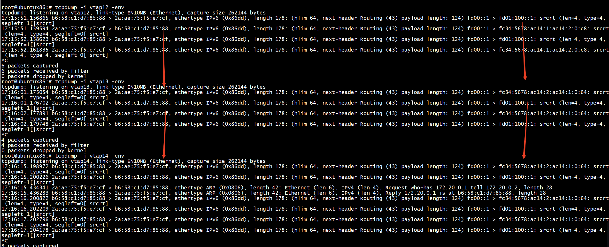

[How To run SRv6 Mobile Uplane POC](https://github.com/c3m3gyanesh/p4srv6/blob/4c0f8158d5da79a9f41d80d4c28718f19377ae4f/demo/srv6/demo1-SRv6MobileUplane-dropin.md) 


+ host1


```
 root@ubuntux86:# ip netns exec host1 ip r
172.20.0.0/24 dev veth1 proto kernel scope link src 172.20.0.1 
192.168.0.2 dev gtp1 scope link 
root@ubuntux86:# ip netns exec host1 ip a
1: lo: <LOOPBACK,UP,LOWER_UP> mtu 65536 qdisc noqueue state UNKNOWN group default qlen 1000
    link/loopback 00:00:00:00:00:00 brd 00:00:00:00:00:00
    inet 127.0.0.1/8 scope host lo
       valid_lft forever preferred_lft forever
    inet 192.168.0.1/32 scope global lo
       valid_lft forever preferred_lft forever
    inet6 ::1/128 scope host 
       valid_lft forever preferred_lft forever
2: gtp1: <POINTOPOINT,MULTICAST,NOARP,UP,LOWER_UP> mtu 1452 qdisc noqueue state UNKNOWN group default qlen 1000
    link/none 
    inet6 fe80::eaa9:9311:b9d5:82e0/64 scope link stable-privacy 
       valid_lft forever preferred_lft forever
62: veth1@if61: <BROADCAST,MULTICAST,UP,LOWER_UP> mtu 1500 qdisc noqueue state UP group default qlen 1000
    link/ether b6:58:c1:d7:85:88 brd ff:ff:ff:ff:ff:ff link-netnsid 0
    inet 172.20.0.1/24 scope global veth1
       valid_lft forever preferred_lft forever
    inet6 fd01::1/64 scope global 
       valid_lft forever preferred_lft forever
    inet6 fe80::b458:c1ff:fed7:8588/64 scope link 
       valid_lft forever preferred_lft forever
root@ubuntux86:# ip netns exec host1 gtp-tunnel list
gtp1 version 1 tei 200/100 ms_addr 192.168.0.2 sgsn_addr 172.20.0.2
```

+ host2    
```
root@ubuntux86:# ip netns exec host2 ip r
172.20.0.0/24 dev veth2 proto kernel scope link src 172.20.0.2 
192.168.0.1 dev gtp2 scope link 
root@ubuntux86:# ip netns exec host2 ip a
1: lo: <LOOPBACK,UP,LOWER_UP> mtu 65536 qdisc noqueue state UNKNOWN group default qlen 1000
    link/loopback 00:00:00:00:00:00 brd 00:00:00:00:00:00
    inet 127.0.0.1/8 scope host lo
       valid_lft forever preferred_lft forever
    inet 192.168.0.2/32 scope global lo
       valid_lft forever preferred_lft forever
    inet6 ::1/128 scope host 
       valid_lft forever preferred_lft forever
2: gtp2: <POINTOPOINT,MULTICAST,NOARP,UP,LOWER_UP> mtu 1452 qdisc noqueue state UNKNOWN group default qlen 1000
    link/none 
    inet6 fe80::ba3f:18f4:5d7c:55da/64 scope link stable-privacy 
       valid_lft forever preferred_lft forever
64: veth2@if63: <BROADCAST,MULTICAST,UP,LOWER_UP> mtu 1500 qdisc noqueue state UP group default qlen 1000
    link/ether 2a:ae:75:f5:e7:cf brd ff:ff:ff:ff:ff:ff link-netnsid 0
    inet 172.20.0.2/24 scope global veth2
       valid_lft forever preferred_lft forever
    inet6 fd01::2/64 scope global 
       valid_lft forever preferred_lft forever
    inet6 fe80::28ae:75ff:fef5:e7cf/64 scope link 
       valid_lft forever preferred_lft forever
root@ubuntux86:# ip netns exec host2  gtp-tunnel list
gtp2 version 1 tei 100/200 ms_addr 192.168.0.1 sgsn_addr 172.20.0.1
root@ubuntux86:# 
```


```
root@ubuntux86:# ip netns exec host1 ping 192.168.0.2
PING 192.168.0.2 (192.168.0.2) 56(84) bytes of data.
64 bytes from 192.168.0.2: icmp_seq=1 ttl=64 time=4.71 ms
^C
--- 192.168.0.2 ping statistics ---
1 packets transmitted, 1 received, 0% packet loss, time 0ms
rtt min/avg/max/mdev = 4.713/4.713/4.713/0.000 ms
root@ubuntux86:# 
```


+ tcpdump vatp11   

+ tcpdump vatp14     

+ tcpdump veth1    


+ GPRS Tunnelling Protocol T-PDU      

In GTP we can see there are two planes.

GTP Control Plane ( GTP-C)   
GTP User Plane (GTP-U)    
GTP-C packet is sent through the UDP port 2123   
GTP-U packet is sent through the UDP port 2152     
    
# libgtpnl
```
$ git clone git://git.osmocom.org/libgtpnl.git
$ cd libgtpnl
 autoreconf -fi
 ./configure  --prefix=/opt/gtp
 make -j8
 root@ubuntux86:# ls /opt/gtp
bin  include  lib
root@ubuntux86:# 
```
```
export PATH=$PATH:/opt/gtp/bin/
```
# topo

```
root@ubuntux86:# ./demo/srv6/ns-hosts-srv6-demo1.sh -c
create_network
ip netns add host1
ip netns add host2
ip link add veth1 type veth peer name vtap1
ip link add veth2 type veth peer name vtap2
ip link add vtap11 type veth peer name vtap12
ip link add vtap13 type veth peer name vtap14
ip link set veth1 netns host1
ip link set veth2 netns host2
ip netns exec host1 ip addr add 172.20.0.1/24 dev veth1
ip netns exec host1 ip -6 addr add fd01::1/64 dev veth1
ip netns exec host2 ip addr add 172.20.0.2/24 dev veth2
ip netns exec host2 ip -6 addr add fd01::2/64 dev veth2
ip netns exec host1 ip link set veth1 up
ip netns exec host1 ip link set lo up
ip netns exec host2 ip link set veth2 up
ip netns exec host2 ip link set lo up
ip link set dev vtap1 up
ip link set dev vtap2 up
ip link set dev vtap11 up
ip link set dev vtap12 up
ip link set dev vtap13 up
ip link set dev vtap14 up
root@ubuntux86:# 
```

# p4 switch

```
root@ubuntux86:# p4c --target bmv2 --arch v1model  p4src/switch.p4
./archive/p4src/switch.p4(154): [--Wwarn=unused] warning: Table local_mac is not used; removing
    table local_mac {
          ^^^^^^^^^
root@ubuntux86:# find ./ -name ns-hosts-srv6-demo1.sh
./archive/demo/srv6/ns-hosts-srv6-demo1.sh
root@ubuntux86:# ./archive/demo/srv6/ns-hosts-srv6-demo1.sh -c
```


```
 simple_switch switch.json -i 1@vtap1 -i 2@vtap2 -i 11@vtap11 -i 12@vtap12 -i 13@vtap13 -i 14@vtap14 --nanolog ipc:///tmp/bm-0-log.ipc --log-console -L debug --notifications-addr ipc:///tmp/bmv2-0-notifications.ipc
```


```
simple_switch_CLI  < fw.txt 
simple_switch_CLI  < srv6-2.txt 
```


```
root@ubuntux86:# ip netns exec host1 ping 172.20.0.2
PING 172.20.0.2 (172.20.0.2) 56(84) bytes of data.
64 bytes from 172.20.0.2: icmp_seq=1 ttl=64 time=5.84 ms
64 bytes from 172.20.0.2: icmp_seq=2 ttl=64 time=4.45 ms
^C
--- 172.20.0.2 ping statistics ---
2 packets transmitted, 2 received, 0% packet loss, time 1002ms
rtt min/avg/max/mdev = 4.450/5.145/5.841/0.695 ms
root@ubuntux86:# ip netns exec host1 ping6 fd01::2
PING fd01::2(fd01::2) 56 data bytes
64 bytes from fd01::2: icmp_seq=1 ttl=64 time=6.64 ms
64 bytes from fd01::2: icmp_seq=2 ttl=64 time=5.99 ms
^C
--- fd01::2 ping statistics ---
2 packets transmitted, 2 received, 0% packet loss, time 1002ms
rtt min/avg/max/mdev = 5.992/6.315/6.638/0.323 ms
root@ubuntux86:# 
```

# gtp   
```
export PATH=$PATH:/opt/gtp/bin/
```

## shell1

```
root@ubuntux86:# cat gtp-set.sh 
ip netns exec host1 ip addr add 192.168.0.1/32 dev lo
ip netns exec host1 gtp-link add gtp1 ip &
ip netns exec host1 gtp-tunnel add gtp1 v1 200 100 192.168.0.2 172.20.0.2
ip netns exec host1 ip route add 192.168.0.2/32 dev gtp1

ip netns exec host2 ip addr add 192.168.0.2/32 dev lo
ip netns exec host2 gtp-link add gtp2 ip &
ip netns exec host2 gtp-tunnel add gtp2 v1 100 200 192.168.0.1 172.20.0.1
ip netns exec host2 ip route add 192.168.0.1/32 dev gtp2
root@ubuntux86:# 
```

## ping


```
root@ubuntux86:# ip netns exec host2 ping 192.168.0.1
PING 192.168.0.1 (192.168.0.1) 56(84) bytes of data.
64 bytes from 192.168.0.1: icmp_seq=1 ttl=64 time=5.45 ms
64 bytes from 192.168.0.1: icmp_seq=2 ttl=64 time=5.15 ms
64 bytes from 192.168.0.1: icmp_seq=3 ttl=64 time=5.66 ms
^C
--- 192.168.0.1 ping statistics ---
3 packets transmitted, 3 received, 0% packet loss, time 2003ms
rtt min/avg/max/mdev = 5.148/5.417/5.655/0.208 ms
root@ubuntux86:# ip netns exec host1 ping 192.168.0.2
PING 192.168.0.2 (192.168.0.2) 56(84) bytes of data.
64 bytes from 192.168.0.2: icmp_seq=1 ttl=64 time=2.95 ms
64 bytes from 192.168.0.2: icmp_seq=2 ttl=64 time=5.45 ms
64 bytes from 192.168.0.2: icmp_seq=3 ttl=64 time=5.83 ms
^C
--- 192.168.0.2 ping statistics ---
3 packets transmitted, 3 received, 0% packet loss, time 2003ms
rtt min/avg/max/mdev = 2.945/4.740/5.827/1.278 ms
root@ubuntux86:# 
```

# control flow   

```
table_add srv6_transit_udp t_m_tmap_sid1 2152 => 0xfc345678 0xfd000000000000000000000000000001 0xfd010100000000000000000000000001
table_add srv6_end end 0xfd010100000000000000000000000001&&&0xFFFFFFFFFFFFFFFFFFFFFFFFFFFFFFFF => 100
table_add srv6_end end_m_gtp4_e 0xfc345678000000000000000000000000&&&0xFFFFFFFF000000000000000000000000 => 100
```

```
>>> import ipaddress 
>>> print(ipaddress.ip_address(0xfc345678)) 
252.52.86.120
>>> print(ipaddress.ip_address(0xfd010100000000000000000000000001)) 
fd01:100::1
>>> print(ipaddress.ip_address(0xfd000000000000000000000000000001)) 
fd00::1
>>> 
```
