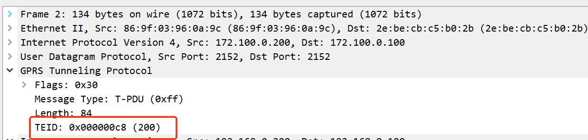
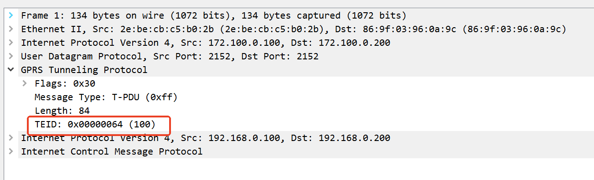

# Simple GTP Gateway example

This example make use of libgtpnl from osmocom to create a GTP tunnel
and send some traffic.

## Install dependencies

```console
apt-get update && apt-get install -y autoconf libtool pkg-config
```

## Setup

First, get the example:

```console
git clone https://github.com/abousselmi/gtp-gw.git
cd gtp-gw
```

Second, you need to clone libgtpnl and compile it:

```console
git clone https://git.osmocom.org/libgtpnl
cd libgtpnl
autoreconf -fi
./configure  --prefix=/opt/gtp
make -j8
make install

```

```
export PATH=$PATH:/opt/gtp/bin/
```

Now we need to copy the example script where we have the gtp wrappers:

```console
cp ../gtpgw.sh ./tools
cd tools
```

Now you can run the example and enjoy:

```console
./gtpgw.sh start
```

To destroy everything, you can do:

```console
./gtpgw.sh stop
```

## Sample output

```console
./gtpgw.sh start
[INFO] create veth pairs
[INFO] create network namespaces
[INFO] attribute each veth pair to its correspondent netns
[INFO] set ip addresses of veth pairs and loopbacks
[INFO] enable veth and lo interfaces
[INFO] create gtp devices (run in bg mode)
[INFO] configure mtu of gtp devices
WARNING: attaching dummy socket descriptors. Keep this process running for testing purposes.
WARNING: attaching dummy socket descriptors. Keep this process running for testing purposes.
[INFO] create gtp tunnels
[INFO] version 1 tei 200/100 ms_addr 192.168.0.200 sgsn_addr 172.100.0.200
[INFO] version 1 tei 100/200 ms_addr 192.168.0.100 sgsn_addr 172.100.0.100
[INFO] configure routes using gtp devices

You can go for e.g.:
  ip netns exec ns-gtp-100 ping 192.168.0.200
  ip netns exec ns-gtp-200 ping 192.168.0.100

Using tshark you will see ICMP pckets encapsulated in GTP
```
##  ns-gtp-200
```
root@ubuntux86:# ip netns exec ns-gtp-100 ip a
1: lo: <LOOPBACK,UP,LOWER_UP> mtu 65536 qdisc noqueue state UNKNOWN group default qlen 1000
    link/loopback 00:00:00:00:00:00 brd 00:00:00:00:00:00
    inet 127.0.0.1/8 scope host lo
       valid_lft forever preferred_lft forever
    inet 192.168.0.100/32 scope global lo
       valid_lft forever preferred_lft forever
    inet6 ::1/128 scope host 
       valid_lft forever preferred_lft forever
2: gtp-100: <POINTOPOINT,MULTICAST,NOARP,UP,LOWER_UP> mtu 1500 qdisc noqueue state UNKNOWN group default qlen 1000
    link/none 
    inet6 fe80::7021:449:c2a7:1548/64 scope link stable-privacy 
       valid_lft forever preferred_lft forever
20: veth-100@if19: <BROADCAST,MULTICAST,UP,LOWER_UP> mtu 1500 qdisc noqueue state UP group default qlen 1000
    link/ether 2e:be:cb:c5:b0:2b brd ff:ff:ff:ff:ff:ff link-netns ns-gtp-200
    inet 172.100.0.100/24 scope global veth-100
       valid_lft forever preferred_lft forever
    inet6 fe80::2cbe:cbff:fec5:b02b/64 scope link 
       valid_lft forever preferred_lft forever
```
192.168.0.100是lo的ip    


路由    
```
$NS1_EXEC ip route add $NS2_LO_CIDR dev $GTP_DEV1
```

```
root@ubuntux86:# ip netns exec ns-gtp-200 ip r
172.100.0.0/24 dev veth-200 proto kernel scope link src 172.100.0.200 
192.168.0.100 dev gtp-200 scope link 
root@ubuntux86:# 
```
gtp-tunnel 路由   
```
root@ubuntux86:# ip netns exec ns-gtp-200 gtp-tunnel list
gtp-200 version 1 tei 100/200 ms_addr 192.168.0.100 sgsn_addr 172.100.0.100
root@ubuntux86:# ip netns exec ns-gtp-100 gtp-tunnel list
gtp-100 version 1 tei 200/100 ms_addr 192.168.0.200 sgsn_addr 172.100.0.200
root@ubuntux86:# 
```


## ns-gtp-200
```
root@ubuntux86:# ip netns exec ns-gtp-200 ip a
1: lo: <LOOPBACK,UP,LOWER_UP> mtu 65536 qdisc noqueue state UNKNOWN group default qlen 1000
    link/loopback 00:00:00:00:00:00 brd 00:00:00:00:00:00
    inet 127.0.0.1/8 scope host lo
       valid_lft forever preferred_lft forever
    inet 192.168.0.200/32 scope global lo
       valid_lft forever preferred_lft forever
    inet6 ::1/128 scope host 
       valid_lft forever preferred_lft forever
2: gtp-200: <POINTOPOINT,MULTICAST,NOARP,UP,LOWER_UP> mtu 1500 qdisc noqueue state UNKNOWN group default qlen 1000
    link/none 
    inet6 fe80::5c34:ada0:df25:ac27/64 scope link stable-privacy 
       valid_lft forever preferred_lft forever
19: veth-200@if20: <BROADCAST,MULTICAST,UP,LOWER_UP> mtu 1500 qdisc noqueue state UP group default qlen 1000
    link/ether 86:9f:03:96:0a:9c brd ff:ff:ff:ff:ff:ff link-netns ns-gtp-100
    inet 172.100.0.200/24 scope global veth-200
       valid_lft forever preferred_lft forever
    inet6 fe80::849f:3ff:fe96:a9c/64 scope link 
       valid_lft forever preferred_lft forever
root@ubuntux86:# 
```

## ping   
```
root@ubuntux86:# ip netns exec ns-gtp-100 ping 192.168.0.200
PING 192.168.0.200 (192.168.0.200) 56(84) bytes of data.
64 bytes from 192.168.0.200: icmp_seq=1 ttl=64 time=0.059 ms
64 bytes from 192.168.0.200: icmp_seq=2 ttl=64 time=0.079 ms
64 bytes from 192.168.0.200: icmp_seq=3 ttl=64 time=0.087 ms
^C
--- 192.168.0.200 ping statistics ---
3 packets transmitted, 3 received, 0% packet loss, time 2055ms
rtt min/avg/max/mdev = 0.059/0.075/0.087/0.011 ms
root@ubuntux86:# ip netns exec ns-gtp-200 ping 192.168.0.100
PING 192.168.0.100 (192.168.0.100) 56(84) bytes of data.
64 bytes from 192.168.0.100: icmp_seq=1 ttl=64 time=0.067 ms
64 bytes from 192.168.0.100: icmp_seq=2 ttl=64 time=0.062 ms
64 bytes from 192.168.0.100: icmp_seq=3 ttl=64 time=0.050 ms
^C
--- 192.168.0.100 ping statistics ---
3 packets transmitted, 3 received, 0% packet loss, time 2048ms
rtt min/avg/max/mdev = 0.050/0.059/0.067/0.007 ms
```


# teid

  



## Credits

- [Kentaro Ebisawa libgtpnl (gtpc) tutorial](https://www.slideshare.net/kentaroebisawa/using-gtp-on-linux-with-libgtpnl)
- [osmocom gtpu](https://osmocom.org/projects/linux-kernel-gtp-u/wiki)
- [osmocom gtpc](https://osmocom.org/projects/linux-kernel-gtp-u/wiki/Libgtpnl)

