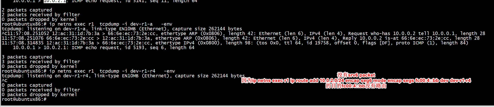

# test1


```
root@ubuntux86:# ip netns exec r1 ip a
3: dev-r1-r4@if2: <BROADCAST,MULTICAST,UP,LOWER_UP> mtu 1500 qdisc noqueue state UP group default qlen 1000
    link/ether 0e:ea:91:a9:9d:96 brd ff:ff:ff:ff:ff:ff link-netns r4
    inet6 2001:14::1/64 scope global 
       valid_lft forever preferred_lft forever
    inet6 fe80::cea:91ff:fea9:9d96/64 scope link 
       valid_lft forever preferred_lft forever
root@ubuntux86:#
```

```
net.ipv6.conf.lo.seg6_enabled = 1
root@ubuntux86:# ip netns exec host-a ping 10.0.2.1
PING 10.0.2.1 (10.0.2.1) 56(84) bytes of data.
64 bytes from 10.0.2.1: icmp_seq=1 ttl=63 time=0.259 ms
64 bytes from 10.0.2.1: icmp_seq=2 ttl=63 time=0.129 ms
64 bytes from 10.0.2.1: icmp_seq=3 ttl=63 time=0.130 ms
^C
--- 10.0.2.1 ping statistics ---
3 packets transmitted, 3 received, 0% packet loss, time 2041ms
rtt min/avg/max/mdev = 0.129/0.172/0.259/0.061 ms
root@ubuntux86:# 
```

删除一条如下路由，2001:14::2是route1 dev-r1-r4连接的route4 dev-4-r1   
```
ip netns exec r1 ip -6 route del fc00:4::bb/128 via 2001:14::2
```

 


添加路由   

```
root@ubuntux86:# ip netns exec r1 ip -6 route add fc00:4::bb/128 via 2001:14::2
root@ubuntux86:# ip netns exec host-a ping 10.0.2.1
PING 10.0.2.1 (10.0.2.1) 56(84) bytes of data.
64 bytes from 10.0.2.1: icmp_seq=1 ttl=63 time=0.201 ms
64 bytes from 10.0.2.1: icmp_seq=2 ttl=63 time=0.131 ms
^C
--- 10.0.2.1 ping statistics ---
2 packets transmitted, 2 received, 0% packet loss, time 1013ms
rtt min/avg/max/mdev = 0.131/0.166/0.201/0.035 ms
root@ubuntux86:# 
```