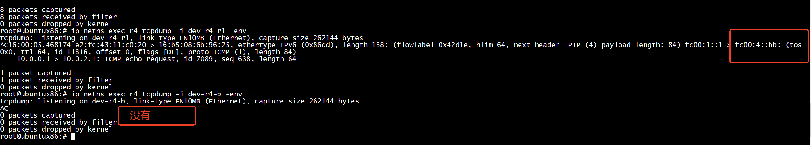
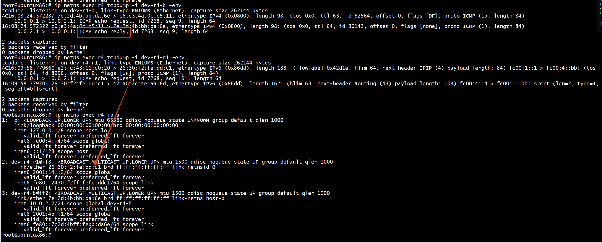
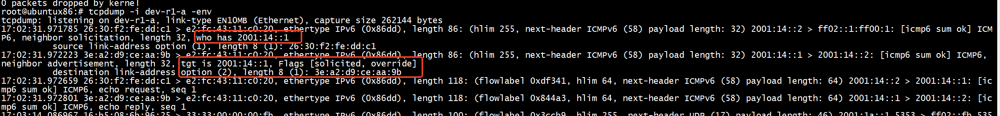

#  usid_encap_1_v4
```
    action usid_encap_1_v4(ipv6_addr_t src_addr, ipv6_addr_t s1) {
        hdr.ipv6.setValid();

        hdr.ipv6.version = 6;
        hdr.ipv6.traffic_class = hdr.ipv4.dscp ++ hdr.ipv4.ecn; 
        hash(hdr.ipv6.flow_label, 
                HashAlgorithm.crc32, 
                (bit<20>) 0, 
                { 
                    hdr.ipv4.src_addr,
                    hdr.ipv4.dst_addr,
                    local_metadata.ip_proto,
                    local_metadata.l4_src_port,
                    local_metadata.l4_dst_port
                },
                (bit<20>) 1048575);
        hdr.ipv6.payload_len = hdr.ipv4.total_len;
        hdr.ipv6.next_hdr = PROTO_IP_IN_IP;
        hdr.ipv6.hop_limit = hdr.ipv4.ttl;
        hdr.ipv6.src_addr = src_addr;
        hdr.ipv6.dst_addr = s1;

        hdr.ethernet.ether_type = ETHERTYPE_IPV6;
    }
```

# 启动交换机

```
p4c -x p4-16 main.p4 
```

```
simple_switch main.json -i 0@dev-r1-a -i 1@dev-r1-r4 --log-console -L debug -- nanolog ipc:///tmp/bm-0-log.ipc --notifications-addr ipc:///tmp/bmv2-0-notifications.ipc

```


# bug


dev-r4-r1上可以抓到srv6报文（fc00:1::1 > fc00:4::4:），但是 dev-r4-b上没有报文   
```
root@ubuntux86:# ip netns exec r4 tcpdump -i dev-r4-r1 -env
tcpdump: listening on dev-r4-r1, link-type EN10MB (Ethernet), capture size 262144 bytes
^C15:51:18.108102 e2:fc:43:11:c0:20 > 16:b5:08:6b:96:25, ethertype IPv6 (0x86dd), length 138: (flowlabel 0x42d1e, hlim 64, next-header IPIP (4) payload length: 84) fc00:1::1 > fc00:4::4: (tos 0x0, ttl 64, id 12224, offset 0, flags [DF], proto ICMP (1), length 84)
    10.0.0.1 > 10.0.2.1: ICMP echo request, id 7089, seq 123, length 64
15:51:19.132196 e2:fc:43:11:c0:20 > 16:b5:08:6b:96:25, ethertype IPv6 (0x86dd), length 138: (flowlabel 0x42d1e, hlim 64, next-header IPIP (4) payload length: 84) fc00:1::1 > fc00:4::4: (tos 0x0, ttl 64, id 12363, offset 0, flags [DF], proto ICMP (1), length 84)
    10.0.0.1 > 10.0.2.1: ICMP echo request, id 7089, seq 124, length 64

2 packets captured
2 packets received by filter
0 packets dropped by kernel
root@ubuntux86:# ip netns exec r4 tcpdump -i dev-r4-b -env
tcpdump: listening on dev-r4-b, link-type EN10MB (Ethernet), capture size 262144 bytes
^C
0 packets captured
0 packets received by filter
0 packets dropped by kernel
````


```
root@ubuntux86:# ip netns exec r4 ip a
1: lo: <LOOPBACK,UP,LOWER_UP> mtu 65536 qdisc noqueue state UNKNOWN group default qlen 1000
    link/loopback 00:00:00:00:00:00 brd 00:00:00:00:00:00
    inet 127.0.0.1/8 scope host lo
       valid_lft forever preferred_lft forever
    inet6 fc00:4::4/64 scope global 
       valid_lft forever preferred_lft forever
    inet6 ::1/128 scope host 
       valid_lft forever preferred_lft forever
2: dev-r4-r1@if8: <BROADCAST,MULTICAST,UP,LOWER_UP> mtu 1500 qdisc noqueue state UP group default qlen 1000
    link/ether 26:30:f2:fe:dd:c1 brd ff:ff:ff:ff:ff:ff link-netnsid 0
    inet6 2001:14::2/64 scope global 
       valid_lft forever preferred_lft forever
    inet6 fe80::2430:f2ff:fefe:ddc1/64 scope link 
       valid_lft forever preferred_lft forever
3: dev-r4-b@if2: <BROADCAST,MULTICAST,UP,LOWER_UP> mtu 1500 qdisc noqueue state UP group default qlen 1000
    link/ether 7e:2d:4b:bb:da:6e brd ff:ff:ff:ff:ff:ff link-netns host-b
    inet 10.0.2.2/24 scope global dev-r4-b
       valid_lft forever preferred_lft forever
    inet6 2001:4b::1/64 scope global 
       valid_lft forever preferred_lft forever
    inet6 fe80::7c2d:4bff:febb:da6e/64 scope link 
       valid_lft forever preferred_lft forever
```
查看路由发现dst ipv6 = fc00:4::bb 的srv6报文才会做action End.DX4 nh4,也就是srv6封装ipv4的dst ipv6出错      
fc00:1::1 > fc00:4::4:
```
root@ubuntux86:# ip netns exec r4 ip -6 r
2001:14::/64 dev dev-r4-r1 proto kernel metric 256 pref medium
2001:4b::/64 dev dev-r4-b proto kernel metric 256 pref medium
fc00:1::bb via 2001:14::1 dev dev-r4-r1 metric 1024 pref medium
fc00:4::bb  encap seg6local action End.DX4 nh4 10.0.2.1 dev dev-r4-b metric 1024 pref medium
fc00:4::/64 dev lo proto kernel metric 256 pref medium
fe80::/64 dev dev-r4-r1 proto kernel metric 256 pref medium
fe80::/64 dev dev-r4-b proto kernel metric 256 pref medium
default via 2001:4b::2 dev dev-r4-b metric 1024 pref medium
root@ubuntux86:# 
```
dst ipv6 = fc00:4::bb设置成功后，dev-r4-b上还是抓不到报文，原因是目的mac=16:b5:08:6b:96:25和dev-r4-r1 mac = 26:30:f2:fe:dd:c1不匹配     


```
 dev-r4-r1@if8: <BROADCAST,MULTICAST,UP,LOWER_UP> mtu 1500 qdisc noqueue state UP group default qlen 1000
    link/ether 26:30:f2:fe:dd:c1 brd ff:ff:ff:ff:ff:ff link-netnsid 0
    inet6 2001:14::2/64 scope global 
       valid_lft forever preferred_lft forever
    inet6 fe80::2430:f2ff:fefe:ddc1/64 scope link 
       valid_lft forever preferred_lft forever
```



```
root@ubuntux86:# ip netns exec r4 tcpdump -i dev-r4-r1 -env
tcpdump: listening on dev-r4-r1, link-type EN10MB (Ethernet), capture size 262144 bytes
^C16:00:05.468174 e2:fc:43:11:c0:20 > 16:b5:08:6b:96:25, ethertype IPv6 (0x86dd), length 138: (flowlabel 0x42d1e, hlim 64, next-header IPIP (4) payload length: 84) fc00:1::1 > fc00:4::bb: (tos 0x0, ttl 64, id 11816, offset 0, flags [DF], proto ICMP (1), length 84)
    10.0.0.1 > 10.0.2.1: ICMP echo request, id 7089, seq 638, length 64

1 packet captured
1 packet received by filter
0 packets dropped by kernel
root@ubuntux86:# ip netns exec r4 tcpdump -i dev-r4-b -env
tcpdump: listening on dev-r4-b, link-type EN10MB (Ethernet), capture size 262144 bytes
^C
0 packets captured
0 packets received by filter
0 packets dropped by kernel
```



# rule   

```
root@ubuntux86:# cat srv6.txt 
table_add IngressPipeImpl.fwd forward 0 => 1 0x2630f2feddc1
table_add IngressPipeImpl.fwd forward 1 => 0 0xe2fc4311c020
table_add IngressPipeImpl.srv6_encap_v4 IngressPipeImpl.usid_encap_1_v4 10.0.2.1/32 => fc00:1::1  fc00:4::bb
table_add IngressPipeImpl.srv6_localsid_table srv6_end_dx4 fc00:1::bb/128 0
root@ubuntux86:# 
```


```
root@ubuntux86:# simple_switch_CLI  < srv6.txt 
Obtaining JSON from switch...
Done
Control utility for runtime P4 table manipulation
RuntimeCmd: Adding entry to exact match table IngressPipeImpl.fwd
match key:           EXACT-00:00
action:              forward
runtime data:        00:01      26:30:f2:fe:dd:c1
Entry has been added with handle 0
RuntimeCmd: Adding entry to exact match table IngressPipeImpl.fwd
match key:           EXACT-00:01
action:              forward
runtime data:        00:00      e2:fc:43:11:c0:20
Entry has been added with handle 1
RuntimeCmd: Adding entry to lpm match table IngressPipeImpl.srv6_encap_v4
match key:           LPM-0a:00:02:01/32
action:              IngressPipeImpl.usid_encap_1_v4
runtime data:        fc:00:00:01:00:00:00:00:00:00:00:00:00:00:00:01    fc:00:00:04:00:00:00:00:00:00:00:00:00:00:00:bb
Entry has been added with handle 0
RuntimeCmd: Adding entry to lpm match table IngressPipeImpl.srv6_localsid_table
match key:           LPM-fc:00:00:01:00:00:00:00:00:00:00:00:00:00:00:bb/128
action:              srv6_end_dx4
runtime data:        
Entry has been added with handle 0
RuntimeCmd: 
root@ubuntux86:# 
```

# ipv6 邻居请求
fc00:1::bb via 2001:14::1 dev dev-r4-r1 metric 1024 pref medium 会请求dev-r1-r4（dev-r1-r4）的邻居请求   
```
2: dev-r4-r1@if10: <BROADCAST,MULTICAST,UP,LOWER_UP> mtu 1500 qdisc noqueue state UP group default qlen 1000
    link/ether b2:dd:4d:6b:33:b5 brd ff:ff:ff:ff:ff:ff link-netnsid 0
    inet6 2001:14::2/64 scope global 
       valid_lft forever preferred_lft forever
    inet6 fe80::b0dd:4dff:fe6b:33b5/64 scope link 
       valid_lft forever preferred_lft forever
root@ubuntux86:# ip netns exec r4 ip -6 r | grep 2001:14::1
fc00:1::bb via 2001:14::1 dev dev-r4-r1 metric 1024 pref medium
root@ubuntux86:# ip netns exec r4 ip -6 n
fe80::94e1:81ff:fe1c:4afd dev dev-r4-r1 lladdr e2:fc:43:11:c0:20 router STALE
fe80::e07f:79ff:fefb:cfca dev dev-r4-r1 lladdr 16:b5:08:6b:96:25 STALE
fe80::d0eb:13ff:fe5d:7eea dev dev-r4-r1 lladdr d2:eb:13:5d:7e:ea STALE
2001:14::1 dev dev-r4-r1 lladdr d2:eb:13:5d:7e:ea STALE
root@ubuntux86:#
```

```
14: dev-r1-r4@if2: <BROADCAST,MULTICAST,UP,LOWER_UP> mtu 1500 qdisc noqueue state UP group default qlen 1000
    link/ether d2:eb:13:5d:7e:ea brd ff:ff:ff:ff:ff:ff link-netns r4
    inet6 2001:14::1/64 scope global 
       valid_lft forever preferred_lft forever
    inet6 fe80::d0eb:13ff:fe5d:7eea/64 scope link 
       valid_lft forever preferred_lft forever
```
***dev-r1-a竟然收到2001:14::1的邻居请求***


代码没有设置ndp_reply_table，也就是丢给协议栈去处理   
```
        if (hdr.icmpv6.isValid() && hdr.icmpv6.type == ICMP6_TYPE_NS) {
            ndp_reply_table.apply();
        }
```

2001:14::1邻居通过协议栈去处理    
```
root@ubuntux86:# ip netns exec r4 ip -6 n
fe80::f467:8eff:febd:7c7d dev dev-r4-r1 lladdr 16:b5:08:6b:96:25 STALE
fe80::3ca2:d9ff:fece:aa9b dev dev-r4-r1 lladdr 3e:a2:d9:ce:aa:9b DELAY
2001:14::1 dev dev-r4-r1 lladdr 3e:a2:d9:ce:aa:9b REACHABLE
fe80::e4ba:51ff:feea:97b dev dev-r4-r1 lladdr e2:fc:43:11:c0:20 router REACHABLE
root@ubuntux86:# 
```

# 结果验证


```
root@ubuntux86:# ip netns exec host-a ping 10.0.2.1
PING 10.0.2.1 (10.0.2.1) 56(84) bytes of data.
64 bytes from 10.0.2.1: icmp_seq=1 ttl=64 time=1.60 ms
64 bytes from 10.0.2.1: icmp_seq=2 ttl=64 time=2.50 ms
64 bytes from 10.0.2.1: icmp_seq=3 ttl=64 time=2.70 ms
64 bytes from 10.0.2.1: icmp_seq=4 ttl=64 time=2.54 ms
^C
--- 10.0.2.1 ping statistics ---
4 packets transmitted, 4 received, 0% packet loss, time 3006ms
rtt min/avg/max/mdev = 1.599/2.337/2.702/0.432 ms
root@ubuntux86:# 
```