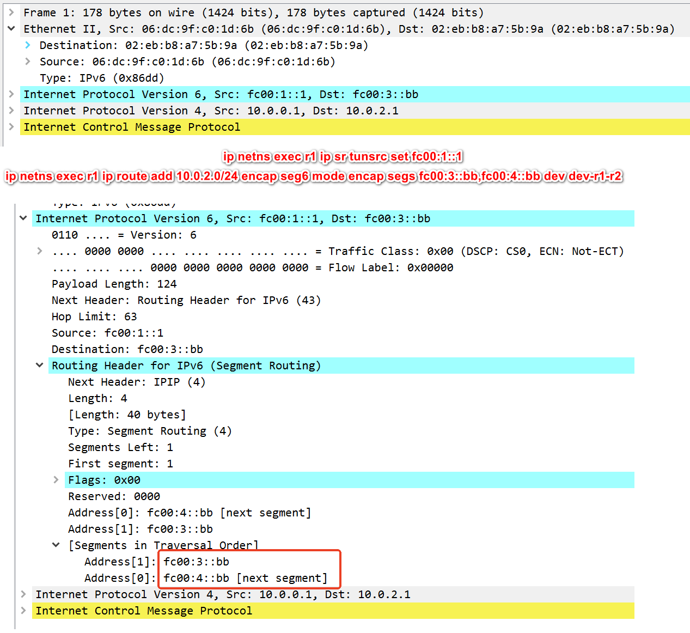

# 测试


```
ip netns exec host-a ping 10.0.2.1
PING 10.0.2.1 (10.0.2.1) 56(84) bytes of data.
64 bytes from 10.0.2.1: icmp_seq=1 ttl=63 time=0.145 ms
64 bytes from 10.0.2.1: icmp_seq=2 ttl=63 time=0.149 ms
^C
--- 10.0.2.1 ping statistics ---
2 packets transmitted, 2 received, 0% packet loss, time 1009ms
rtt min/avg/max/mdev = 0.145/0.147/0.149/0.002 ms
root@ubuntux86:# ip netns exec host-a ping 10.0.1.1
PING 10.0.1.1 (10.0.1.1) 56(84) bytes of data.
From 10.0.0.2 icmp_seq=1 Destination Net Unreachable
From 10.0.0.2 icmp_seq=2 Destination Net Unreachable
From 10.0.0.2 icmp_seq=3 Destination Net Unreachable
^C
--- 10.0.1.1 ping statistics ---
3 packets transmitted, 0 received, +3 errors, 100% packet loss, time 2034ms

root@ubuntux86:# 
```


## host1


```
root@ubuntux86:# ip netns exec host-a ip a
1: lo: <LOOPBACK> mtu 65536 qdisc noop state DOWN group default qlen 1000
    link/loopback 00:00:00:00:00:00 brd 00:00:00:00:00:00
2: dev-a-r1@if2: <BROADCAST,MULTICAST,UP,LOWER_UP> mtu 1500 qdisc noqueue state UP group default qlen 1000
    link/ether 22:9a:28:94:77:fe brd ff:ff:ff:ff:ff:ff link-netns r1
    inet 10.0.0.1/24 scope global dev-a-r1
       valid_lft forever preferred_lft forever
    inet6 2001:1a::2/64 scope global 
       valid_lft forever preferred_lft forever
    inet6 fe80::209a:28ff:fe94:77fe/64 scope link 
       valid_lft forever preferred_lft forever
```


+ 路由   
```
ip netns exec host-a ip route add 10.0.1.0/24 via 10.0.0.2
ip netns exec host-a ip route add 10.0.2.0/24 via 10.0.0.2
```

```
root@ubuntux86:# ip netns exec host-a ip r
10.0.0.0/24 dev dev-a-r1 proto kernel scope link src 10.0.0.1 
10.0.1.0/24 via 10.0.0.2 dev dev-a-r1 
10.0.2.0/24 via 10.0.0.2 dev dev-a-r1 
root@ubuntux86:# ip netns exec host-a ip -6  r
2001:1a::/64 dev dev-a-r1 proto kernel metric 256 pref medium
fe80::/64 dev dev-a-r1 proto kernel metric 256 pref medium
root@ubuntux86:# 
```

+ host-a ping4 request 在router1封装成srv6 packet1  

   

```
ip netns exec r1 ip route add 10.0.2.0/24 encap seg6 mode encap segs fc00:3::bb,fc00:4::bb dev dev-r1-r2
```

+ srv6 packet1在route1上路由    

从dev-r1-r2出口

```
default via 2001:12::2 dev dev-r1-r2 metric 1024 pref medium
```


```
root@ubuntux86:# ip netns exec r1 ip -6 route
2001:12::/64 dev dev-r1-r2 proto kernel metric 256 pref medium
2001:14::/64 dev dev-r1-r4 proto kernel metric 256 pref medium
2001:1a::/64 dev dev-r1-a proto kernel metric 256 pref medium
fc00:1::bb  encap seg6local action End.DX4 nh4 10.0.0.1 dev dev-r1-a metric 1024 pref medium
fc00:1::/64 dev lo proto kernel metric 256 pref medium
fe80::/64 dev dev-r1-a proto kernel metric 256 pref medium
fe80::/64 dev dev-r1-r2 proto kernel metric 256 pref medium
fe80::/64 dev dev-r1-r4 proto kernel metric 256 pref medium
default via 2001:12::2 dev dev-r1-r2 metric 1024 pref medium
root@ubuntux86:# ip netns exec r1 ip -4 route
10.0.0.0/24 dev dev-r1-a proto kernel scope link src 10.0.0.2 
10.0.2.0/24  encap seg6 mode encap segs 2 [ fc00:3::bb fc00:4::bb ] dev dev-r1-r2 scope link 
root@ubuntux86:# 
```

+ router2 收到srv6 packet1 根据如下路由转发,转发到route3     


```
fc00:3::/64 via 2001:23::2 dev dev-r2-r3 metric 1024 pref medium
```


```
root@ubuntux86:# ip netns exec r2 ip -6 route
2001:12::/64 dev dev-r2-r1 proto kernel metric 256 pref medium
2001:23::/64 dev dev-r2-r3 proto kernel metric 256 pref medium
2001:24::/64 dev dev-r2-r4 proto kernel metric 256 pref medium
fc00:1::/64 via 2001:12::1 dev dev-r2-r1 metric 1024 pref medium
fc00:2::/64 dev lo proto kernel metric 256 pref medium
fc00:3::/64 via 2001:23::2 dev dev-r2-r3 metric 1024 pref medium
fe80::/64 dev dev-r2-r1 proto kernel metric 256 pref medium
fe80::/64 dev dev-r2-r3 proto kernel metric 256 pref medium
fe80::/64 dev dev-r2-r4 proto kernel metric 256 pref medium
```

+ router3 收到srv6 packet1 根据如下路由转发,做srv6 End     

fc00:3::bb  encap seg6local action End dev dev-r3-r4 metric 1024 pref medium
```
root@ubuntux86:# ip netns exec r3 ip -6 route
2001:23::/64 dev dev-r3-r2 proto kernel metric 256 pref medium
2001:34::/64 dev dev-r3-r4 proto kernel metric 256 pref medium
2001:3c::/64 dev dev-r3-c proto kernel metric 256 pref medium
fc00:3::bb  encap seg6local action End dev dev-r3-r4 metric 1024 pref medium
fc00:3::/64 dev lo proto kernel metric 256 pref medium
fc00:4::/64 via 2001:34::2 dev dev-r3-r4 metric 1024 pref medium
fe80::/64 dev dev-r3-r2 proto kernel metric 256 pref medium
fe80::/64 dev dev-r3-c proto kernel metric 256 pref medium
fe80::/64 dev dev-r3-r4 proto kernel metric 256 pref medium
default via 2001:23::1 dev dev-r3-r2 metric 1024 pref medium
root@ubuntux86:# 
```


 

+ router4 收到srv6 packet1 根据如下路由转发,向做srv6 End.DX4 nh4，然后做ip4转发      


```
fc00:4::bb  encap seg6local action End.DX4 nh4 10.0.2.1 dev dev-r4-b metric 1024 pref medium
default via 10.0.2.1 dev dev-r4-b 
```
   
 
 
```
root@ubuntux86:# ip netns exec r4 ip -6 route
2001:14::/64 dev dev-r4-r1 proto kernel metric 256 pref medium
2001:24::/64 dev dev-r4-r2 proto kernel metric 256 pref medium
2001:34::/64 dev dev-r4-r3 proto kernel metric 256 pref medium
2001:4b::/64 dev dev-r4-b proto kernel metric 256 pref medium
fc00:1::bb via 2001:14::1 dev dev-r4-r1 metric 1024 pref medium
fc00:4::bb  encap seg6local action End.DX4 nh4 10.0.2.1 dev dev-r4-b metric 1024 pref medium
fc00:4::/64 dev lo proto kernel metric 256 pref medium
fe80::/64 dev dev-r4-r1 proto kernel metric 256 pref medium
fe80::/64 dev dev-r4-r2 proto kernel metric 256 pref medium
fe80::/64 dev dev-r4-r3 proto kernel metric 256 pref medium
fe80::/64 dev dev-r4-b proto kernel metric 256 pref medium
default via 2001:4b::2 dev dev-r4-b metric 1024 pref medium
root@ubuntux86:# ip netns exec r4 ip -4 route
default via 10.0.2.1 dev dev-r4-b 
10.0.0.0/24  encap seg6 mode encap segs 1 [ fc00:1::bb ] dev dev-r4-r1 scope link 
10.0.2.0/24 dev dev-r4-b proto kernel scope link src 10.0.2.2 
root@ubuntux86:# 
```

# host-b ping4 reply

   
 
 
 ```
 root@ubuntux86:# ip netns exec host-b ip -4 route
10.0.0.0/24 via 10.0.2.2 dev dev-b-r4 
10.0.2.0/24 dev dev-b-r4 proto kernel scope link src 10.0.2.1 
root@ubuntux86:# 
 ```
 
+ host-b ping4 reply在router4上做如下转发     
 ```
 10.0.0.0/24  encap seg6 mode encap segs 1 [ fc00:1::bb ] dev dev-r4-r1 scope link 
 ```
 
    