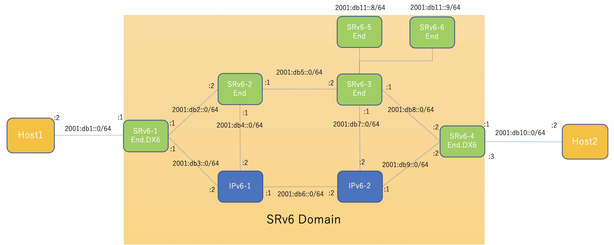

# srv6-netns-demo
[One touch Build SRv6 Network Namespace](https://github.com/vn-cdr/srv6-netns-demo/tree/master)    
 
# Topology


## Run 
```
sudo su -
bash scripts/01_create-namespaces.sh
bash scripts/04_create_srv6.sh
```

## how to use

```
# ping from host1 to host2
ip netns exec host1 ping6 2001:db10::2

# tcpdump sample 
# Topology を参考にパケット収集したい veth を指定してください
ip netns exec srv6-2 tcpdump -i veth-sr2-sr3
```
```
root@ubuntux86:# ip netns exec host1 ping6 2001:db10::2
PING 2001:db10::2(2001:db10::2) 56 data bytes
From 2001:db1::1 icmp_seq=1 Destination unreachable: No route
From 2001:db1::1 icmp_seq=2 Destination unreachable: No route
From 2001:db1::1 icmp_seq=3 Destination unreachable: No route
^C
--- 2001:db10::2 ping statistics ---
3 packets transmitted, 0 received, +3 errors, 100% packet loss, time 2040ms
```

### Demo1

```
## Demo1用にルーティングテーブル変更
ip netns exec srv6-1 ip -6 rule add to 2001:db10::/64 lookup localsid1
ip netns exec srv6-4 ip -6 rule add to 2001:db1::/64 lookup localsid1
```

### Demo2

```
## Demo2用にルーティングテーブル変更
ip netns exec srv6-4 ip -6 rule add to 2001:db1::/64 lookup localsid2
```

### Demo3

```
## Demo3用にルーティングテーブル変更
ip netns exec srv6-1 ip -6 rule add to 2001:db10::/64 lookup localsid2
```

### Demo4

```
## Demo4用にルーティングテーブル変更
ip netns exec srv6-1 ip -6 rule add to 2001:db10::/64 lookup localsid3
```
