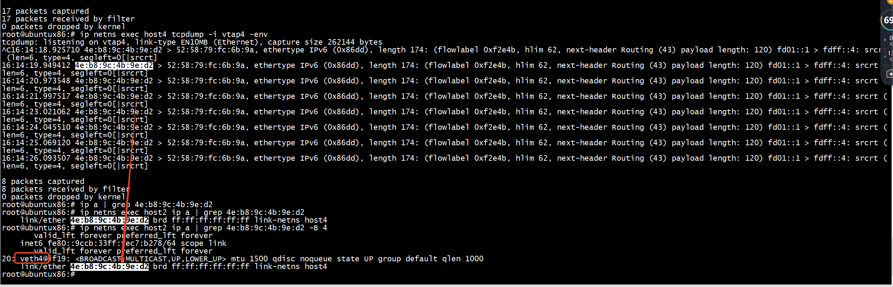
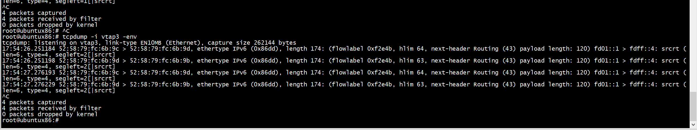
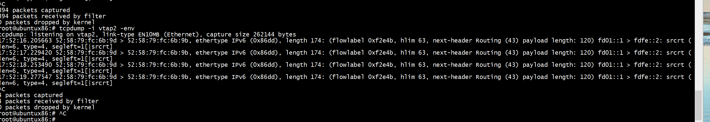

# 参考项目

 
[https://github.com/ebiken/p4srv6/tree/c5049a80ba366f0cacf20b8bfb88b21540150383/archive/demo/srv6/end.am ](https://github.com/ebiken/p4srv6/tree/c5049a80ba366f0cacf20b8bfb88b21540150383/archive/demo/srv6/end.am )
 
# compile p4


```
root@ubuntux86:# pwd
/work/ovs_p4/p4c_demo/p4srv6/archive
root@ubuntux86:# p4c --target bmv2 --arch v1model p4src/switch.p4
p4src/switch.p4(154): [--Wwarn=unused] warning: Table local_mac is not used; removing
    table local_mac {
          ^^^^^^^^^

```


# network topo

```
./archive/demo/srv6/end.am/ns-hosts-srv6-end-am.sh -c
```

+ 路由
```
root@ubuntux86:# ip netns exec host1 ip -6 route add fdff::4/128 encap seg6 mode inline segs fd01::ff,fdfe::2 dev veth1
root@ubuntux86:# ip netns exec host2 ip -6 route add fdfe::2 encap seg6local action End dev veth4
```

+ proxy mac
```
root@ubuntux86:# ip netns exec host1 ip -6 neigh add fd01::ff lladdr 00:11:22:33:44:55 nud permanent dev veth1
```
删除
```
ip netns exec host1 ip -6 neigh del fd01::ff  dev veth1
```
+ veth3 --> veth2   mac    

```
root@ubuntux86:# ip netns exec host3 ip -6 neigh add fd01::02 lladdr 52:58:79:fc:6b:9b nud permanent dev veth3
root@ubuntux86:# 
```

+ 补充  
```
ip netns exec host4 ifconfig vtap4 hw ether  52:58:79:fc:6b:9a
ip netns exec host2 ifconfig veth2 hw ether 52:58:79:fc:6b:9b
ip netns exec host1 ifconfig veth1 hw ether 52:58:79:fc:6b:9c
ip netns exec host3 ifconfig veth3 hw ether 52:58:79:fc:6b:9d
ip netns exec host1 ip -6 neigh add fdff::4 lladdr 52:58:79:fc:6b:9a nud permanent dev veth1
ip netns exec host4 ip -6 neigh add fd01::1 lladdr 52:58:79:fc:6b:9c nud permanent dev vtap4
ip netns exec host2 ip -6 neigh add fd01::03 lladdr 52:58:79:fc:6b:9d nud permanent dev veth2
ip netns exec host3 ip -6 neigh add fd01::01 lladdr 52:58:79:fc:6b:9c nud permanent dev veth3
ip netns exec host2 ip -6 neigh add fd01::ff lladdr 00:11:22:33:44:55 nud permanent dev veth2

```

删除mac   
```
ip netns exec host3 ip -6 neigh del fd01::01  dev veth3
ip netns exec host3 ip -6 neigh del fd01::02  dev veth3
```

+ 删除


```
root@ubuntux86:# ./archive/demo/srv6/end.am/ns-hosts-srv6-end-am.sh -d
destroy_network
ip link del vtap1
ip link del vtap2
ip link del vtap3
ip netns exec host4 ip link del vtap4
ip netns del host1
ip netns del host2
ip netns del host3
ip netns del host4
root@ubuntux86:# 
```


# run p4


```
simple_switch switch.json -i 1@vtap1 -i 2@vtap2 -i 3@vtap3 --nanolog \
ipc:///tmp/bm-0-log.ipc --log-console -L debug --notifications-addr \
ipc:///tmp/bmv2-0-notifications.ipc
```


# rule


```
root@ubuntux86:# simple_switch_CLI  < srv6.txt 
Obtaining JSON from switch...
Done
Control utility for runtime P4 table manipulation
RuntimeCmd: Adding entry to exact match table portfwd
match key:           EXACT-00:01
action:              set_egress_port
runtime data:        00:02
Entry has been added with handle 0
RuntimeCmd: Adding entry to exact match table portfwd
match key:           EXACT-00:02
action:              set_egress_port
runtime data:        00:01
Entry has been added with handle 1
RuntimeCmd: Adding entry to ternary match table srv6_end
match key:           TERNARY-fd:01:00:00:00:00:00:00:00:00:00:00:00:00:00:ff &&& ff:ff:ff:ff:ff:ff:ff:ff:ff:ff:ff:ff:ff:ff:ff:ff
action:              end_am
runtime data:        00:03      56:1f:6a:a0:de:06
Entry has been added with handle 0
RuntimeCmd: Adding entry to exact match table srv6_end_iif
match key:           EXACT-00:03
action:              end_am_d
runtime data:        00:02
Entry has been added with handle 0
RuntimeCmd: 
root@ubuntux86:# cat srv6.txt 
table_add portfwd set_egress_port 1 => 2
table_add portfwd set_egress_port 2 => 1
table_add srv6_end end_am 0xfd0100000000000000000000000000ff&&&0xFFFFFFFFFFFFFFFFFFFFFFFFFFFFFFFF => 3 0x561f6aa0de06 100
table_add srv6_end_iif end_am_d 3 => 2
root@ubuntux86:#
```

# tcpdump   

veth1-->vtap1-->vtap3 --> veth2 -->veth4 -->vtap4    






以下操作不需要配置
```
root@ubuntux86:# ip netns exec host4 ip -6 route add fd01::ff encap seg6local action End dev vtap4
root@ubuntux86:# ip netns exec host4 ip -6 route add fdff::4 encap seg6local action End dev vtap4
```

#  SRv6 PSP and End.AM with a modified linux kernel   

***You can use PSP flavor of End function, which will pop SRH on host2, to test end to end pin6***
This document describes how to play SRv6 PSP and End.AM with a modified linux kernel, which was implemented for Interop Tokyo 2019 ShowNet.

The enhancements are:
- End.AM (Masquerading proxy)
- PSP (penultimate segment POP of the SRH) for End, End.X, and End.T
- End.AC (Caching proxy, designed in ShowNet 2019, and its detail will be presented soon)

We are currently working for brushing up patches to try upstream ;)
 
## source code and install
- kernel source: https://github.com/upa/linux/tree/seg6-shownet
- iproutee2: https://github.com/upa/iproute2/tree/seg6-shownet

To install the kernel, please follow the instructions provided by distributions you use.
If you use debian-based distributions, we provide a kernel deb package http://web.sfc.wide.ad.jp/~upa/linux-image-5.1.0-rc7-seg6-shownet+_034_amd64.deb.

#### replace kernel
```shell-session
# on debian-based distribution,
$ wget http://web.sfc.wide.ad.jp/~upa/linux-image-5.1.0-rc7-seg6-shownet+_034_amd64.deb
$ sudo dpkg -i linux-image-5.1.0-rc7-seg6-shownet+_034_amd64.deb
$ sudo reboot

# then your machine will boot with the modified kernel.
```

#### install modified iproute2
```shell-session
# install the modified iproute2 that is capable of seg6local PSP and End.AM configurations.
$ sudo apt install flex bison pkg-config
$ git clone https://github.com/upa/iproute2 -b seg6-shownet
$ cd iproute2
$ ./configure
$ make
$ sudo make install

# then, the ip command is installed on /sbin/ip.
# Please use it instead of the default ip command installed on /bin/ip.
```

## Configuration

#### PSP

The modified iproute2 and kernel accept `endflavor` option for seg6local action End, End.X, and End.T.
Argument is `none` or `psp`. `none` means SRH is not popped, and `psp` means SRH is popped if updated SL is 0.

For example,

```shell-session
$ sudo ip -6 route add 2001:db8:6:e2:: encap seg6local action End.T table 254 endflavor psp dev ve2a
$ sudo ip -6 route add 2001:db8:6:ef:: encap seg6local action End.T table 254 endflavor none dev ve2a
 
$ ip -6 r s | grep  seg6local
2001:db8:6:e2::  encap seg6local action End.T table 254 endflavor psp dev ve2a metric 1024 pref medium
2001:db8:6:ef::  encap seg6local action End.T table 254 endflavor none dev ve2a metric 1024 pref medium

```

#### End.AM

End.AM is composed of two parts: Masquerading and De-masquerading. These two parts cannot be implemented as a single route entry,
therefore, we implemented it as two seperated seg6local actions.

*End.AM.E* is the masquerading part (.E means Egress). IF NH = SRH & SL > 0, update the IPv6 DA with SRH[0]. 
It is configured by:
```shell-session
$ sudo ip -6 route add 2001:db8:6:1:: encap seg6local action End.AM.E oif v11a mac 0a:c3:b8:cb:8d:84 dev v11a  
$ ip -6 r s | grep AM
2001:db8:6:1::  encap seg6local action End.AM.E oif v11a mac 0a:c3:b8:cb:8d:84 dev v11a metric 1024 pref medium
```
Masqueraded IPv6 packets are tranmistted through oif v11a to dst mac 0a:c3:b8:cb:8d:84.


*End.AM.I.T* is the de-masqueading part (.I means Ingress). IF NH=SRH & SL > 0, decrement SL and update the IPv6 DA with SRH[SL].
It is configured by:
```shell-session
$ sudo ip -6 route add table 101 default encap seg6local action End.AM.I.T table 254 dev v12a                
$ ip -6 r s table 101
default  encap seg6local action End.AM.I.T table 254 dev v12a metric 1024 pref medium

$ sudo ip -6 rule add iif v12a table 101
```

The configuration of End.AM.I.T requires two steps. Masqueraded IPv6 packets may have arbitrary destination IPv6 addresses,
which are the original destinations. Thus, we need to use ::/0 for the destination prefix of the End.AM.I.T route entry.
To isolated the default route from the default routing table (254), the End.AM.I.T route should be installed on other routing tables,
table 101 for instance in the example. In addition, use `ip rule` to use the table for incoming masqueraded IPv6 packets.
`ip -6 rule add iif v12a table 101` means incoming IPv6 packets are processed on table 101 that has the End.AM.I.T route
as the default route. l3mdev (VRF) could achieve this isolation (but I have not tested yet).


by using these enhancements, you can play End.AM with inline SRH mode.