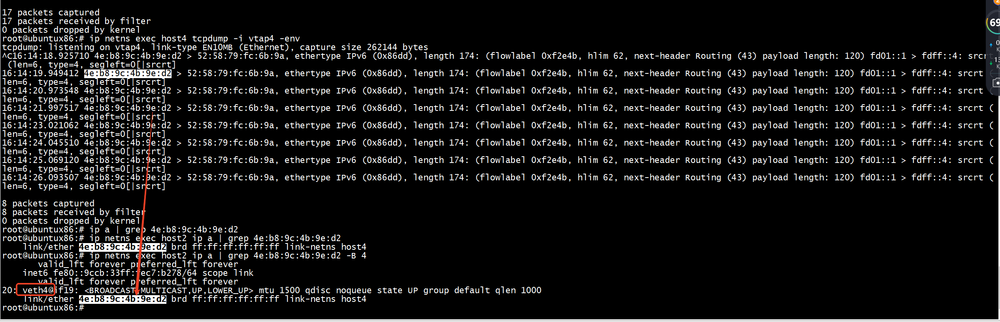

# compile p4


```
root@ubuntux86:# pwd
/work/ovs_p4/p4c_demo/p4srv6/archive
root@ubuntux86:# p4c --target bmv2 --arch v1model p4src/switch.p4
p4src/switch.p4(154): [--Wwarn=unused] warning: Table local_mac is not used; removing
    table local_mac {
          ^^^^^^^^^

```


# network topo

```
./archive/demo/srv6/end.am/ns-hosts-srv6-end-am.sh -c
```

+ 路由
```
root@ubuntux86:# ip netns exec host1 ip -6 route add fdff::4/128 encap seg6 mode inline segs fd01::ff,fdfe::2 dev veth1
root@ubuntux86:# ip netns exec host2 ip -6 route add fdfe::2 encap seg6local action End dev veth4
```

+ proxy mac
```
root@ubuntux86:# ip netns exec host1 ip -6 neigh add fd01::ff lladdr 00:11:22:33:44:55 nud permanent dev veth1
```
+ veth3 --> veth2   mac    

```
root@ubuntux86:# ip netns exec host3 ip -6 neigh add fd01::02 lladdr 52:58:79:fc:6b:9b nud permanent dev veth3
root@ubuntux86:# 
```

+ 补充  
```
ip netns exec host4 ifconfig vtap4 hw ether  52:58:79:fc:6b:9a
ip netns exec host2 ifconfig veth2 hw ether 52:58:79:fc:6b:9b
ip netns exec host1 ifconfig veth1 hw ether 52:58:79:fc:6b:9c
ip netns exec host3 ifconfig veth3 hw ether 52:58:79:fc:6b:9d
ip netns exec host1 ip -6 neigh add fdff::4 lladdr 52:58:79:fc:6b:9a nud permanent dev veth1
ip netns exec host4 ip -6 neigh add fd01::1 lladdr 52:58:79:fc:6b:9c nud permanent dev vtap4
ip netns exec host2 ip -6 neigh add fd01::03 lladdr 52:58:79:fc:6b:9d nud permanent dev veth2
ip netns exec host3 ip -6 neigh add fd01::01 lladdr 52:58:79:fc:6b:9c nud permanent dev veth3
ip netns exec host2 ip -6 neigh add fd01::ff lladdr 00:11:22:33:44:55 nud permanent dev veth2

```

+ 删除


```
root@ubuntux86:# ./archive/demo/srv6/end.am/ns-hosts-srv6-end-am.sh -d
destroy_network
ip link del vtap1
ip link del vtap2
ip link del vtap3
ip netns exec host4 ip link del vtap4
ip netns del host1
ip netns del host2
ip netns del host3
ip netns del host4
root@ubuntux86:# 
```


# run p4


```
simple_switch switch.json -i 1@vtap1 -i 2@vtap2 -i 3@vtap3 --nanolog \
ipc:///tmp/bm-0-log.ipc --log-console -L debug --notifications-addr \
ipc:///tmp/bmv2-0-notifications.ipc
```


# rule


```
root@ubuntux86:# simple_switch_CLI  < srv6.txt 
Obtaining JSON from switch...
Done
Control utility for runtime P4 table manipulation
RuntimeCmd: Adding entry to exact match table portfwd
match key:           EXACT-00:01
action:              set_egress_port
runtime data:        00:02
Entry has been added with handle 0
RuntimeCmd: Adding entry to exact match table portfwd
match key:           EXACT-00:02
action:              set_egress_port
runtime data:        00:01
Entry has been added with handle 1
RuntimeCmd: Adding entry to ternary match table srv6_end
match key:           TERNARY-fd:01:00:00:00:00:00:00:00:00:00:00:00:00:00:ff &&& ff:ff:ff:ff:ff:ff:ff:ff:ff:ff:ff:ff:ff:ff:ff:ff
action:              end_am
runtime data:        00:03      56:1f:6a:a0:de:06
Entry has been added with handle 0
RuntimeCmd: Adding entry to exact match table srv6_end_iif
match key:           EXACT-00:03
action:              end_am_d
runtime data:        00:02
Entry has been added with handle 0
RuntimeCmd: 
root@ubuntux86:# cat srv6.txt 
table_add portfwd set_egress_port 1 => 2
table_add portfwd set_egress_port 2 => 1
table_add srv6_end end_am 0xfd0100000000000000000000000000ff&&&0xFFFFFFFFFFFFFFFFFFFFFFFFFFFFFFFF => 3 0x561f6aa0de06 100
table_add srv6_end_iif end_am_d 3 => 2
root@ubuntux86:#
```

# tcpdump   

veth1-->vtap1-->vtap3 --> veth2 -->veth4 -->vtap4    

