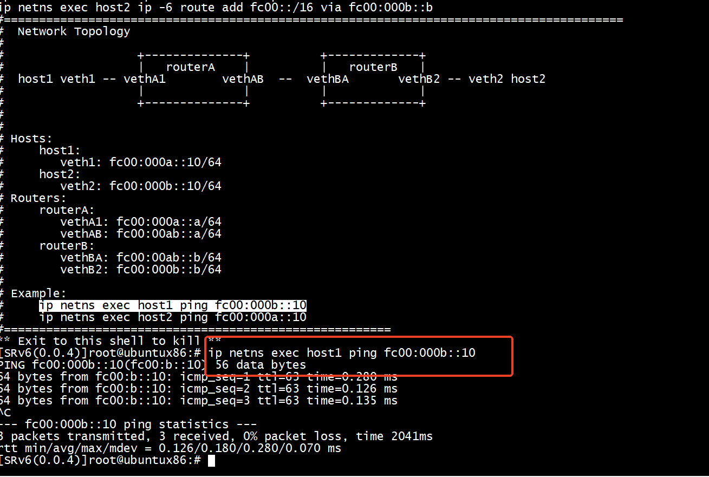
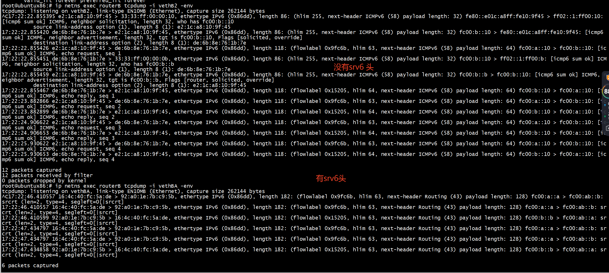
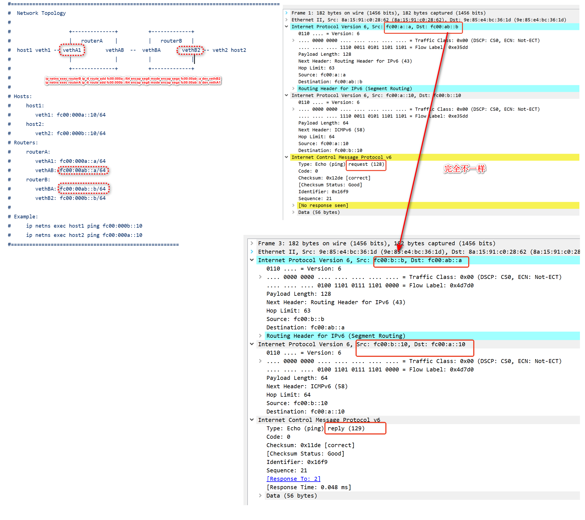

# 参考项目
[SRV6-sample](https://github.com/torukita/SRV6-sample/tree/4a42aa15b7ccd030ddc908c0b6cf396d66f61a9c)

# create network topo
```
cd namespace
sudo ./srv6-AB.sh
```

# test


```
root@ubuntux86:# ip netns exec host1 ping fc00:000b::10
PING fc00:000b::10(fc00:b::10) 56 data bytes
64 bytes from fc00:b::10: icmp_seq=1 ttl=63 time=0.280 ms
64 bytes from fc00:b::10: icmp_seq=2 ttl=63 time=0.126 ms
64 bytes from fc00:b::10: icmp_seq=3 ttl=63 time=0.135 ms
^C
--- fc00:000b::10 ping statistics ---
3 packets transmitted, 3 received, 0% packet loss, time 2041ms
rtt min/avg/max/mdev = 0.126/0.180/0.280/0.070 ms
```

  




# 退出


输入exit   
```
[SRv6(0.0.4)]root@ubuntux86:# exit
exit
-----
Cleaned Virtual Network Topology successfully
-----
ip netns del host1
ip netns del routerA
ip netns del routerB
ip netns del host2
[SRv6(0.0.4)]root@ubuntux86:# 
```

```
[SRv6(0.0.4)]root@ubuntux86:# ip netns exec host1 ping fc00:000b::10
Cannot open network namespace "host1": No such file or directory
[SRv6(0.0.4)]root@ubuntux86:# 
```

# srv6-AB
[基于Openwrt（Linux）系统实现SRv6数据包的传输](https://blog.csdn.net/weixin_46466722/article/details/119580276)   
[思科SRv6 实现 VPN+流量工程测试](https://www.ctyun.cn/developer/article/561546223239237)   
[Linux SRv6实现VPN+流量工程](https://github.com/nokia-t1zhou/segment-routing-step-by-step/blob/337fdcdaf00ee57e6f9a4cdfa7cad34f20b0b7d9/SRv6%20VPN/VPN.md)     
将去往10.0.2.0/24的数据包，封装入SRv6， 并配置SRH 包含的Segment列表为R4::bb,R3::bb(逆序排列):   
ip route add 10.0.2.0/24 encap seg6 mode encap segs fc00:3::bb,fc00:4::bb dev r1-eth1  
 
