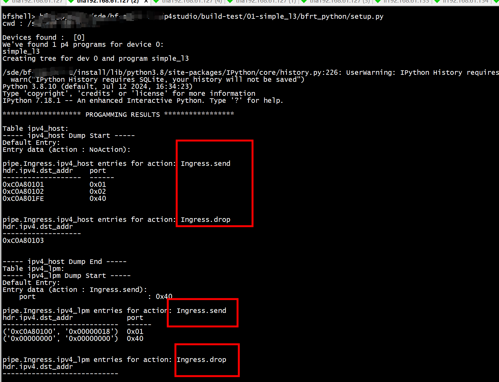

simple_l3
=========

This directory contains a simple program, called simple_l3.p4, complete
with the sample bfrt_python setup script

The program
===========

The program `simple_l3.p4` can only forward IPv4 packets. It contains just two
tables, `ipv4_host` and `ipv4_lpm`. Both tables match on the IPv4 destination
address in the packet (the program checks that the packet contains an IPv4
header and applies the tables only if it is present). First, `ipv4_host`
table performs an exact match on the IPv4 Destination Address. If there was no
match, then the lookup is performed in `ipv4_lpm` table.

Both tables can execute only two very simple actions: `send()` and `drop()`.
The former switches the packet to a specified port, while the latter simply
drops it.

The user can program these tables to achieve very simple network configurations,
which are still practical.

For example, it can program entries for specific IP addresses to forward
packets to the ports to which corresponding hosts are connected, e.g.

| IP Address    | Action | Parameters |
----------------|:------:|------------|
|192.168.1.1    | send   | port = 1   |
|192.168.1.2    | send   | port = 2   |
|192.168.1.3    | discard|            |
|192.168.1.0/24 | send   | port = 64  |
|192.168.0.0/16 | discard|            |
|0.0.0.0/0      | send   | port = 64  |.

While simple, this program serves as a basis for more elaborate examples and
is also very easy to understand. It provides a good learning exercise for the
tools.

Directory organization:
=======================
```
simple_l3/
   p4src/
      simple_l3.p4 -- the P4 code for the program
      
    bfrt_python/
      setup.py     -- A sample table programming script for run_pd_rpc.py
                      This script can be used with any target

    pkt/
      send.py      -- A simple utility to send a packet with a given
                      IPv4 Destination Address into Tofino-Model
                      
```

Compiling the program
=====================
To compile the program for Tofino simply use p4_build.sh scripts from the tools
directory:
```
01-simple_l3/p4src# ./build.sh 
```

Running the program
===================

Set up Virtual Ethernet Interfaces
----------------------------------
This step is required if you plan to run the program on both tofino-model. The
standard mapping, used by the SDE is organized as follows:

```
---------------+
     Model     |
     =====     |
               | veth0               veth1
       Port 0  +--------------------------+
               |
               | veth2               veth3
       Port 1  +--------------------------+
               |
               | veth4               veth5
       Port 2  +--------------------------+    
               |
                                                  This side is for PTF,
     . . .                                        Scapy and other tools

               | veth16             veth17
       Port 8  +--------------------------+
               |
     . . .

               | veth250           veth251
 Port 64 (CPU) +--------------------------+
               |
---------------+
```

To set up virtual ethernet interfaces simply execute the following command
```
sudo $SDE/install/bin/veth_setup.sh
```

Running on Tofino-Model
-----------------------

### Change the directory to $SDE

```
sde 
```

### Run the model
Run Tofino-model in one window:
```
. ~/tools/set_sde.bash
sde
./run_tofino_model.sh -p simple_l3
```

### Run the driver
Run the driver process (switchd) in another window:
```
. ~/tools/set_sde.bash
sde
./run_switchd.sh -p simple_l3
```

### Run bfrt_python

The driver runs a CLI, called `bfshell`. It is actually a "gateway" to several
different interactive shells. A tool with the same name (usually invoked by
running the script `$SDE/run_bfshell.sh`  allows you to access
bfshell via a telnet-like session from another window. The advantage of this
approach is that your session will not be obscured by driver messages.


#### Run the CLI (bfshell) in the third window:
```
. ~/tools/set_sde.bash
sde
./run_bfshell.sh
```
If you have a script, prepared ahead of time, you can run it like so:
```
./run_bfshell.sh -b ~/labs/01-simple_l3/bfrt_python/setup.py [-i]
```

Use -i to stay in the interactive mode after the script has been executed.




#### Injecting and sniffing  the packets

The easiest way to inject the packets is to use scapy. It is important to run
it as `root`, otherwise you will not get access to network interfaces:
```
$ sudo scapy
WARNING: No route found for IPv6 destination :: (no default route?)
Welcome to Scapy (2.2.0-dev)
>>> p=Ether()/IP(dst="192.168.1.1", src="10.10.10.1")/UDP(sport=7,dport=7)/"Payload"
>>> sendp(p, iface="veth1")
.
Sent 1 packets.
```

There is also a convenience script provided for the simple_l3_program:
```
$ sudo python 01-simple_l3/pkt/send.py 192.168.1.1
WARNING: No route found for IPv6 destination :: (no default route?)
Sending IP packet to 192.168.1.1
.
Sent 1 packets.
```

To sniff packets you can use Wireshark (see an icon on your desktop)

Additional experiments and projects
===================================

1. Try to manipulate the size of the tables and see what you can fit. To see
   the visualizations, use the following command:
```
show_p4i simple l3
```

2. Use bfrt_python to experiment with table capacity by filling the
   tables with random entries until the first failure. The code might look
   like this:
```
ipv4_host = bfrt.simple_l3.Ingress.ipv4_host
count=0

while True:
  try:
    ipv4_host.add_with_droprandom.randint(0, 0xFFFFFFFF)))
    count += 1
    if count % 1000 == 0:
       print count, "entries added"
  except Exception as e:
    if e.sts == 4:  # Ignore duplicate key error
       continue
    print "Failed to add entry number", count + 1
    break
```
You can also find this code (in a more elaborate form) in
`bfrt_python/fill_ipv4_host.py` 

If you choose to run the program, it is best to load the file into the tool
and switch to the interactive mode so that you experiment with it. Also,
remember that the Python has the help() function. Here is how you can load the
program and stay in the interactive mode:

```
./run_bfshell -b ~/labs/01-simple_l3/bfrt_python/fill_ipv4_host.py -i
```

``` python
clear_all   # Clear All tables
fill_ipv4_host() # Fill the IPv4 host with random entries
clear_all
fill_ipv4_host(keyfunc=lambda c: 0xc0a80101 + c) # Fill with 192.168.1.1 + N
clear_all batching=0     # Compare time with the previous case (batching=1)
```

3. You can repeat the same experiment (do not forget to clear the table
first), but with batching: 
```
ipv4_host = bfrt.simple_l3.Ingress.ipv4_host
count=0

bfrt.batch_begin()
while True:
  try:
    ipv4_host.add_with_drop(random.randint(0, 0xFFFFFFFF)))
    count += 1
    if count % 1000 == 0:
       print count, "entries added"
  except Exception as e:
    if e.sts == 4:  # Ignore duplicate key error
       continue
    print "Failed to add entry number", count + 1
    break
bfrt.batch_end()
```
and compare the time it required to add entries

4. Run PTF tests

This program has several PTF tests written for it. To run them, you can either
use bfshell window or open another one (do not forget to source
`set_sde.bash`)! 

To run the tests use the following command:

``` shell
./run_p4_tests -p simple_l3 -t ~/labs/01-simple_l3/ptf-tests
```

This specific test is written in the spirit of most SDE tests that require
that no entries are programmed in the device before the start of the test. It
will fail if you have entries programmed in the tables from the previous
experiments. 

However, it is fairly easy to fix by uncommenting the line to call the test's
`cleanUp()` method inside the `setUp()` method (around line 115 in the file
`ptf-tests/simple_l3.py`).

Please, read the file `ptf-tests/README.md` for moree information about how
the tests are written and organized. 

To see the list of tests you can use the following command:

``` shell
./run_p4_tests.sh -p simple_l3 -t ~/labs/01-simple_l3/ptf-tests/ -- --list
```

# compile test

定义一个大header ipv4_h头      
```
header ipv4_h {
    bit<4>   version;
    bit<4>   ihl;
    bit<8>   diffserv;
    bit<16>  total_len;
    bit<16>  identification;
    bit<3>   flags;
    bit<13>  frag_offset;
    bit<8>   ttl;
    bit<8>   protocol;
    bit<16>  hdr_checksum;
    bit<32>  src_addr;
    bit<32>  dst_addr;
#if 0
    bit<2048>  pad1;
    bit<2048>  pad2;
    bit<2048>  pad3;
    bit<2048>  pad4;
    bit<2048>  pad5;
    bit<2048>  pad6;
    bit<2048>  pad7;
    bit<2048>  pad8;
    bit<2048>  pad9;
    bit<2048>  pad10;
    bit<2048>  pad11;
    bit<2048>  pad12;
    bit<2048>  pad13;
    bit<2048>  pad14;
    bit<2048>  pad15;
    bit<2048>  pad16;
    bit<2048>  pad17;
    bit<2048>  pad18;
    bit<2048>  pad19;
    bit<2048>  pad20;
#endif
    bit<2048>  pad21;
    bit<2048>  pad22;
    bit<2048>  pad23;
    bit<2048>  pad24;
    bit<2048>  pad25;
}
```


```
[100%] Generating simple_l3/tofino/bf-rt.json
warning: Parser state min_parse_depth_accept_loop will be unrolled up to 4 times due to @pragma max_loop_depth.
warning: Parser state min_parse_depth_accept_loop will be unrolled up to 4 times due to @pragma max_loop_depth.
error: PHV allocation was not successful
168 field slices remain unallocated

The following fields were not allocated: 
    ingress::hdr.ipv4.pad23<2048b>[927:896]
    ingress::hdr.ipv4.pad23<2048b>[959:928]
    ingress::hdr.ipv4.pad23<2048b>[991:960]
    ingress::hdr.ipv4.pad23<2048b>[1023:992]
    ingress::hdr.ipv4.pad23<2048b>[1055:1024]
    ingress::hdr.ipv4.pad23<2048b>[1087:1056]
    ingress::hdr.ipv4.pad23<2048b>[1119:1088]
    ingress::hdr.ipv4.pad23<2048b>[1151:1120]
    ingress::hdr.ipv4.pad23<2048b>[1183:1152]
    ingress::hdr.ipv4.pad23<2048b>[1215:1184]
    ingress::hdr.ipv4.pad23<2048b>[1247:1216]
    ingress::hdr.ipv4.pad23<2048b>[1279:1248]
    ingress::hdr.ipv4.pad23<2048b>[1311:1280]
    ingress::hdr.ipv4.pad23<2048b>[1343:1312]
    ingress::hdr.ipv4.pad23<2048b>[1375:1344]
    ingress::hdr.ipv4.pad23<2048b>[1407:1376]
    ingress::hdr.ipv4.pad23<2048b>[1439:1408]
    ingress::hdr.ipv4.pad23<2048b>[1471:1440]
    ingress::hdr.ipv4.pad23<2048b>[1503:1472]
    ingress::hdr.ipv4.pad23<2048b>[1535:1504]
    ingress::hdr.ipv4.pad23<2048b>[1567:1536]
    ingress::hdr.ipv4.pad23<2048b>[1599:1568]
    ingress::hdr.ipv4.pad23<2048b>[1631:1600]
    ingress::hdr.ipv4.pad23<2048b>[1663:1632]
    ingress::hdr.ipv4.pad23<2048b>[1695:1664]
    ingress::hdr.ipv4.pad23<2048b>[1727:1696]
    ingress::hdr.ipv4.pad23<2048b>[1759:1728]
    ingress::hdr.ipv4.pad23<2048b>[1791:1760]
    ingress::hdr.ipv4.pad23<2048b>[1823:1792]
    ingress::hdr.ipv4.pad23<2048b>[1855:1824]
    ingress::hdr.ipv4.pad23<2048b>[1887:1856]
    ingress::hdr.ipv4.pad23<2048b>[1919:1888]
    ingress::hdr.ipv4.pad23<2048b>[1951:1920]
    ingress::hdr.ipv4.pad23<2048b>[1983:1952]
    ingress::hdr.ipv4.pad23<2048b>[2015:1984]
    ingress::hdr.ipv4.pad23<2048b>[2047:2016]
    ingress::hdr.ipv4.pad22<2048b>[31:0]
    ingress::hdr.ipv4.pad22<2048b>[63:32]
    ingress::hdr.ipv4.pad22<2048b>[95:64]
    ingress::hdr.ipv4.pad22<2048b>[127:96]
    ingress::hdr.ipv4.pad22<2048b>[159:128]
    ingress::hdr.ipv4.pad22<2048b>[191:160]
    ingress::hdr.ipv4.pad22<2048b>[223:192]
    ingress::hdr.ipv4.pad22<2048b>[255:224]
    ingress::hdr.ipv4.pad22<2048b>[287:256]
    ingress::hdr.ipv4.pad22<2048b>[319:288]
    ingress::hdr.ipv4.pad22<2048b>[351:320]
    ingress::hdr.ipv4.pad22<2048b>[383:352]
    ingress::hdr.ipv4.pad22<2048b>[415:384]
    ingress::hdr.ipv4.pad22<2048b>[447:416]
    ingress::hdr.ipv4.pad22<2048b>[479:448]
    ingress::hdr.ipv4.pad22<2048b>[511:480]
    ingress::hdr.ipv4.pad22<2048b>[543:512]
    ingress::hdr.ipv4.pad22<2048b>[575:544]
    ingress::hdr.ipv4.pad22<2048b>[607:576]
    ingress::hdr.ipv4.pad22<2048b>[639:608]
    ingress::hdr.ipv4.pad22<2048b>[671:640]
    ingress::hdr.ipv4.pad22<2048b>[703:672]
    ingress::hdr.ipv4.pad22<2048b>[735:704]
    ingress::hdr.ipv4.pad22<2048b>[767:736]
    ingress::hdr.ipv4.pad22<2048b>[799:768]
    ingress::hdr.ipv4.pad22<2048b>[831:800]
    ingress::hdr.ipv4.pad22<2048b>[863:832]
    ingress::hdr.ipv4.pad22<2048b>[895:864]
    ingress::hdr.ipv4.pad22<2048b>[927:896]
    ingress::hdr.ipv4.pad22<2048b>[959:928]
    ingress::hdr.ipv4.pad22<2048b>[991:960]
    ingress::hdr.ipv4.pad22<2048b>[1023:992]
    ingress::hdr.ipv4.pad22<2048b>[1055:1024]
    ingress::hdr.ipv4.pad22<2048b>[1087:1056]
    ingress::hdr.ipv4.pad22<2048b>[1119:1088]
    ingress::hdr.ipv4.pad22<2048b>[1151:1120]
    ingress::hdr.ipv4.pad22<2048b>[1183:1152]
    ingress::hdr.ipv4.pad22<2048b>[1215:1184]
    ingress::hdr.ipv4.pad22<2048b>[1247:1216]
    ingress::hdr.ipv4.pad22<2048b>[1279:1248]
    ingress::hdr.ipv4.pad22<2048b>[1311:1280]
    ingress::hdr.ipv4.pad22<2048b>[1343:1312]
    ingress::hdr.ipv4.pad22<2048b>[1375:1344]
    ingress::hdr.ipv4.pad22<2048b>[1407:1376]
    ingress::hdr.ipv4.pad22<2048b>[1439:1408]
    ingress::hdr.ipv4.pad22<2048b>[1471:1440]
    ingress::hdr.ipv4.pad22<2048b>[1503:1472]
    ingress::hdr.ipv4.pad22<2048b>[1535:1504]
    ingress::hdr.ipv4.pad22<2048b>[1567:1536]
    ingress::hdr.ipv4.pad22<2048b>[1599:1568]
    ingress::hdr.ipv4.pad22<2048b>[1631:1600]
    ingress::hdr.ipv4.pad22<2048b>[1663:1632]
    ingress::hdr.ipv4.pad22<2048b>[1695:1664]
    ingress::hdr.ipv4.pad22<2048b>[1727:1696]
    ingress::hdr.ipv4.pad22<2048b>[1759:1728]
    ingress::hdr.ipv4.pad22<2048b>[1791:1760]
    ingress::hdr.ipv4.pad22<2048b>[1823:1792]
    ingress::hdr.ipv4.pad22<2048b>[1855:1824]
    ingress::hdr.ipv4.pad22<2048b>[1887:1856]
    ingress::hdr.ipv4.pad22<2048b>[1919:1888]
    ingress::hdr.ipv4.pad22<2048b>[1951:1920]
    ingress::hdr.ipv4.pad22<2048b>[1983:1952]
    ingress::hdr.ipv4.pad22<2048b>[2015:1984]
    ingress::hdr.ipv4.pad22<2048b>[2047:2016]
    ingress::hdr.ipv4.pad21<2048b>[31:0]
    ingress::hdr.ipv4.pad21<2048b>[63:32]
    ingress::hdr.ipv4.pad21<2048b>[95:64]
    ingress::hdr.ipv4.pad21<2048b>[127:96]
    ingress::hdr.ipv4.pad21<2048b>[159:128]
    ingress::hdr.ipv4.pad21<2048b>[191:160]
    ingress::hdr.ipv4.pad21<2048b>[223:192]
    ingress::hdr.ipv4.pad21<2048b>[255:224]
    ingress::hdr.ipv4.pad21<2048b>[287:256]
    ingress::hdr.ipv4.pad21<2048b>[319:288]
    ingress::hdr.ipv4.pad21<2048b>[351:320]
    ingress::hdr.ipv4.pad21<2048b>[383:352]
    ingress::hdr.ipv4.pad21<2048b>[415:384]
    ingress::hdr.ipv4.pad21<2048b>[447:416]
    ingress::hdr.ipv4.pad21<2048b>[479:448]
    ingress::hdr.ipv4.pad21<2048b>[511:480]
    ingress::hdr.ipv4.pad21<2048b>[543:512]
    ingress::hdr.ipv4.pad21<2048b>[575:544]
    ingress::hdr.ipv4.pad21<2048b>[607:576]
    ingress::hdr.ipv4.pad21<2048b>[639:608]
    ingress::hdr.ipv4.pad21<2048b>[671:640]
    ingress::hdr.ipv4.pad21<2048b>[703:672]
    ingress::hdr.ipv4.pad21<2048b>[735:704]
    ingress::hdr.ipv4.pad21<2048b>[767:736]
    ingress::hdr.ipv4.pad21<2048b>[799:768]
    ingress::hdr.ipv4.pad21<2048b>[831:800]
    ingress::hdr.ipv4.pad21<2048b>[863:832]
    ingress::hdr.ipv4.pad21<2048b>[895:864]
    ingress::hdr.ipv4.pad21<2048b>[927:896]
    ingress::hdr.ipv4.pad21<2048b>[959:928]
    ingress::hdr.ipv4.pad21<2048b>[991:960]
    ingress::hdr.ipv4.pad21<2048b>[1023:992]
    ingress::hdr.ipv4.pad21<2048b>[1055:1024]
    ingress::hdr.ipv4.pad21<2048b>[1087:1056]
    ingress::hdr.ipv4.pad21<2048b>[1119:1088]
    ingress::hdr.ipv4.pad21<2048b>[1151:1120]
    ingress::hdr.ipv4.pad21<2048b>[1183:1152]
    ingress::hdr.ipv4.pad21<2048b>[1215:1184]
    ingress::hdr.ipv4.pad21<2048b>[1247:1216]
    ingress::hdr.ipv4.pad21<2048b>[1279:1248]
    ingress::hdr.ipv4.pad21<2048b>[1311:1280]
    ingress::hdr.ipv4.pad21<2048b>[1343:1312]
    ingress::hdr.ipv4.pad21<2048b>[1375:1344]
    ingress::hdr.ipv4.pad21<2048b>[1407:1376]
    ingress::hdr.ipv4.pad21<2048b>[1439:1408]
    ingress::hdr.ipv4.pad21<2048b>[1471:1440]
    ingress::hdr.ipv4.pad21<2048b>[1503:1472]
    ingress::hdr.ipv4.pad21<2048b>[1535:1504]
    ingress::hdr.ipv4.pad21<2048b>[1567:1536]
    ingress::hdr.ipv4.pad21<2048b>[1599:1568]
    ingress::hdr.ipv4.pad21<2048b>[1631:1600]
    ingress::hdr.ipv4.pad21<2048b>[1663:1632]
    ingress::hdr.ipv4.pad21<2048b>[1695:1664]
    ingress::hdr.ipv4.pad21<2048b>[1727:1696]
    ingress::hdr.ipv4.pad21<2048b>[1759:1728]
    ingress::hdr.ipv4.pad21<2048b>[1791:1760]
    ingress::hdr.ipv4.pad21<2048b>[1823:1792]
    ingress::hdr.ipv4.pad21<2048b>[1855:1824]
    ingress::hdr.ipv4.pad21<2048b>[1887:1856]
    ingress::hdr.ipv4.pad21<2048b>[1919:1888]
    ingress::hdr.ipv4.pad21<2048b>[1951:1920]
    ingress::hdr.ipv4.pad21<2048b>[1983:1952]
    ingress::hdr.ipv4.pad21<2048b>[2015:1984]
    ingress::hdr.ipv4.pad21<2048b>[2047:2016]
    ingress::hdr.ipv4.dst_addr<32b>
    ingress::hdr.ipv4.src_addr<32b>
    ingress::hdr.ethernet.src_addr<48b>[47:32]
    ingress::hdr.ethernet.dst_addr<48b>[47:32]


Number of errors exceeded set maximum of 1
```
