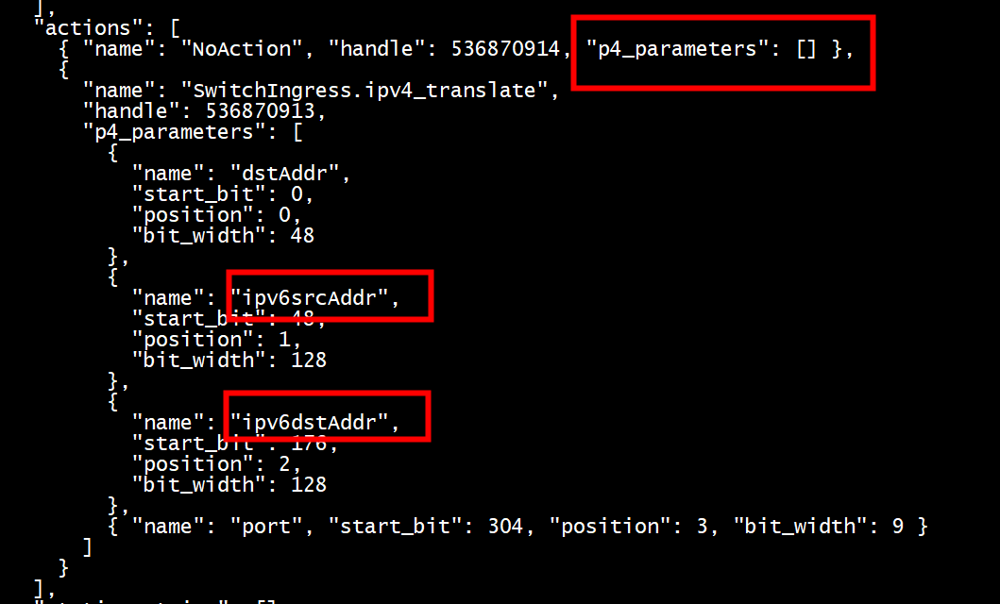
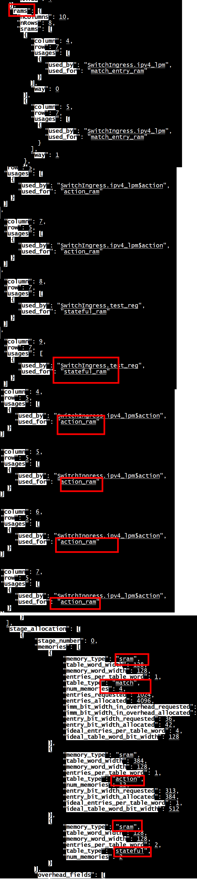

```
 Current Dir: /sde/bf-sde-9.7.1/build/p4-build/tna_ports
   Executing: /sde/bf-sde-9.7.1/pkgsrc/p4-build/configure --prefix="/sde/bf-sde-9.7.1/install" --with-p4c="/sde/bf-sde-9.7.1/install/bin/bf-p4c" P4_PATH="/sde/bf-sde-9.7.1/pkgsrc/p4-examples/p4_16_programs/tna_ports/tna_ports.p4" P4_NAME="tna_ports" P4_PREFIX="tna_ports" P4_VERSION="p4-16" P4_ARCHITECTURE="tna" P4JOBS=8 P4FLAGS=" -g --verbose 2 --parser-timing-reports --display-power-budget --create-graphs" --with-tofino P4PPFLAGS="" 
```

## tofino

**Bringing up ports and testing the program**

The first thing you probably want to do is bring up some ports. This can be done in the control script, but you can also do it manually from bfshell > ucli > pm:


```
bfshell> ucli
Starting UCLI from bf-shell 
Cannot read termcap database;
using dumb terminal settings.
bf-sde> pm
bf-sde.pm> ?
# ... list of commands (not shown)
```
pm has a bunch of commands. The most important ones are: 

``show [-a]`` -- show the currently configured ports. If run with -a, show all ports.

```
bf-sde.pm> show -a
-----+----+---+----+-------+----+---+---+---+--------+----------------+----------------+-
PORT |MAC |D_P|P/PT|SPEED  |FEC |RDY|ADM|OPR|LPBK    |FRAMES RX       |FRAMES TX       |E
-----+----+---+----+-------+----+---+---+---+--------+----------------+----------------+-
1/0  |23/0|128|3/ 0|-------|----|YES|---|---|--------|----------------|----------------|-
1/1  |23/1|129|3/ 1|-------|----|YES|---|---|--------|----------------|----------------|-
```
Important columns are: 
PORT -- the front panel port name. 
D_P -- the port's id from inside of P4. 
RDY -- is a cable detected? 
ADM -- is the port configured? 
OPR -- is the port down (DWN) or up (UP)?
Most of the other columns are self explanatory. LPBK is whether the port is configured as a loopback port. 

To configure a port, use port-add. To bring a configured port up, use port-enb.

`` port-add        <port_str> <speed (1G, 10G, 25G, 40G, 40G_NB, 50G(50G/50G-R2, 50G-R1), 100G(100G/100G-R4, 100G-R2),200G(200G/200G-R4, 200G-R8), 400G 40G_NON_BREAKABLE)> <fec (NONE, FC, RS)>``

``<port_str>`` is the port's front panel id. 100G ports can be split into 4 separate 25G or 10G ports, so each port id has two components: the physical port name and the id of the port's channel: ``<port id>/<channel id>``

So, for example, `1/0` and `2/0` are the first two ports in 100G mode. If you configure port 1 in 4x25G mode, you can also use ports `1/1`, `1/2`, and `1/3`. 

You configure each port individually. So, to bring up 1/0 - 1/3 in 10G mode with no FEC, use: 

```
bf-sde.pm> port-add 1/0 10G NONE
bf-sde.pm> port-add 1/1 10G NONE
bf-sde.pm> port-add 1/2 10G NONE
bf-sde.pm> port-add 1/3 10G NONE
bf-sde.pm> show                 
-----+----+---+----+-------+----+---+---+---+--------+----------------+----------------+-
PORT |MAC |D_P|P/PT|SPEED  |FEC |RDY|ADM|OPR|LPBK    |FRAMES RX       |FRAMES TX       |E
-----+----+---+----+-------+----+---+---+---+--------+----------------+----------------+-
1/0  |23/0|128|3/ 0|10G    |NONE|YES|DIS|DWN|  NONE  |               0|               0| 
1/1  |23/1|129|3/ 1|10G    |NONE|YES|DIS|DWN|  NONE  |               0|               0| 
1/2  |23/2|130|3/ 2|10G    |NONE|YES|DIS|DWN|  NONE  |               0|               0| 
1/3  |23/3|131|3/ 3|10G    |NONE|YES|DIS|DWN|  NONE  |               0|               0| 
```

Next, to bring up a configured port, say ``1/0``, use ``port-enb``: 
```
bf-sde.pm> port-add 1/0 1G NONE 
2024-07-18 09:07:09.452871 BF_PM ERROR - pm_port_valid_speed_and_channel_internal:711 Port validation failed for Dev-family: 0 dev : 0 d_p : 168 : 1/0 speed : 1g num-lanes: 1 error-msg: 1G not supported on this  port
Add failed Invalid arguments (3)

```

```
bf-sde.pm> port-add 1/0 10G NONE
bf-sde.pm> port-add 1/1 10G NONE
bf-sde.pm> port-enb 1/0
bf-sde.pm> port-enb 1/1
bf-sde.pm> show
-----+----+---+----+-------+----+--+--+---+---+---+--------+----------------+----------------+-
PORT |MAC |D_P|P/PT|SPEED  |FEC |AN|KR|RDY|ADM|OPR|LPBK    |FRAMES RX       |FRAMES TX       |E
-----+----+---+----+-------+----+--+--+---+---+---+--------+----------------+----------------+-
1/0  |29/0|168|3/40|10G    |NONE|Au|Au|NO |ENB|DWN|  NONE  |               0|               0| 
1/1  |29/1|169|3/41|10G    |NONE|Au|Au|NO |ENB|DWN|  NONE  |               0|               0| 
bf-sde.pm> 
```

At this point, once the ethernet autonegotiation completes the OPR column for an enabled port should change to "UP". 

Once you have a server connected to a port that's UP, you can test the program: send a packet into the switch from the server, the P4 program should send a copy of the exact same packet back. You should see the frames RX and frames TX counters increase in the CLI. 

```
bf-sde.pm> port-add -/-  10G NONE
bf-sde.pm> show -a   
bf-sde.pm> an-set -/- 2
bf-sde.pm> port-enb -/-
```

```
bf-sde.pm> port-add 5/-  40G NONE
bf-sde.pm> port-add 7/-  40G NONE
bf-sde.pm> an-set -/- 2
bf-sde.pm> port-enb -/-
bf-sde.pm>
```

## docker 
```
docker export -o  p4i-docker.tar 1f43ce1c21ba 
docker import p4i-docker.tar p4i-img
docker  run  --net=host  --cap-add=NET_ADMIN  -v /sde:/sde --name tofino  -it  tofino-img  bash
docker  run  --net=host  --cap-add=NET_ADMIN  -v /work/tofino:/sde --name tofino  -it  tofino-img  bash
docker  run  --net=host  --cap-add=SYS_ADMIN  --cap-add=NET_ADMIN  -v /sde:/sde --name tofino  -it  p4i-img  bash
```


```
docker run -d --rm --name p4i -v /sde:/sde -w /sde/bf-sde-9.7.1/build/ -p 3000:3000/tcp --init --cap-add CAP_SYS_ADMIN --cap-add CAP_NET_ADMIN p4i-img bash
```

# p4i


```
 xvfb-run ./p4i --disable-gpu --no-sandbox -w /work/tofino/bf-sde-9.7.1/build/
```

```
xvfb-run ./p4i -w /work/tofino/bf-sde-8.9.1/build/pkgsrc/p4-examples/tna_exact_match/tofino
```

   

没有  /home/ubuntu/.local/p4i/LICENCE文件   

```
root@ubuntux86:# xvfb-run ./p4i --no-sandbox --disable-gpu -h
p4i [--working-dir, -w <dir>][--open, -o <manifest.json|archive.tar.bz2>, ...][--licence, -l <license.info>][--editor-path-command, -e <command_string>][--editor-files-command, -f <command_string>][--no-browser][--defaults]

Editor commands
Commands with a parameter of %p to launch a file or directory path in your editor. For opening files specifically, parameter %l is available to set line number.

  [--editor-path-command | -e] <command_string> 
    Example for VS Code: p4i -e "code %p"

  [--editor-files-command | -f] <command_string> 
    Example for VS Code: p4i -f "code -g %p:%l"
root@ubuntux86:# 
```

##  chrome_sandbox 
chown root:root chrome_sandbox &&  chmod 4755 chrome_sandbox 
```
root@ubuntux86:# xvfb-run ./chrome-sandbox --disable-gpu --no-sandbox --disable-setuid-sandbox
The setuid sandbox provides API version 1, but you need 0
Please read https://chromium.googlesource.com/chromium/src/+/master/docs/linux/suid_sandbox_development.md.

close: Bad file descriptor
Read on socketpair: Success
```

[一个用于在虚拟桌面下跑chrome的docker镜像](https://blog.csdn.net/socrates/article/details/140284135)
```
run --rm -it -v /work/tofino:/sde -v /run/dbus/:/run/dbus/ --workdir /workdir --cap-add=SYS_ADMIN --net=host  --cap-add=NET_ADMIN -p 9222:9222 --entrypoint "/bin/bash"  socrateslee/xvfb-chrome
```

```
./usr/bin/google-chrome-stable
./usr/bin/google-chrome
```
进入容器，切换成root,执行   
```
 xvfb-run  google-chrome --disable-gpu --no-sandbox --disable-setuid-sandbox --remote-debugging-port=9222  --remote-debugging-address=0.0.0.0
```

```
docker run --rm -it -v /work/tofino:/sde --workdir /sde --cap-add=SYS_ADMIN --net=host  --cap-add=NET_ADMIN -p 9222:9222 socrateslee/xvfb-chrome bash
```
```
docker run --rm -it -v /work/tofino:/sde --workdir /sde --cap-add=SYS_ADMIN --net=host  --cap-add=NET_ADMIN -p 9222:9222 socrateslee/xvfb-chrome --xvfb-run --remote-debugging-port=9222  --disable-gpu
```

#   Print out Tofino resource utilization statistics

**Pipeline resources:**
```
vagrant@cebinaevm:/cebinae/tofino_prototype$ sed -n 10,26p ./main/pipe/logs/mau.resources.log
| Stage Number | Exact Match Input xbar | Ternary Match Input xbar | Hash Bit | Hash Dist Unit | Gateway | SRAM | Map RAM | TCAM | VLIW Instr | Meter ALU | Stats ALU | Stash | Exact Match Search Bus | Exact Match Result Bus | Tind Result Bus | Action Data Bus Bytes | 8-bit Action Slots | 16-bit Action Slots | 32-bit Action Slots | Logical TableID |
---------------------------------------------------------------------------------------------------------------------------------------------------------------------------------------------------------------------------------------------------------------------------------------------------------------------------------------------------------------
|      0       |           21           |            0             |   144    |       4        |    3    |  8   |    0    |  0   |     4      |     0     |     0     |   2   |           3            |           4            |        4        |           18          |         0          |          0          |          0          |        8        |
|      1       |           22           |            0             |   142    |       2        |    6    |  17  |    8    |  0   |     6      |     4     |     0     |   3   |           5            |           9            |        6        |           16          |         0          |          0          |          0          |        11       |
|      2       |           31           |            0             |   113    |       2        |    2    |  12  |    2    |  0   |     3      |     1     |     0     |   2   |           3            |           4            |        4        |           26          |         0          |          0          |          0          |        7        |
|      3       |           21           |            16            |    33    |       2        |    2    |  7   |    2    |  4   |     3      |     1     |     0     |   0   |           1            |           1            |        1        |           8           |         0          |          0          |          0          |        5        |
|      4       |           10           |            0             |    20    |       2        |    2    |  4   |    4    |  0   |     2      |     2     |     0     |   0   |           1            |           2            |        2        |           8           |         0          |          0          |          0          |        4        |
|      5       |           0            |            1             |    0     |       0        |    0    |  1   |    0    |  1   |     32     |     0     |     0     |   0   |           0            |           0            |        2        |           4           |         0          |          0          |          0          |        2        |
|      6       |           16           |            16            |    30    |       3        |    0    |  9   |    6    |  9   |     4      |     3     |     0     |   0   |           0            |           0            |        4        |           8           |         0          |          0          |          0          |        4        |
|      7       |           0            |            17            |    0     |       0        |    0    |  2   |    0    |  4   |     32     |     0     |     0     |   0   |           0            |           0            |        2        |           4           |         0          |          0          |          0          |        2        |
|      8       |           18           |            32            |    42    |       3        |    2    |  5   |    4    |  6   |     2      |     2     |     0     |   0   |           1            |           2            |        1        |           4           |         0          |          0          |          0          |        3        |
|      9       |           6            |            0             |    16    |       1        |    1    |  2   |    2    |  0   |     1      |     1     |     0     |   0   |           1            |           1            |        1        |           0           |         0          |          0          |          0          |        2        |
|      10      |           0            |            0             |    0     |       0        |    0    |  0   |    0    |  0   |     1      |     0     |     0     |   0   |           0            |           0            |        1        |           0           |         0          |          0          |          0          |        1        |
|      11      |           0            |            8             |    0     |       0        |    0    |  3   |    2    |  2   |     3      |     1     |     0     |   0   |           0            |           0            |        1        |           0           |         0          |          0          |          0          |        1        |
|              |                        |                          |          |                |         |      |         |      |            |           |           |       |                        |                        |                 |                       |                    |                     |                     |                 |
|    Totals    |          145           |            90            |   540    |       19       |    18   |  70  |    30   |  26  |     93     |     15    |     0     |   7   |           15           |           23           |        29       |           96          |         0          |          0          |          0          |        50       |```
---------------------------------------------------------------------------------------------------------------------------------------------------------------------------------------------------------------------------------------------------------------------------------------------------------------------------------------------------------------

vagrant@cebinaevm:/cebinae/tofino_prototype$ sed -n 320,345p ./main/pipe/logs/phv_allocation_summary_3.log
+-------------------+-----------------+----------------+----------------------+---------------------+----------------+---------------------------+--------------------------+----------------+
|     MAU Group     | Containers Used |   Bits Used    | Bits Used on Ingress | Bits Used on Egress | Bits Allocated | Bits Allocated on Ingress | Bits Allocated on Egress | Available Bits |
+-------------------+-----------------+----------------+----------------------+---------------------+----------------+---------------------------+--------------------------+----------------+
|       B0-15       |   5 ( 31.2 %)   |  35 ( 27.3 %)  |     35 ( 27.3 %)     |     0 (   0  %)     |  83 ( 64.8 %)  |       83 ( 64.8 %)        |       0 (   0  %)        |      128       |
|      B16-31       |   2 ( 12.5 %)   |  12 ( 9.38 %)  |     0 (   0  %)      |    12 ( 9.38 %)     |  12 ( 9.38 %)  |        0 (   0  %)        |       12 ( 9.38 %)       |      128       |
|      B32-47       |   0 (   0  %)   |  0 (   0  %)   |     0 (   0  %)      |     0 (   0  %)     |  0 (   0  %)   |        0 (   0  %)        |       0 (   0  %)        |      128       |
|      B48-63       |   0 (   0  %)   |  0 (   0  %)   |     0 (   0  %)      |     0 (   0  %)     |  0 (   0  %)   |        0 (   0  %)        |       0 (   0  %)        |      128       |
+-------------------+-----------------+----------------+----------------------+---------------------+----------------+---------------------------+--------------------------+----------------+
|       H0-15       |   7 ( 43.8 %)   | 105 (  41  %)  |    105 (  41  %)     |     0 (   0  %)     | 105 (  41  %)  |       105 (  41  %)       |       0 (   0  %)        |      256       |
|      H16-31       |   5 ( 31.2 %)   |  66 ( 25.8 %)  |     0 (   0  %)      |    66 ( 25.8 %)     |  66 ( 25.8 %)  |        0 (   0  %)        |       66 ( 25.8 %)       |      256       |
|      H32-47       |   0 (   0  %)   |  0 (   0  %)   |     0 (   0  %)      |     0 (   0  %)     |  0 (   0  %)   |        0 (   0  %)        |       0 (   0  %)        |      256       |
|      H48-63       |   0 (   0  %)   |  0 (   0  %)   |     0 (   0  %)      |     0 (   0  %)     |  0 (   0  %)   |        0 (   0  %)        |       0 (   0  %)        |      256       |
|      H64-79       |   0 (   0  %)   |  0 (   0  %)   |     0 (   0  %)      |     0 (   0  %)     |  0 (   0  %)   |        0 (   0  %)        |       0 (   0  %)        |      256       |
|      H80-95       |   0 (   0  %)   |  0 (   0  %)   |     0 (   0  %)      |     0 (   0  %)     |  0 (   0  %)   |        0 (   0  %)        |       0 (   0  %)        |      256       |
+-------------------+-----------------+----------------+----------------------+---------------------+----------------+---------------------------+--------------------------+----------------+
|       W0-15       |  16 (  100 %)   | 504 ( 98.4 %)  |    504 ( 98.4 %)     |     0 (   0  %)     | 632 (  123 %)  |       632 (  123 %)       |       0 (   0  %)        |      512       |
|      W16-31       |  10 ( 62.5 %)   | 320 ( 62.5 %)  |     0 (   0  %)      |    320 ( 62.5 %)    | 353 ( 68.9 %)  |        0 (   0  %)        |      353 ( 68.9 %)       |      512       |
|      W32-47       |   0 (   0  %)   |  0 (   0  %)   |     0 (   0  %)      |     0 (   0  %)     |  0 (   0  %)   |        0 (   0  %)        |       0 (   0  %)        |      512       |
|      W48-63       |   0 (   0  %)   |  0 (   0  %)   |     0 (   0  %)      |     0 (   0  %)     |  0 (   0  %)   |        0 (   0  %)        |       0 (   0  %)        |      512       |
+-------------------+-----------------+----------------+----------------------+---------------------+----------------+---------------------------+--------------------------+----------------+
|   Usage for 8b    |   7 ( 10.9 %)   |  47 ( 9.18 %)  |     35 ( 6.84 %)     |    12 ( 2.34 %)     |  95 ( 18.6 %)  |       83 ( 16.2 %)        |       12 ( 2.34 %)       |      512       |
|   Usage for 16b   |  12 ( 12.5 %)   | 171 ( 11.1 %)  |    105 ( 6.84 %)     |    66 (  4.3 %)     | 171 ( 11.1 %)  |       105 ( 6.84 %)       |       66 (  4.3 %)       |      1536      |
|   Usage for 32b   |  26 ( 40.6 %)   | 824 ( 40.2 %)  |    504 ( 24.6 %)     |    320 ( 15.6 %)    | 985 ( 48.1 %)  |       632 ( 30.9 %)       |      353 ( 17.2 %)       |      2048      |
+-------------------+-----------------+----------------+----------------------+---------------------+----------------+---------------------------+--------------------------+----------------+
| Overall PHV Usage |  45 ( 20.1 %)   | 1042 ( 25.4 %) |    644 ( 15.7 %)     |    398 ( 9.72 %)    | 1251 ( 30.5 %) |       820 (  20  %)       |      431 ( 10.5 %)       |      4096      |
+-------------------+-----------------+----------------+----------------------+---------------------+----------------+---------------------------+--------------------------+----------------+
```
These statistics were used to create Table 3 as follows:
- Stages: (from mau.resources.log) The program uses resources in all stages 0 - 11
- PHV:    (from phv_allocation_summary_3.log) The cell (overall PHV usage, Bits Used) is 1042
- SRAM: (from mau.resources.log) The program uses 70 SRAM blocks. Each block is 16KB each, for a total of 1120KB.
- TCAM: (from mau.resources.log) The program uses 26 TCAM blocks. Each block is 1.28KB, for a total of <34KB.
- VLIWs: (from mau.resources.log) The program uses 93 VLIW instructions.
- Queues: Not shown here. The program configures 2 physical queues per port, on a 32-port switch this is 64 queues.


##  table_summary.log

```
cat  tofino/pipe/logs/table_summary.log
Table allocation done 1 time(s), state = INITIAL
Number of stages in table allocation: 3
  Number of stages for ingress table allocation: 3
  Number of stages for egress table allocation: 1
Critical path length through the table dependency graph: 3
Number of tables allocated: 7
+-------+------------------------------------------+
|Stage  |Table Name                                |
+-------+------------------------------------------+
|0      |cond-5                                    |
|0      |MyIngress.tbl_compute_hash                |
|0      |MyEgress.tbl_do_add_timestamp             |
|0      |MyEgress.do_bytes_count_malicious_egress  |
|0      |MyEgress.do_bytes_count_benign_egress     |
|1      |MyIngress.tbl_update_bloom_filter         |
|2      |MyIngress.tbl_drop_table                  |
|0      |cond-6                                    |
|2      |cond-7                                    |
|0      |cond-8                                    |
+-------+------------------------------------------+
``` 


## Compiling a P4 program
bf-p4c can compile a P4 program that is written for TNA or V1 model.    

To compile a P4_16 program written for V1model, use [2]:    

bf-p4c --std p4-16 --arch v1model --p4runtime-files <prog>.p4info.pb.txt <prog>.p4   


```
 cd $SDE/pkgsrc/p4-build
    ./configure \
    --prefix=$SDE_INSTALL --enable-thrift --with-tofino \
    P4_NAME=$prog_name P4_PATH=$1 P4_ARCHITECTURE=tna P4_VERSION=p4-14 P4FLAGS="-g --create-graphs"
```


```
P4FLAGS="-g --verbose 2"
cmake ${SDE}/p4studio \
    -DCMAKE_INSTALL_PREFIX=${SDE_INSTALL} \
    -DCMAKE_MODULE_PATH=${SDE}/cmake \
    -DP4_NAME=heavy_hitter_5tupple\
    -DP4_PATH=$(realpath ${script_dir}/heavy_hitter_5tupple.p4)\
    -DP4FLAGS="${P4FLAGS}"

make && make install
```


 


## 编译的include文件 


```
 install/share/p4c/p4include/tofino1_base.p4
```

### psa


```
// BEGIN:Programmable_blocks
parser IngressParser<H, M, RESUBM, RECIRCM>(
    packet_in buffer,
    out H parsed_hdr,
    inout M user_meta,
    in psa_ingress_parser_input_metadata_t istd,
    in RESUBM resubmit_meta,
    in RECIRCM recirculate_meta);

control Ingress<H, M>(
    inout H hdr, inout M user_meta,
    in    psa_ingress_input_metadata_t  istd,
    inout psa_ingress_output_metadata_t ostd);

control IngressDeparser<H, M, CI2EM, RESUBM, NM>(
    packet_out buffer,
    out CI2EM clone_i2e_meta,
    out RESUBM resubmit_meta,
    out NM normal_meta,
    inout H hdr,
    in M meta,
    in psa_ingress_output_metadata_t istd);

parser EgressParser<H, M, NM, CI2EM, CE2EM>(
    packet_in buffer,
    out H parsed_hdr,
    inout M user_meta,
    in psa_egress_parser_input_metadata_t istd,
    in NM normal_meta,
    in CI2EM clone_i2e_meta,
    in CE2EM clone_e2e_meta);

control Egress<H, M>(
    inout H hdr, inout M user_meta,
    in    psa_egress_input_metadata_t  istd,
    inout psa_egress_output_metadata_t ostd);

control EgressDeparser<H, M, CE2EM, RECIRCM>(
    packet_out buffer,
    out CE2EM clone_e2e_meta,
    out RECIRCM recirculate_meta,
    inout H hdr,
    in M meta,
    in psa_egress_output_metadata_t istd,
    in psa_egress_deparser_input_metadata_t edstd);

package IngressPipeline<IH, IM, NM, CI2EM, RESUBM, RECIRCM>(
    IngressParser<IH, IM, RESUBM, RECIRCM> ip,
    Ingress<IH, IM> ig,
    IngressDeparser<IH, IM, CI2EM, RESUBM, NM> id);

package EgressPipeline<EH, EM, NM, CI2EM, CE2EM, RECIRCM>(
    EgressParser<EH, EM, NM, CI2EM, CE2EM> ep,
    Egress<EH, EM> eg,
    EgressDeparser<EH, EM, CE2EM, RECIRCM> ed);

package PSA_Switch<IH, IM, EH, EM, NM, CI2EM, CE2EM, RESUBM, RECIRCM> (
    IngressPipeline<IH, IM, NM, CI2EM, RESUBM, RECIRCM> ingress,
    PacketReplicationEngine pre,
    EgressPipeline<EH, EM, NM, CI2EM, CE2EM, RECIRCM> egress,
    BufferingQueueingEngine bqe);
```


# phv

```
grep 'ethernet.dst_addr' -rn pipe/logs/pa.results.log
56:  32-bit PHV 0 (ingress): phv0[31:0] = hdr.ethernet.dst_addr[31:0] (deparsed)
128:  16-bit PHV 135 (ingress): phv135[15:0] = hdr.ethernet.dst_addr[47:32] (deparsed)
168:  32-bit PHV 266 (egress): phv266[31:0] = hdr.ethernet.dst_addr[31:0] (tagalong capable) (deparsed)
230:  16-bit PHV 344 (egress): phv344[15:0] = hdr.ethernet.dst_addr[47:32] (tagalong capable) (deparsed)
```
以下两个分布在normal中   
```
56:  32-bit PHV 0 (ingress): phv0[31:0] = hdr.ethernet.dst_addr[31:0] (deparsed)

```


# dump


```
dump(table=True)
dump(table=True)
```

# vliw
tofino/pipe/context.json   

```
{
                "action_name": "SwitchIngress.ipv4_translate",
                "action_handle": 536870913,
                "table_name": "--END_OF_PIPELINE--",
                "next_table": 0,
                "next_table_full": 16,
                "vliw_instruction": 1,
                "vliw_instruction_full": 65,
                "next_tables": [
                  {
                    "next_table_name": "tbl_tofinonat64l454",
                    "next_table_logical_id": 0,
                    "next_table_stage_no": 1
                  }
                ],
                "immediate_fields": []
              }
```


   

# sram

tofino/pipe/logs/resources.json

   

# action_data

```
action ipv6_lpm_0$action_data:
```
# Match Types

In the case of key fields, these are qualified by their match type. So far
`LongestPrefixMatch` (LPM), `Ternary` and `Exact` are defined. These match types
encapsulate the field to which they refer. This was a design decision to have 
generic field objects decoupled from whether or not they were part of a key.


## Exact

This match type is exactly what it says on the tin. It will match and only match
exactly the field value which it encapsulates.

Example:

```python
mac_exact = Exact(match=MacAddress('ff:ff:ff:ff:ff:ff'))
```

## Longest Prefix Match

A longest prefix match is where a field has a value and a number representing 
the number of leading bits the match engine is to consider. The "longest" part
means that, when considering a match, the engine will select the most specific
value, i.e, the field with the largest amount of matching leading bits.

If we consider LPM within the context of an IP address, we could consider the
case of two fields which overlap each other:

1. `192.168.16.0/24`
2. `192.168.0.0/16`

> Since any value beyond the prefix will not be considered in the match, it
> doesn't matter what their values are, and convention is to set them to zero.

An address of `192.168.0.1` will match the second rule, and `192.168.16.57`
would match the first.

Since the gRPC message for an LPM contain both the value and the prefix, no
special processing is required other than to select the correct object in any
request and populate it's fields.

Example:

```python
ipv4_lpm = LongestPrefixMatch(match=IPv4Address('192.168.0.0'), prefix=24)
```

## Ternary

Ternary fields match on a value and a mask. The mask bits indicate to the engine
which bits are to be considered.

The mask is specified as value with the exact type of the match value.

In the following example, only the first and third octets are considered in the
match.

Example:

```python
ipv4_ternary = Ternary(match=IPv4Address('192.168.0.1'), mask=IPv4Address('255.0.255.0'))
```
# piplines

```
bf-sde> sku
SKU : Tofino1 32D (B0)
bf-sde> 
```

```
bf-sde.pipe_mgr>  pipe -d 0
Pipeline 0:
    Logical pipe 0 maps to Physical pipe 1
Pipeline 1:
    Logical pipe 1 maps to Physical pipe 3
bf-sde.pipe_mgr> 
```

# run

```
 bf_switchd  --install-dir /sde/bf-sde-9.7.1/install --conf-file /sde/bf-sde-9.7.1/install/share/p4/targets/tofino/tofino_nat64.conf --init-mode=cold --status-port 7777
```

```
# sudo ./${PROG} --install-dir $SDE_INSTALL --conf-file $SDE_INSTALL/share/p4/targets/tofino/$PROGNAME.conf

# start the bf_switchd included with sde
function start_switchd() {
    if [ "$2" = "HW" ]; then
        local CMD="sudo env SDE=$SDE SDE_INSTALL=$SDE_INSTALL PATH=$SDE_INSTALL/bin:$PATH LD_LIBRARY_PATH=/usr/local/lib:$SDE_INSTALL/lib:$LD_LIBRARY_PATH $SDE_INSTALL/bin/bf_switchd --background --status-port 7777 --install-dir $SDE_INSTALL --conf-file $1 --kernel-pkt"
    else
        local CMD="sudo env SDE=$SDE SDE_INSTALL=$SDE_INSTALL PATH=$SDE_INSTALL/bin:$PATH LD_LIBRARY_PATH=/usr/local/lib:$SDE_INSTALL/lib:$LD_LIBRARY_PATH $SDE_INSTALL/bin/bf_switchd --background --status-port 7777 --install-dir $SDE_INSTALL --conf-file $1"
    fi

    # local CMD="sudo env SDE=$SDE SDE_INSTALL=$SDE_INSTALL PATH=$SDE_INSTALL/bin:$PATH LD_LIBRARY_PATH=/usr/local/lib:$SDE_INSTALL/lib:$LD_LIBRARY_PATH $SDE_INSTALL/bin/bf_switchd --background --status-port 7777 --install-dir $SDE_INSTALL --conf-file $1 --kernel-pkt"
    # local CMD="sudo $SDE_INSTALL/bin/bf_switchd --install-dir $SDE_INSTALL --conf-file $1"
    local SIG="bf_switchd: server started - listening on port 9999"
    echo "SWITCHD COMMAND: $CMD"
    cd_launch_and_wait "$LOG_DIR" "$CMD" "$SIG" "SWITCHD_MGR"
}
```

```
netstat -pan | grep bf_switchd
tcp        0      0 0.0.0.0:9999            0.0.0.0:*               LISTEN      6462/bf_switchd     
tcp        0      0 0.0.0.0:7777            0.0.0.0:*               LISTEN      6462/bf_switchd     
tcp        0      0 127.0.0.1:48232         127.0.0.1:9999          ESTABLISHED 6462/bf_switchd     
```

+ 9.7.1 版本 用-r 代替--background       

```
 ./run_switchd.sh  -p  tofino_nat64 -r startup.log 
```

#  qsfp


```
bf-sde> bf_pltfm
bf-sde.bf_pltfm> qsfp           
bf-sde.bf_pltfm.qsfp> module-show 7
Module memory dump, port 7
Module type identifier         = QSFP+ (0x0d)
Number of lanes                = 4

Vendor name                    = Intel Corp      
Vendor P/N                     = FTL410QE2C-IT   
Vendor rev                     = A 
Vendor S/N                     = X01A4W1         
Date & lot code                = 180720  
Vendor OUI                     = 00-1B-21

Memory map format              = SFF-8636
Memory map spec rev            = Not specified
Flat/paged memory              = Paged

Media type                     = ---
Media side connector           = MPO 1x12
Max supported OM2 fiber length = 30 m
Max supported OM3 fiber length = 100 m


## SUPPORTED SPECIFICATIONS
-------------- Host interface --------------
Standard supported                      Lns 
XLPPI            4 X 10.3125Gbd NRZ     4   
XLPPI            4 X 10.3125Gbd NRZ     1   

bf-sde.bf_pltfm.qsfp>
```


# proj

[The Cheetah Load Balancer - NSLab @ KTH](https://github.com/cheetahlb)   
[AnotherKamila/sdn-loadbalancer](https://github.com/AnotherKamila/sdn-loadbalancer)   
[P4NAT](https://github.com/zhy1658858023/P4NAT/blob/main/ServiceNAT_tofino/ServiceNAT_tofino.p4)     
 

