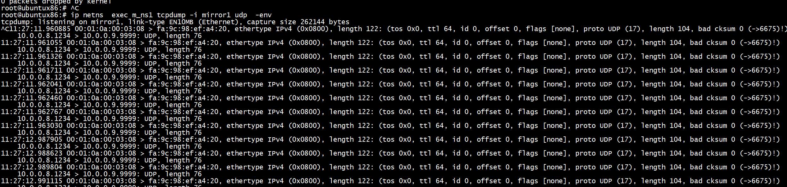
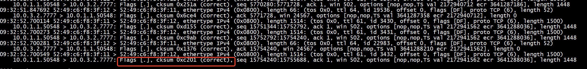
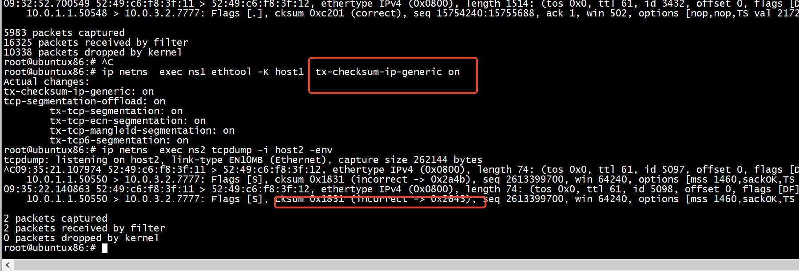
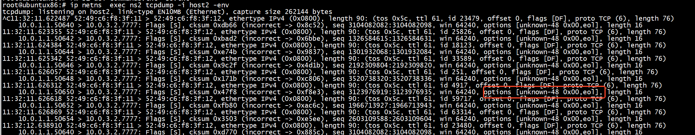
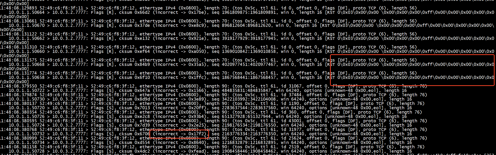
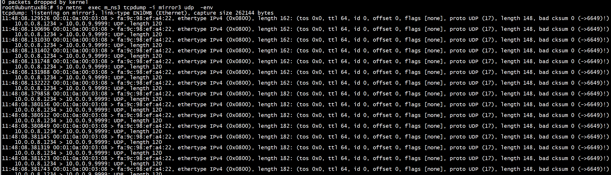
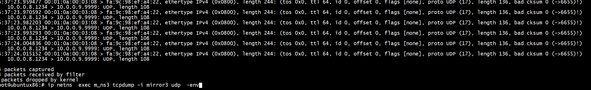

 [tofino int-mx](https://github.com/mandaryoshi/p4-int/tree/3a9e9e5b2686bd7c2c1b98cd8946fcb83abde55d/int-mx)   

[INT-InBand-Network-Telemetry规则](https://github.com/MehmedGIT/INT-InBand-Network-Telemetry-/blob/master/include/int_parser.p4) 


 # make
 
 ```
 p4c --target bmv2 --arch v1model --std p4-16 int_md.p4 -o ./build
 
 ```
 
 
 
 ```
 simple_switch -i 1@sw1_p1 -i 2@sw1_p2 -i 3@sw1_p3 p4src/build/int_md.json  --thrift-port 9092  --nanolog ipc:///tmp/bm-1-log.ipc --device-id 1  &
 ```
 
 ```
 simple_switch -i 1@sw2_p1 -i 2@sw2_p2 -i 3@sw2_p3 p4src/build/int_md.json --thrift-port 9093 --nanolog ipc:///tmp/bm-2-log.ipc --device-id 2 &
 ```
 
  ```
 simple_switch -i 1@sw3_p1 -i 2@sw3_p2 -i 3@sw3_p3 p4src/build/int_md.json --thrift-port 9094 --nanolog ipc:///tmp/bm-3-log.ipc --device-id 3 &
 ```
 
 
 ```
simple_switch_CLI --thrift-port 9092 < rule/s1-commands.txt 
simple_switch_CLI --thrift-port 9093 < rule/s2-commands.txt 
simple_switch_CLI --thrift-port 9094 < rule/s3-commands.txt 
 ```

# debug 

```
simple_switch -i 1@sw1_p1 -i 2@sw1_p2 -i 3@sw1_p3 int_md.json  --thrift-port 9092  --nanolog ipc:///tmp/bm-1-log.ipc --device-id 1  --log-console
```
 
# test2
 
## topo
```
 root@ubuntux86:# ./topo.sh -c
ip link add name host1 type veth peer name sw1_p1
ip link add name sw1_p2 type veth peer name sw2_p1
ip link add name sw2_p2 type veth peer name sw3_p1
ip link add name sw3_p2 type veth peer name host2
ip link set sw1_p1 up
ip link set sw1_p2 up
ip link set sw2_p1 up
ip link set sw2_p2 up
ip link set sw3_p1 up
ip link set sw3_p2 up
ip netns add ns1
ip netns add ns2
ip link set host1 netns ns1
ip link set host2 netns ns2
ip netns exec ns1 ip link set host1 up
ip netns exec ns2 ip link set host2 up
ip netns exec ns1 ip a add 10.0.1.1/16 dev host1
ip netns exec ns1 ifconfig host1 hw ether 52:49:c6:f8:3f:11
ip netns exec ns1 ip n add 10.0.3.2 dev host1 lladdr 2e:2e:21:21:00:12
ip netns exec ns2 ip a add 10.0.3.2/16 dev host2
ip netns exec ns2 ifconfig host2 hw ether 52:49:c6:f8:3f:12
ip netns exec ns2 ip n add 10.0.1.1 dev host2 lladdr 52:49:c6:f8:3f:11
root@ubuntux86:# ./topo.sh -e
ip netns add m_ns1
ip link add name mirror1 type veth peer name sw1_p3
ip link set mirror1 netns m_ns1
ip netns exec m_ns1 ip link set mirror1 up
ip netns exec m_ns1 ifconfig mirror1 hw ether fa:9c:98:ef:a4:20
ip link set sw1_p3 up
ip netns add m_ns2
ip link add name mirror2 type veth peer name sw2_p3
ip link set mirror2 netns m_ns2
ip netns exec m_ns2 ip link set mirror2 up
ip netns exec m_ns2 ifconfig mirror2 hw ether fa:9c:98:ef:a4:21
ip link set sw2_p3 up
ip netns add m_ns3
ip link add name mirror3 type veth peer name sw3_p3
ip link set mirror3 netns m_ns3
ip netns exec m_ns3 ip link set mirror3 up
ip link set sw3_p3 up
ip netns exec m_ns3 ifconfig mirror3 hw ether fa:9c:98:ef:a4:22
ip netns exec m_ns3 ip a add 10.0.4.2/16 dev mirror3
ip netns exec m_ns3 ip n add 10.0.3.2 dev mirror3 lladdr 52:49:c6:f8:3f:12
ip netns exec ns2 ip n add 10.0.4.2 dev host2 lladdr fa:9c:98:ef:a4:22
root@ubuntux86:# 
 ```
 
## make
 
 ```
 p4c INT-MX/int_mx.p4
 ```
## clone

```
 clone_preserving_field_list(CloneType.I2E, REPORT_MIRROR_SESSION_ID, 1);
``` 

const bit<32> REPORT_MIRROR_SESSION_ID = 500   

   

## run
 
```
 simple_switch -i 1@sw1_p1 -i 2@sw1_p2 -i 3@sw1_p3 int_mx.json  --thrift-port 9092  --nanolog ipc:///tmp/bm-1-log.ipc --device-id 1  &
 
 
```
 
 
```
 simple_switch -i 1@sw2_p1 -i 2@sw2_p2 -i 3@sw2_p3 int_mx.json --thrift-port 9093 --nanolog ipc:///tmp/bm-2-log.ipc --device-id 2 &
```
 
```
 simple_switch -i 1@sw3_p1 -i 2@sw3_p2 -i 3@sw3_p3 int_mx.json --thrift-port 9094 --nanolog ipc:///tmp/bm-3-log.ipc --device-id 3 &
```
 
 
```
 simple_switch_CLI --thrift-port 9092 < s1-commands.txt
 simple_switch_CLI --thrift-port 9093 < s2-commands.txt
 simple_switch_CLI --thrift-port 9094 < s3-commands.txt 
```
 
 
 ## 虚拟网卡  tx-checksum-ip-generic off
```
 root@ubuntux86:# ip netns  exec ns2 ethtool -k host2
Features for host2:
rx-checksumming: on
tx-checksumming: on
        tx-checksum-ipv4: off [fixed]
        tx-checksum-ip-generic: on
        tx-checksum-ipv6: off [fixed]
        tx-checksum-fcoe-crc: off [fixed]
        tx-checksum-sctp: on
scatter-gather: on
        tx-scatter-gather: on
        tx-scatter-gather-fraglist: on
tcp-segmentation-offload: on
        tx-tcp-segmentation: on
        tx-tcp-ecn-segmentation: on
        tx-tcp-mangleid-segmentation: on
        tx-tcp6-segmentation: on
```
 
 
 
```
root@ubuntux86:# ip netns  exec ns2 ethtool -k host2 | grep rx
rx-checksumming: on
rx-vlan-offload: on
rx-vlan-filter: off [fixed]
rx-fcs: off [fixed]
rx-all: off [fixed]
rx-vlan-stag-hw-parse: on
rx-vlan-stag-filter: off [fixed]
rx-udp_tunnel-port-offload: off [fixed]
tls-hw-rx-offload: off [fixed]
rx-gro-hw: off [fixed]
rx-gro-list: off
rx-udp-gro-forwarding: off
```

```
root@ubuntux86:# ip netns  exec ns2 ethtool -K host2  tx-checksum-ip-generic off
Actual changes:
tx-checksum-ip-generic: off
tcp-segmentation-offload: off
        tx-tcp-segmentation: off [requested on]
        tx-tcp-ecn-segmentation: off [requested on]
        tx-tcp-mangleid-segmentation: off [requested on]
        tx-tcp6-segmentation: off [requested on]
root@ubuntux86:# ip netns  exec ns1 ethtool -K host1  tx-checksum-ip-generic off
Actual changes:
tx-checksum-ip-generic: off
tcp-segmentation-offload: off
        tx-tcp-segmentation: off [requested on]
        tx-tcp-ecn-segmentation: off [requested on]
        tx-tcp-mangleid-segmentation: off [requested on]
        tx-tcp6-segmentation: off [requested on]
root@ubuntux86:# 
```






## bpf

```
cat  /sys/kernel/debug/tracing/trace
```


##  iperf(tcp有问题)


   

### test1


+ client

```
root@ubuntux86:# ip netns  exec ns1 iperf -c 10.0.3.2 -p 7777 -t 600 -i 5  -P 8
connect failed: Connection timed out
connect failed: Connection timed out
connect failed: Connection timed out
connect failed: Connection timed out
connect failed: Connection timed out
connect failed: Connection timed out
connect failed: Connection timed out
connect failed: Connection timed out
```
+ server    
```
root@ubuntux86:# ip netns exec ns2 iperf -s -p 7777  
------------------------------------------------------------
Server listening on UDP port 7777
Receiving 1470 byte datagrams
UDP buffer size:  208 KByte (default)
------------------------------------------------------------
```


host2接收到的报文头有问题    

### test perf
s1-commands.txt 删除如下规则，这样不会有int   
```
table_add process_int_source.tb_int_source int_source 10.0.3.2/32  =>  0xF 0xF
```

```
root@ubuntux86:# ip netns  exec ns1 iperf -c 10.0.3.2 -p 7777 -t 600 -i 5  -P 8
------------------------------------------------------------
Client connecting to 10.0.3.2, TCP port 7777
TCP window size: 85.0 KByte (default)
------------------------------------------------------------
[  7] local 10.0.1.1 port 50664 connected with 10.0.3.2 port 7777
[  6] local 10.0.1.1 port 50662 connected with 10.0.3.2 port 7777
[ 10] local 10.0.1.1 port 50670 connected with 10.0.3.2 port 7777
[  5] local 10.0.1.1 port 50660 connected with 10.0.3.2 port 7777
[  8] local 10.0.1.1 port 50666 connected with 10.0.3.2 port 7777
[  9] local 10.0.1.1 port 50668 connected with 10.0.3.2 port 7777
[  3] local 10.0.1.1 port 50658 connected with 10.0.3.2 port 7777
[  4] local 10.0.1.1 port 50656 connected with 10.0.3.2 port 7777

```

```
root@ubuntux86:# ip netns exec ns2 iperf -s -p 7777 
------------------------------------------------------------
Server listening on TCP port 7777
TCP window size:  128 KByte (default)
------------------------------------------------------------
[  4] local 10.0.3.2 port 7777 connected with 10.0.1.1 port 50656
[  5] local 10.0.3.2 port 7777 connected with 10.0.1.1 port 50658
[  7] local 10.0.3.2 port 7777 connected with 10.0.1.1 port 50660
[  6] local 10.0.3.2 port 7777 connected with 10.0.1.1 port 50662
[  9] local 10.0.3.2 port 7777 connected with 10.0.1.1 port 50664
[ 10] local 10.0.3.2 port 7777 connected with 10.0.1.1 port 50666
[  8] local 10.0.3.2 port 7777 connected with 10.0.1.1 port 50670
[ 11] local 10.0.3.2 port 7777 connected with 10.0.1.1 port 50668
```

### s1 加int + s2 转发 +  s3 report

```
root@ubuntux86:# ./start.sh 
```

```
root@ubuntux86:# ip netns exec ns2 iperf -s -p 7777 
------------------------------------------------------------
Server listening on TCP port 7777
TCP window size:  128 KByte (default)
------------------------------------------------------------
^Croot@ubuntux86:# 
```

```
root@ubuntux86:# ip netns  exec ns1 iperf -c 10.0.3.2 -p 7777 -t 600 -i 5  -P 8
^C^Croot@ubuntux86:# ^C
root@ubuntux86:# 
```
ip netns  exec ns2 tcpdump -i host2 -env    
   
   

### success test

+ 更改rule/s3-commands.txt    
```
table_add process_int_source_sink.tb_set_sink int_set_sink 1 =>
```
改为
```
table_add process_int_source_sink.tb_set_sink int_set_sink 2 =>
```

+ 降低mtu，否则加了int header 后报文超过mtu(1500),sw1_p2 无法接收， tcpdump -i sw1_p2 -env 也无法抓到报文   
```
ip netns  exec ns1 ifconfig host1 mtu 1400
root@ubuntux86:# ip netns  exec ns1 ifconfig host1
host1: flags=4163<UP,BROADCAST,RUNNING,MULTICAST>  mtu 1400
        inet 10.0.1.1  netmask 255.255.0.0  broadcast 0.0.0.0
        inet6 fe80::8013:d5ff:fe3d:9cbf  prefixlen 64  scopeid 0x20<link>
        ether 52:49:c6:f8:3f:11  txqueuelen 1000  (Ethernet)
        RX packets 10693451  bytes 714082744 (714.0 MB)
        RX errors 0  dropped 10  overruns 0  frame 0
        TX packets 23143036  bytes 34954889834 (34.9 GB)
        TX errors 0  dropped 0 overruns 0  carrier 0  collisions 0

```


```
root@ubuntux86:# ip netns exec ns2 iperf -s -p 7777 -u
------------------------------------------------------------
Server listening on UDP port 7777
Receiving 1470 byte datagrams
UDP buffer size:  208 KByte (default)
------------------------------------------------------------
[  3] local 10.0.3.2 port 7777 connected with 10.0.1.1 port 37542
```


```
root@ubuntux86:# ip netns  exec ns1 iperf -c 10.0.3.2 -p 7777 -t 600 -i 5   -u
------------------------------------------------------------
Client connecting to 10.0.3.2, UDP port 7777
Sending 1470 byte datagrams, IPG target: 11215.21 us (kalman adjust)
UDP buffer size:  208 KByte (default)
------------------------------------------------------------
[  3] local 10.0.1.1 port 37542 connected with 10.0.3.2 port 7777
[ ID] Interval       Transfer     Bandwidth
[  3]  0.0- 5.0 sec   642 KBytes  1.05 Mbits/sec
[  3]  5.0-10.0 sec   640 KBytes  1.05 Mbits/sec
[  3] 10.0-15.0 sec   640 KBytes  1.05 Mbits/sec
[  3] 15.0-20.0 sec   640 KBytes  1.05 Mbits/sec
[  3] 20.0-25.0 sec   640 KBytes  1.05 Mbits/sec
[  3] 25.0-30.0 sec   639 KBytes  1.05 Mbits/sec
[  3] 30.0-35.0 sec   640 KBytes  1.05 Mbits/sec
[  3] 35.0-40.0 sec   640 KBytes  1.05 Mbits/sec
```

   

# INTCollector

[INTCollector](https://github.com/mandaryoshi/p4-int/tree/3a9e9e5b2686bd7c2c1b98cd8946fcb83abde55d/int-md-1-0)
