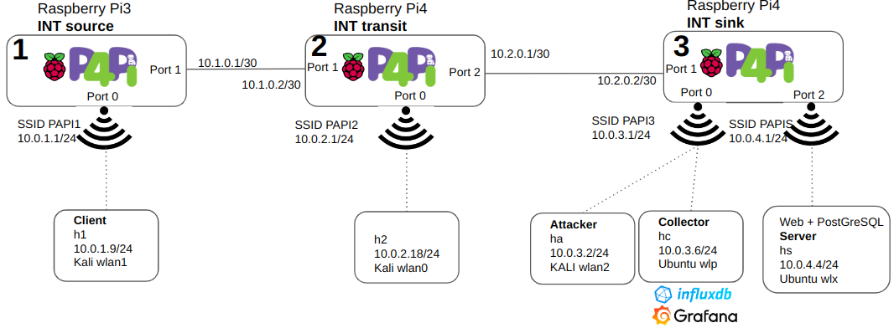
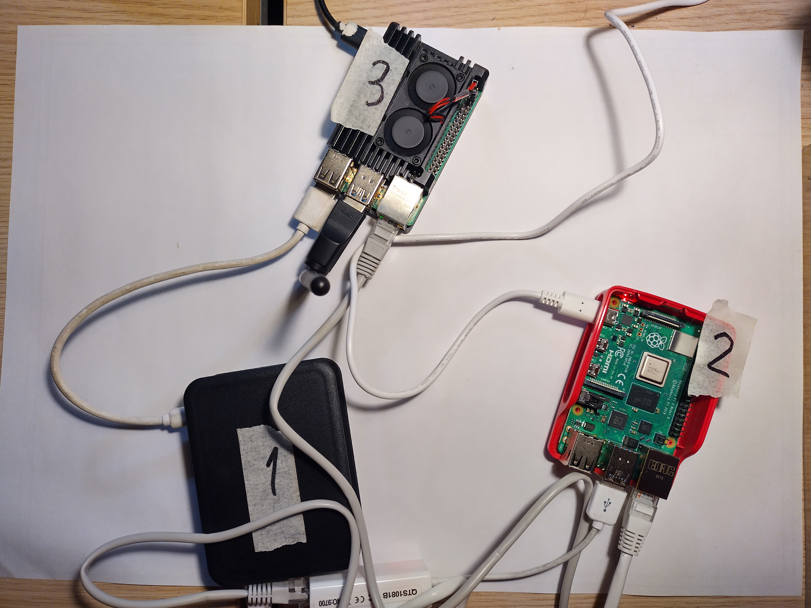
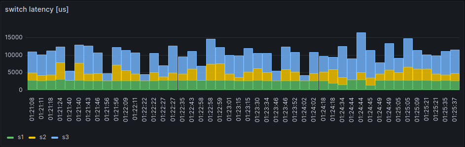
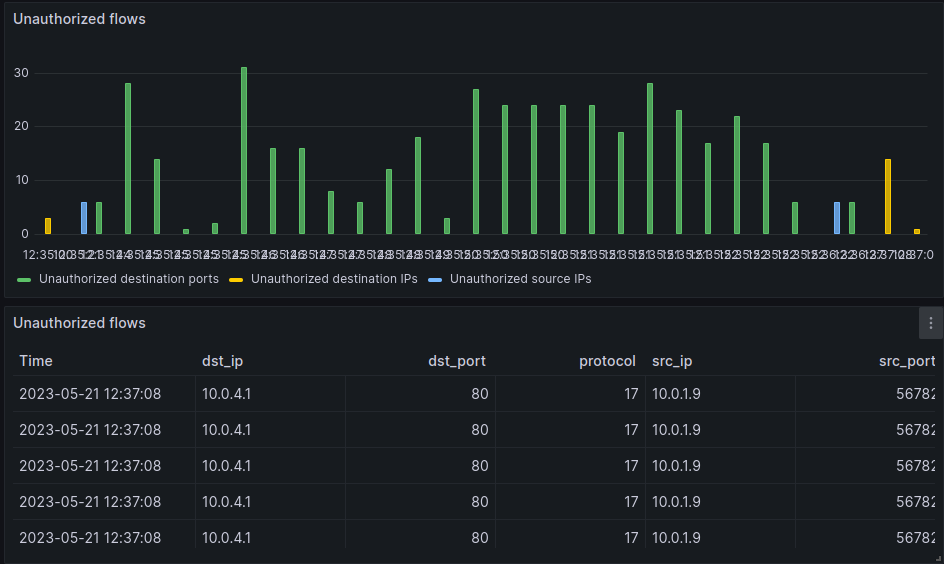

# P4INT_P4PI
SDN P4 INT deployed in P4PI raspberry and security analysis.
You can find a similar version running in Mininet, in https://github.com/ruimmpires/P4INT_Mininet

## WHY
This is an SDN implementation of P4 INT-MD for bmv2 in P4Pi. This project is ongoing until hopefuly July 2023 as part of my thesis "SECURITY FOR SDN ENVIRONMENTS WITH P4" to be also available publicly. The code is mostly not original and you may find most of it in the following repositories:
- https://github.com/lifengfan13/P4-INT
- https://github.com/GEANT-DataPlaneProgramming/int-platforms
- https://github.com/mandaryoshi/p4-int. You may also check the Mandar Joshi's thesis "Implementation and evaluation of INT in P4" here https://www.diva-portal.org/smash/get/diva2:1609265/FULLTEXT01.pdf.
- [P4PI ARP](https://github.com/p4lang/p4pi/blob/master/packages/p4pi-examples/bmv2/arp_icmp/arp_icmp.p4)

You may also look into the official INT code available in the [p4 official repository for INT](https://github.com/p4lang/p4factory/tree/master/apps/int)

## INTRODUCTION
SDN with P4 brings a new set of possibilities as the way the packets are processed is not defined by the vendor, but rather by the P4 program. Using this language, developers can define data plane behavior, specifying how switches shall process the packets. P4 lets developers define which headers a switch shall parse, how tables match on each header, and which actions the switch shall perform on each header. This new programmability extends the capabilities of the data plane into security features, such as stateful packet inspection and filtering, thus relieving the control plane. This offloading of security is enhanced by the ability to run at line speed as P4 runs on the programmed devices.

You may find some courses in universities such as:
* [Stanford Building an Internet Router](https://cs344-stanford.github.io/documentation/internet-router/)
* https://p4campus.cs.princeton.edu/
* https://www.princeton.edu/~hyojoonk/

Find below the specs:
* [P4Runtime Specification](https://p4.org/p4-spec/p4runtime/main/P4Runtime-Spec.html#sec-client-arbitration-and-controller-replication)
* [P416 Language Specification working spec](https://p4.org/p4-spec/docs/P4-16-working-spec.html)
* [P416 Language Specification version 1.2.3](https://p4.org/p4-spec/docs/P4-16-v1.2.3.pdf)
* [In-band Network Telemetry (INT) Dataplane Specification Version 2.1](https://p4.org/p4-spec/docs/INT_v2_1.pdf)
* [INT spec source](https://github.com/p4lang/p4-applications/tree/master/telemetry/specs)

## TOPOLOGY
For the sake of simplicity and due to the shortage of Raspberry Pis, we streamlined the topology to three P4 switches. The WiFi interfaces are configured as APs, so we may regard those as L2 switches. We used 2 laptops with several WiFi interfaces to simulate the hosts: h1 (client), h2, hc (collector), ha (attacker) and hs (server). We used the following Raspberry PIs as described in the figure:
1. Raspberry Pi 3 Model B, Rev 1.2, 1GB of RAM. This device will act as INT source.
2. Raspberry Pi 4 Model B, Rev 1.5, 8GB of RAM. This device will act as INT transit.
3. Raspberry Pi 4 Model B, Rev 1.1, 4GB of RAM. This device will act as INT sink.


As the Raspberry Pis only have one on-board Ethernet and one WiFi interface, we added the necessary USB devices as in the picture:


## PRE-REQUISITES
We started with following the steps in the P4Pi wiki, downloaded the image, burned it to the SD-cards and then boot and configure each one (example code below for s3):
* connect via WiFi, papi/raspberry;
* ssh, pi/raspberry, sudo su, apt update;
* change static IPs, br0 and eth0, example below for the s3:
```
nano /etc/dhcpcd.conf
interface br0
  static ip_address=10.0.3.1/24
  nohook wpa_supplicant
interface eth0
  static ip_address=10.2.0.2/30
  interface wlx38a28c80c2ee
  static ip_address=10.0.4.1/24
  nohook wpa_supplicant
```
* Change DHCP
```
nano /etc/dnsmasq.d/p4edge.conf
interface=br0
dhcp-range=set:br0,10.0.3.2,10.0.3.10,255.255.255.0,24h
domain=p4pi3
address=/gw.p4pi3/10.0.3.1

interface=wlx38a28c80c2ee
dhcp-range=set:wlx38a28c80c2ee,10.0.4.2,10.0.4.10,255.255.255.0,24h
domain=p4pis
address=/gw.p4pis/10.0.4.1
```
* Change WiFi
```
cp /etc/hostapd/hostapd.conf /etc/hostapd/wlan0.conf
cp /etc/hostapd/hostapd.conf /etc/hostapd/wlx38a28c80c2ee.conf
nano /etc/hostapd/wlan0.conf
  ssid=p4pi3
nano /etc/hostapd/wlx38a28c80c2ee.conf
  interface=wlx38a28c80c2ee
  ssid=p4pis
```
* enable the new hostapd services
```
systemctl disable hostapd
systemctl enable hostapd@wlan0
systemctl enable hostapd@wlx38a28c80c2ee
```
* reboot
* connect via WiFi, papi3/raspberry
* ssh, pi/raspberry, sudo su
* add static routing as needed
```
ip r add 10.0.1.0/24 via 10.2.0.1
ip r add 10.0.2.0/24 via 10.2.0.1
```
* copy all the P4 code to /root/bmv2/intv8/. Be sure to name the main p4 file the same as the folder.
* configure the bmv2 service and change as needed:
```
nano /usr/bin/bmv2-start
#!/bin/bash
export P4PI=/root/PI
export GRPCPP=/root/P4Runtime_GRPCPP
export GRPC=/root/grpc
BM2_WDIR=/root/bmv2
P4_PROG=l2switch
T4P4S_PROG_FILE=/root/t4p4s-switch
if [ -f "${T4P4S_PROG_FILE}" ]; then
P4_PROG=$(cat "${T4P4S_PROG_FILE}")
else
echo "${P4_PROG}" > "${T4P4S_PROG_FILE}"
fi
rm -rf ${BM2_WDIR}/bin
mkdir ${BM2_WDIR}/bin
echo "Compiling P4 code"
p4c-bm2-ss -I /usr/share/p4c/p4include --std p4-16 --p4runtime-files ${BM2_WDIR}
echo "Launching BMv2 switch"
sudo simple_switch_grpc -i 0@veth0 -i 1@eth0 -i 2@wlx38a28c80c2ee ${BM2_WDIR}/bin/${P4_PROG}.json -- --grpc-server-addr 127.0.0.1:50051
```
* configure the switch
```
echo intv8 > /root/t4p4s-switch
```
* stop and disable t4p4s, stop bmv2, enable bmv2:
```
systemctl stop t4p4s | systemctl disable t4p4s
systemctl stop bmv2 | systemctl enable bmv2
```
* start the bmv2 service and check its status:
```
systemctl start bmv2
systemctl status bmv2
```
Confirm the service is running before the next step.
* load the static tables into the P4 switch
```
simple_switch_CLI < /root/bmv2/intv8/r3commands.txt
```
### Manual mode
You may stop the bmv2 service and run manually with:
```
simple_switch_grpc -i 0@veth0 -i 1@eth0 -i 2@wlx38a28c80c2ee /root/bmv2/intv8/intv8.json -- --grpc-server-addr 127.0.0.1:50051
simple_switch_CLI < /root/bmv2/intv8/r3commands.txt
```

### Debugging mode
If you find issues with the P4 switch, you may stop the bmv2 service and run with the manually with:
```
simple_switch -i 0@veth0 -i 1@eth0 /root/bmv2/examples/intv8/intv8.json --nanolog ipc:///tmp/bm-log.ipc
simple_switch_CLI < /root/bmv2/intv8/r3commands.txt
python3 /usr/lib/python3/dist-packages/nanomsg_client.py
```

## Packet source
The INT packets are only generated if a specific packet matches the watchlist. So, we used the scapy library within a python script to craft the packets. This is a simple python script that takes as input parameters the destination IP, the l4 protocol UDP/TCP, the destination port number, an optional message and the number of packets sent.
Additionally, we included a command to simulate recurrent accesses to the server, every few seconds access to HTTP, HTTPS, and PostGreSQL from the h1:
```
watch -n 15 python3 sendwlan1.py --ip 10.0.4.4 -l4 udp --port 80 --m INTH1 &
watch -n 25 python3 sendwlan1.py --ip 10.0.4.4 -l4 udp --port 443 --m INTH1 &
watch -n 35 python3 sendwlan1.py --ip 10.0.4.4 -l4 udp --port 5432 --m INTH1 &
```
These packets are only carrying the content "INTH1" which is confirmed in the captured data with tcpdump at the ingress of s1:
```
pi@p4pi1:~$ sudo tcpdump -e -X -i br0 udp
38:a2:8c:90:60:6c (oui Unknown) > 3e:90:87:5f:dc:af (oui Unknown), ethertype IPv4 (0x0800), length 47: kali.p4pi1.65116 > 10.0.4.4.https: UDP, length 5
0x0000:  4500 0021 0001 0000 4011 61bf 0a00 0109  E..!....@.a.....
0x0010:  0a00 0404 fe5c 01bb 000d 1819 494e 5448  .....\......INTH
0x0020:  31 
```

## Packet forwarding
We initially made sure there was connectivity between all devices, so we setup static routes for the networks in the Raspberry Pis. The L3 forwarding tables are pre-established in the switches with MAT using Longest Prefix Match (LPM). So, the networks and hosts h1, h2 and hs are preregistered in each switch’s MAT:
```
#s1
table_add l3_forward.ipv4_lpm ipv4_forward 10.0.3.0/24 => d8:3a:dd:11:7a:de 1
table_add l3_forward.ipv4_lpm ipv4_forward 10.0.4.0/24 => d8:3a:dd:11:7a:de 1
table_add l3_forward.ipv4_lpm ipv4_forward 10.0.2.0/24 => d8:3a:dd:11:7a:de 1
table_add l3_forward.ipv4_lpm ipv4_forward 10.0.1.9/32 => 38:a2:8c:90:60:6c 0
#s2
table_add l3_forward.ipv4_lpm ipv4_forward 10.0.1.0/24 => b8:27:eb:83:45:95 1
table_add l3_forward.ipv4_lpm ipv4_forward 10.0.3.0/24 => dc:a6:32:40:1b:03 2
table_add l3_forward.ipv4_lpm ipv4_forward 10.0.4.0/24 => dc:a6:32:40:1b:03 2
table_add l3_forward.ipv4_lpm ipv4_forward 10.0.2.18/32 => 60:67:20:87:81:4c 0
#s3
table_add l3_forward.ipv4_lpm ipv4_forward 10.0.1.0/24 => 00:e0:4c:53:44:58 1
table_add l3_forward.ipv4_lpm ipv4_forward 10.0.2.0/24 => 00:e0:4c:53:44:58 1
table_add l3_forward.ipv4_lpm ipv4_forward 10.0.3.6/32 => e4:a4:71:cd:52:99 0
The hosts hc and ha are not required to have routing.
```

## INT source
The INT source switch must identify the flows via its watchlist. When there is a match, the switch adds the INT header and its INT data accordingly. In this lab, the source switch is s1 so the code below is the content to be uploaded the switch tables:
```
#L3 forwarding
table_add l3_forward.ipv4_lpm ipv4_forward 10.0.3.0/24 => d8:3a:dd:11:7a:de 1
table_add l3_forward.ipv4_lpm ipv4_forward 10.0.4.0/24 => d8:3a:dd:11:7a:de 1
table_add l3_forward.ipv4_lpm ipv4_forward 10.0.2.0/24 => d8:3a:dd:11:7a:de 1
table_add l3_forward.ipv4_lpm ipv4_forward 10.0.1.9/32 => 38:a2:8c:90:60:6c 0
#set up process_int_source_sink
table_add process_int_source_sink.tb_set_source int_set_source 1 =>
#set up switch ID
table_set_default process_int_transit.tb_int_insert init_metadata 1
#ARP
table_add arpreply.arp_exact arp_reply 10.1.0.1 => b8:27:eb:83:45:95
table_add arpreply.arp_exact arp_reply 10.0.1.1 => 3e:90:87:5f:dc:af
table_add arpreply.arp_exact arp_reply 10.0.1.9 => 38:a2:8c:90:60:6c
#port PostGreSQL 5432
table_add process_int_source.tb_int_source int_source 10.0.1.9&&&0xFFFFFF00 10.0.4.4&&&0xFFFFFFFF 0x00&&&0x00 0x1538&&&0xFFFF => 11 10 0xF 0xF 10
#port HTTPS 443
table_add process_int_source.tb_int_source int_source 10.0.1.9&&&0xFFFFFF00 10.0.4.4&&&0xFFFFFFFF 0x00&&&0x00 0x01BB&&&0xFFFF => 11 10 0xF 0xF 10
#port HTTP 80
table_add process_int_source.tb_int_source int_source 10.0.1.9&&&0xFFFFFF00 10.0.4.4&&&0xFFFFFFFF 0x00&&&0x00 0x0050&&&0xFFFF => 11 10 0xF 0xF 10
#any port
table_add process_int_source.tb_int_source int_source 10.0.1.9&&&0xFFFFFF00 10.0.4.4&&&0xFFFFFF00 0x00&&&0x00 0x00&&&0x00 => 11 10 0xF 0xF 10
```
### Detect unauthorized access
We chose to configure the masks in a way to create data when there are unauthorized accesses. As the authorized access is from the host 10.0.1.9 to 10.0.4.4
to the ports 80, 443 and 80, we added the last line to capture unauthorized ones.
This solution may overload the network, so it must be weighted carefully by the network administrator.

### INT packet
The packet leaving s1 has now the s1 INT statistics, as captured at the exit of s1:
```
pi@p4pi1:~$ sudo tcpdump -e -X -i enxb827eb834595 udp
d8:3a:dd:11:7a:de (oui Unknown) > d8:3a:dd:11:7a:de (oui Unknown), ethertype IPv4 (0x0800), length 107: kali.p4pi1.58928 > 10.0.4.4.https: UDP, length 65
0x0000: 455c 005d 0001 0000 3e11 6327 0a00 0109 E\.]....>.c’....
0x0010: 0a00 0404 e630 01bb 0049 3045 100e 0000 .....0...I0E....
0x0020: 2000 0b09 ff00 0000 0000 0000 0000 0001 ................
0x0030: 0001 0001 0000 0a3f 0000 0000 0000 000a .......?........
0x0040: eded 8034 0000 000a eded 8a73 0000 0001 ...4.......s....
0x0050: 0000 0001 0000 0000 494e 5448 31 ........INTH1
```
### Log of one packet matching
If you run in the debugging mode, search for the "intl4_shim" message and then identify the flow. We have captured one flow in the [p4_log_s1.log](logs/p4_log_s1.log)

## INT Transit
The int transit switch identifies that there is a INT packet embedded in the packet, so reads the instructions encoded in the INT header and adds its own INT data.
Then forwards as specified by the lpm MAT. In this lab, the transit switches is s2 so the code below is the content to be uploaded the switch tables:
```
#L3 forwading
table_add l3_forward.ipv4_lpm ipv4_forward 10.0.1.0/24 => b8:27:eb:83:45:95 1
table_add l3_forward.ipv4_lpm ipv4_forward 10.0.3.0/24 => dc:a6:32:40:1b:03 2
table_add l3_forward.ipv4_lpm ipv4_forward 10.0.4.0/24 => dc:a6:32:40:1b:03 2
table_add l3_forward.ipv4_lpm ipv4_forward 10.0.2.18/32 => 60:67:20:87:81:4c 0
#set up switch ID
table_set_default process_int_transit.tb_int_insert init_metadata 2
#ARP
table_add arpreply.arp_exact arp_reply 10.0.2.1 => 8e:8a:0a:2c:17:de
table_add arpreply.arp_exact arp_reply 10.0.2.18 => 60:67:20:87:81:4c
table_add arpreply.arp_exact arp_reply 10.1.0.2 => d8:3a:dd:11:7a:de
table_add arpreply.arp_exact arp_reply 10.2.0.1 => 00:e0:4c:53:44:58
```

The packet leaving s2 has now the s1 + s2 INT statistics, as captured at the exit of s2:
```
pi@p4pi2:~$ sudo tcpdump -e -X -i enx00e04c534458 udp
dc:a6:32:40:1b:03 (oui Unknown) > dc:a6:32:40:1b:03 (oui Unknown), ethertype IPv4 \
(0x0800), length 151: 10.0.1.9.56972 > 10.0.4.4.5432: UDP, length 109
0x0000: 455c 0089 0001 0000 3c11 64fb 0a00 0109 E\......<.d.....
0x0010: 0a00 0404 de8c 1538 0075 246c 1019 0000 .......8.u$l....
0x0020: 2000 0b08 ff00 0000 0000 0000 0000 0002 ................
0x0030: 0002 0002 0000 1354 0000 0000 0000 000b .......T........
0x0040: a1e3 8201 0000 000b a1e3 9555 0000 0002 ...........U....
0x0050: 0000 0002 0000 0000 0000 0001 0001 0001 ................
0x0060: 0000 0a7c 0000 0000 0000 000b 2d74 0ebf ...|........-t..
0x0070: 0000 000b 2d74 193b 0000 0001 0000 0001 ....-t.;........
0x0080: 0000 0000 494e 5448 31 ....INTH1
```
### Log of one packet matching
If you run in the debugging mode, search for the "intl4_shim" message and then identify the flow. We have captured one flow in the [p4_log_s2.log](logs/p4_log_s2.log)

## INT sink
The INT sink switch detects the INT header in the packets and reads the instructions. Then adds its own INT data and creates a new packet as defined in the table below, towards the INT collector. This new packet is mirrored to the port 0 towards the INT collector. Then extracts the INT data and restores the packet as it was originally and sends to the server.
The code below is the configuration of the switch s3:
```
#creates a mirroring ID to output port specified
mirroring_add 500 0
#L3 forwading
table_add l3_forward.ipv4_lpm ipv4_forward 10.0.1.0/24 => 00:e0:4c:53:44:58 1
table_add l3_forward.ipv4_lpm ipv4_forward 10.0.2.0/24 => 00:e0:4c:53:44:58 1
table_add l3_forward.ipv4_lpm ipv4_forward 10.0.3.6/32 => e4:a4:71:cd:52:99 0
#set up process_int_source_sink
table_add process_int_source_sink.tb_set_sink int_set_sink 0 =>
#INT report setup towards the INT collector PAPI3 veth0 to INTC in hpelite
table_add process_int_report.tb_generate_report do_report_encapsulation => 9a:4b:89:ad:8a:59 e4:a4:71:cd:52:99 10.0.3.1 10.0.3.6 1234
#set up switch ID
table_set_default process_int_transit.tb_int_insert init_metadata 3
#ARP
table_add arpreply.arp_exact arp_reply 10.0.3.1 => 9a:4b:89:ad:8a:59
table_add arpreply.arp_exact arp_reply 10.0.3.6 => e4:a4:71:cd:52:99
table_add arpreply.arp_exact arp_reply 10.1.0.3 => dc:a6:32:40:1b:03
```
### Mirrored packet
Now s3 adds its own statistics, so now we have a new package with s1 + s2 + s3 INT statistics, as captured at the exit of s3 interface towards hc:
```
pi@p4pi3:~$ sudo tcpdump -e -X -i br0 udp
9a:4b:89:ad:8a:59 (oui Unknown) > e4:a4:71:cd:52:99 (oui Unknown), ethertype IPv4
(0x0800), length 252: 10.0.3.1.1234 > 10.0.3.6.1234: UDP, length 210
0x0000: 4500 00ee 0000 0000 4011 0000 0a00 0301 E.......@.......
0x0010: 0a00 0306 04d2 04d2 00da 0000 2041 416d .............AAm
0x0020: 0000 0003 1300 0020 0000 0000 0000 0000 ................
0x0030: dca6 3240 1b03 dca6 3240 1b03 0800 455c ..2@....2@....E\
0x0040: 00b5 0001 0000 3c11 64cf 0a00 0109 0a00 ......<.d.......
0x0050: 0404 e023 1538 00a1 22d5 1024 0000 2000 ...#.8.."..$....
0x0060: 0b07 ff00 0000 0000 0000 0000 0003 0001 ................
0x0070: 0000 0000 1e07 0000 0000 0000 0013 5aba ..............Z.
0x0080: ae25 0000 0013 5aba cc2c 0000 0001 0000 .%....Z..,......
0x0090: 0000 0000 0000 0000 0002 0002 0002 0000 ................
0x00a0: 16cb 0000 0000 0000 000b d958 2be8 0000 ...........X+...
0x00b0: 000b d958 42b3 0000 0002 0000 0002 0000 ...XB...........
0x00c0: 0000 0000 0001 0001 0001 0000 0a54 0000 .............T..
0x00d0: 0000 0000 000b 64e8 82a8 0000 000b 64e8 ......d.......d.
0x00e0: 8cfc 0000 0001 0000 0001 0000 0000 ..............
```
### Original packet
And the packet sent to the server was stripped from INT data and is the same as original, except for the L2, TTL, and checksum:
```
pi@p4pi3:~$ sudo tcpdump -e -X -i wlx38a28c80c2ee udp
38:a2:8c:80:c2:ee (oui Unknown) > 34:60:f9:c9:ee:84 (oui Unknown), ethertype IPv4 (0x0800), length 47: 10.0.1.9.61786 > hpelite.p4pis.5432: UDP, length 5
0x0000: 4500 0021 0001 0000 3c11 65bf 0a00 0109 E..!....<.e.....
0x0010: 0a00 0404 f15a 1538 000d 119e 494e 5448 .....Z.8....INTH
0x0020: 31 
```
### Log of one packet matching
If you run in the debugging mode, search for the "report" message and then identify the flow. We have captured one flow in the [p4_log_s3.log](logs/p4_log_s3.log)

## Collection of INT statistics and visualization
As described in 4.2, both InfluxDB and Grafana need to be installed and configured.

### Install and configure InfluxDB
Install InfluxDB with the influx online instriuctions, configure the service and install influx python libraries:
```
sudo apt-get update && sudo apt-get install influxdb
sudo systemctl unmask influxdb.service
sudo systemctl start influxdb
sudo pip3 install influxdb
```
Create the int database:
```
~$ influx
Connected to http://localhost:8086 version 1.8.10
InfluxDB shell version: 1.8.10
> show databases
name: databases
name
----
_internal
> create database int with duration 24h
> use int
Using database int
> show measurements
```
No measurements are there yet. These will be created when the data is uploaded.

### Collection to InfluxDB
Similarly to what was implemented in https://github.com/ruimmpires/P4INT_Mininet, the script was configured to listen to the hc interface, in this case the Ubunto machine in the inteface wlp1s0. We got the real-world statistics:
```
pi@p4pi3$ sudo python3 collector_influxdb.py
src_ip 10.0.1.9
dst_ip 10.0.4.4
src_port 54782
dst_port 443
ip_proto 17
hop_cnt 3
flow_latency 16530
switch_ids [3, 2, 1]
l1_ingress_ports [2, 2, 1]
l1_egress_ports [0, 2, 1]
hop_latencies [11094, 2835, 2601]
queue_ids [0, 0, 0]
queue_occups [0, 0, 0]
ingress_tstamps [915441488, 52685864513, 50732366655]
egress_tstamps [915452582, 52685867348, 50732369256]
l2_ingress_ports [2, 2, 1]
l2_egress_ports [0, 2, 1]
egress_tx_utils [0, 0, 0]
```
These measurements are appended to a Influx database running on the host machine. We can now connect to influx and check if these were uploaded.
```
~$ influx
Connected to http://localhost:8086 version 1.8.10
InfluxDB shell version: 1.8.10
> use int
Using database int
> show measurements
name: measurements
name
----
flow_latency
link_latency
queue_occupancy
switch_altency
> select * from flow_latency
name: flow_latency
time dst_ip dst_port protocol src_ip src_port value
---- ------ -------- -------- ------ -------- -----
1683387986735098368 10.0.4.4 80 17 10.0.1.9 57347 3666
```
#### Influx logs
You may also check the logs with
```
sudo journalctl -u influxdb.service | grep “POST /write”
```

### Install and configure Grafana
Install with the guide Grafana from apt online instructions.
Add the InfluxDB datasource in the Grafana web interface, usually localhost:3000/:
1. Go to Configuration > Data sources, select InfluxDB
2. Select the database int.
3. Test and if all is ok, you will see the message "datasource is working. 4 measurements found".

#### Import the dashboard
Import the dashboard in the Grafana web interface. Go to Home > Dashboards > Import dashboard and upload the [Grafana dashboard json](grafana/INTstatisticsP4Pi.json). Note: this is optional, as you can build your own dashboard. Note: make sure the collector is syncronized with an ntp or rather manually sync with the date command

### Visualization in Grafana
The visualization of the INT packets in Grafana offers quick insights of the behavior of the network. Additionally to the examples we provided in 4.2.2, we now have data from a real environment.
We can confirm that there is more latency in the sink switch as shown in the Figure:


As an example, when attacking with unauthorized traffic, we can visually notice and identify the source, as highlighted in the Figure below. As such, we can identify three types of unauthorized flows:
1. Unauthorized destination ports: only 80, 443 or 5432 should be reached. This may hint a port scan.
2. Unauthorized destination IP ports: only the server should be reached.
3. Unauthorized source IPs: only the client should reach to the server.

The table form easily identifies what are the root causes.




## My labs
If you have access to the FCTUC/DEI VPN or are locally connected, you may see the stats here [http://10.254.0.171:3000/d/V8Ss1QY4k/int-statistics?orgId=1&refresh=1m&from=now-15m&to=now](http://10.254.0.166:3000/d/V8Ss1QY4k/int-statistics?orgId=1&refresh=1m&from=now-15m&to=now) with the credentials readonly/readonly.

Here is based on P4Pi http://g0mesp1res.dynip.sapo.pt:3000/goto/pWvFPOw4R?orgId=1

## Other resources
https://linuxhint.com/tcpdump-beginner-guide-2/
https://manpages.ubuntu.com/manpages/bionic/man8/ettercap.8.html
https://github.com/Ettercap/ettercap/blob/master/share/etter.filter.examples
https://www.irongeek.com/i.php?page=security/ettercapfilter
https://nmap.org/book/toc.html
[P4PI main site](https://github.com/p4lang/p4pi)
[Creating a new Bmv2 project on P4Pi](https://github.com/p4lang/p4pi/wiki/Creating-a-new-Bmv2-project-on-P4Pi)
[Install P4PI](https://github.com/p4lang/p4pi/wiki/Installing-P4Pi)
