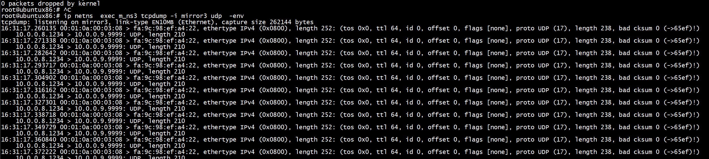

# make

```
root@ubuntux86:# pwd
/work/ovs_p4/p4c_demo/P4INT_P4PI
root@ubuntux86:# p4c p4src/int_md.p4
root@ubuntux86:# 
```

# mtu

降低mtu，否则加了int header 后报文超过mtu(1500),sw1_p2 无法接收， tcpdump -i sw1_p2 -env 也无法抓到报文
```
ip netns  exec ns1 ifconfig host1 mtu 1400
root@ubuntux86:# ip netns  exec ns1 ifconfig host1
host1: flags=4163<UP,BROADCAST,RUNNING,MULTICAST>  mtu 1400
        inet 10.0.1.1  netmask 255.255.0.0  broadcast 0.0.0.0
        inet6 fe80::8013:d5ff:fe3d:9cbf  prefixlen 64  scopeid 0x20<link>
        ether 52:49:c6:f8:3f:11  txqueuelen 1000  (Ethernet)
        RX packets 10693451  bytes 714082744 (714.0 MB)
        RX errors 0  dropped 10  overruns 0  frame 0
        TX packets 23143036  bytes 34954889834 (34.9 GB)
        TX errors 0  dropped 0 overruns 0  carrier 0  collisions 0

```

# rule

+ rule/s1-commands.txt 

从port=1（ int_set_source 1）接收到的报文进行遥测,添加int header，遥测根据key=（ip src,ip dst, src port, dst port）（int_source 10.0.1.1&&&0xFFFFFF00 10.0.3.2&&&0xFFFFFF00 ）   进行     
```
root@ubuntux86:# cat  rule/s1-commands.txt 
table_add l3_forward.ipv4_lpm ipv4_forward 10.0.1.1/32 => 52:49:c6:f8:3f:11   1
table_add l3_forward.ipv4_lpm ipv4_forward 10.0.3.2/32 => 52:49:c6:f8:3f:12   2

table_add process_int_source_sink.tb_set_source int_set_source 1 =>
table_add process_int_source.tb_int_source int_source 10.0.1.1&&&0xFFFFFF00 10.0.3.2&&&0xFFFFFF00 0x00&&&0x00 0x1e61&&&0xFFFF => 11 10 0xF 0xF 10
table_set_default process_int_transit.tb_int_insert init_metadata 1
```
+ s3-commands.txt 

遥测报文从port=3发出   

```
mirroring_add 500 3
table_add l3_forward.ipv4_lpm ipv4_forward 10.0.0.9/32 => fa:9c:98:ef:a4:22  3
```
从 port=2发出的报文要删除int header  process_int_source_sink.tb_set_sink int_set_sink 2

```
root@ubuntux86:# cat  rule/s3-commands.txt 
mirroring_add 500 3

table_add l3_forward.ipv4_lpm ipv4_forward 10.0.1.1/32 => 52:49:c6:f8:3f:11   1
table_add l3_forward.ipv4_lpm ipv4_forward 10.0.3.2/32 => 52:49:c6:f8:3f:12  2
table_add l3_forward.ipv4_lpm ipv4_forward 10.0.0.9/32 => fa:9c:98:ef:a4:22  3
table_add process_int_source_sink.tb_set_sink int_set_sink 2 =>
table_add process_int_report.tb_generate_report do_report_encapsulation => 00:01:0a:00:03:08 fa:9c:98:ef:a4:22 10.0.0.8 10.0.0.9  9999

table_set_default process_int_transit.tb_int_insert init_metadata 3

root@ubuntux86:# 
```


# iperf

+ client
```
root@ubuntux86:# ip netns  exec ns1 iperf -c 10.0.3.2 -p 7777 -t 600 -i 5   -u
------------------------------------------------------------
Client connecting to 10.0.3.2, UDP port 7777
Sending 1470 byte datagrams, IPG target: 11215.21 us (kalman adjust)
UDP buffer size:  208 KByte (default)
------------------------------------------------------------
[  3] local 10.0.1.1 port 45794 connected with 10.0.3.2 port 7777
[ ID] Interval       Transfer     Bandwidth
[  3]  0.0- 5.0 sec   642 KBytes  1.05 Mbits/sec
[  3]  5.0-10.0 sec   640 KBytes  1.05 Mbits/sec
[  3] 10.0-15.0 sec   640 KBytes  1.05 Mbits/sec
[  3] 15.0-20.0 sec   640 KBytes  1.05 Mbits/sec
[  3] 20.0-25.0 sec   640 KBytes  1.05 Mbits/sec
```


+ server

```
root@ubuntux86:# ip netns exec ns2 iperf -s -p 7777 -u
------------------------------------------------------------
Server listening on UDP port 7777
Receiving 1470 byte datagrams
UDP buffer size:  208 KByte (default)
------------------------------------------------------------
[  3] local 10.0.3.2 port 7777 connected with 10.0.1.1 port 45794
[ ID] Interval       Transfer     Bandwidth        Jitter   Lost/Total Datagrams
[  3]  0.0-600.0 sec  75.0 MBytes  1.05 Mbits/sec   0.299 ms    0/53499 (0%)
```

# mirror tcpdump    

