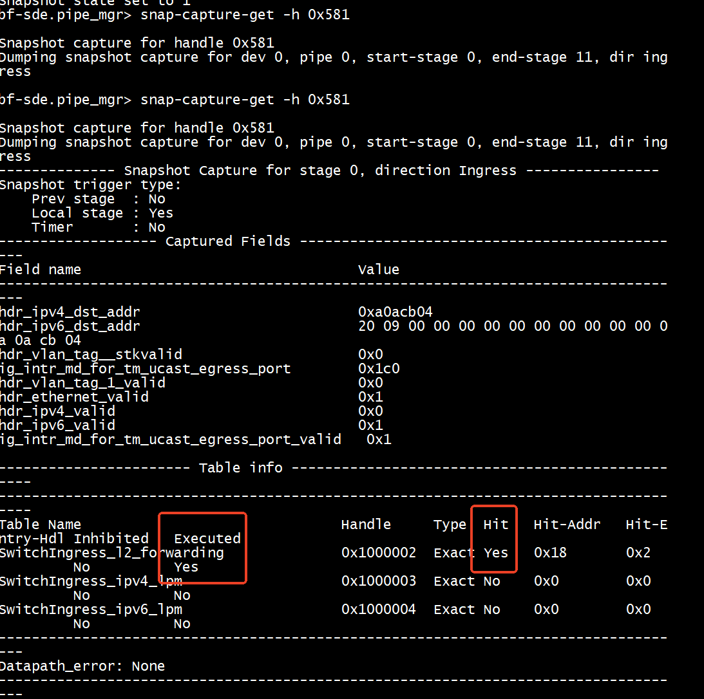
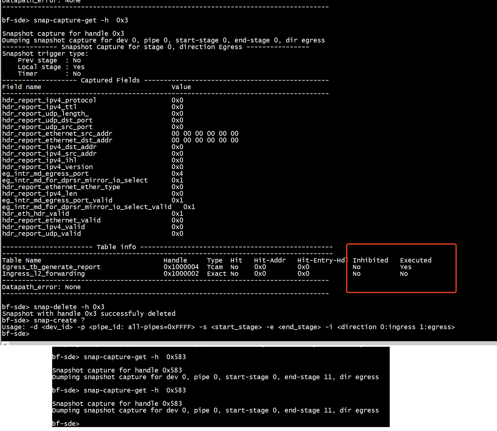

# dev

```
bf-sde.pipe_mgr> dev 
------------------------------------------------------------
Device|Type               |#pipe|#stg|#prsr|#macblk|#sub-dev
------|-------------------|-----|----|-----|-------|--------
0     |BFN-T20-128Q      |4    |20  |36   |-3     |1       
bf-sde.pipe_mgr> 
```

# snap

```
bfshell> ucli 
Cannot read termcap database;
using dumb terminal settings.
bf-sde.pm> ..
bf-sde> pi
bf-sde> pipe_mgr 
```

```
snap-create       Create a snapshot Usage: snap-create -d <dev_id> -p <pipe_id: all-pipes=0xFFFF> -s <start_stage> -e <end_stage> -i <direction 0:ingress 1:egress>
```

```
bf-sde.pipe_mgr> profile -d 0
Num of pipeline profiles: 1 
---------------------------------------------
Profile-id | Name            | Pipes in scope 
---------------------------------------------
0          | pipe            | 0 1 2 3        
bf-sde.pipe_mgr> 
```

```
bf-sde.pipe_mgr> phv-dump 
Usage: -d <dev_id> -p <log_pipe_id> -s <stage_id> -i <direction>
bf-sde.pipe_mgr> dev
------------------------------------------------------------
Device|Type               |#pipe|#stg|#prsr|#macblk|#sub-dev
------|-------------------|-----|----|-----|-------|--------
0     |BFN-T20-128Q      |4    |20  |36   |-3     |1       
bf-sde.pipe_mgr> phv-dump  -d 0 -p 0 
Usage: -d <dev_id> -p <log_pipe_id> -s <stage_id> -i <direction>
bf-sde.pipe_mgr> phv-dump  -d 0 -p 0 -s 0 -i 1

Pipe Stage SnapS Contr[Len] Field[S:E] PHV[S:E] Name
   0     0   Y       84[ 8]       0: 0     1: 1 eg_intr_md_egress_port_valid
   0     0   Y       84[ 8]       0: 0     0: 0 eg_intr_md_for_dprsr_mirror_io_select_valid
   0     0   Y      172[16]       0: 8     0: 8 eg_intr_md_egress_port
   0     0   Y      173[16]       0: 0     0: 0 eg_intr_md_for_dprsr_mirror_io_select

bf-sde.pipe_mgr> phv-dump  -d 0 -p 0 -s 0 -i 0

Pipe Stage SnapS Contr[Len] Field[S:E] PHV[S:E] Name
   0     0   Y       81[ 8]       0: 0     0: 0 hdr_vlan_tag_1_valid
   0     0   Y       81[ 8]       0: 1     0: 1 hdr_vlan_tag__stkvalid
   0     0   Y       82[ 8]       0: 0     2: 2 hdr_ethernet_valid
   0     0   Y       82[ 8]       0: 0     3: 3 hdr_ipv4_valid
   0     0   Y       82[ 8]       0: 0     4: 4 hdr_ipv6_valid
   0     0   Y      160[16]       0: 8     0: 8 ig_intr_md_ingress_port

bf-sde.pipe_mgr> phv-dump  -d 0 -p 0 -s 1 -i 0

Pipe Stage SnapS Contr[Len] Field[S:E] PHV[S:E] Name
   0     1   Y       81[ 8]       0: 0     0: 0 hdr_vlan_tag_1_valid
   0     1   Y       81[ 8]       0: 1     0: 1 hdr_vlan_tag__stkvalid
   0     1   Y       82[ 8]       0: 0     2: 2 hdr_ethernet_valid
   0     1   Y       82[ 8]       0: 0     3: 3 hdr_ipv4_valid
   0     1   Y       82[ 8]       0: 0     4: 4 hdr_ipv6_valid
   0     1   Y       82[ 8]       0: 0     0: 0 ig_intr_md_for_tm_ucast_egress_port_valid
   0     1   N      192[16]       0: 8     0: 8 ig_intr_md_for_tm_ucast_egress_port

bf-sde.pipe_mgr> phv-dump  -d 0 -p 0 -s 2 -i 0

Pipe Stage SnapS Contr[Len] Field[S:E] PHV[S:E] Name
   0     2   Y       81[ 8]       0: 0     0: 0 hdr_vlan_tag_1_valid
   0     2   Y       81[ 8]       0: 1     0: 1 hdr_vlan_tag__stkvalid
   0     2   Y       82[ 8]       0: 0     2: 2 hdr_ethernet_valid
   0     2   Y       82[ 8]       0: 0     3: 3 hdr_ipv4_valid
   0     2   Y       82[ 8]       0: 0     4: 4 hdr_ipv6_valid
   0     2   Y       82[ 8]       0: 0     0: 0 ig_intr_md_for_tm_ucast_egress_port_valid
   0     2   N      192[16]       0: 8     0: 8 ig_intr_md_for_tm_ucast_egress_port

bf-sde.pipe_mgr> phv-dump  -d 0 -p 0 -s 3 -i 0

Pipe Stage SnapS Contr[Len] Field[S:E] PHV[S:E] Name
   0     3   Y       81[ 8]       0: 0     0: 0 hdr_vlan_tag_1_valid
   0     3   Y       81[ 8]       0: 1     0: 1 hdr_vlan_tag__stkvalid
   0     3   Y       82[ 8]       0: 0     2: 2 hdr_ethernet_valid
   0     3   Y       82[ 8]       0: 0     3: 3 hdr_ipv4_valid
   0     3   Y       82[ 8]       0: 0     4: 4 hdr_ipv6_valid
   0     3   Y       82[ 8]       0: 0     0: 0 ig_intr_md_for_tm_ucast_egress_port_valid
   0     3   N      192[16]       0: 8     0: 8 ig_intr_md_for_tm_ucast_egress_port

bf-sde.pipe_mgr> 
```


```
bf-sde.pipe_mgr> phv-dump  -d 0 -p 0 -s 0 -i 0

Pipe Stage SnapS Contr[Len] Field[S:E] PHV[S:E] Name
   0     0   Y       12[32]       0:31     0:31 hdr_ipv4_dst_addr
   0     0   Y       12[32]       0:31     0:31 hdr_ipv6_dst_addr
   0     0   Y       13[32]      32:63     0:31 hdr_ipv6_dst_addr
   0     0   Y       14[32]      64:95     0:31 hdr_ipv6_dst_addr
   0     0   Y       15[32]      96:127     0:31 hdr_ipv6_dst_addr
   0     0   Y       81[ 8]       0: 0     0: 0 hdr_vlan_tag_1_valid
   0     0   Y       81[ 8]       0: 1     0: 1 hdr_vlan_tag__stkvalid
   0     0   Y       82[ 8]       0: 0     2: 2 hdr_ethernet_valid
   0     0   Y       82[ 8]       0: 0     3: 3 hdr_ipv4_valid
   0     0   Y       82[ 8]       0: 0     4: 4 hdr_ipv6_valid
   0     0   Y      160[16]       0: 8     0: 8 ig_intr_md_ingress_port

bf-sde.pipe_mgr> snap-create -d 0 -p 0 -s 0 -e 11 -i 0  
Snapshot created with handle 0x581 
bf-sde.pipe_mgr> snap-trig-add -h 0x581 -n hdr_ipv6_valid -v 0x1 -m 0x1   

Trigger: Adding Field hdr_ipv6_valid, value 0x1, mask 0x1
Success in adding field hdr_ipv6_valid to trigger 
bf-sde.pipe_mgr> snap-state-set -h 0x581 -e 1 
Snapshot state set to 1 
bf-sde.pipe_mgr> snap-capture-get -h 0x581 

Snapshot capture for handle 0x581 
Dumping snapshot capture for dev 0, pipe 0, start-stage 0, end-stage 11, dir ingress 

bf-sde.pipe_mgr> snap-capture-get -h 0x581

```




## 删除


```
snap-delete -h 0x581
```

## egress


### Field name md_is_mirror does not exist or not all trigger fields exist in a stage

```
bf-sde>  phv-dump  -d 0 -p 0 -s 0 -i 1

Pipe Stage SnapS Contr[Len] Field[S:E] PHV[S:E] Name
   0     0   Y      105[ 8]       0: 0     1: 1 eg_intr_md_egress_port_valid
   0     0   Y      105[ 8]       0: 0     0: 0 eg_intr_md_for_dprsr_mirror_io_select_valid
   0     0   Y      105[ 8]       0: 0     2: 2 hdr_eth_hdr_valid
   0     0   Y      172[16]       0: 8     0: 8 eg_intr_md_egress_port
   0     0   Y      173[16]       0: 0     0: 0 eg_intr_md_for_dprsr_mirror_io_select
   0     0   Y      173[16]       0: 0     1: 1 md_is_mirror
```
```
bf-sde>  phv-dump  -d 0 -p 0 -s 1 -i 1                      

Pipe Stage SnapS Contr[Len] Field[S:E] PHV[S:E] Name
   0     1   Y        0[32]       0: 7    16:23 hdr_report_ipv4_protocol
   0     1   Y        0[32]       0: 7    24:31 hdr_report_ipv4_ttl
   0     1   Y        1[32]       0:15    16:31 hdr_report_udp_length_
   0     1   N       12[32]       0:15     0:15 hdr_report_udp_dst_port
   0     1   N       12[32]       0:15    16:31 hdr_report_udp_src_port
   0     1   N       13[32]       0:31     0:31 hdr_report_ethernet_src_addr
   0     1   N       14[32]       0:31     0:31 hdr_report_ethernet_dst_addr
   0     1   N       15[32]       0:31     0:31 hdr_report_ipv4_dst_addr
   0     1   N       32[32]       0:31     0:31 hdr_report_ipv4_src_addr
   0     1   Y      105[ 8]       0: 0     1: 1 eg_intr_md_egress_port_valid
   0     1   Y      105[ 8]       0: 0     0: 0 eg_intr_md_for_dprsr_mirror_io_select_valid
   0     1   Y      105[ 8]       0: 0     2: 2 hdr_eth_hdr_valid
   0     1   Y      105[ 8]       0: 0     3: 3 hdr_report_ethernet_valid
   0     1   Y      105[ 8]       0: 0     4: 4 hdr_report_ipv4_valid
   0     1   Y      105[ 8]       0: 0     5: 5 hdr_report_udp_valid
   0     1   Y      106[ 8]       0: 3     0: 3 hdr_report_ipv4_ihl
   0     1   Y      106[ 8]       0: 3     4: 7 hdr_report_ipv4_version
   0     1   N      172[16]       0: 8     0: 8 eg_intr_md_egress_port
   0     1   N      173[16]       0: 0     0: 0 eg_intr_md_for_dprsr_mirror_io_select
   0     1   N      174[16]       0:15     0:15 hdr_report_ethernet_ether_type
   0     1   N      175[16]      32:47     0:15 hdr_report_ethernet_src_addr
   0     1   N      212[16]      32:47     0:15 hdr_report_ethernet_dst_addr
   0     1   N      213[16]       0:15     0:15 hdr_report_ipv4_len

```
只在stage 0    
```
bf-sde> snap-create -d 0 -p 0 -s 0 -e 11 -i 0  
Snapshot created with handle 0x581 
bf-sde> snap-trig-add -h 0x581 -n md_is_mirror -v 0x1 -m 0x1  

Tr2025-02-18 01:27:55.945610 BF_PIPE ERROR - Field name md_is_mirror does not exist or not all trigger fields exist in a stage 

igger: Adding Field md_is_mirror, value 0x1, mask 0x1
Failed to add field md_is_mirror to trigger 
```

添加成功   

```
bf-sde> snap-create ?
Usage: -d <dev_id> -p <pipe_id: all-pipes=0xFFFF> -s <start_stage> -e <end_stage> -i <direction 0:ingress 1:egress>
bf-sde> 
```

```
bf-sde> snap-create -d 0 -p 0 -s 0 -e 0  -i 1
Snapshot created with handle 0x3 
bf-sde> snap-trig-add -h 0x3 -n md_is_mirror -v 0x1 -m 0x1  

Trigger: Adding Field md_is_mirror, value 0x1, mask 0x1
Success in adding field md_is_mirror to trigger 
bf-sde> 
```

```
bf-sde>  snap-state-set -h 0x3 -e 1   
Snapshot state set to 1 
bf-sde> snap-capture-get -h  0x3

Snapshot capture for handle 0x3 
Dumping snapshot capture for dev 0, pipe 0, start-stage 0, end-stage 0, dir egress 
-------------- Snapshot Capture for stage 0, direction Egress ----------------
Snapshot trigger type: 
    Prev stage  : No 
    Local stage : Yes 
    Timer       : No 
------------------- Captured Fields -----------------------------------------------
Field name                                 Value 
-----------------------------------------------------------------------------------
hdr_report_ipv4_protocol                   0x0 
hdr_report_ipv4_ttl                        0x0 
hdr_report_udp_length_                     0x0 
hdr_report_udp_dst_port                    0x0 
hdr_report_udp_src_port                    0x0 
hdr_report_ethernet_src_addr               00 00 00 00 00 00 
hdr_report_ethernet_dst_addr               00 00 00 00 00 00 
hdr_report_ipv4_dst_addr                   0x0 
hdr_report_ipv4_src_addr                   0x0 
hdr_report_ipv4_ihl                        0x0 
hdr_report_ipv4_version                    0x0 
eg_intr_md_egress_port                     0x4 
eg_intr_md_for_dprsr_mirror_io_select      0x1 
hdr_report_ethernet_ether_type             0x0 
hdr_report_ipv4_len                        0x0 
eg_intr_md_egress_port_valid               0x1 
eg_intr_md_for_dprsr_mirror_io_select_valid   0x1 
hdr_eth_hdr_valid                          0x1 
hdr_report_ethernet_valid                  0x0 
hdr_report_ipv4_valid                      0x0 
hdr_report_udp_valid                       0x0 

----------------------- Table info -------------------------------------------------
------------------------------------------------------------------------------------
Table Name                               Handle     Type  Hit   Hit-Addr   Hit-Entry-Hdl Inhibited   Executed  
Egress_tb_generate_report                0x1000004  Tcam  No    0x0        0x0           No          Yes       
Ingress_l2_forwarding                    0x1000002  Exact No    0x0        0x0           No          No        
-----------------------------------------------------------------------------------
Datapath_error: None
-----------------------------------------------------------------------------------

bf-sde> 
```

#  pipe


```
bf-sde.pipe_mgr.pkt_path_counter> ..
bf-sde.pipe_mgr> pipe -d 0 -p 0
Pipeline 0:
    Logical pipe 0 maps to Physical pipe 0
bf-sde.pipe_mgr> pipe -d 0 -p 1
Pipeline 1:
    Logical pipe 1 maps to Physical pipe 1
bf-sde.pipe_mgr> pipe -d 0 -p 2
Pipeline 2:
    Logical pipe 2 maps to Physical pipe 2
bf-sde.pipe_mgr> pipe -d 0 -p 3
Pipeline 3:
    Logical pipe 3 maps to Physical pipe 3
bf-sde.pipe_mgr> pipe -d 0 -p 4
Invalid pipe <4> 
bf-sde.pipe_mgr> 
```

# 命令行 + ?

```
bfrt.tofino_mirr.pipe.Egress.tb_generate_report> set_default_with_do_report_encapsulation?
Signature:
set_default_with_do_report_encapsulation(
    src_mac=None,
    mon_mac=None,
    src_ip=None,
    mon_ip=None,
    mon_port=None,
    pipe=None,
    gress_dir=None,
    prsr_id=None,
)
Docstring:
Set default action for tb_generate_report table with action: Egress.do_report_encapsulation

Parameters:
src_mac                        type=BYTE_STREAM size=48 default=0
mon_mac                        type=BYTE_STREAM size=48 default=0
src_ip                         type=BYTE_STREAM size=32 default=0
mon_ip                         type=BYTE_STREAM size=32 default=0
mon_port                       type=BYTE_STREAM size=16 default=0
File:      Dynamically generated function. No source code available.
Type:      method
```