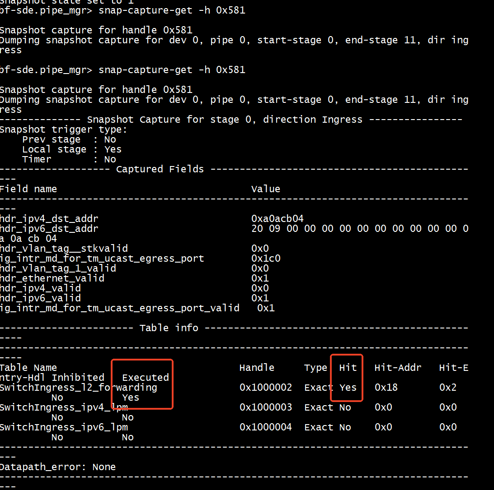

# dev

```
bf-sde.pipe_mgr> dev 
------------------------------------------------------------
Device|Type               |#pipe|#stg|#prsr|#macblk|#sub-dev
------|-------------------|-----|----|-----|-------|--------
0     |BFN-T20-128Q      |4    |20  |36   |-3     |1       
bf-sde.pipe_mgr> 
```

# snap

```
snap-create       Create a snapshot Usage: snap-create -d <dev_id> -p <pipe_id: all-pipes=0xFFFF> -s <start_stage> -e <end_stage> -i <direction 0:ingress 1:egress>
```

```
bf-sde.pipe_mgr> profile -d 0
Num of pipeline profiles: 1 
---------------------------------------------
Profile-id | Name            | Pipes in scope 
---------------------------------------------
0          | pipe            | 0 1 2 3        
bf-sde.pipe_mgr> 
```

```
bf-sde.pipe_mgr> phv-dump 
Usage: -d <dev_id> -p <log_pipe_id> -s <stage_id> -i <direction>
bf-sde.pipe_mgr> dev
------------------------------------------------------------
Device|Type               |#pipe|#stg|#prsr|#macblk|#sub-dev
------|-------------------|-----|----|-----|-------|--------
0     |BFN-T20-128Q      |4    |20  |36   |-3     |1       
bf-sde.pipe_mgr> phv-dump  -d 0 -p 0 
Usage: -d <dev_id> -p <log_pipe_id> -s <stage_id> -i <direction>
bf-sde.pipe_mgr> phv-dump  -d 0 -p 0 -s 0 -i 1

Pipe Stage SnapS Contr[Len] Field[S:E] PHV[S:E] Name
   0     0   Y       84[ 8]       0: 0     1: 1 eg_intr_md_egress_port_valid
   0     0   Y       84[ 8]       0: 0     0: 0 eg_intr_md_for_dprsr_mirror_io_select_valid
   0     0   Y      172[16]       0: 8     0: 8 eg_intr_md_egress_port
   0     0   Y      173[16]       0: 0     0: 0 eg_intr_md_for_dprsr_mirror_io_select

bf-sde.pipe_mgr> phv-dump  -d 0 -p 0 -s 0 -i 0

Pipe Stage SnapS Contr[Len] Field[S:E] PHV[S:E] Name
   0     0   Y       81[ 8]       0: 0     0: 0 hdr_vlan_tag_1_valid
   0     0   Y       81[ 8]       0: 1     0: 1 hdr_vlan_tag__stkvalid
   0     0   Y       82[ 8]       0: 0     2: 2 hdr_ethernet_valid
   0     0   Y       82[ 8]       0: 0     3: 3 hdr_ipv4_valid
   0     0   Y       82[ 8]       0: 0     4: 4 hdr_ipv6_valid
   0     0   Y      160[16]       0: 8     0: 8 ig_intr_md_ingress_port

bf-sde.pipe_mgr> phv-dump  -d 0 -p 0 -s 1 -i 0

Pipe Stage SnapS Contr[Len] Field[S:E] PHV[S:E] Name
   0     1   Y       81[ 8]       0: 0     0: 0 hdr_vlan_tag_1_valid
   0     1   Y       81[ 8]       0: 1     0: 1 hdr_vlan_tag__stkvalid
   0     1   Y       82[ 8]       0: 0     2: 2 hdr_ethernet_valid
   0     1   Y       82[ 8]       0: 0     3: 3 hdr_ipv4_valid
   0     1   Y       82[ 8]       0: 0     4: 4 hdr_ipv6_valid
   0     1   Y       82[ 8]       0: 0     0: 0 ig_intr_md_for_tm_ucast_egress_port_valid
   0     1   N      192[16]       0: 8     0: 8 ig_intr_md_for_tm_ucast_egress_port

bf-sde.pipe_mgr> phv-dump  -d 0 -p 0 -s 2 -i 0

Pipe Stage SnapS Contr[Len] Field[S:E] PHV[S:E] Name
   0     2   Y       81[ 8]       0: 0     0: 0 hdr_vlan_tag_1_valid
   0     2   Y       81[ 8]       0: 1     0: 1 hdr_vlan_tag__stkvalid
   0     2   Y       82[ 8]       0: 0     2: 2 hdr_ethernet_valid
   0     2   Y       82[ 8]       0: 0     3: 3 hdr_ipv4_valid
   0     2   Y       82[ 8]       0: 0     4: 4 hdr_ipv6_valid
   0     2   Y       82[ 8]       0: 0     0: 0 ig_intr_md_for_tm_ucast_egress_port_valid
   0     2   N      192[16]       0: 8     0: 8 ig_intr_md_for_tm_ucast_egress_port

bf-sde.pipe_mgr> phv-dump  -d 0 -p 0 -s 3 -i 0

Pipe Stage SnapS Contr[Len] Field[S:E] PHV[S:E] Name
   0     3   Y       81[ 8]       0: 0     0: 0 hdr_vlan_tag_1_valid
   0     3   Y       81[ 8]       0: 1     0: 1 hdr_vlan_tag__stkvalid
   0     3   Y       82[ 8]       0: 0     2: 2 hdr_ethernet_valid
   0     3   Y       82[ 8]       0: 0     3: 3 hdr_ipv4_valid
   0     3   Y       82[ 8]       0: 0     4: 4 hdr_ipv6_valid
   0     3   Y       82[ 8]       0: 0     0: 0 ig_intr_md_for_tm_ucast_egress_port_valid
   0     3   N      192[16]       0: 8     0: 8 ig_intr_md_for_tm_ucast_egress_port

bf-sde.pipe_mgr> 
```


```
bf-sde.pipe_mgr> phv-dump  -d 0 -p 0 -s 0 -i 0

Pipe Stage SnapS Contr[Len] Field[S:E] PHV[S:E] Name
   0     0   Y       12[32]       0:31     0:31 hdr_ipv4_dst_addr
   0     0   Y       12[32]       0:31     0:31 hdr_ipv6_dst_addr
   0     0   Y       13[32]      32:63     0:31 hdr_ipv6_dst_addr
   0     0   Y       14[32]      64:95     0:31 hdr_ipv6_dst_addr
   0     0   Y       15[32]      96:127     0:31 hdr_ipv6_dst_addr
   0     0   Y       81[ 8]       0: 0     0: 0 hdr_vlan_tag_1_valid
   0     0   Y       81[ 8]       0: 1     0: 1 hdr_vlan_tag__stkvalid
   0     0   Y       82[ 8]       0: 0     2: 2 hdr_ethernet_valid
   0     0   Y       82[ 8]       0: 0     3: 3 hdr_ipv4_valid
   0     0   Y       82[ 8]       0: 0     4: 4 hdr_ipv6_valid
   0     0   Y      160[16]       0: 8     0: 8 ig_intr_md_ingress_port

bf-sde.pipe_mgr> snap-create -d 0 -p 0 -s 0 -e 11 -i 0  
Snapshot created with handle 0x581 
bf-sde.pipe_mgr> snap-trig-add -h 0x581 -n hdr_ipv6_valid -v 0x1 -m 0x1   

Trigger: Adding Field hdr_ipv6_valid, value 0x1, mask 0x1
Success in adding field hdr_ipv6_valid to trigger 
bf-sde.pipe_mgr> snap-state-set -h 0x581 -e 1 
Snapshot state set to 1 
bf-sde.pipe_mgr> snap-capture-get -h 0x581 

Snapshot capture for handle 0x581 
Dumping snapshot capture for dev 0, pipe 0, start-stage 0, end-stage 11, dir ingress 

bf-sde.pipe_mgr> snap-capture-get -h 0x581

```




#  pipe


```
bf-sde.pipe_mgr.pkt_path_counter> ..
bf-sde.pipe_mgr> pipe -d 0 -p 0
Pipeline 0:
    Logical pipe 0 maps to Physical pipe 0
bf-sde.pipe_mgr> pipe -d 0 -p 1
Pipeline 1:
    Logical pipe 1 maps to Physical pipe 1
bf-sde.pipe_mgr> pipe -d 0 -p 2
Pipeline 2:
    Logical pipe 2 maps to Physical pipe 2
bf-sde.pipe_mgr> pipe -d 0 -p 3
Pipeline 3:
    Logical pipe 3 maps to Physical pipe 3
bf-sde.pipe_mgr> pipe -d 0 -p 4
Invalid pipe <4> 
bf-sde.pipe_mgr> 
```