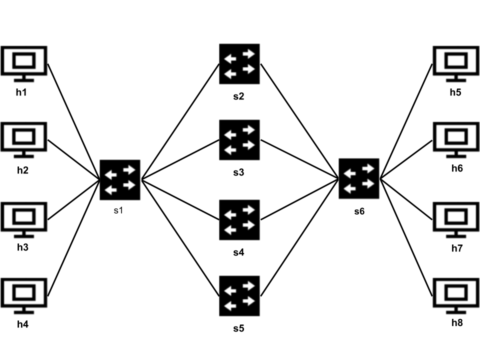

# Project 6: Congestion Aware Load Balancing

## Objectives:
- Implementing the [CONGA](https://people.csail.mit.edu/alizadeh/papers/conga-sigcomm14.pdf) load balancing algorithm.
- Understand the benefits of congestion aware load balancing

## Overview

In this project, we will support a better load balancing solution than ECMP---congestion-aware load balancing.
We will collect queuing information (i.e. for example how many packets are waiting to be transmitted) at switches to detect congestion (i.e. if a queue contains many packets). If an egress (the switch right before the destination host) identifies that the packet has experienced congestion, then it sends a notification message to the ingress switch of the packet. Upon receiving the message, the switch randomly moves the flow to another path. Obviously, this is a simpler and less effective solution compared to the full CONGA solution, but it will be enough to show how to collect information as packets cross the network, how to communicate between switches, and how to make them react to network states.

We encourage you to revisit `p4_explanation.md` in project 3 for references if you incur P4 related questions in this project.

Through Part 1 to 5, we mainly work with UDP flows because it provides larger stable flows and makes flow rate differences easier to observe. For Part 6 and 7, you should adapt your solution to work for both TCP and UDP flows. 

## Part 1: Observing the problem

In this part, we use a `Medium topology` as illustrated in the following figure:

The bandwidth of each link is 2 Mbps.

We send flows from h1 to h5, from h2 to h6, from h3 to h7, and from h4 to h8. Each flow has four different potential paths to travel on. Let's first use the provided code and observe how flows collide.

1. Start the medium size topology:

   ```bash
   sudo p4run --config topology/p4app-medium.json
   ```

2. Open a `tmux` terminal by typing `tmux` (or if you are already using `tmux`, open another window and type `tmux`) and run monitoring script (`nload_tmux_medium.sh`). This script uses `tmux` to create a window with 4 panes. In each pane it launches a `nload` session with a different interface (`s2-eth1`, `s3-eth1`, `s4-eth1`, and `s5-eth1`). These interfaces directly connect `s2-s5` to `s1`. `nload`, which has already been installed in our provided VM, is a console application which monitors network traffic and bandwidth usage in real time.

   ```bash
   tmux
   ./nload_tmux_medium.sh
   ```

3. Send traffic from `h1-h4` to `h5-h8` (Make sure that you have run `make` in apps/traffic_generator). Create the traffic trace via

   ```bash
   python apps/trace/generate_trace.py ./apps/trace/project6_onetoone.json
   ```

   Then send the trace using this command.

   ```bash
   sudo apps/send_traffic.py --trace ./apps/trace/project6_onetoone.trace --protocol udp
   ```

   If each flow gets placed to a different path (very unlikely) you should get a bandwidth close to `2Mbps` (which is the link bandwidth). In the example below, after trying once, we got 2 flows colliding in the same path, and thus they get ~1 Mbps, and only two flows get full bandwidth:

<p align="center">

<p/>

The objective of this project is to provide the network the means to detect this kind of collisions and react to the congestion.

## Part 2: Detecting Congestion

Before implementing the real solution, let's first do a small modification to the starting p4 program to show how to read queue information. Some of the code we implement in this section has to be changed for the final solution. Our objective in this example is to add a telemetry header to every packets with dst port 7777. This telemetry header carries the largest queue depth found along the path. We add the `telemetry` header if the packet does not have it (packet is at the first switch along the path), and then update its `enq_qdepth` value by setting it to the highest value we find along the path.

1. First add a new header to the program and call it `telemetry`. This header has two fields: `enq_qdepth` (16 bits) and `nextHeaderType` (16 bits). You need to place this header between the `ethernet` and `ipv4` (take this into account when you define the deparser).
2. Update deparser accordingly.
3. When packets carry the `telemetry` header, the `ethernet.etherType` has to be set to `0x7777` (telemetry). Update the parser accordingly. Note that the `telemetry` header has a `nextHeaderType` that can be used by the parser to know which is the next header (typically `0x800` (ipv4)).
4. When the switch enqueues a packet to its output port, we get its queuing information at the egress pipeline. Specifically, `standard_metadata.enq_qdepth` contains the number of packets in the queue when this packet was enqueued (You can check out all the queue metadata fields in the [v1model.p4](https://github.com/p4lang/p4c/blob/master/p4include/v1model.p4#L59). You may need to do a casting when using the standard `enq_qdepth` (eg, `(bit<16>)standard_metadata.enq_qdepth`). 

To make this simple test work, you should implement the following logic at the egress pipeline:

   (1) If the `udp` header is valid and the `udp.dstPort == 7777`, we identify this packet as a probe packet and run (2) and (3) on this packet

   (2) If there is no `telemetry` header, add the `telemetry` header to the packet and set the depth field to `standard_metadata.enq_qdepth`.  Modify the ethernet type to the one mentioned above, set the `nextHeaderType` to the ipv4 ethernet type.

   (3) If there is already a `telemetry` header and if `standard_metadata.enq_qdepth` value is higher than the value already in the header, store the new value. 

<!-- (a trick we use to send probes, see [scapy sending script](./probe_send.py)). -->

### Testing
1. Start the topology.

   ```bash
   sudo p4run --config topology/p4app-medium.json
   ```

2. Open a terminal in `h1` and `h6`. And run the probe_packet_sender.py and probe_packet_receiver.py scripts. Note that these commands should be run in a new terminal tab or window, not as commands in the Mininet command line.

   ```bash
   mx h6
   python probe_packet_receiver.py
   ```

   ```bash
   mx h1 
   python probe_packet_sender.py 10.6.6.2 1000
   ```

  You should now see that the receiver prints the queue depth observed by the probes we are sending (packets with dst port == 7777). Since we are not sending any traffic yet, queue depth is always 0.

3. Create the traffic trace `apps/trace/project6_part2.trace` from `apps/trace/project6_part2.json` and run `send_traffic` with `--protocol udp`. You do not have to login into `h1` to send. This trace will generate four flows from `h1`, `h2`, `h3` and `h4` to `h5`, `h6`, `h7`, and `h8`. These four flows will collide. If you continue sending probes you should see how the queue starts filling up. (Note that we are using udp in particular because tcp leads to small queue depth.) <!-- to 63 and starts oscillating (due to tcp nature). -->
   ```bash
   python apps/trace/generate_trace.py ./apps/trace/project6_part2.json
   sudo apps/send_traffic.py --trace ./apps/trace/project6_part2.trace --protocol udp
   ```


## Part 3: Keeping the telemetry in-network

In Part 2, we set the telemetry header as a packet enters the network with a specific destination port and keep the telemetry header until the packet reaches the destination. We just did that for the sake of showing you how the queue depth changes as we make flows collide in one path.

Now in Part 3 (the real implementation of CONGA), only switches inside the network use the telemetry header to detect congestion and move flows. Thus, packets leaving the internal network (going to a host) should not have the telemetry header in them. Therefore, we need to remove it before the packet reaches a host.

To do that you need to know which type of node (the host or the switch) is connected to each switch's port. As you have seen, to do something like that we need to use a table, the control plane, and the topology object that knows how nodes are connected. In brief, in this section you have to:

1. Define a new table `egress_type_table` and action in the ingress pipeline in P4. This table should match to the `egress_spec` and call an action that sets to which type of node (host or switch) the packet is going to (save that in a metadata field). For example, you can use the number 1 for hosts and 2 for switches. The type of outgoing node determines whether to send the telemetry header or not.
   
2. Apply this table `egress_type_table` at the ingress control once `egress_spec` is known.

3. Fill up the `set_egress_type_table` function in `routing-controller.py` program. The goal of this function is to install entries in `egress_type_table` based on your topology. For each switch, you should have one entry for each output port and the type of its connected node (i.e., host(1) or switch(2)).

4. Based on `egress_type_table`, manage the telemtry packets in the P4 egress pipeline. 
   
   (1) Do not check for the dst port 7777 anymore (remove that part of the code for the final real implementation).

   (2) Identify whether this is an ingress switch (the first hop on a path) , an egress switch (the last hop on a path), or a switch in the middle. **Hint:** You can check if there is a telemetry header in the packet, and check the output of the `egress_type_table`. If we haven't added any telemetry header to a packet yet, it's the ingress switch. If we have seen the telemetry header and the next hop is connected to a host, it's the egress switch. The rest are middle switches.

   (3) Ingress switch: Add the `telemetry` header, set the `enq_qdepth` field, `nextHeaderType`, and set the `etherType` to `0x7777` (telemetry).

   (4) Middle switch: Update the `enq_qdepth` field if its bigger than the current one.
   
   (5) Egress switch: Remove the `telemetry` header, and set the `etherType` to `0x800` (ipv4).
   

### Testing
At this point, for each packet that enters the network, your switches should add the telemetry header and remove it when the packet exits to a host. To test that this is working, you can send traffic (you can reuse part2's trace ./apps/trace/project6_part2.json to do this) and inspect the pcap files that record the packets as we did in Project 5 to check:
<!-- You can parse the pcap file with e.g., Wireshark to check: --> 
1. There are telemetry packets in the internal links. That is, these packets have Ethernet headers `0x7777` and that the next 4 bytes belong to the `telemetry` headers.
2. Traffic exiting the network (going to hosts) look normal (i.e., no telemetry headers).

<!-- **Note:** Due to adding extra bytes to packets you will not be able to run the `mininet> iperf` command anymore directly from the CLI. 
This is because by default, iperf sends packets with the maximum transmission unit (MTU). Thus if the ingress switch adds 4 bytes to packets, the interface would drop the over-sized packets. 
So when you run `iperf`, you should use `-M` to set its packet size. 
In our network created using `P4-utils`, the MTU is set to 9500. That's why in 
our `send_traffic*` scripts, we set iperf packtet size to be <= 9000 bytes. -->

## Part 4: Congestion notification

In this part, you will implement the egress logic that detects congestion for a flow, and sends a feedback packet to the previous-hop ingress switch (the entry switch in the topology). To generate
a packet and send it to the ingress switch you need to `clone` the packet that triggers the congestion, modify it, and send it back to the switch.

### Step 1: Notification conditions
There are several things to consider when sending a congestion notification. You should implement these conditions by extending the Part 3 code where the egress switches remove the `telemetry` headers.

1. Set the notification threshold. The switch should only send a notification when the received queue `depth` is above a threshold. As default queues are 64 packets long, you can set the threshold as a number between 30 and 40 to trigger the notification message.

2. Reduce the number of notifications per flow. Upon congestion the switch receives a burst of packets that would trigger many notification messages. To reduce the number of messages, we set a timeout per flow. For instance, every time you send a notification message for flow X, you save in a `register` the current timestamp. The next time you need to send a notification message, you check in the register if the time difference is bigger than some seconds (for example 0.1-0.5 second).

3. Probabilistic notifications across flows. Furthermore, during congestion, all the flows that see the congestion would trigger notification messages. Moving all the flows to a new path can be suboptimal. You may end up creating congestion in other paths and leaving the current one empty. Thus, sometimes it's better if you don't move them all. You can use a probability p (i.e., 33%) to decide whether to notify a flow and move it.

### Step 2: Generate notification packets
If all the conditions above are met, you can now generate the congestion notification packet. You can clone an incoming packet (you have to clone from egress to egress, see `p4_explanation.md` in project 3 for more details) and modify the cloned packet to carry the congestion notification. You need to decide which port to clone the packet to. Here you have two options:

a. You define a `mirror_session` for each switch port.  For that you would need to use the `ingress_port` and a table that maps it to a mirror id that would send the packet to the port where the packet came from.

b. You clone the packet to any port (lets say port 1, it really does not matter). And then you recirculate it by using the `recirculate` extern. This allows you to send this packet again to the ingress pipeline so you can use the normal forwarding tables to forward the packet. We recommend you to use this second option since it does not require an extra table and ensures that the packet is properly forwarded using the routing table.

For the notification packet, you need to modify its ethernet type to the notification type we define (0x7778). Remember to update the parser accordingly.

**Hint 1:** Since we want to send the notification packet back to the ingress switch, you can just swap the source and destination IP addresses of the original packet, so the cloned packet's destination is the original source host. In this way, the notification packet is automatically routed to the ingress switch and the ingress switch can drop the notification packet there.

**Hint 2:** To differentiate between `NORMAL`, `CLONED`, and `RECIRCULATED` packets, you can use the metadata `standard_metadata.instance_type` (see more at `p4_explaination.md`). 

<!-- Check the
standard metadata [documentation](https://github.com/p4lang/behavioral-model/blob/master/docs/simple_switch.md#standard-metadata). -->

### Testing
To test if your implementation sends notifications to the ingress switch, you can generate congestion (you can use part2's trace or part6's trace ./apps/trace/project6_part6.json to do this), check the pcap files of the ingress switch, and see if you see packets with the notification type (<!-- 0x7777 -->0x7778). 

**Hint 3:** If you find testing on the medium topology too complex, you may consider debugging on the line topology in the topology directory (this line topology is the same as the one in project 0) and use the project6_line_topo.trace.
```bash
   python apps/trace/generate_trace.py ./apps/trace/project6_line_topo.json
   sudo apps/send_traffic.py --trace ./apps/trace/project6_line_topo.trace --protocol udp
   ```

## Part 5: Move flows to new paths

In this section we will close the loop and implement the logic that makes ingress switches move flows to new paths. For that you need the following steps:

1. For every notification packet that should be dropped at this switch (meaning that the current switch is sending it to a host). You have to update how the congested flow is hashed.

2. For that you need to save in a `register` an ID value for each flow. Every time you receive a congestion notification for a given flow you will have to update the register value with a new id (use a random number). Remember that
the notification message has the source and destination IPs swapped, so to access the register entry of the original flow you have to take that into account when hashing the 5-tuple to get the register index.

3. You also need to update the hash function used in the original program (ECMP) and add a new field to the 5-tuple hash that will act as a randomizer (something like we did for flowlet switching).

4. Finally make sure you drop the congestion notification message.

**Note:** Remember to use the `standard_metadata.instance_type` to correctly implement the ingress and egress logic.

## Part 6: Testing your full solution

Once your implementation is ready, here is the end-to-end testing steps:

1. Start the medium size topology:

   ```bash
   sudo p4run --config topology/p4app-medium.json
   ```

2. Open a `tmux` terminal by typing `tmux` (or if you are already using `tmux`, open another window and type `tmux`). And run monitoring script (`nload_tmux_medium.sh`). This script will use `tmux` to create a window
with 4 panes, in each pane it will lunch a `nload` session with a different interface (`s2-eth1`, `s3-eth1`, `s4-eth1`, and `s5-eth1`), which are the interfaces directly connecting `s2-s5` to `s1`.

   ```bash
   tmux
   ./nload_tmux_medium.sh
   ```

3. Test with UDP: Create traffic trace and send traffic from `h1-h4` to `h5-h8`.

   ```bash
   python apps/trace/generate_trace.py ./apps/trace/project6_part6.json
   ```

   ```bash
   sudo apps/send_traffic.py --trace ./apps/trace/project6_part6.trace --protocol udp
   ```

4. Transition to TCP: To adapt our solution to also work with TCP, we need to take two steps: (1) extract the TCP header in parser and (2) include TCP srcPort and dstPort in the fields we are hashing over. If in project 3 you changed your solution to support both UDP and TCP for the Bisection Bandwidth experiment, you would find the changes you need to make here very similar to what you did in project 3. 

5. Test with TCP: Send traffic from `h1-h4` to `h5-h8` using the following script. This script will run one flow from each host, and the transmission will last for 300 seconds.
   ```
   python send_traffic_onetoone.py 300
   ```
<!-- 4. If you want to send 4 different flows, you can just run the command again, it will first stop all the `iperf` sessions, alternatively, if you want
to stop the flow generation you can kill them:

   ```bash
   sudo killall iperf
   ```
-->
This time, if your system works, flows should start moving until eventually converging to four different paths. Since we are using a simple solution in which flows get just randomly re-hashed, it can take some time until they converge (even one or two minutes). Of course, this exercise was just a way to show you how to use the queueing information to make switches exchange information and react autonomously. In a more advanced solution you would try to learn what is the occupancy of all the alternative paths and just move flows to those paths that are least utilized.

## Part 7: Compare ECMP and CONGA Load Balancing in an asymmetric topology

In this section, we use an example to see how your traffic balancer could perform better than ECMP in an asymmetric topology. We use the following topology for our experiment:


We send 4.8 Mbps of TCP traffic from `h1` to `h2`, which consists of eight 600Kbps TCP flows.  
ECMP would split the flow evenly, leading to underutilization of the upper path(through s2), and packet loss on the lower path(through s3). However, the congestion aware system (CONGA) should shift traffic to allow for efficient utilization of the bandwidth, for example, where 1.6 Mbps is sent through s3 while 3.2 Mbps is sent through s2, where the bandwidth is higher.

**Note:** Be sure to monitor your CPU utilization during this process. If the cpu utilization gets too high, scale down the bandwidths of the links and of your traffic generator. This should minimize any unexpected behavior during the test.

There are some steps you need to complete before comparing these two systems.

1. Copy over the P4 code and the routing controller code of your ECMP implementation in project3. 

2. Modify the routing controller to accommodate the new topology.


### Testing

1. Edit the configuration file of the asymmetric topology(`topology/p4app-asym.json`) to run your ECMP code, and also your ECMP controller.

2. Start the asymmetric topology, which connects 2 hosts with two different paths, but the paths have an asymmetric distribution of bandwidth:

   ```bash
   sudo p4run --config topology/p4app-asym.json
   ```

3. Send traffic from `h1` to `h2`. There is a script that sends traffic for you automatically. This script sends eight 600 Kbps flows from h1 to h2.

   ```bash
   sudo python send_traffic_asym.py
   ```

4. If you would like to stop the traffic, kill all the traffic generators with this command:

   ```bash
   sudo killall iperf3
   ```

Next, try running the topology with your conga.p4 code and the corresponding routing controller.

In your report, please show the performance reported from `send_traffic_asym.py` between ECMP and CONGA and compare their performance difference. Please explain the reasons for your observations in the report.

## Extra credits

### Investigate the right threshold setting (10 credits)
In Part 4 congestion notification, you can set the notification threshold as a number between 30 and 60. Now your job is to understand the impact of thresholding in the load balancing system. Start by selecting a flow that is involved in the congestion. Draw a graph with x-axis as different thresholds and y-axis as the number of notification messages you get. Next, draw a timeline of the notified congestion levels. Explain what you observe.

### Investigate alternative load balancing policies (10 credits)
Can you extend your load balancer to incorporate more Conga design (e.g., select paths based on their congestion levels rather than randomly)? Can you think about alternative ways to further improve CONGA performance for specific workloads? Design your own experiments and explain what you observe. For example, in past years, a student has explored giving priorities to selected flows. 

## Submission and Grading

### What to Submit

You are expected to submit the following documents:

1. code: The main P4 code should be in `p4src/include/headers.p4`, `p4src/include/parsers.p4`, and `p4src/conga.p4`;  The controller code should be in `controller/routing-controller.py` which fills in table entries when launching those P4 switches.

2. report/report.md: You should describe the performance difference between ECMP and the implementation in this project in `report.md`.

### Grading

The total grades is 100:

- 30: For your description for your code, and your comparison between ECMP load balancing and congestion aware load balancing in `report.md`.
- 70: We will check the correctness of your code for congestion aware load balancing.
- Deductions based on late policies

### Survey

Please fill up the survey when you finish your project.

[Survey link](https://docs.google.com/forms/d/e/1FAIpQLSdpJBEA2ocPctgg6uBjTqAL6PZPK6__TClxD69UKaioUJUZEA/viewform?usp=sf_link)
