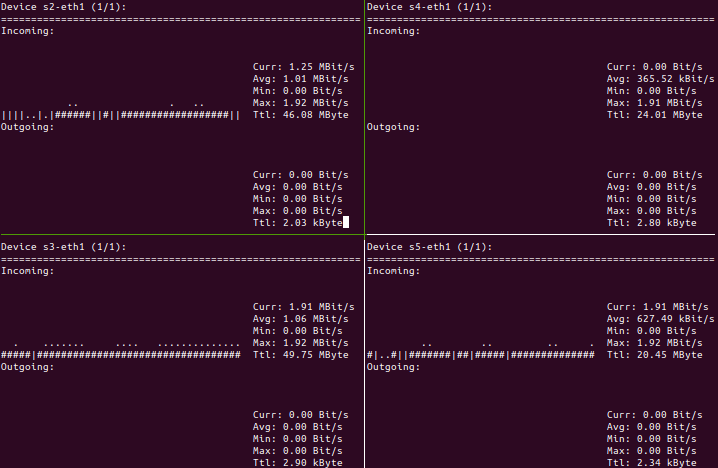

# Project 5: Flowlet Load Balancing

## Objectives

- Understand the concept of flowlets and detect flowlets in real-traffic
- Understand the benefits of flowlet based load balancing
- Understand the benefits of congestion aware load balancing

## Getting Started

To start this project, you will first need to get the [infrastructure setup](https://github.com/minlanyu/cs145-site/blob/spring2025/infra.md) and clone this repository with submodules
```
git clone --recurse-submodules <your repository>
```

When there are updates to the starter code, TFs will open pull requests in your repository. You should merge the pull request and pull the changes back to local. You might need to resolve conflicts manually (either when merging PR in remote or pulling back to local). However, most of the times there shouldn't be too much conflict as long as you do not make changes to test scripts, infrastructures, etc. Reach out to TF if it is hard to merge.

- In Project 5, we provide you with the skeleton P4 script files (`Imcompleted`), the completed controller script (`Completed`), and the completed topology file (`Completed`), enabling you to build the flowlet on top of that. It will also work if you choose to inherit your `p4src/l3fwd.p4`, `topology/p4app_fat.json` (Fattree with k=4), and `controller/controller_fat_l3.py` files from Project 3.
- We encourage you to revisit `p4_explanation.md` in project 3 for references if you incur P4 related questions in this project.

## Introduction

We implemented ECMP in Project 3. But one drawback of ECMP is that ECMP may hash two large flows onto the same path, which causes congestion. The purpose of this project is to divide large flows into smaller *flowlets* and run load balancing based on those flowlets (instead of flows). Flowlet switching leverages the burstness of TCP flows to achieve better load balancing. TCP flows tend to come in bursts (because TCP is window based). Every time there is gap which is big enough (e.g., 50ms) between packets from the same flow, flowlet switching will rehash the flow to another path (by hashing an flowlet ID value together with the 5-tuple). For more information about flowlet switching check out this [paper](https://www.usenix.org/system/files/conference/nsdi17/nsdi17-vanini.pdf).


## Part 0: Observing the problem

In this part, we use a `Medium topology` as illustrated in the following figure:

The bandwidth of each link is 2 Mbps.

We send flows from h1 to h5, from h2 to h6, from h3 to h7, and from h4 to h8. Each flow has four different potential paths to travel on. Let's first use the provided code and observe how flows collide.

1. Start the medium size topology:

   ```bash
   sudo p4run --config topology/p4app-medium.json
   ```

2. Open a `tmux` terminal by typing `tmux` (or if you are already using `tmux`, open another window and type `tmux`) and run monitoring script (`nload_tmux_medium.sh`). This script uses `tmux` to create a window with 4 panes. In each pane it launches a `nload` session with a different interface (`s2-eth1`, `s3-eth1`, `s4-eth1`, and `s5-eth1`). These interfaces directly connect `s2-s5` to `s1`. `nload`, which has already been installed in our provided VM, is a console application which monitors network traffic and bandwidth usage in real time.

   ```bash
   tmux
   ./nload_tmux_medium.sh
   ```

3. Send traffic from `h1-h4` to `h5-h8` (Make sure that you have run `make` in apps/traffic_generator). Send the trace using this command.

   ```bash
   sudo apps/send_traffic.py --trace ./apps/trace/project5_onetoone.trace --protocol udp
   ```

   If each flow gets placed to a different path (very unlikely) you should get a bandwidth close to `2Mbps` (which is the link bandwidth). In the example below, after trying once, we got 2 flows colliding in the same path, and thus they get ~1 Mbps, and only two flows get full bandwidth:

<p align="center">

<p/>

One way of solving this problem is to provide fine-grained load balancing to avoid hotspot congestion.

## Part One: Flowlet Switching

In this part, you are expected to implement flowlet switching. 
You need to modify `p4src/flowlet_switching.p4` to implement flowlet switching. 

The original ECMP hashes on 5 tuples of a flow to select paths. Now with flowlets, we hash on not only the 5 tuples of a flow but also its flowlet IDs so we can select different paths for flowlets of the same flow. Here is the concrete workflow:

1. We identify flowlets by maintaining the timestamp of the last seen packet of each 5-tuple flow. You can use `standard_metadata.ingress_global_timestamp` to get the current timestamp (in micro-second) in the P4 switch. You can maintain these timestamps for each flow in a hash table. You may consider setting a large hash table size, e.g, 8192, so that you do not need to handle hash collision.
2. We define the flowlet timeout as how long a flowlet remains active. If the next packet takes more than the flowlet timeout time to arrive, we treat it as the start of a new flowlet. We suggest you set flowlet timeout as **50ms** in your experiments. Whenever the difference between the current timestamp and the last timestamp is larger than the gap, then you should treat the packet as the starting packet of a new flowlet.
3. For each new flowlet, assign it with a random flowlet ID. A large flow can have many flowlets sometimes even over a thousand. Register with of 16 bits should be fine for storing a flowlet ID. Anything larger also should not be an issue. You can use `random(val, (bit<32>)0, (bit<32>)65000)` to get a random number from 0 to 65000, and the value is written to `val`.
4. Use hash function to compute hash value for a combination of five tuples and the flowlet ID. Then use the hash value as the new ecmp group ID (due to modulo, this new ID might be the same as the old one; but overall, flowlets are distributed among all path evenly). This new ECMP group ID determines which port the switch forwards this packet to. 
5. Consider whether or not to modify the controller code.

## Hints
This code snippet provides an example of how to use registers in P4. We read from a register, compare its value with packet global timestamps, and write the timestamp back to the register.

```
struct metadata {
    bit<16> register_index;
}

control MyIngress(inout headers hdr, inout metadata meta,
                  inout standard_metadata_t standard_metadata) {
    
    /* Declare a set of registers with a size of 8192 */
    register<bit<48>>(8192) my_register;

    /* Define an action to update the registers */
    action update_register() {
        bit<48> dst_data;
        
        /* Read the content of the register with the index specified in metadata to dst_data */
        my_register.read(dst_data, (bit<32>)meta.register_index);
        
        /* If the stored data in the register has a smaller value compared to the global timestamp */
        if (standard_metadata.ingress_global_timestamp > dst_data) {

            /* Update the register with the global timestamp value */
            my_register.write((bit<32>)meta.register_index, standard_metadata.ingress_global_timestamp);

        }
    }

    apply {
        if (hdr.ipv4.isValid()){
            
            /* Call the update_register action to update the register conditionally */
            update_register();
        }
    }
}
```

### Testing
Your code should work for the following testing. These are also good steps for debugging.
1. Run your `p4src/flowlet_switching.p4`
```
sudo p4run --conf topology/p4app_fat_flowlet.json
```
2. Start your controller
```
python controller/controller_flowlet.py
```
3. Testing connectivity:
- Run `pingall`.
4. In the first testing script, it starts multiple flows in the network. If your setup effectively balances the traffic between different flows, as intended with original ECMP, then you should pass this test:
- Run `sudo python3 tests/validate_ecmp.py`. 
5. The second testing script tests Flowlet-based ECMP. Each test case involves only one flow at a time. If your implementation of Flowlet ECMP is accurate, you should be able to pass this test:
- Run `sudo python3 tests/validate_flowlet.py`. 


## Part Two: Compare Performance

In this part, let's compare the ECMP performance with flowlet switching (Your solution in Part One) and without flowlets (Project 3 solution) when network hotspots are encountered. 

1. Run ECMP without flowlet switching. Run your code in project 3:
    1. Run your `p4src/ecmp.p4`
    ```
    sudo p4run --conf topology/fat_tree_app_ecmp.json
    ```
    2. Start your controller 
    ```
    python controller/controller_fat_ecmp.py
    ```   
    3. Send two iPerf flows with our provided script. (Flow 1: from h1 to h13, and Flow 2: from h3 to h16).
    ```
    python apps/project5_send_traffic.py [duration_in_seconds] [random_seed] 
    ```
    The `random_seed` is used to generate random source and destination ports for the two flows. Since the ECMP hashing depends on the ports, you can tune the `random_seed` to make sure the two flows collide and thus generate network hotspot on the collided link. 
    
    4. You can check the iperf throughput values in the `log` directory or in the stdout to verify if the chosen paths have collided. The throughput drops significantly when collision happens. 

**Note**: To get reliable performance numbers for this project (and all future projects that need to measure throughput and latency), you'd better check your VM CPU usage and ensure it's low. You can reduce CPU usage by terminating unnecessarily running applications in your VM and your computer.

2. Run ECMP with flowlet switching. Run your code in Part One in the same way as Step 1. 
   1. Run your `p4src/flowlet_switching.p4`
   ```
   sudo p4run --conf topology/p4app_fat_flowlet.json
   ```
   2. Start your controller
   ```
   python controller/controller_flowlet.py
   ```
   3. Send two iPerf flows with our provided script. (Flow 1: from h1 to h13, and Flow 2: from h3 to h16).
   ```
    python apps/project5_send_traffic.py [duration_in_seconds] [random_seed] 
   ```
   4. You can check the iperf throughput values in the `log` directory or in the stdout to verify if the throughput drops and the chosen paths have collided. Otherwise, change your `random_seed` in step 3. 

3. Report the throughput of both flows in Step 1 and Step 2. In the report, write down the reasons on why you see the throughput difference. 

4. We now use the packet level traces collected at switches to understand the throughput difference more. We discuss how to use pcap files to parse packet traces below. Your job is to use the pcap files to answer the following questions in your report.
   1. List all the flowlets in flow 1 and flow 2 in our Step 2 experiment. You can identify the flowlets based on five tuples and packet timestamps.
   2. Identify the paths these flowlet takes. What's the percentage of flowlets of flow 1 on each of the four paths? What's the percentage of flowlets of flow 2 on each of the four paths?

### Parsing Pcap Files

When you send traffic, we record all the packets arriving at or leaving all interfaces at all switchees in the pcap files in the `pcap` directory. The name of each pcap file is in this format: `{sw_name}-{intf_name}_{in/out}.pcap`. For example, if the pcap file is `a1-eth1_in.pcap`, the file records all packets **arriving in** the `eth1` interface of switch `a1`. If the pcap file is `t2-eth3_out.pcap`, the file records all packets **leaving** the `eth3` interface of switch `t2`.

Pcap files are in binary format, so you need to use `tcpdump` to parse those files.

```
tcpdump -enn -r [pcap file] > res.txt
```

Then you can get a human-readable file `res.txt` containing the information of each packet. Within this file, each line represents one packet. For example 

```
13:29:40.413988 00:00:00:09:11:00 > 00:00:00:00:09:00, ethertype IPv4 (0x0800), length 9514: 10.0.0.5.41456 > 10.0.0.1.5001: Flags [.], seq 71136:80584, ack 1, win 74, options [nop,nop,TS val 4116827540 ecr 1502193499], length 9448
```

Each field represents timestamp, src MAC address, dst MAC address, ethernet type, packet size, src IP address/TCP port, dst IP address/TCP port, TCP flags, sequence number, ACK number, etc.

For more information about pcap, please refer to [pcap for Tcpdump page](https://www.tcpdump.org/pcap.html).

## Extra Credit 

One critical parameter in flowlet switching is the flowlet timeout , which impacts the performance of flowlet switching a lot. You can explore the impact of different timeout values based on this flowlet [paper](https://www.usenix.org/system/files/conference/nsdi17/nsdi17-vanini.pdf).
For example, you can draw a figure with different flowlet timeout values as x-axis, and corresponding iperf average throughput as y-axis. Write down your findings and embed the figure in your `report.md`. 


## Part Three: Is Flowlet Switching Congestion-Aware?

Consider the following asymmetric topology:


Let's say we send 4.8 Mbps of TCP traffic from `h1` to `h2`, which consists of eight 600Kbps TCP flows. ECMP would split the flow evenly, leading to underutilization of the upper path(through s2), and packet loss on the lower path(through s3). However, a better congestion aware system (flowlet) should shift traffic to allow for efficient utilization of the bandwidth, for example, where 1.6 Mbps is sent through s3 while 3.2 Mbps is sent through s2, where the bandwidth is higher.

In this section, you need to demonstrate how your flowlet traffic balancer could perform better than ECMP in an asymmetric topology. 

**Note:** Be sure to monitor your CPU utilization during this process. If the cpu utilization gets too high, scale down the bandwidths of the links and of your traffic generator. This should minimize any unexpected behavior during the test.

There are some steps you need to complete before comparing these two systems.

1. Copy over the P4 code and the routing controller code of your ECMP implementation in project3. 

2. Modify the routing controller to accommodate the new topology.


### Testing

1. Edit the configuration file of the asymmetric topology(`topology/p4app-asym.json`) to run your ECMP code, and also your ECMP controller.

2. Start the asymmetric topology, which connects 2 hosts with two different paths, but the paths have an asymmetric distribution of bandwidth:

   ```bash
   sudo p4run --config topology/p4app-asym.json
   ```

3. Send traffic from `h1` to `h2`. There is a script that sends traffic for you automatically. This script sends eight 600 Kbps flows from h1 to h2.

   ```bash
   sudo python send_traffic_asym.py
   ```

4. If you would like to stop the traffic, kill all the traffic generators with this command:

   ```bash
   sudo killall iperf3
   ```

Next, try running the topology with your flowlet switching code and the corresponding routing controller.

In your report, please show the performance reported from `send_traffic_asym.py` between ECMP and flowlet switching and compare their performance difference. Please provide detailed explanations for your observations in the report.

> CONGA is another congestion-aware load balancing technique. Please also read and learn about how CONGA works and is developed; check [here](https://github.com/Harvard-CS145/conga/tree/solution) for more details, even though we do not ask you to implement it step-by-step this year.

## Submission and Grading

### Submit your work

You are expected to tag the version you would like us to grade on using following commands and push it to your own repo. You can learn from [this tutorial](https://git-scm.com/book/en/v2/Git-Basics-Tagging) on how to use git tag command. This command will record the time of your submission for our grading purpose.

```bash
git tag -a submission -m "Final Submission"
git push --tags
```

### What to Submit

You are expected to submit the following documents:

1. Code: The main P4 code should be in `p4src/flowlet_switching.p4`, while you can also use other file to define headers or parsers, in order to reduce the length of each P4 file.

2. report/report.md: You should describe how you implement flowlet switching and provide a detailed report on performance analysis as described above in `report.md`. You might include your findings and figure if you choose to explore different flowlet timeout value.

### Grading

The total grades is 100:

- 30: For your description of how you program in `report.md`.
- 50: We will check the correctness of your solutions for flowlet switching.
- **10**: Extra credit for exploring different flowlet timeout value. 
- 20: Describe the comparison results and explain how flowlet congestion awareness contributes to better load balancing.
- Deductions based on late policies


### Survey

Please fill up the survey when you finish your project: [Survey link](https://forms.gle/z3p9tYNnfpDP4zVE7).
