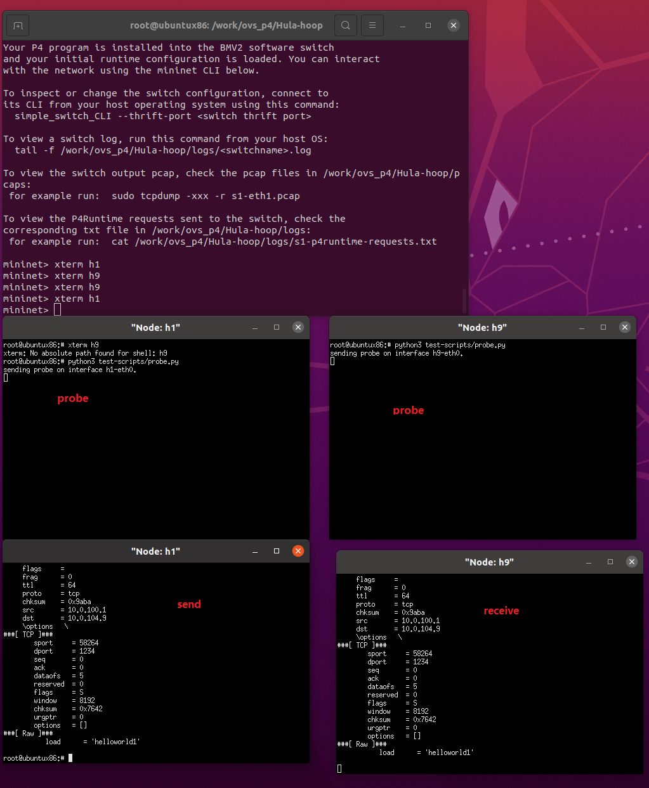
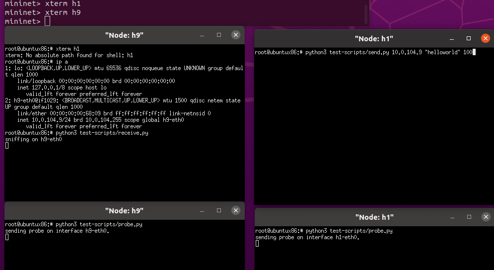
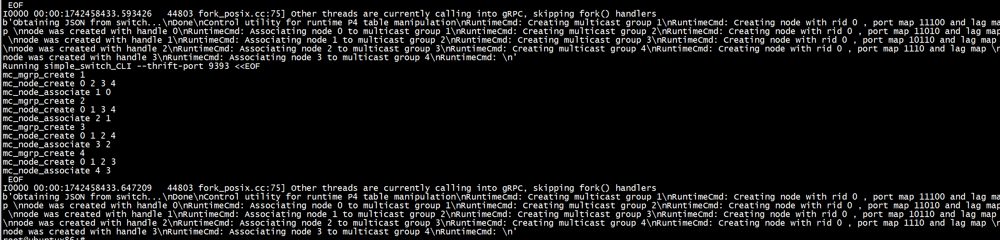

[HuLA-hoop-Team/Hula-hoop](https://github.com/HuLA-hoop-Team/Hula-hoop/tree/main)

+ step1 make   

+ step2   python3 controller.py  

+ step3 h1 and h9 run test-scripts/probe.py    

+ step4  h1 run test-scripts/send.py    h9_ip "hello world" 100

+ step5  h9 run test-scripts/receive.py    




***控制平面***    





# mcast

```
mc_mgrp_create 1 
mc_node_create 0  0 1 2 
mc_node_associate 1 0 
```

# mn


```
sudo -E mn

```