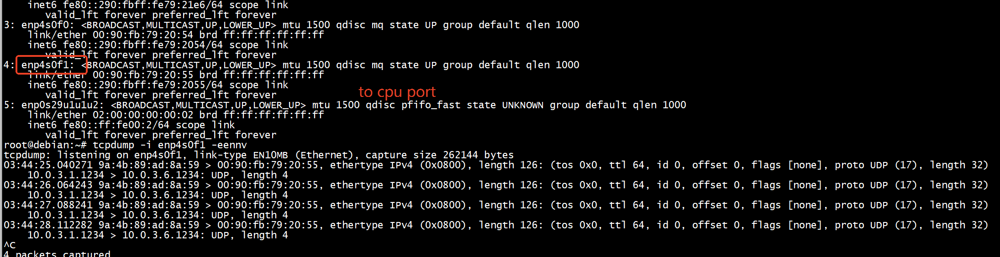

#  参考


[int-xd](https://github.com/mandaryoshi/p4-int/blob/3a9e9e5b2686bd7c2c1b98cd8946fcb83abde55d/int-xd/bfrt_python/bfswitch3.py)


# mirror

```
bfrt.mirror.cfg> get(123)
Entry 0:
Entry key:
    $sid                           : 0x007B
Entry data (action : $normal):
    $session_enable                : True
    $session_priority              : True
    $hash_cfg_flag                 : False
    $hash_cfg_flag_p               : False
    $icos_cfg_flag                 : False
    $dod_cfg_flag                  : False
    $c2c_cfg_flag                  : False
    $mc_cfg_flag                   : False
    $epipe_cfg_flag                : False
    $direction                     : EGRESS
    $ucast_egress_port             : 0x00000004
    $ucast_egress_port_valid       : True
    $egress_port_queue             : 0x00000000
    $ingress_cos                   : 0x00000000
    $packet_color                  : GREEN
    $level1_mcast_hash             : 0x00000000
    $level2_mcast_hash             : 0x00000000
    $mcast_grp_a                   : 0x0000
    $mcast_grp_a_valid             : False
    $mcast_grp_b                   : 0x0000
    $mcast_grp_b_valid             : False
    $mcast_l1_xid                  : 0x0000
    $mcast_l2_xid                  : 0x0000
    $mcast_rid                     : 0x0000
    $icos_for_copy_to_cpu          : 0x00000000
    $copy_to_cpu                   : False
    $max_pkt_len                   : 0x4000

Out[14]: Entry for mirror.cfg table.

bfrt.mirror.cfg> delete(123)

bfrt.mirror.cfg> get(123)
Error: table_entry_get failed on table mirror.cfg. [Object not found]
Out[16]: -1

bfrt.mirror.cfg> 
```

## del mirred ether hdr

```
hdr.eth_hdr.setInvalid();
```


#  Entry add api is not supported for keyless table 0x1000004. Use the set_default api instead
 
 
```
rep_table = p4.Egress.tb_generate_report
rep_table.add_with_do_report_encapsulation(0x9a4b89ad8a59,0x0090fb792055, 0xa000301,0xa000306,1234)
```

改成    

```
rep_table.clear()
rep_table.set_default_with_do_report_encapsulation(0x9a4b89ad8a59,0x0090fb792055, 0xa000301,0xa000306,1234)
```

```
bfrt.tofino_mirr.pipe.Egress.tb_generate_report> dump
-----------------------------------------------> dump()
----- tb_generate_report Dump Start -----
Default Entry:
Entry data (action : Egress.do_report_encapsulation):
    src_mac                        : 0x9A4B89AD8A59
    mon_mac                        : 0x0090FB792055
    src_ip                         : 0x0A000301
    mon_ip                         : 0x0A000306
    mon_port                       : 0x04D2

Table pipe.Egress.tb_generate_report has no entries.
----- tb_generate_report Dump End -----
```