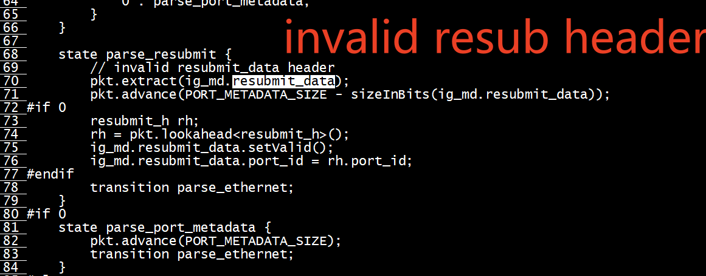
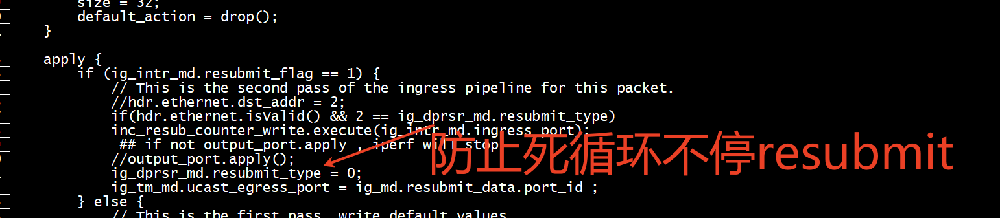

# resubmit  




##  resubmit   packet 有ether header 

ig_dprsr_md.resubmit_type 不等于2     


```
b'SwitchIngress.recir_counter.f1' , port 24 , counter 20833365 
b'SwitchIngress.resub_counter2.f1' , port 8 , counter 208961435 
```

```
if(hdr.ethernet.isValid())
            inc_resub_counter_write2.execute(ig_intr_md.ingress_port);
          if(hdr.ethernet.isValid() && 2 == ig_dprsr_md.resubmit_type)
             inc_resub_counter_write.execute(ig_intr_md.ingress_port);
```

# recirculate

```
const bit<9> RECIRCULATE_PORT = 40;
```
将dp port =40的端口设置为loopback    
port-loopback 27/0 mac-near       


# test

+ ingress port = 8的执行resubmit   

+ ingress port = 34的执行recirculate    

```
numactl -C 24,26,27,28,30,32,34,36  iperf  -c 10.10.203.3 -p 9999  -P 8 -t 12000 -i 5 -S 0x3
[  5] local 10.10.203.4 port 55950 connected with 10.10.203.3 port 9999
[  3] local 10.10.203.4 port 55936 connected with 10.10.203.3 port 9999
[  1] local 10.10.203.4 port 55916 connected with 10.10.203.3 port 9999
[  4] local 10.10.203.4 port 55940 connected with 10.10.203.3 port 9999
[  2] local 10.10.203.4 port 55928 connected with 10.10.203.3 port 9999
```